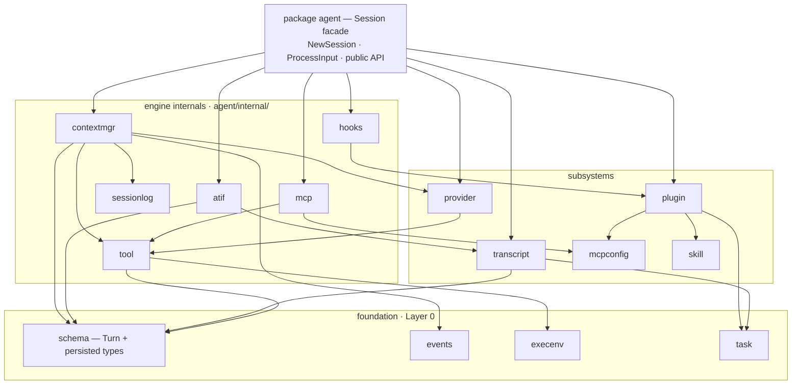
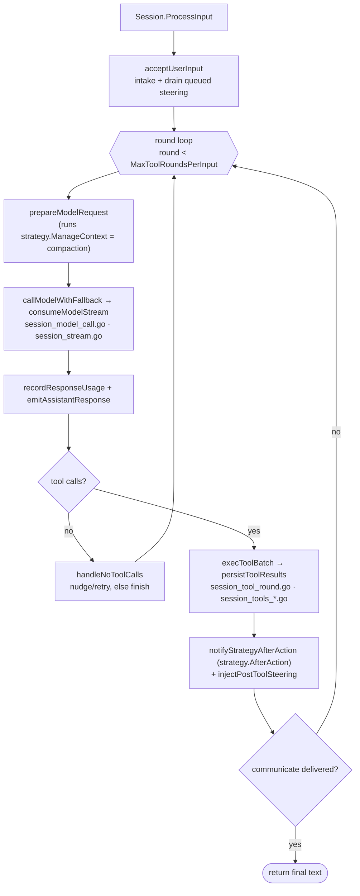

# Serf code architecture & module layout

How the Serf codebase is organized: which modules exist, what each is for, what
may depend on what, and how to build it. This is the **canonical, living** layout
reference — kept current as the structure evolves. (The dated migration spec under
`docs/superpowers/specs/2026-06-01-go-monorepo-module-architecture.md` records the
plan and the decisions behind this structure; this doc describes the result.)

## Shape

Serf is a **multi-module Go monorepo** containing two published libraries, a small
shared auth module, and one application made of three binaries that talk over two
wire contracts.

| Module | Path | Role | May depend on |
| --- | --- | --- | --- |
| `auth` | `auth/` | OpenAI OAuth: token storage + interactive login flow | (stdlib only) |
| `llm` | `llm/` | LLM client library — providers, requests, responses, streaming | `auth` |
| `agent` | `agent/` | Agent engine + the public persistence schema (`SessionMeta`, `Turn`, …) | `llm`, `auth` |
| **app** (root) | `.` | the **serf application** — the three binaries + the wire contracts | `agent`, `llm`, `auth` |

`llm` and `agent` are **published libraries** (consumed inside and outside Prime
Radiant); their `go.mod` files are kept clean and publishable. `auth` is its own
module because it's OAuth machinery (a login flow + a localhost callback server)
that the hub drives far more than `llm` consumes — keeping it separate preserves
`llm`'s minimal surface.

## The three application binaries (one product, three processes)

The app is **one product**: the binaries are coupled only by **protocols**, never by
importing each other's Go code.

| Binary | `cmd/` | Role | Talks to | via |
| --- | --- | --- | --- | --- |
| `serf` | `cmd/serf` | **engine** — runs an `agent.Session` | agent, llm | direct |
| `serf-hub` | `cmd/serf-hub` | **supervisor** — spawns `serf` subprocesses, serves clients | serf (spawn), agent (schema) | **AppWire** + schema |
| `serf-tui` | `cmd/serf-tui` | **client** — terminal dashboard | serf-hub | **hubapi** (HTTP) |

The two shared **contracts** are ordinary top-level packages in the app module:
`appwire/` (the engine↔hub↔tui wire protocol) and `hubapi/` (the hub's HTTP API).
Each binary owns its private code under `cmd/<bin>/internal/`.

## The placement rule — "what goes where"

1. **Reusable outside this repo?** → a library module (`llm/`, `agent/`, `auth/`).
2. **A contract *between* binaries (wire / HTTP)?** → a top-level package in the app
   module, named for what it is (`appwire/`, `hubapi/`).
3. **Private to exactly one binary?** → that binary's `cmd/<bin>/internal/…`.
4. **A binary entry point?** → `cmd/<bin>/main.go` (thin — wiring only).
5. **Shared by a library *and* the app?** → the lowest module that needs it, exported
   there; or its own small module; or (for tiny utils) **duplicated** into each
   product's `internal/`. Libraries never reach into app code.

A library must never import app code or the app's build metadata. Two consequences
already enforced: the build version is **injected**, not imported (`openai.ClientVersion`,
`agent.BuildVersion` — package-level settings the binaries set at startup, default
`"dev"`); and shared parsers (`frontmatter`, `diagnostic`) are **duplicated** into
`agent/internal/` so `agent` is self-contained.

## Building — the go.work workspace

The repo is a Go workspace (`go.work`, committed). `make build` / `make build-hub` /
`make build-tui` / `make build-llmcall` work as before; import paths are unchanged
(`primeradiant.com/serf/…`).

The unpublished sibling modules are wired with **versioned `replace … v0.0.0 => ./dir`
directives in `go.work`** (repo-local — invisible to external `go get`). This keeps
the committed `go.mod` files replace-free and publishable while a fresh clone builds
out-of-the-box. (`go.work use` alone does *not* resolve an unpublished sibling once a
module has external deps — it 404s trying to fetch it; the in-`go.work` replace is the
fix.) Note: `./...` resolves **per-module** in a workspace, not across it — so the lint /
vet / test gates loop over every module (`make vet` / `make test-race` / `make lint-golangci`
iterate `. agent llm auth`); a root-only `go test ./...` silently skips the agent/llm/auth
library suites.

## Boundaries Go enforces

- `agent` / `llm` (modules) **cannot** import the app — the engine libraries can never
  depend on serf-app glue.
- `cmd/<bin>/internal/…` is importable only by that binary.
- `appwire` / `hubapi` are ordinary packages → all three binaries share them as the
  one legitimately-shared contract tier.
- External: `go get primeradiant.com/serf/agent` pulls `agent` + `llm` + `auth` and
  nothing else.

## The app module's `internal/`

The root app module keeps a top-level `internal/` for code **shared across its three
binaries** (engine / supervisor / client are one module). Most of it genuinely is shared
— e.g. `appserver` (engine `server/` + hub + tui), `diagnostic` (engine + hub + server),
`apptranscript`, `binresolve` (hub + tui), `credentials` (all three via `cmdutil`). For a
single module, shared code in `internal/` is the correct Go idiom; *duplicating* it per
binary would be worse. The "no glue drawer" goal was about **not mixing library and app
code** — and that is fully resolved: the libraries are separate modules, so the app's
`internal/` now holds only app code. (`appprojector` and `httpguard` are engine-`server/`-
only and could later sink to `cmd/serf/internal/` alongside `server/`.) Relaxing the
migration's original "zero top-level `internal/`" target is the **decided end-state**:
per-binary duplication would be strictly worse, and the real goal — no library/app code
mixing — is already met by the module carve.

## Inside the `agent` module

`agent` is decomposed from a flat package into **layered sub-packages** — for
legibility, not to shrink the public API (which is unchanged: `Session`, `NewSession`,
and the `schema` persisted types). Dependencies point **down** the layers only; no
lower layer imports a higher one.

- **Foundation (Layer 0)** — `schema` (the canonical `Turn` plus the persisted types
  `SessionMeta` / `ConfigSnapshot` / `EnvironmentInfo`), `events`, `execenv`. No
  intra-`agent` dependencies.
- **Subsystems** — `internal/tool` (tool registry + builtins), `provider` (model
  profiles), `transcript` (JSONL writer/reader), `mcpconfig`, `skill`, `task`.
- **Engine internals** (`agent/internal/…`, off the public surface) — `contextmgr`
  (context-pressure management: compaction + the pluggable strategies + recall),
  `sessionlog` (the shared session-action-log substrate), `hooks` (the plugin/hook
  runner — see [`plugin-hooks.md`](plugin-hooks.md) for authoring), `mcp` (MCP
  client manager), `atif` (trajectory export).
- **Facade** — `package agent` itself: `Session` composes all of the above and is the
  only public entry point. Engine sub-packages call *back* into the session through
  narrow **seam interfaces** (e.g. `contextmgr.Host`) satisfied by small **unexported
  adapters**, so the engine can live in sub-packages without widening `Session`'s
  public method set.

### How a turn flows

`Session.ProcessInput` drives one user input through up to `MaxToolRoundsPerInput`
model/tool rounds, until the model delivers a result (via the communicate tool) or the
round budget runs out. Each round (simplified):

The phase names map onto the files in `package agent` that the turn loop was split into:
`session_model_call.go` (request build + call), `session_stream.go` (streaming decode),
`session_tool_round.go` + `session_tools_*.go` (tool execution), and the
`ManageContext` compaction step backed by `agent/internal/contextmgr`.

## Current status

- ✅ `auth`, `llm`, `agent` all carved into their own modules; the `go.work` workspace is
  established; all four `go.mod` files are clean and publishable (replace-free).
- ✅ App `internal/` holds only app-shared code (no library/app mixing) — the structural
  goal of the migration is met.
- ✅ The library public API is fully documented and **gated in CI**: `serf-docscheck`
  fails the build if any exported package-level declaration in `llm`, `agent`,
  `agent/events`, or `auth/openai` lacks a doc comment — running alongside
  `serf-namingcheck` (tag casing) and `serf-internalcheck` (no internal-type leaks).
  `llm`/`agent`/`auth/openai` carry runnable `Example`s.
- ✅ Validated externally consumable: a scratch module that `require`s `agent` resolves
  only `agent` + `llm` + `auth` (plus their third-party deps) — no app code.
- ✅ **Whole-repo golangci-lint gate**: a curated best-practice `.golangci.yml` (errcheck,
  govet, staticcheck, unused, ineffassign, errorlint, bodyclose, misspell, unconvert, revive,
  gocritic, nilerr, noctx, nakedret, perfsprint, …; the gocritic value-copy checks
  `hugeParam`/`rangeValCopy`/`rangeExprCopy` are disabled — they fight the codebase's
  deliberate value semantics) is driven to **zero across all four modules** and gates in CI
  beside the three custom AST checks. The `vet` / `test-race` / `lint-golangci` make targets
  (and CI) loop over `. agent llm auth`, so the **library test suites now run in CI** too.
