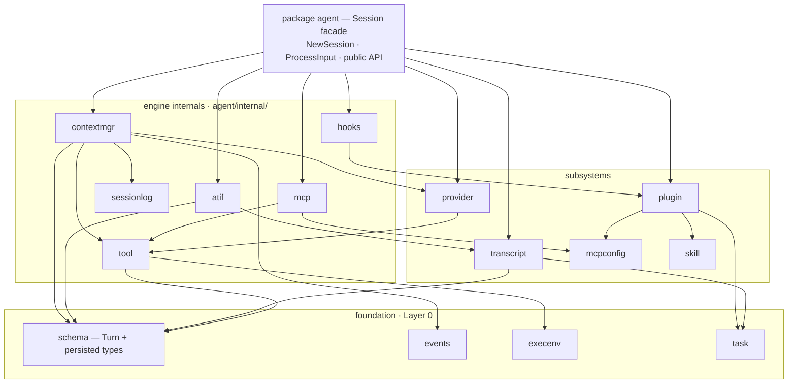
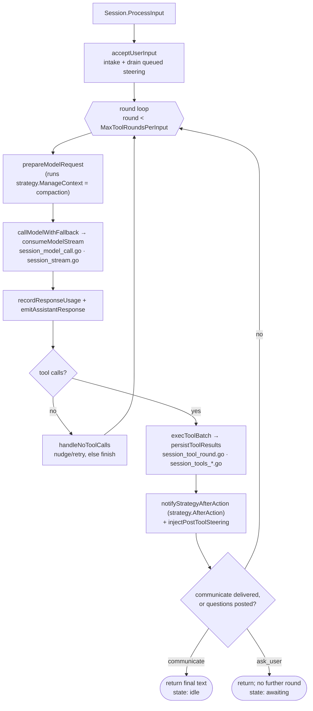

# Evener code architecture & module layout

How the Evener codebase is organized: which modules exist, what each is for, what
depends on what, and how to build it. This is the **canonical, living** layout
reference. The [product subsystem map](product/subsystems.md) connects this
structure to user journeys, state ownership, and recovery responsibilities.

## Shape

Evener is a **multi-module Go monorepo** with browser, shared TypeScript, and native
clients. [go.work](../go.work) is the workspace module inventory; each module's
`go.mod` records its declared dependencies.

| Module | Path | Responsibility |
| --- | --- | --- |
| Application | [root](../go.mod) | Binaries, AppWire and HTTP contracts, hub, server, shared application services |
| Agent | [agent/](../agent/go.mod) | Session engine, tools, jobs, delegates, persistence and schema |
| LLM | [llm/](../llm/go.mod) | Provider registry, requests, streaming, retries and model metadata |
| Authentication | [auth/](../auth/go.mod) | OAuth flows and token storage |
| Environment | [envvars/](../envvars/go.mod) | Environment-variable definitions and user-directory resolution |
| Execution support | [execsupport/](../execsupport/README.md) | Value expressions, process groups, pipe draining and shell quoting |
| Identifiers | [identifier/](../identifier/go.mod) | Session, job, mutation and other domain identities |
| Invariants | [invariant/](../invariant/invariant.go) | Assertions enabled in fuzz builds; no-op assertions in normal builds |
| Fuzz tooling | [fuzz/](../fuzz/README.md) | Portable generation, oracles and regression-promotion tooling |

Module separation does not by itself imply application independence. Production
`agent` code imports both AppWire and root `internal` packages, for example
[client mutations](../agent/session_client_mutation.go) and
[skill source recovery](../agent/session_skill_source.go). `llm` uses `auth`,
`envvars`, `execsupport`, `identifier`, and `invariant`; `auth` uses `envvars`.
Consult imports and `go.mod` when moving a responsibility rather than assuming
that a module name is an enforced architectural boundary.

## Application commands and process boundaries

The installed application is the `evener` binary. Its entry point imports the hub,
TUI, doctor, and migration command packages and dispatches subcommands. The hub,
TUI, and session daemons run as separate processes and communicate over AppWire;
sharing an executable does not merge their runtime state.

| Command | `cmd/` | Role | Talks to | via |
| --- | --- | --- | --- | --- |
| `evener` | `cmd/evener` | **engine** — runs an `agent.Session` | agent, llm | direct |
| `evener hub` | `cmd/evener-hub` | **supervisor** — spawns `evener` subprocesses, serves clients | evener (spawn), agent (schema) | **AppWire** + schema |
| `evener tui` | `cmd/evener-tui` | **client** — terminal dashboard | evener hub | **AppWire** (WebSocket) |

The TUI's control and event connection to the hub is **AppWire**, not HTTP. It
dials the hub's `/rpc` WebSocket, initializes an `appwire.Client`, and installs an
ordered-frame observer (`dialHubRPC`, `cmd/evener-tui/internal/hubstart`). The hub
is the AppWire **server** for the TUI and the browser, an AppWire **client** to
each `evener serve` daemon it spawns, and — on a multi-host controller — an
AppWire **relay** that carries frames to a remote host's hub over `ssh <dest>
evener hub attach --stdio` (`appwire.StreamTransport`). Navigation and session
activity reads use AppWire. The [hub HTTP router](../cmd/evener-hub/web.go) serves
the application, documents, assets, authentication, health and subscription
diagnostics; it has no parallel navigation read endpoint. The TypeScript clients
use the shared AppWire client package; the TUI's best-effort environment health
probe (`checkHubEnvironment`) uses HTTP.

```
browser ─┐
         ├─ AppWire /rpc (WS) ──▶ evener hub ──┬─ AppWire (WS) ──▶ evener serve daemon
evener   │                                     └─ HTTP /api/health ─▶ health probe
  tui ───┘

remote host:  evener hub ── ssh ──▶ evener hub attach --stdio ── AppWire (stdio) ──▶ remote hub
```

The two shared **contracts** are ordinary top-level packages in the app module:
`appwire/` (the JSON-RPC wire protocol over WebSocket or stdio, hop by hop between
browser/`evener tui`, hub, and `evener serve` daemon) and `hubapi/` (hub health and
projection types, including navigation types carried by AppWire).
Command-specific private code lives under `cmd/<command>/internal/`.
`evener doctor` and `evener migrate` provide inspection and migration commands.
`evener-dev` is checkout development tooling and is not installed with the product.

[Session activity](product/session-activity.md) follows the same process
boundaries: the agent projects existing delegate/job/watch authorities, daemon
and hub handlers route the typed reads, and the shared TypeScript store owns
observed demand and recovery. Navigation carries compact session summaries.
Rendering adapters do not own network requests or lifecycle state.

## Placing responsibilities

1. **Reusable outside this repo?** → a library module (`llm/`, `agent/`, `auth/`).
2. **A contract *between* processes (wire / HTTP)?** → a top-level package in the app
   module, named for what it is (`appwire/`, `hubapi/`).
3. **Private to exactly one command package?** → that command's `cmd/<command>/internal/…`.
4. **An executable entry point?** → its `cmd/<binary>/main.go`; command packages
   expose their own entry functions to the executable.
5. **Shared across modules?** → a clearly named owning module or shared contract.
   Document the dependency and update the subsystem map. Existing cross-module
   imports are part of the implementation; changing those boundaries is an
   architectural decision.

Build-version values such as `tokenauth.ClientVersion` and `agent.BuildVersion` are
injected by the binaries. Process boundaries use wire contracts; package and
module boundaries describe code dependencies within those processes.

## Building — the go.work workspace

The repo is a Go workspace (`go.work`, committed). Use `make build` for the
application executable; [building](developing-evener/building.md) describes the
other development targets. Import paths use `primeradiant.com/evener/…`.

Workspace `use` entries and **versioned `replace` directives in `go.work`** resolve
sibling modules to checkout paths, including unpublished placeholder versions.
These replacements are local to the workspace and do not establish external
module consumability. `./...` resolves **per-module** in a workspace, so lint,
vet and test gates select their modules explicitly. `GO_MODULES` and
`FUZZ_GO_MODULES` in the [Makefile](../Makefile) own those lists; the fuzz module
has its own gate family. A root-only `go test ./...` does not run sibling module
suites. See [testing](developing-evener/testing.md) for the selected gate's scope.

## Package boundaries

- `cmd/<command>/internal/…` is visible within that command's import subtree.
- `appwire` / `hubapi` are ordinary packages → the application processes share them as the
  contract tier.
- Go's `internal` visibility follows import-path ancestry, not `go.mod` boundaries.
  The root `internal/` tree is reachable from sibling modules under the
  `primeradiant.com/evener` import prefix.
- External consumption needs verification from an external module with the
  intended versions. A successful workspace build is not that verification.

## The app module's `internal/`

The root `internal/` tree contains shared application services such as
`appserver`, `apptranscript`, `binresolve`, `credentials`, and `plugins`. Some are
also consumed by the agent module. Follow the [subsystem map](product/subsystems.md)
and actual import sites to find each service's owners and consumers; the directory
alone does not establish whether a change affects just one binary or the agent
engine as well.

## Inside the `agent` module

`agent` is decomposed from a flat package into **layered sub-packages** — for
legibility, not to shrink the public API (which is unchanged: `Session`, `NewSession`,
and the `schema` persisted types). Dependencies point **down** the layers only; no
lower layer imports a higher one.

- **Foundation (Layer 0)** — `schema` (the canonical `Turn` plus the persisted types
  `SessionMeta` / `ConfigSnapshot` / `EnvironmentInfo`), `events`, `execenv`. No
  intra-`agent` dependencies.
- **Subsystems** — `internal/tool` (tool registry + builtins), `provider` (model
  profiles), `transcript` (JSONL writer/reader), `mcpconfig`, `skill`, `task`.
- **Engine internals** (`agent/internal/…`, off the public surface) — `contextmgr`
  (context-pressure management: compaction + the pluggable strategies + recall),
  `sessionlog` (the shared session-action-log substrate), `hooks` (the plugin/hook
  runner — see [`hooks.md`](hooks.md) for authoring), `mcp` (MCP
  client manager), `atif` (trajectory export).
- **Facade** — `package agent` itself: `Session` composes all of the above and is the
  only public entry point. Engine sub-packages call *back* into the session through
  narrow **seam interfaces** (e.g. `contextmgr.Host`) satisfied by small **unexported
  adapters**, so the engine can live in sub-packages without widening `Session`'s
  public method set.

MCP reconnect recovery is connection history: the manager emits the session's
`mcp_reconnected` informational notice after restoring a dropped connection,
before the retried tool call returns. Web and native transcripts hide that notice
at normal detail and render it quietly at Full, whether it arrives as a direct
warning or an overlay system notice. The retry's actual result remains separate;
failed calls, interruptions and required sign-in remain visible.


```mermaid
flowchart TD
    Session["package agent — Session facade<br/>NewSession · ProcessInput · public API"]

    subgraph internals["engine internals · agent/internal/"]
      contextmgr["contextmgr"]
      hooks["hooks"]
      mcp["mcp"]
      atif["atif"]
      tool["tool"]
      sessionlog["sessionlog"]
    end
    subgraph mid["subsystems"]
      provider["provider"]
      transcript["transcript"]
      plugin["plugin"]
      mcpconfig["mcpconfig"]
      skill["skill"]
    end
    subgraph base["foundation · Layer 0"]
      schema["schema — Turn + persisted types"]
      events["events"]
      execenv["execenv"]
      task["task"]
    end

    Session --> contextmgr & hooks & mcp & atif & provider & transcript & plugin
    contextmgr --> sessionlog & tool & provider & schema & events
    atif --> transcript & schema
    mcp --> tool & mcpconfig
    hooks --> plugin
    plugin --> skill & task & mcpconfig
    provider --> tool
    transcript --> schema & task
    tool --> schema & execenv
```

### How a turn flows

`Session.ProcessInput` drives one user input through up to `MaxToolRoundsPerInput`
model/tool rounds, until the model delivers a result (via the `communicate` tool), the
round posts one or more `ask_user` questions, or the round budget runs out. Each round
(simplified):


```mermaid
flowchart TD
    PI["Session.ProcessInput"] --> AUI["acceptUserInput<br/>intake + drain queued steering"]
    AUI --> R{{"round loop<br/>round &lt; MaxToolRoundsPerInput"}}
    R --> PR["prepareModelRequest<br/>(runs strategy.ManageContext = compaction)"]
    PR --> MC["callModelWithFallback → consumeModelStream<br/>session_model_call.go · session_stream.go"]
    MC --> RU["recordResponseUsage + emitAssistantResponse"]
    RU --> TC{"tool calls?"}
    TC -->|no| HN["handleNoToolCalls<br/>nudge/retry, else finish"]
    HN --> R
    TC -->|yes| EX["execToolBatch → persistToolResults<br/>session_tool_round.go · session_tools_*.go"]
    EX --> AA["notifyStrategyAfterAction (strategy.AfterAction)<br/>+ injectPostToolSteering"]
    AA --> DL{"communicate delivered,<br/>or questions posted?"}
    DL -->|communicate| DONE(["return final text<br/>state: idle"])
    DL -->|ask_user| AWAIT(["return; no further round<br/>state: awaiting"])
    DL -->|no| R
```

The phase names map onto the files in `package agent` that the turn loop was split into:
`session_model_call.go` (request build + call), `session_stream.go` (streaming decode),
`session_tool_round.go` + `session_tools_*.go` (tool execution), and the
`ManageContext` compaction step backed by `agent/internal/contextmgr`.

A round that posts `ask_user` questions ends the turn at the same `AA --> DL` boundary a
delivered `communicate` does, but leaves the session resting in `SessionAwaiting` ("awaiting")
instead of idle — the session waits, visibly, until the user's next message answers the
questions. `ask_user` and `communicate` compose rather than collide: a `communicate` in the
same round still delivers its message, and the boundary state is awaiting whenever the round
posted questions, regardless of the communicate's own end-turn value. `ask_user` is
interactive-root-only — invisible in non-interactive sessions and in every subagent — so this
branch never applies to a delegate.

On the roots that get `ask_user`, `communicate` also takes `end_reason`, read only when
`end_turn=true`: `done` (the default), `needs_response`, or `waiting_on_work`. It is recorded
with the message (`CommunicateData`, the transcript's `CommunicateInfo`). A turn that ends on
`done` or `waiting_on_work` rests idle. One that ends on `needs_response` rests awaiting, unless
autonomous work (a working child, a pending delegate report, a pending notification, queued
input, a goal kick) will move the session first; a finished child's warm runtime does not
count. The settle reads the first turn-ending call the input accepted, and restore derives the
same state from the transcript. A pending question rests awaiting at the settle. A
`needs_response` rest first waits a 5-second quiet period, resting idle, so a session that ends
a turn and starts the next one at once never flickers to awaiting. When the period passes, the
timer checks everything the settle checked again: a new turn or settle, a close, queued input,
runnable steering, or autonomous work leaves the session idle. Otherwise it rests awaiting and
announces the change with `STATUS_SETTLED`, which the server ignores when a turn is running or
reserved, or the session has closed. A turn start waits for a rest that is arming to finish
its announcement, so the announcement is sent before anything the turn emits once it starts. Restore derives awaiting at once, with no quiet period.

### The repeated-call breaker

Steering a stuck agent has two layers. `injectPostToolSteering`
(`agent/session_tool_round.go`) watches a window of recent call signatures and, when
`detectLoop` fires, injects steering — the structural intervention when every call in
the window failed, today's tiered escalation otherwise. Underneath it,
`Registry.ExecuteCall` (`agent/internal/tool/registry.go`) consults a ledger
(`agent/internal/tool/breaker.go`) that every *dispatched* tool call passes through,
native and MCP alike — a call refused before dispatch — by pre-validation, an unknown tool
name, unparseable arguments, an argument normalizer, a schema violation, blocking middleware, or the
argument-size guard — never reaches the ledger. The ledger carries **two triggers,
keyed differently**. The **failure trigger** counts consecutive failures sharing an
error class, keyed on tool name + a hash of a **normalized** view of the arguments:
the top-level `intent` free text and the shell tool's presentation-only `description`
are dropped, and JSON key order, whitespace, and number spellings are canonicalized,
so a call that changes only those is the same failing operation; the tool's own
`RegisteredTool.NormalizeArgs`, when it has one, is applied too, so a value it
removes before dispatch fingerprints as the omitted call — while arguments
that are not a single well-formed JSON value fall back to the raw bytes. Its second
failure appends a nudge to the result, and the third is **not executed at
all** — the tool is resolved to compute the key, and the call is refused before
any validation or execution. The **repetition trigger**
counts consecutive byte-identical result bodies regardless of error status, keyed on
tool name + a hash of the raw argument bytes, and only ever nudges, from the second
onward; a tool observing mutable state may yet return
something new, and refusing `communicate` would take away the session's only exit
door. Repetition catches what error flags miss: a plugin that reports its failures with
`is_error: false` and the failure as plain body text still trips it, so evener needs no
knowledge of any tool's error conventions.

The ledger is per session and per signature — it lives on the session's own
`*tool.Registry`, and a `Clone` starts empty. Calls to other signatures never disturb a
signature's counters. A success or a failure of a different error class resets the
failure counter; a different result body resets the repetition counter. A parked call
is recorded as an ordinary error tool result whose output begins
`evener did not execute this call:` — no new turn kind, no new event type — and the park
itself is not recorded, so the refusal's own body cannot release the next identical
call.

One consequence worth knowing before you meet it: a parked result carries **no typed
error**, only text. Sandbox denial escalation (`agent/session_escalation.go`) keys off
`sandbox.AsDenied(res.Err)`, so a third identical file-tool call that the breaker parks
never raises the human approval card a live denial would have raised. Changing the
arguments or the approach is what clears it.

### Ownership and mailboxes

A `Session` runs no persistent goroutine; it is driven by `ProcessInput` and woken by
its server. Background machinery — the shell-only `jobManager`, stable
delegate-tree controller, job-output pumps, and event emitters — observes a
session's activity and needs to feed work back to it. The rule that keeps this
safe is one invariant:

> **Event observation records durable intent and wakes the owner. Only a session's own
> loop mutates that session.**

An observer (anything reacting to an emitted event or a job-output append) may match
watches, persist durable state, append to a queue, and kick a wake — nothing more. It
may **not** append turns, steer a session, resume a delegate, or otherwise deliver a
message. Delivery is the owning loop's job, done at a named boundary.

**The three queues.** A session has three durable/in-memory mailboxes. Each has many
appenders and exactly one drainer:

- **Steering queue** (`steeringQueue`, guarded by `mu`) — runtime guidance for the next
  round. Appended by anyone holding only `mu` (tools, `Steer`, the warning-notification
  hook); drained by the loop at round boundaries (`drainSteering`).
- **Job notifications** (`pendingJobNotifs`, guarded by `pendingJobNotifsMu`) — durable
  job-completion records and watch-send wake tokens. Appended by the `jobManager`'s
  `enqueue` upcall from observation paths (`enqueueJobNotificationAndNotify`); drained
  by the loop in the notification-accept path (`acceptNotificationInput`,
  `agent/session_lifecycle.go`).
- **Watch outbox** — the durable pending watch sends (jobstore `watch_send_pending`
  records). Appended by the `jobManager`'s observation paths (`onSessionEvent`,
  `feedJobOutput`, `fireProgressTick`, `armFinalizedJob`) taking only leaf locks;
  drained by `drainPendingWatchSends` (`agent/job_watch.go`), the **sole** executor
  of watch-send delivery.

Stable delegate attention is deliberately not a fourth durable queue. Delegate,
quiet, observer, and shell attention is appended to the receiver transcript,
which is its sole durable authority. A process-local set keyed by unresolved
attention ID arms the existing notification wake; successful notification turns
append exact consumed markers, failures leave the IDs pending, and restore folds
the transcript to rearm without constructing a provider runtime.

**Who drains where.** `drainPendingWatchSends` runs only from loop-owned boundaries:
between tool rounds (`injectPostToolSteering`, `agent/session_tool_round.go`), at the
processing-finish boundary (`finishProcessingAtBoundary`, `agent/session_state.go`),
in the notification-accept path (`acceptNotificationInput`), and after restore /
history-repair (`agent/history_repair.go`). Caller-targeted sends ride the
notification queue as wake tokens keyed by watch ID; the accept path deduplicates them
against current pending state and settles delivery in that turn. Stable
delegate-source deliveries bind the typed `dlg_...` source/receiver through the
controller and append durable attention to the receiver transcript; they do not
resolve an activation job.

**The wake path.** `jm.wake` (wired to `Session.notify` at construction,
`agent/session_init.go`) → `Session.notify` (`agent/session.go`) → the server's
input channel → an `EntryNotification` (`agent/session_lifecycle.go`) that runs the
accept path. The same entry kind consumes transcript-backed root delegate
attention after a successful turn and durable resolution append. An empty
accept is otherwise a no-op that still calls
`finishProcessingAtBoundary` → `drainPendingWatchSends` (`agent/session_lifecycle.go`),
so a wake carrying only already-settled shell/watch bookkeeping can finish with
zero model turns; model-bound transcript attention always runs the owner turn.

**The forbidden re-entry.** `responseSideEffectsMu` is held across event emits
(`emitAssistantResponse`, the tool-call-end emit). Observation paths and the `jobManager`'s
retained upcalls (`emit`, `enqueue`, `wake`, `forward`) may take **only** leaf locks
(`s.mu`, `eventsMu`, `pendingJobNotifsMu`) — never `responseSideEffectsMu`. The documented
lock order is `responseSideEffectsMu > mu` (`agent/session.go`), so a leaf-lock upcall
from an emit context is order-consistent; re-taking `responseSideEffectsMu` on the emitting
goroutine would self-deadlock (Go mutexes are not re-entrant). The enforcement is
structural, not by discipline: `jobManager` has **no** `send` closure back into `Session`,
so an observation path *cannot* deliver — only queue and kick.

This rule exists because an event observer that delivered synchronously once wedged a live
session (`docs/specs/2026-06-12-job-control-watch-deadlock-design.md`): a caller-targeted
watch fired while the session emitted an assistant event under `responseSideEffectsMu`, and
the delivery path re-acquired the same mutex on the same goroutine. If you add a new event
observer, it records intent and wakes — it does not mutate the session.

### Drive-down: how a subagent's mailbox gets drained

The wake path above drains the **root** — its server submits the `EntryNotification`. A
subagent session has no server of its own, so the same question recurs one level down: who
wakes a child that has undelivered attention sitting in its own mailboxes? The answer is
**drive-down**: a parent drives its direct children at its own loop boundaries, the same way
its server drives it.

> **A parent drives its children; the root is driven by `serve.go`; the tree is therefore
> eventually-driven, level by level. The mailbox invariant holds at every depth.**

A parent drains its own watch outbox in `drainPendingWatchSends`, and at the tail of that
same boundary it calls `driveChildrenWithUndeliveredAttention` (`agent/job_watch.go`).
That scan reads each direct child's mailboxes as **signal only** — a queued owner
notification (`peekNotifications`) or pending watch sends (`hasPendingWatchSends`) — and, for
any child with undelivered attention, calls `driveSubagentNotificationTurn`
(`agent/subagents.go`). The drive launches **one** notification turn on the *child's own*
loop (`ProcessInputKind(..., EntryNotification)`), so the child's own `acceptNotificationInput`
drains the child's own mailboxes. The parent never appends to, steers, or mutates the child;
it only **runs** the child, and the child's loop delivers. A child's terminal notification
firing also kicks its parent directly — `SetNotifyFunc(func() { s.driveChildIfNotStopGated(sub) })`
(`agent/subagents.go`) — so a child wake propagates up to the parent's boundary the same
way the root's `jm.wake` propagates to its server. The drive mints no job record and arms
nothing new; it is the child processing its own durable attention, using the
separately bounded tree-wide drive counter for the turn's duration.

So the invariant — *observation records durable intent and wakes the owner; only a session's
own loop mutates that session* — holds unchanged at every depth. At depth 0 the server is the
driver; at depth N the parent is. A deep idle tree is woken level by level: the root drives the
coordinator, the coordinator (now running) drives its worker at *its* next boundary, and so on.

**The notification rule, stated plainly: every shell job notifies only its OWNER,
and every delegate notifies only its direct owner.** A subagent's shell jobs
notify the subagent, never its ancestors. A forwarded copy of a child-owned terminal that
lands in an ancestor's store is a **drive signal**, not a render target: the ancestor is *not*
interrupted about a job a descendant created — it drives the descendant so the descendant
renders its own notification (`forwardEvent` returns before `enqueue` when
`rec.OwnerSessionID != jm.sessionID`, `agent/jobs_nested.go`; the restore path filters
the same way at `agent/jobs.go`, so there is no restart wake-storm). A parent still
**renders** its own shell terminals and stable `<delegate-notification
delegate_id="dlg_...">` attention for direct delegates. Delegate notifications
never masquerade as `JOB_FINISHED` or `<job-notification>`. Ancestors retain on-demand visibility
into the whole subtree through `job_list(include_descendants=true)`, which walks the live tree
at read time rather than pushing notifications upward. This realizes the durable principle that
an agent is never interrupted about a *subagent's* children: attention escalates only one honest
level (the `child unreachable:` fallback when a child cannot be driven,
`renderUnreachableChildPendings`, `agent/job_watch.go`).

**Shell forwarding is single-hop.** A shell job's events forward exactly one level: a child's `jm.forward`
is its direct parent's `forwardEvent`, which appends the event to the parent's store and
returns **without** re-forwarding to its own parent (`agent/jobs_nested.go`). So a descendant's
forwarded copy lives only in its **direct parent's** store — it is not propagated up to
grandparents or the root. Two consequences that are easy to get wrong: an ancestor sees deeper
descendants only by walking the live tree (`job_list(include_descendants=true)`), not from
forwarded copies sitting at the root; and a depth-≥2 job output read
(`read_transcript(transcript_ref="job:<job_id>")`) whose owner store closes mid-read falls back
to the **owner's parent** store (where the single-hop copy lives), not the root caller's store.
Stable delegates are never forwarded JobRecords: their `dlg_...` hierarchy and
projection come from the root delegate journal/controller.

## Keeping architecture current

Update this reference and the [subsystem map](product/subsystems.md) when module,
process, contract, or recovery ownership changes. Keep the workspace inventory in
`go.work`, module dependencies in `go.mod`, and gate membership in the Makefile
consistent. Use [development gates](developing-evener/README.md) for validation;
this guide describes structure and does not certify a particular build or release.
