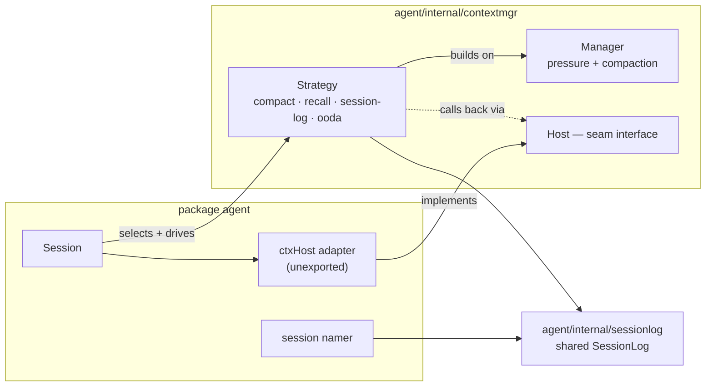

# Context Management

How serf manages conversation history as it grows toward the context window limit.

## Overview

The context manager (`contextmgr.Manager`, in `agent/internal/contextmgr`) tracks token
usage and applies compaction to conversation history when context pressure gets too
high. It runs before each LLM request via a pluggable `contextmgr.Strategy`.

## Where it lives — the Session seam

The subsystem lives in `agent/internal/contextmgr` (the `Manager` plus the strategies
and recall), with the shared session-action log in `agent/internal/sessionlog`.
`Session` selects and drives a `contextmgr.Strategy`; the strategy calls *back* into the
session — to emit events, read the profile/client, persist a snapshot for the recall
tool — through the narrow `contextmgr.Host` interface, which an unexported `ctxHost`
adapter inside `package agent` satisfies. That keeps the engine in a sub-package without
adding any exported forwarding methods to `Session`. The session namer (also in `package
agent`) appends to that same `SessionLog`, which is why the log is its own shared
substrate rather than living inside `contextmgr`.



## Pressure Estimation

Context pressure is the fraction of the context window currently in use (0.0-1.0).

**Primary signal: API-reported input tokens.** After each LLM response, the session
records `InputTokens + CacheReadTokens + CacheWriteTokens` as the exact token count.
Subsequent pressure estimates use this as a baseline, adding `char/4` estimates only
for turns added since the measurement.

**Fallback: char/4 heuristic.** When no API measurement is available (first turn, or
after compaction resets the measurement), all turns are estimated at 4 characters per
token.

**Reset after compaction.** Any compaction modifies history in place, invalidating the
token measurement. `lastInputTokens` is zeroed so the next estimate uses char/4 until
the next API response establishes a new baseline.

### Web search token inflation

Anthropic's server-side web search (`web_search_20250305`) makes multiple forward
passes internally, reporting combined usage in the response. This inflates
`InputTokens` by roughly 2x. When a response contains `ContentWebSearch` parts, we
skip `RecordInputTokens` entirely. The previous measurement remains valid; the next
non-web-search response will establish a fresh baseline.

## Self-Compaction (agent-invoked)

Agents can compact their own context at a clean stopping point using the `compact`
tool, rather than waiting for the automatic pressure-triggered layers.

### The `compact` tool

| Parameter | Required | Description |
|-----------|----------|-------------|
| `note_to_self` | yes | Durable note preserved verbatim across compactions. Empty string clears a previously set note. |
| `compaction_instructions` | no | Steers what the summary keeps vs. drops. |

When only `note_to_self` is empty and no `compaction_instructions` are given, no
compaction is scheduled — just the note is cleared. Otherwise a force-compaction is
queued at the tool-round tail and the tool returns a prediction (not past-tense
confirmation, since the compaction hasn't happened yet).

### Pinned note

The note is stored on the `Session` (`pinnedNote` field), persisted in
`SessionMeta.PinnedNote` (`"pinned_note"` JSON key), and restored on session resume.
At every compaction `runPreCompactHook` strips any existing pinned-note steering turn
and re-stamps the note verbatim as a new `TurnSteering` turn. The format is:

```
[NOTE TO SELF]
<note text>
[END NOTE TO SELF]
```

The pinned note is inserted after plugin `PreCompact` output and **before** the goal
objective, so the goal objective remains the trailing (strongest-recency) steering turn
and the `safeCutoff` protection keeps it past the compaction boundary.

### Agent-force path

The `compact` tool calls `requestForceCompact(instructions)`, which sets a pending
flag on the session. After the tool round drains, `applyPendingForceCompact` consumes
the request and calls `Manager.ForceCompact(ctx, history, instructions, emitFn)`.
This is the same `Manager` seam used by the `/compact` user command; passing non-empty
`instructions` routes through `summarizeWithLLMSteered`, which replaces the default
mandatory-sections prompt with the agent's directive.

`ForceCompact` returns a `bool` indicating whether a summary turn was actually
produced (false when there is no LLM client or the history is too short to summarize).

### Warn nudge

When pressure crosses `WarnThreshold` (0.75), `maybeNudgeSelfCompact` injects a
one-shot steering nudge asking the agent to call `compact` at its next clean seam.
The nudge is best-effort: a single large tool result can jump past `CheckpointThreshold`
before the nudge fires. The automatic checkpoint and summary layers remain the
guarantee. The latch resets on any compaction (force or automatic) so the nudge can
fire again after the next compaction cycle.

## Compaction Layers

Two layers, applied progressively as pressure rises:

| Layer | Threshold | Method | Destructiveness |
|-------|-----------|--------|-----------------|
| **Checkpoint** | >= 80% | Deterministic state snapshot | Replaces old history with structured summary |
| **LLM Summarize** | >= 95% | LLM-generated narrative summary | Replaces old history with LLM prose |

Both layers preserve the most recent `PreserveRecentTurns` turns (default 6) to
maintain conversation coherence.

### Why only two layers

Earlier versions had four layers with observation masking (>= 60%) and thinking
clearing (>= 70%) as gentler precursors to checkpoint. These were removed because
**they bust the prompt cache for all providers**.

All major LLM providers use prefix-based prompt caching:

- **Anthropic**: Automatic prompt caching (cache reads at 0.1x cost)
- **OpenAI**: Automatic prefix caching on Responses API (50% discount)
- **Gemini**: Context caching

Observation masking and thinking clearing modify turns in the middle of the
conversation history. This changes the content at that position, breaking the cache
prefix match for everything after. The result:

- **Tokens saved by masking**: ~200-500 per turn (one masked tool result)
- **Tokens that lose cache benefit**: ~2-5K (all "recent" turns after the masked one)
- **Net effect**: More expensive, not less

The masked information (tool names, file paths, exit codes) is also captured by the
checkpoint layer, so skipping straight to checkpoint doesn't lose meaningful context.

The two remaining layers don't have this problem: checkpoint replaces the entire old
prefix, and summarize replaces the checkpoint. The old cached prefix is gone regardless.

### Checkpoint (Layer 1)

Deterministic, no LLM call required. Extracts structured state from old history:

- Original task (propagated through repeated checkpoints)
- Files modified (from `edit_file`, `write_file`, `apply_patch` tool calls)
- Tool call counts (sorted deterministically)
- Last 3 shell command results with exit codes

Output format:
```
[CONTEXT CHECKPOINT]
Original task: Fix the auth bug in login.go
Files modified: auth.go, login.go
Actions taken: 5 tool calls (2 edit_file, 2 read_file, 1 shell)
Last shell results:
  "go test ./..." -> exit 0
[END CHECKPOINT]
```

The checkpoint turn uses `TurnCheckpoint` kind and `llm.RoleUser` role.

### LLM Summarize (Layer 2)

Calls the provider's cheap model to generate a narrative summary. Only fires when
checkpoint alone doesn't free enough space (>= 95% after checkpoint). The prompt is
capped at ~80K chars to fit within cheap model context windows.

The summary turn uses `TurnSummary` kind and `llm.RoleUser` role.

## ForceCompact

`Manager.ForceCompact(ctx, history, instructions, emitFn) bool` runs both compaction
layers unconditionally, regardless of current pressure. It returns `true` if an LLM
summary turn was actually produced, `false` when there is no client or the history
is too short.

The `instructions` parameter (empty string for default behavior) is forwarded to
`summarizeWithLLMSteered`, which replaces the default mandatory-sections prompt with
the caller's directive. This is how agent-invoked self-compaction steers the summary.

`ForceCompact` is used by two callers:
- **`/compact` user command** (`Session.Compact`): passes `instructions = ""`.
- **`compact` tool** (`applyPendingForceCompact`): passes the agent's
  `compaction_instructions` string (may be empty).

**Transcript callbacks**: Both `MaybeCompact` and `ForceCompact` fire
`OnCompactionTurn` for checkpoint and summary turns. The session wires this to
`TranscriptWriter.Append` so compaction turns are persisted. Without this, resumed
sessions would load the entire pre-compaction history from the transcript because the
compaction boundary wouldn't be recorded.

## safeCutoff

When splitting history into "old" (compacted) and "recent" (preserved), the cut point
must not leave a `TurnTool` or `TurnSteering` as the first preserved turn:

- **TurnTool** without a preceding assistant tool call is invalid for all provider APIs
- **TurnSteering** after a checkpoint (both `RoleUser`) produces consecutive user
  messages that some APIs reject

`safeCutoff` walks the cut point backward until it lands on a safe turn kind. Returns
-1 if no safe position exists, in which case compaction is skipped entirely.

## Context Strategy Interface

The `contextmgr.Strategy` interface wraps `MaybeCompact` with additional behaviors:

- `compact` (default): Calls `MaybeCompact` directly
- `recall`, `session-log`, `ooda`, etc.: Experimental strategies with additional hooks

Strategies can register custom tools (e.g., memory management) and respond to
`AfterAction` events after tool rounds complete.

## Profile Synchronization

The `Manager` holds a `*provider.Profile` reference for `ContextWindowSize()`. When
`Session.SetModel` changes the model (e.g., from 200K to 1M context), it must also
call `cm.SetProfile()` to update the context manager's profile. Without this, pressure
estimation uses the stale window size.

## Token Measurement Lifecycle

```
1. Session starts (or resumes with seeded lastInputTokens)
2. LLM request sent
3. Response received:
   - AddUsage() for billing totals (always)
   - RecordInputTokens() for pressure baseline (skip if web search response)
4. Before next LLM request:
   - estimatePressure() = lastInputTokens + char/4(new turns since measurement)
   - If >= threshold: compact, then reset lastInputTokens to 0
5. Next response establishes new baseline
```

## Configuration

| Field | Default | Description |
|-------|---------|-------------|
| `WarnThreshold` | 0.75 | Pressure at which the agent is nudged to self-compact (best-effort, one-shot per compaction cycle) |
| `CheckpointThreshold` | 0.80 | Pressure threshold for deterministic checkpoint |
| `SummarizeThreshold` | 0.95 | Pressure threshold for LLM summarization |
| `PreserveRecentTurns` | 6 | Turns kept intact during compaction |
| `CompactionThresholdScale` | 1.0 | Multiplier for all thresholds (for testing) |
