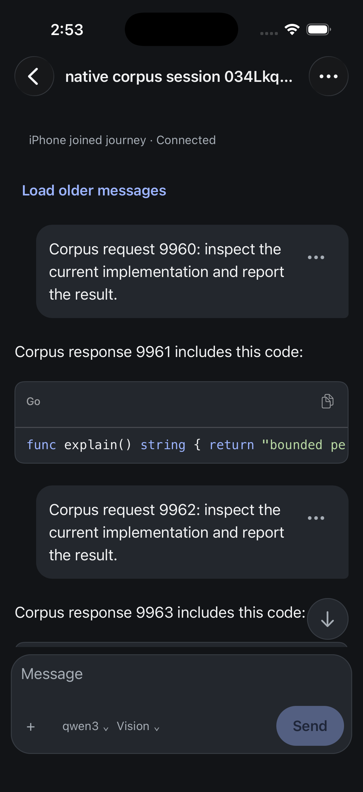
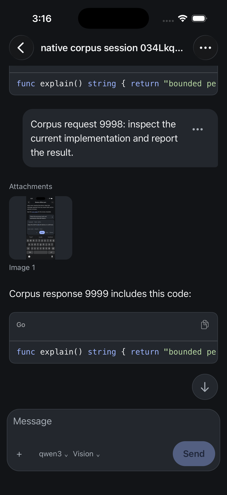

# iPhone loading measurements — 2026-09-09

This note records bounded server/projection measurements and two native scrolling corrections. The [evidence receipt](assets/2026-09-09-iphone-loading-evidence.json) binds the sources, raw samples, images and checks. It does not establish an iPhone performance budget.

## Corpus and reproducibility

The accepted v8 fixture contains 5 projects, 500 persisted sessions (100 per project), one heavy session with exactly 10,000 projected `ThreadItem` entries across 5,000 semantic turns, 5,000 fenced Go responses, and two supplied native PNG screenshots. Session identifiers are production UUIDv7 payloads; project identifiers come from `identifier.ProjectFromCanonicalPath`. The immutable corpus is at `/private/tmp/evener-native-performance-corpus-v8`; its manifest SHA256 is `b981f78273a588b84480d82e67ec47b49ca5f43ae9e4dd63fa7f95162cd1ea2d`, and its complete file list is recorded in `/private/tmp/evener-native-performance-corpus-v8/files.sha256`. The retained [generator snapshot](assets/2026-09-09-iphone-loading-generator.go.txt) is also at `/private/tmp/evener-native-performance-corpus-v8/generator/main.go` (SHA256 `c9b7afc85426ec541deec8ddc33452a080d0dbccd7110a906c5ef94974274af3`).

To regenerate, use the snapshot with the production module workspace, replace its private root/image paths with owned destinations and the two chosen PNG inputs, and choose current metadata timestamps if testing the current-session tier. UUIDs differ between generations; validate counts and semantic item identities again rather than expecting byte-identical generated IDs. Reproduction uses the production transcript writer and schema validator to generate the corpus, then the installed SDK against an immutable CLI Hub configured with `plugin_auto_upgrade = false` and an empty known-marketplaces file. The SDK catalog is read first, all five project pages are enumerated, and the heavy session is selected only from the returned catalog and matched to the manifest. The raw responses and per-request hashes are retained under `/private/tmp/evener-native-performance-corpus-v8/root-sdk-validation-1788946776953/` (286 SDK calls total). Earlier datasets were rejected for invalid session IDs, invalid hand-built PNG bytes, manifest hash mismatch, plain prose in place of fenced code, or January timestamps that caused the Hub to classify every session as archived.

## Measurements

The corrected process-cold run is recorded at `/private/tmp/evener-native-performance-measure-v8-corrected/summary.json`, with the driver at `/private/tmp/evener-native-performance-measure-v8-corrected.mjs`. It used 30 fresh CLI Hub processes with separate XDG state/config/cache and explicit run roots and warm OS filesystem cache. Startup and SDK connection were measured separately; startup p50 was 86.90 ms and p95 was 93.08 ms; SDK connection p50 was 1.02 ms and p95 was 4.22 ms. Per-method nearest-rank results across 30 runs were:

- Catalog `evener/navigation/read`: n=30, p95 10.86 ms. Project-page `evener/navigation/read`: n=30, p95 1.60 ms.
- `thread/read` with `includeTurns`, subscription replacement, `itemsView: "fragment"`, and `itemLimit: 40`: n=30, p50 54.971 ms, p95 61.436 ms, max 61.731 ms.

Each run proved 5 catalog projects, 500 catalog sessions, a 20-row project page with 80 remaining, the exact heavy reference, 40 unique returned items, and an image descriptor. The summary selects the 30 completed samples with recorded exit/listener results; 30 additional incomplete snapshots in the same directory are excluded. Each selected Hub exited cleanly and its listener was absent before the next run. Root independently found no remaining owned process among all 60 snapshot PIDs. The earlier uncorrected cold summary is excluded because it combined 90 different request types into one percentile and omitted the native fragment request shape.

A separate pure-Node projection check measured p95 `.2972 ms` for a 40-item fragment and `.2939 ms` for a 500-item projection. This excludes network, Hub startup, React Native rendering, layout, image decoding on device, and persistence waits. A separate authenticated image HTTP check measured p95 `26.56 ms` for the 294,233-byte screenshot payload; this is a server transfer measurement, not an iPhone image-rendering result. The final warm subscribed run is `/private/tmp/evener-native-performance-corpus-v8/root-sdk-timing-subscribed-1788947364956`: thread-read p95 was 3.03 ms across 30 fresh connections to the warm Hub and 4.85 ms across 30 reads on one connection. Both final warm modes retain the same exact driver SHA256 `5b65bc6fb76f416b37144e6d9bd0e8c091cdad5e878863816a49d34f7bb514b0`.

## Native interpretation and limits

The original Release `841220ee2` first-open frame opened the heavy session at the oldest item of its tail page (`9960`) while showing `Latest`; the final response (`9999`) was many screens below. The first correction (`7feeae950`) enables follow-latest when no saved reader anchor exists, while preserving saved-anchor restoration and disabling follow-latest on user drag. The current native first-open evidence reaches `9999` with the image verified. The same large fixture then exposed a separate saved-reader restoration defect: native scrolling clamped an exact offset before the virtualized list grew tall enough, but the duplicate guard treated it as applied. The saved anchor stayed intact while its visible position drifted. Source `af72f7bd4` records the reachable offset, retries when layout makes the target reachable, and cancels stale approximate positioning. Its signed Release build and all 704 native tests plus TypeScript pass. On final artifact `af72f7bd4`, a cold saved-anchor open and three consecutive navigation returns placed the same user message at y=118.6665 points, preserving its exact stored anchor. The earlier `7feeae950` artifact placed that same anchor at y=529. The final artifact also passed a separate no-anchor first visit with reply 9999 and its image visible. These are settled-position observations, not latency measurements. An independent Luna review accepted this bounded native comparison.

| First visit before | First visit after |
| --- | --- |
|  |  |

The native comparison used a copy of the 500-session corpus alongside 36 existing owned test sessions: 536 sessions across 11 projects. Its older fixture backend is recorded separately from the SDK measurement backend. No production Hub was changed. All seven original draft tables, nine pre-existing reader anchors and 226 original session files compare identically; the original conversation/draft is restored. Temporary tracing and its device key are removed. The standalone v7/v8 measurement Hubs exited cleanly; the owned native fixture Hub retains its five copied projects for further qualification.

These measurements contain no 30 native interactions, no physical iPhone or LAN run, no live provider stream, no memory check, and no native performance-budget pass. They show that the bounded Hub/SDK path and projection work complete quickly under this fixture; they do not identify a server root cause for Jesse's original slow-open complaint or substitute for device qualification.
