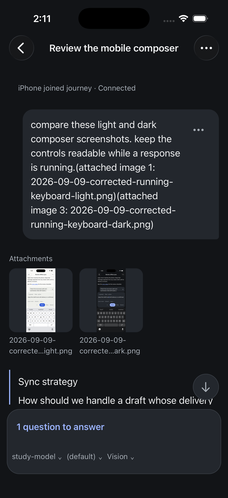
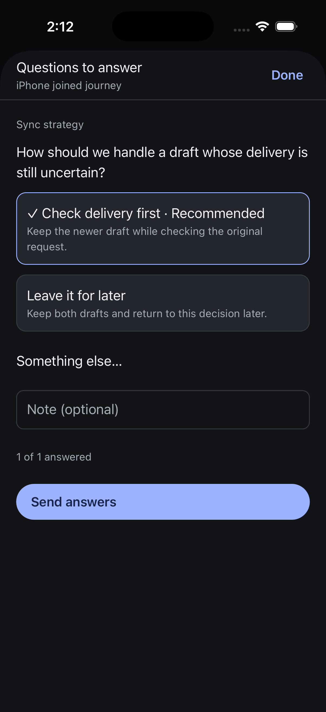

# iPhone media journey and review

The [native receipt](assets/2026-09-09-native-media-journey.json) records a real
two-image draft, send, viewer and question journey. This is a bounded simulator
result. Full media acceptance and the joined Task 15 workflow remain open.

On native source `c5fb198a9`, the coordinator selected two owned screenshots
through Photos, removed one, cancelled another picker visit without changing
the remaining draft, and reselected the removed image. Both encoded images and
the exact draft survived a terminated-app restart and navigation away and back.
Native Send delivered both images to the scripted provider with their original
encoded hashes and order. Both full-size images opened in the viewer.

An independent Luna reviewer found that long filenames took five lines below
each thumbnail. The implementation at `841220ee2` bounds those captions to two
lines and keeps shared typography. Another Luna reviewer approved the source;
the coordinator built, verified and installed the Release artifact. Native
frames confirm 95-point captions became 38 points, with unchanged thumbnail
geometry. The [visual confirmation](assets/2026-09-09-native-media-confirmation-review.md)
also checked both rendered images, full viewer filenames and navigation controls.

The image-containing conversation then opened its pending question sheet. Native
Send answers delivered “Check delivery first”; authoritative readback shows the
response completed, no pending question and an empty queue. The original
conversation and its unsent draft were restored. All seven original draft
tables and all three stored navigation/settings values exactly match the
pre-journey snapshots.

The canonical sent message still repeats long attachment descriptions inside
its text bubble. This is an open presentation concern, separate from caption
height. A future correction must preserve the user's text and image-reference
meaning; arbitrary string removal is not an accepted solution.

The two input images used inline bytes. Authenticated HTTP images, unavailable
image recovery, large transcripts, streaming reflow, landscape, overlapping-hub
destinations and physical-device performance remain unqualified here. The
current simulator artifact has not been uploaded to TestFlight. iPad and
dedicated accessibility qualification remain paused.
