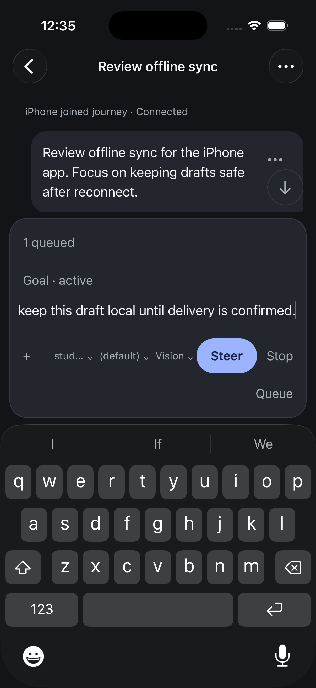
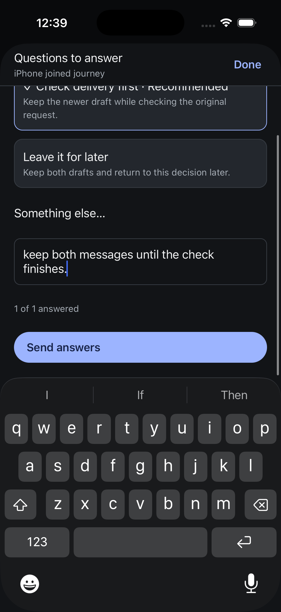
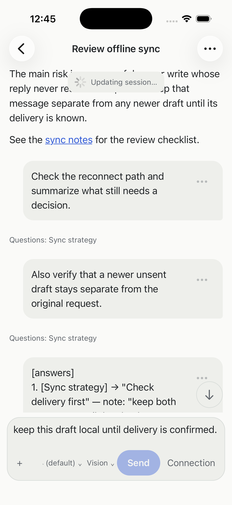
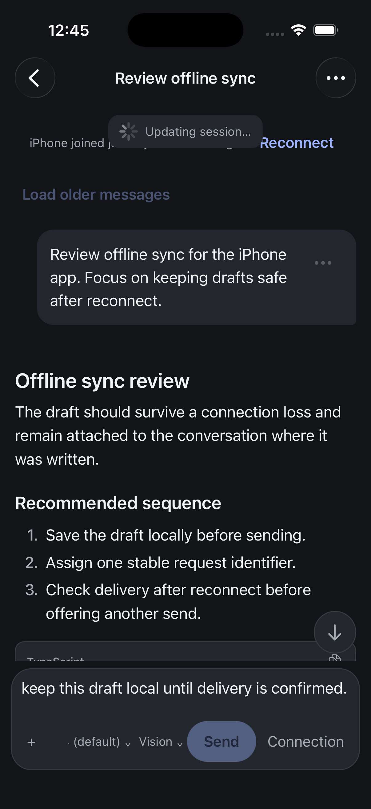
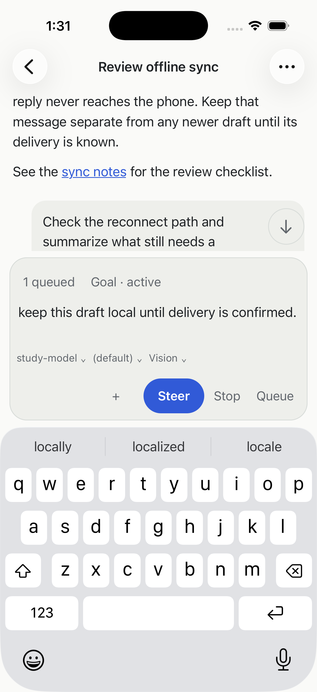
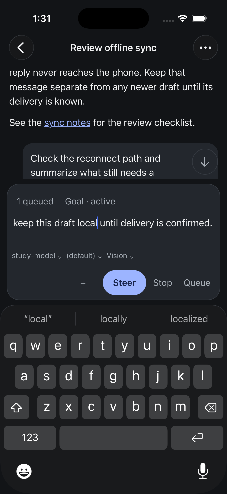
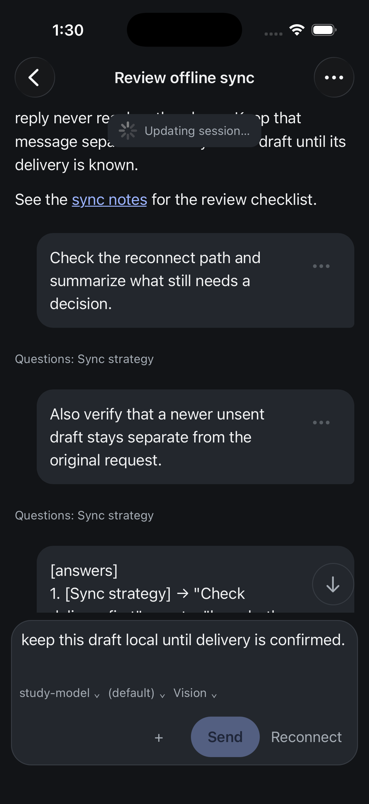
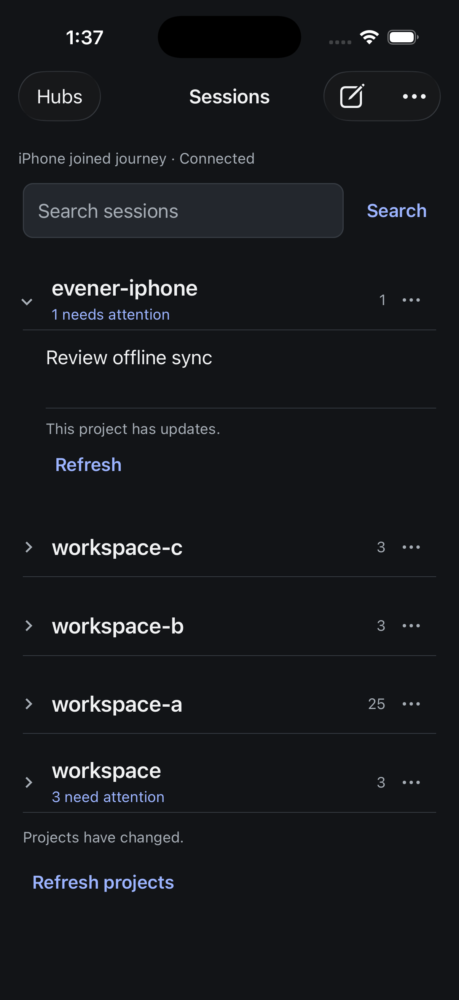

# iPhone running-work review panel

9 September 2026. Two independent Luna-medium reviewers inspected the same
installed native source `b9990e5c1`, actual iPhone simulator screens and source.
This continues the [whole-app UX contract](iphone-ux-contract.md). It is a
before-fix review; the complete Task 15 gate remains open.

The [workflow review](assets/2026-09-09-native-running-workflow-review.md) and
[visual review](assets/2026-09-09-native-running-visual-review.md) were written
independently. The coordinator then checked the findings against source and
actual interactions recorded in the [study receipt](assets/2026-09-09-native-running-study.json).

## What the actual workflow established

Running work exposed a queued message, an active goal, an unsent draft and the
software keyboard. Queue inspection worked. When the question-producing turn
finished, the queued message automatically started; question-plus-goal is a
separate reachable state, not an invented all-controls-at-once composition.

The question answer and optional note were submitted from the phone. Send answers
was reachable with one scroll while the keyboard stayed open. The ordinary
message draft remained separate. Allow once completed the exact requested file
write, independently verified on disk and in the completed turn.

A temporary pause of the owned test hub exposed connection recovery. The same
process resumed, the draft survived and provider request count stayed seven.
Tapping Connection scrolled to the transcript header. This tests an idle unsent
draft; it does not establish a lost-acknowledgement submission outcome.

After this inspection the original conversation, dark appearance and draft were
restored. Every preexisting draft row, saved reader entry and other stored value
is unchanged; only owned study message/question rows and one reader entry were
added. No existing conversation was used to generate study messages.

## Adjudicated fix batch

| Finding | Panel judgment | Coordinator decision |
| --- | --- | --- |
| Connection action sends the reader to a distant header | Both reviewers identify the same defect; visual P1, workflow P2 | Fix before the next demo. Show a local, named recovery action; preserve reading context and the draft. Keep uncertain delivery separate and never auto-send. |
| Busy composer crowds model/settings and wraps Queue | Visual P2; workflow finds the actions usable but model recognition weak | Group queue/goal as quiet metadata, preserve full-width writing, give settings readable room, and keep Steer primary with distinct Queue/Stop. |
| Duplicate project refresh notices | Coordinator reproduced two identical notices; source emits one for each internal current/recent page | Show one stale notice per expanded project while retaining actual page errors, pagination and retries. |
| Long approval path dominates | Visual P2; workflow finds the decision clear | Keep exact target visible in this batch. A future path summary needs trustworthy parent context before hiding detail; current Allow/Deny is reachable and the effect passed. |
| Selected option clips after scrolling under pinned sheet header | Visual P3 | Excluded: ordinary scroll clipping is not evidence of a broken layout. Question submission is verified. |
| Globally dim light frames | Both reviewers identify uncertain capture state | Excluded from contrast diagnosis. Confirm stable light appearance on the corrected artifact. |

The implementation keeps the established native header, user-message distinction,
colors, native sheets and 44-point action regions. It does not change navigation
architecture. iPad and dedicated accessibility remain paused.

## Captured screens

| Running with keyboard | Reachable question submission |
| --- | --- |
|  |  |

| Connection recovery at reading position | After tapping Connection |
| --- | --- |
|  |  |

Static screens do not prove latency or complete usability. The next confirmation
must run the corrected artifact through these affected actions. Image-containing
conversation coverage, similar hub destinations, representative scale, physical
network performance and the signed physical-device update remain separate open
requirements. The first two-person panel and project-attention follow-through
remain linked from the whole-app contract.

## Implemented and confirmed follow-through

The [correction receipt](assets/2026-09-09-native-running-correction.json) and
[independent confirmation](assets/2026-09-09-native-running-confirmation-review.md)
record the bounded result. The current signed simulator artifact is
`c5fb198a9`; busy/queue/recovery interactions were confirmed at `5c253d512`,
before the final project-only stale/error predicate fix. These identities are
kept separate in the receipt and screenshots.

Queue and Goal share a quiet row, the draft remains full width, model settings
have readable space, and Steer, Stop and Queue remain distinct above the
keyboard. Native queue inspection worked. After releasing the held fixture,
both turns completed and the queue/goal cleared.

A real connection fault initially exposed a 25-point transcript shift: the
connection row grew when Reconnect appeared offscreen. Reserving its action
height fixed that cause. The confirmed run kept the same anchor at
267.333 points before disconnect, after settling, after tapping Reconnect and
after recovery. The draft was unchanged and provider requests stayed at nine.
This was an idle unsent draft; the actual unconfirmed-delivery sheet remains a
separate runtime requirement.

Project invalidation exposed another concrete mistake: stale snapshots also
carry informational error text, which was being misclassified as two failed
pages. The final predicate fixes that distinction. Renaming the owned session
now produces one update notice per expanded project, retains cached content,
and reveals the changed name after native Refresh. Restoring the name and
refreshing again also passed. Genuine non-stale load-error handling remains;
the existing catalog-level refresh notice is separate.

All original draft rows and saved reader entries are unchanged. Other stored
values match exactly, and the original conversation and dark appearance were
restored. The 703 native tests, TypeScript, touched-file formatting and signed
Release build pass. This work has not been uploaded as a new TestFlight build.

| Corrected running composer, light | Corrected running composer, dark |
| --- | --- |
|  |  |

| Local recovery preserves reading position | One project update notice |
| --- | --- |
|  |  |

The next complete specimen still needs image content and recognizable
similarly named hub destinations; representative-data performance and physical
install/update require their own evidence. iPad and accessibility stay paused.
