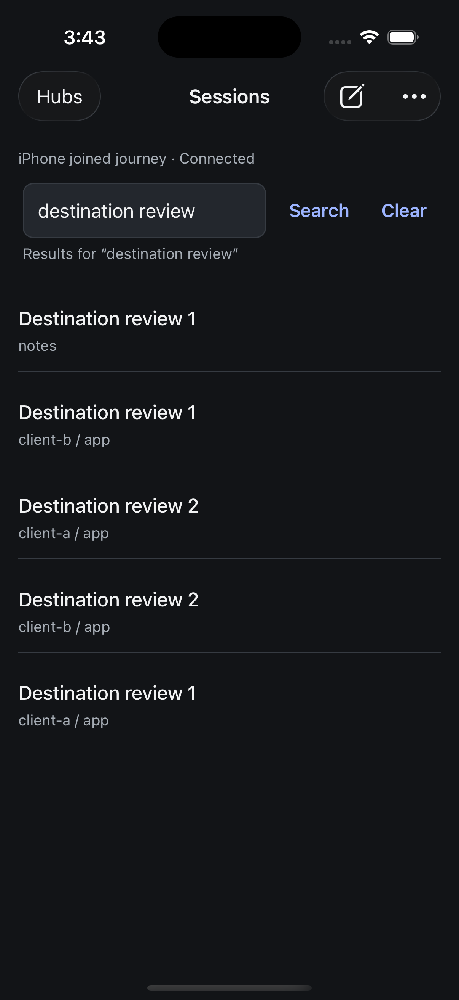
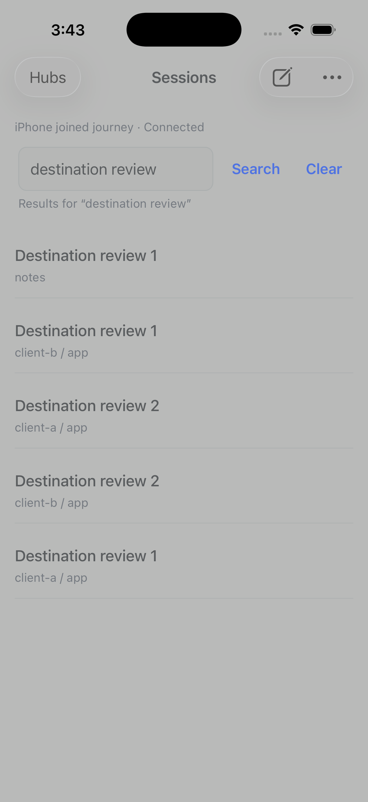

# Recognizable search destinations

9 September 2026. The UX panel identified ambiguous sessions in projects sharing
a basename. The signed iPhone simulator build at `f866b2a80` now shows the shortest
distinguishing path suffix. Multiple sessions from one project retain the same
short label, and unrelated projects retain their basename. The full canonical
path remains available for context; session routing is unchanged.

The real test Hub supplied five newly created sessions across three owned
projects. Before the correction, four results showed only **app**. After it,
those rows show **client-a / app** or **client-b / app**; the other project remains
**notes**. An independent Luna reviewer accepted the source and the light/dark
native comparison without further findings.

| Dark appearance | Light appearance |
| --- | --- |
|  |  |

Opening a same-title session selected the exact intended hub/ref. Returning
retained the query, all five session contexts and every row position with zero
measured drift. The original conversation and its separate unsent draft were
restored. All seven original draft tables, nine reader entries and other saved
values match the initial snapshot exactly.

The [receipt](assets/2026-09-09-search-destinations.json) binds the screenshots,
raw observations and signed simulator artifact. The native gate passed 710 tests
across 75 files plus TypeScript; formatting and independent SDK package
qualification also passed. The SDK settings fixture retains its separate backend
and package identity. This small specimen does not qualify physical-device
performance, the whole application or TestFlight installation.
