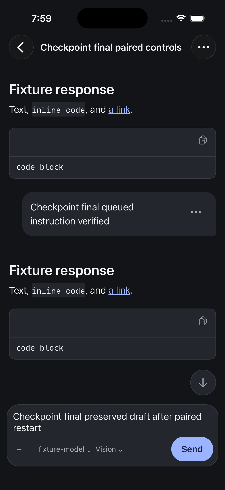

# Current iPhone checkpoint evidence

This page separates source qualification, the owned simulator journey, and delivery. The [status page](status.md) records the dated PR inventory; the [remaining-work plan](ios-v1-remaining.md) defines the acceptance work still open.

## Combined source qualification

Candidate: `8081b4e635f54807b6ad186738e2870e8186275f`.

`make merge-approval-gate` completed with exit code 0. It covered repository lint and generation checks, all backend modules, the web gate, 720 native tests, 686 shared-session tests, native TypeScript and the independently installed SDK qualification. The [receipt](assets/2026-09-10-paired-restart-8081.json) records the candidate and full-log hash. The earlier passing `3dcde7559` gate is a prior baseline.

The intermediate candidate `38142a4ce` failed the existing resume-hook reinjection diagnostic test. Persisting environment context before hook delivery caused setup context to be counted as prior conversation. The correction excludes environment metadata; an additional public empty-restore regression proves the real failure classification. The full agent module and subpackages pass after that correction. Timing metadata is likewise excluded from conversation counts and transcript search, with failing-before/passing-after regressions.

## Artifact and runtime identity

| Item | Verified identity |
| --- | --- |
| Simulator | iPhone 17 Pro, iOS 26.5 |
| Native app | Signed Release artifact built from `87e2b876e`; native/shared inputs unchanged at `ec0b6d3af` |
| Native executable SHA-256 | `711495869c88518eec5df3667be0c26310ce2d2a43baaa62dea8573a996ba404` |
| JavaScript bundle SHA-256 | `6de2fd0981d564ab7f236225691315717a0b8cac4d960b31366790936afa6d9b` |
| Final backend | `8081b4e635f54807b6ad186738e2870e8186275f`, clean VCS stamp on both runtime binaries |
| Prior backend | `d983930b0e089a26ed8bd1047c2edfb45aa300b4` |

The backend restart retained the fixture's origin, credentials, state and scripted provider. The fixture is isolated from production hubs and sessions.

## Observed product behavior

The [earlier native control journey](assets/2026-09-10-paired-restart-d983.json) exercised native send, queue, steering and Stop. The verified queue attempt used the full composer text, and both queued messages completed once. Steering retained its owner. Stop cancelled the provider request and left the turn interrupted without an answer. An earlier automation attempt submitted a partially typed queue message; it was repeated with input verification before submission and is not presented as an app defect.

The [final comparison](assets/2026-09-10-paired-restart-8081.json) performed a real backend restart followed by an app cold launch:

- All 32 saved canonical items matched by persisted key, turn identity/status, position, content and structured payload.
- The stopped turn remained interrupted.
- All seven draft tables were unchanged.
- All eleven reader entries outside the currently exercised fixture were unchanged.
- The exact unsent draft remained visible in the composer.
- The provider request count stayed at 41, demonstrating that the restart and cold launch did not submit another request.
- The native accessibility tree contained eight user-message rows without a loading indicator.

The current fixture's reader position and navigation state may change during the journey. Cache tables are not user-draft preservation evidence.

The earlier live-to-cold comparison covered 31 common persisted items because live startup diagnostics and the saved system-prompt item differ. The final saved-to-saved comparison includes that saved system prompt and therefore covers 32 items. Neither receipt claims equality of transient wire IDs.

## Evidence that remains open

This simulator result does not establish a fresh TestFlight archive, Apple processing, physical iPhone installation/update, real-network performance, or the full supported workflow matrix. Those are separate acceptance rows. The TestFlight automation still requires landing on main and an actual run; external Drew access still requires completion of Apple's beta setup.
