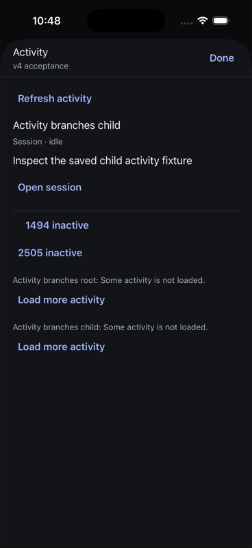
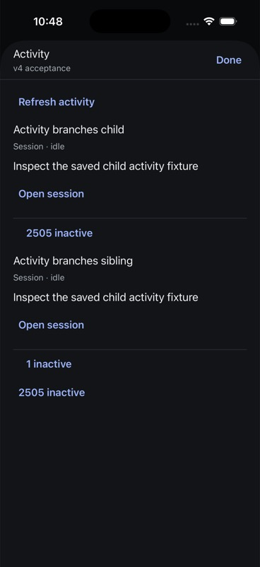
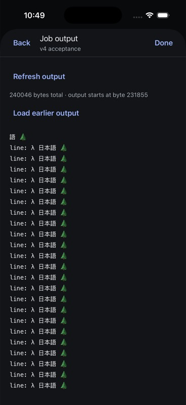
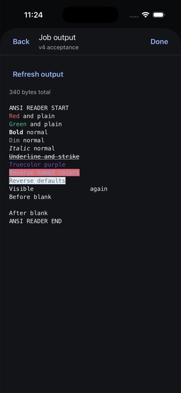
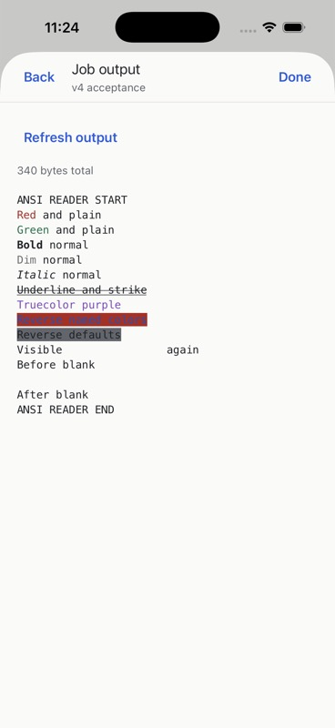
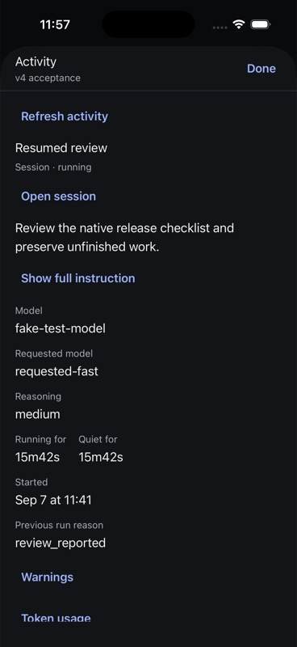
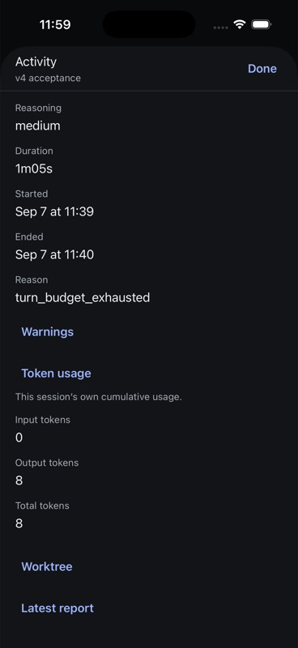
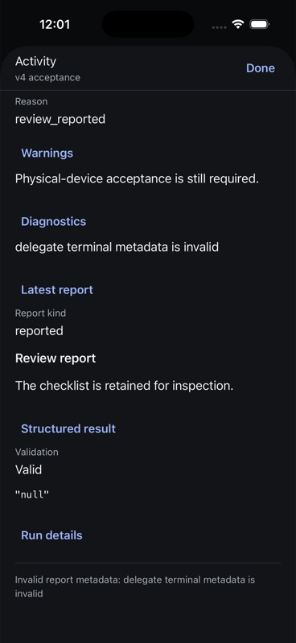

# Native activity and job output

Product authority: current web `ActivityPanel.tsx`, `ActivityTree.tsx`,
`ActivityRowDetail.tsx`, `activityData.ts`, `activityRows.ts`, and
`panes/transcript/JobLog.tsx`; AppWire `evener/jobs/list`,
`evener/jobs/output`, job lifecycle/tree notifications, and thread resync.
The old mobile UI is not a feature reference.

## Native behavior

Work opens the platform chooser for Tasks and Activity, leaving the composer
and Session controls in place. Activity uses the current web parser, row
hierarchy, inactive folds, delegate revision fencing, and continuation grafting.
The merge functions and job-output parser are extracted into pure modules used
by both clients, without changing the web behavior.

Rows disclose command or mandate, status, available output/exit information,
and server-provided reasons. An explicit action opens a server-provided job
transcript or delegated session. There is no invented job-stop operation.
Partial branches retain their notices and continuation controls.

Each activity reader belongs to one hub/session connection lifetime. Matching
notifications coalesce into a fresh root read; a root invalidation supersedes
an in-flight continuation. Older revisions, foreign roots, and disposed
responses cannot replace displayed activity. Refresh failures retain the last
tree with an error. Reconnect can seed the new reader with that retained tree.

Output is fetched against its owning session. Load earlier uses the server's
byte offset, not the rendered character count. A non-advancing page ends
paging without duplicating content. Failed reads retain output with an error;
Refresh replaces the loaded window with the latest tail. Output lines are
virtualized, selectable terminal text. Parsed ANSI runs render themed colors,
emphasis, reverse colors and concealed spacing; blank lines retain their height.
Concealed runs are omitted from the line's accessibility label.

## Verification, 6 September 2026

- Native TypeScript and targeted Biome pass; all 158 native tests pass.
  Six new transport-boundary tests cover root retention/revision guards,
  continuation ownership/count retention, invalidation coalescing, disposal,
  output byte paging, failure retention, and non-advancing pages.
- The existing activity-store tests pass after pure helper extraction.
  `make test-web` passes typecheck, tests, and lint. All five
  `make test-web-browser` guards pass.
- Both Release builds succeeded: iPhone 17 Pro / iOS 26.5 and Pixel 7 /
  Android API 35. Both were installed and launched.
- Each native composer submitted NATIVE-JOB-HARNESS to its owned session on
  the isolated real hub at port 56491, through the port 9199 AppWire proxy.
  A scripted provider issued a real background shell call that emitted
  220000 bytes, remained running for 45 seconds, then emitted its end marker.
  No production hub session or live model was used.
- Both platforms displayed the running job, opened its output, and loaded
  earlier output from byte 215904 to 211808. Both subsequently showed the
  inactive fold after the job completed without manually refreshing the tree.
  iOS expanded that fold and reopened completed output. Android system Back
  returned from output to the activity tree.
- The final Work-menu build was manually exercised on both platforms. iOS
  uses the native action sheet; Android uses the native chooser dialog.

## Remaining acceptance

This is an implemented increment, not complete activity parity or release
acceptance. Still required: real delegated-session navigation and nested
branch paging, native reconnect/fault testing, cross-hub action ownership,
complete delegate metadata and timing presentation, ANSI contrast qualification,
output copy/selection and reading-position behavior, large-text and screen
reader coverage, long-log memory/performance, and representative devices.

## Delegate navigation and reconnect follow-up

Using the same isolated real hub, the scripted provider issued the current
`delegate` tool with a leaf assignment. It created distinct children for each
native parent, and each child reported NATIVE-DELEGATE-CHILD-READY through
`communicate`. Android child: `local:034K2olsBMMCemqCadASi0`; iOS child:
`local:034K2p09OvyVcaii5Foii8`.

On both platforms, Work → Activity → inactive fold → delegate detail → Open
session reached the child's own transcript and displayed its report marker
with the expected hub name. iOS toolbar Back and Android system Back returned
to the respective parent. The web reference opens delegates in a read-only
transcript pane; these children advertise no composition capabilities.

This check exposed an editable Message field and attachment picker on a
session that could not send. Native now omits composition fields, attachment
controls and composer settings when all send/steer/queue/goal capabilities are
false. Reading/navigation controls and pending decisions remain available.
Stored drafts are untouched, and an unknown/loading conversation is not
classified as read-only. Both new Release builds succeeded, and both apps
were installed and restarted into the child: its report remains readable and
Message/Attach images/model controls are absent. Native 158 tests, TypeScript,
and touched-file Biome pass. This presentation change was checked manually;
no new automated UI-rendering coverage is claimed.

For reconnect acceptance, both parent Activity panels were expanded before
restarting the owned port-9199 WebSocket proxy with a controlled jobs/list
failure. Both panels retained their rows and fold state, displayed the exact
refresh error plus the stale-data notice, and recovered on Refresh activity
after the failure was removed. This establishes native activity-tree
retention and recovery; output-window reconnect/failure acceptance and
cross-hub faults are still open. Nested delegate branch paging, full metadata,
styled output, accessibility and performance acceptance remain outstanding.

## Continuation prefix repair — 7 September

The server's continuation cursor skips entries already returned. The shared
native/web merge treated the target session as a replacement, dropping its
loaded prefix. It also skipped child expansion when the target delegate's
projection revision was unchanged. The native test previously repeated the
prefix in its continuation fixture and therefore missed the loss.

Continuation now uses the existing ordered ID merge throughout the returned
branch: retain earlier entries, update overlaps, append new entries, and merge
children independently of the delegate metadata revision fence. Both callers
use this path only for continuations; ordinary root refresh continues to
replace missing entries. Root summary retention, advertised-cursor checks,
invalidation handling and ownership guards remain in effect.

The corrected native suffix fixture failed before the fix, as did four new
shared merge regressions for overlap, nested prefixes, equal-revision expansion
and newer delegate metadata. The focused frontend suites pass 22 tests, and
the full native suite passes 585 tests plus TypeScript. The canonical frontend
gate passes typecheck, tests and lint after formatting. Current-source real v4
device branch paging and the broader activity acceptance matrix remain open;
the installed iOS bundle still corresponds to the goal-qualified source.

## Direct v4 iOS paging and output — 7 September

Implementation source `cb0dca5cc` is installed as a Release app on iPhone 17 Pro /
iOS 26.5, bundle SHA
`22974d41d3b24501cb710c4f4da74eced60f7caaec5d0a769e7c709716e677ff`.
The direct owned hub at port 54211 runs `0f95ef200`. The independent SDK consumer
packs `7b48a7314`, tarball SHA
`6d5f65703f30ea7da2be5a610ef0894f2b4e008902bf4404e167d861e5b96046`.
The [receipt](assets/activity-output-v4-receipt.json) records artifact paths,
fixture Git provenance, exact session identities, structured page counts, UI
snapshots and retained draft hashes.

These are deliberately large **persisted read fixtures**. Newly minted sessions
and journals live only under the existing disposable hub's XDG state. The real
hub indexes, folds, projects and serves the data; the actual native controllers,
iOS app and packed SDK read it without a proxy. Seeded job/delegate records do
not prove shell execution or delegate processes. Header-only transcripts let
the native app open these saved sessions. No model/provider was called.

### Repairs exposed by the direct fixture

The 2000-work-unit limit produces suffix pages. A 2505-job root and 2505-job
child retained all IDs after the earlier prefix repair, but the merged root
still reported the first page's 2000 completed entries and incomplete coverage.
The child's last page reported only its 1011-entry suffix. Continuation merging
now derives counts and aggregate state from all retained entries and merged
children. Coverage completion means all branches are loaded; it does not mean
every job is terminal. Ordinary root refresh still replaces omitted entries.

A second fixture adds another child with one job. Loading the large child first
also exposed an empty ancestor branch object erasing the root's outstanding
cursor. Grafting now receives the requested node ID, replaces branch state within
that target, and preserves other pending branches. Removed targets are ignored.
These regressions failed before their repairs.

The output decoder now rejects unsafe, negative, fractional or inverted byte
offsets and malformed paging flags. Its required `truncated` field is validated;
omitted `hasEarlier` remains the current wire's false value. Native, web and the
new single-page SDK recipe share this decoder. A rejected page retains native
content and retries from the same server offset.

### Observed native journey

The second fixture reached these states on the actual iOS screen:

| Step | Root jobs | Large child jobs | Other child jobs | Remaining pages |
| --- | ---: | ---: | ---: | --- |
| Initial read | 2000 | 0 | 0 | Root |
| Load root | 2505 | 1494 | 0 | Root and child |
| Load child first | 2505 | 2505 | 0 | Root |
| Load root again | 2505 | 2505 | 1 | None |

The native-controller harness separately asserted exact ordered IDs with no
duplicates, final counts of 5011 completed jobs plus two nonterminal delegate
descriptors, foreign-ref cursor rejection, stale-cursor no-ops, and fresh-root
replacement back to the first 2000 entries.

iOS opened the large child's first job through its owning session. Load earlier
moved the displayed byte start from 235950 to 231855 for a 240046-byte Unicode
log; Refresh returned to 235950. Back retained the expanded job and loaded
activity. The controller harness reassembled the complete log exactly. The
separate packed SDK used four 64-KiB reads with server cursors, obtained the same
SHA-256, accepted empty output and a one-byte request at a multibyte boundary,
and rejected a child job requested through the root owner. Numeric output
offsets do not contain ownership; clients must retain the ref/job binding.

### Verification and limits

593 native tests plus TypeScript, 131 SDK contracts across thirteen files,
isolated package qualification, the canonical web gate and all five browser
guards pass. Eighteen decoder regressions failed before validation was added.
Luna medium supplied implementation proposals and independent reviews; the
coordinator integrated and executed the checks. All six existing drafts and
the unrelated Apple project/plist patch remain byte-identical.

The automation tool's refreshed snapshot exceeded its 2500-ms settling deadline
when opening output and loading earlier; both actions succeeded and subsequent
snapshots verified the result. This is not performance qualification. Native
output faults/reconnect, cross-hub ownership races, real ongoing/delegated
execution on this build, complete metadata, styled ANSI, copy/selection,
reading-position behavior, accessibility, large text and device/performance
coverage remain open. SDK activity-tree traversal still lacks a packaged
workflow. This checkpoint qualifies these iOS reads, not v1 as a whole.

## SDK traversal and native ANSI output — 7 September

Source `e0cd5690fb13dc4b14aa5c0d020a280d4312b23f` shares the existing activity
parser, merge logic and native reader through the portable protocol package.
The reader fences ref/thread identity, unsafe integer revisions and stale
responses; malformed members preserve valid neighbors and mark their branch
incomplete. A bounded recipe consumes only advertised opaque continuations,
retains partial trees on failures, and distinguishes budget exhaustion, repeated
cursors, incomplete summaries, unavailable actions and ended threads. See the
[packaged recipe guide](../../../cmd/evener-hub/frontend/src/protocol/README.md#reading-activity-and-its-continuation-branches).

An independently installed tarball against the owned direct v4 hub completed
both persisted fixtures from the preceding acceptance section: three pages for
2,505 root plus 2,505 child jobs, and four pages for the fixture with the additional
sibling job. Exact ordered job IDs, ownership, accumulated counts and exhausted
branches were checked. Both one-page reads returned an incomplete 2,000-job
prefix. Wrong-thread reads returned failure without a tree. The installed CLI
returned only outcome and page/remaining-branch counts. The tarball SHA-256 is
`2bed1fc54314ace0f8661702ab917db588f5b09f60f29401a2f0e4fac7123346`.

The iPhone Release build renders nested native ANSI text. The first simulator
pass found missing decorations and visible concealed text despite green unit
tests. Metro resolved an undeclared transitive Anser 1.4.10; tests resolved the
web installation's 2.3.5. Aligning Vitest with native resolution reproduced three
failures. Declaring Anser 2.3.5 explicitly repaired the bundled behavior. This
was a dependency-resolution defect, not an ANSI parser or simulator timing issue.

A new 340-byte persisted output fixture checks named and RGB colors, bold, dim,
italic, underline, strike, reverse colors, conceal and a blank line. The rebuilt
app displayed all styles in dark and light mode; conceal retained its glyph
spacing while the runtime accessibility label contained only the visible text.
Blank-line geometry was correct without adding placeholder text. Refresh kept
the output intact, and Back returned to the expanded job and inactive fold.
The independent SDK read matched the entire saved output byte-for-byte. The
native bundle SHA-256 is
`8cf0711382da7eb20f6e8df3bf356e6782a3ce53b0cfabc1ab1af17828ddee45`.

The [receipt](assets/activity-sdk-ansi-v4-receipt.json) records source, build logs,
package/bundle/fixture hashes, exact read outcomes and draft preservation.
601 native tests and TypeScript, 141 SDK contracts across fourteen files,
outside-checkout package qualification, the canonical frontend gate and all
five browser guards passed. Six drafts and the unrelated Apple migration patch
remain unchanged. No production session was used.

These are read/projection fixtures, not new shell or delegate execution proof.
Actual VoiceOver, selection/copy, large text, long-output memory/performance,
ANSI contrast, multi-hub faults, delegate metadata and final release acceptance
remain open. Android sources remain preserved; Android release qualification is
deferred for iOS-only v1.

## Delegate details and current-wire usage — 7 September

Source `ef12d750e434e25798782a40099dfb36f0c6a82d` adds native instruction
disclosure, requested/resolved model and reasoning, live/terminal timing, usage,
reported worktrees, warnings/diagnostics, latest reports, structured results and
run/budget facts. Detail clocks use valid current-run timestamps, stop on
background/disconnect/unmount, and label server-only durations as last reported.
The sheet waits for a connected client before its first activity read.

Direct acceptance used a new owned persisted journal with three delegates: an
exhausted result, a resumed run retaining an old outcome/report, and a terminal
result with deliberately invalid metadata. The initial fixture violated the
journal's exhaustion-reason enum; correcting that value and adding empty child
job journals repaired the fixture without changing production code.

The valid fixture then exposed a product defect: the hub returned all three
delegates, but the shared parser retained only the invalid-metadata row. The
other two had output-only usage objects because Go omits zero-valued counters.
The parser incorrectly required both input and output counts. Isolated tests
reproduced the lost rows; the fix normalizes omitted input/output counters within
a present usage object while still rejecting malformed supplied values. Missing
usage remains missing. The independent guide now explains this wire rule.

An outside-checkout consumer installed the corrected tarball and verified all
three raw and parsed children, incomplete counts from the intentional error,
65-second terminal durations, retained prior outcome/end on the resumed child,
input 0/output 8/total 8, ahead 0, false exhaustion resumability, and JSON null
versus the string "null". The tarball SHA-256 is
`be6651ac3f43f0270a009fc94f2c7641289d3010ba926b293ff57aec53124d9d`.

The iPhone 17 Pro Release build on iOS 26.5 displayed all three rows. The resumed
clock advanced from 15m33s to 16m09s, while terminal duration stayed 1m05s. Full
instruction disclosure, model settings, zero usage, wrapped worktree path and
zero commits ahead rendered correctly. The exhausted result showed Invalid,
its validation reason, JSON null and No for resume after exhaustion. The other
terminal row retained its warning/diagnostic, Markdown report and a Valid quoted
JSON string. Open session reached that child on the selected hub, and Back
returned to the parent. The native bundle SHA-256 is
`8dd7fe2db1b514a6637b6542e14732c70c673a3f12ab1217f8375fc9b6cff1e8`.

The [receipt](assets/delegate-v4-receipt.json) includes fixture/source hashes,
build logs, additional worktree/exhaustion captures and all six preserved drafts.
610 native tests and TypeScript, the canonical frontend gate, all five browser
guards and outside-checkout package qualification passed. The unrelated Apple
project/plist patch remains byte-identical. Luna medium workers implemented the
helpers/parser regressions, reviewed integration and ran the independent SDK
read; Bot integrated, corrected weak assertions and verified the native UI.

These are persisted projection reads. The resumed journal is not proof of an
executing delegate, and the worktree fields are reported packet metadata, not
independently checked Git state. Background/disconnect lifecycle has source and
helper coverage but still needs its actual fault journey. UI automation sometimes
timed out waiting for snapshots to settle after successful actions; refreshed
snapshots verified the resulting state, without establishing performance.
Live concurrent faults, VoiceOver, selection/copy, large text/reports, iPad,
physical-device and release acceptance remain open. Android qualification stays
deferred for iOS-only v1.
