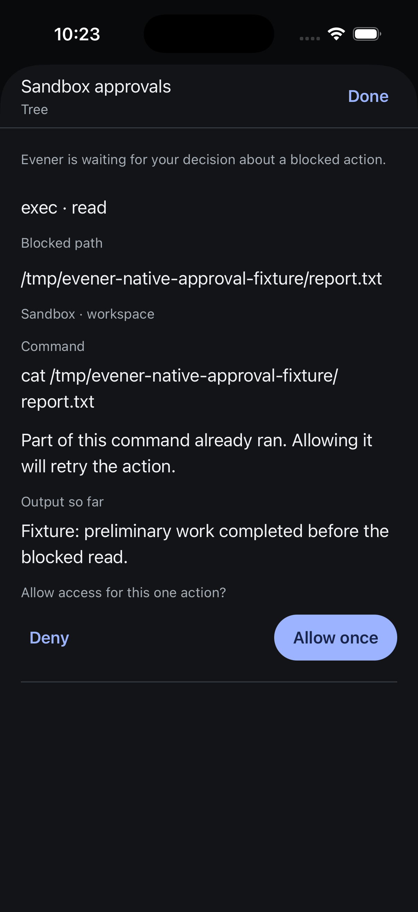
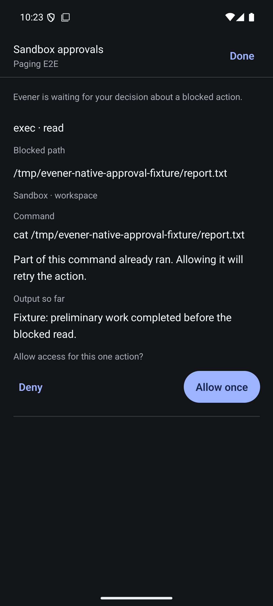
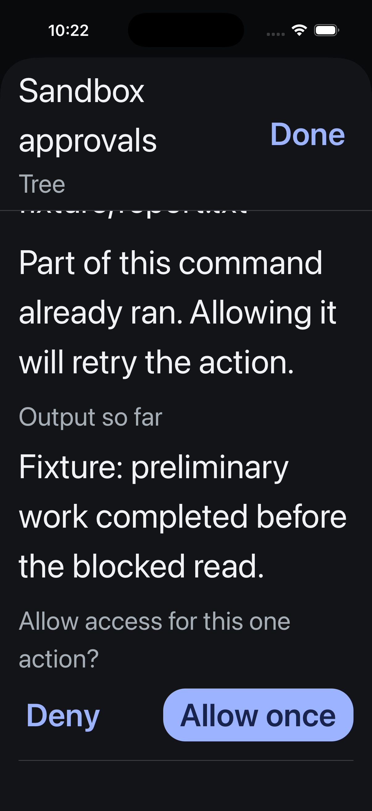
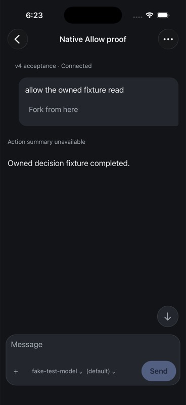
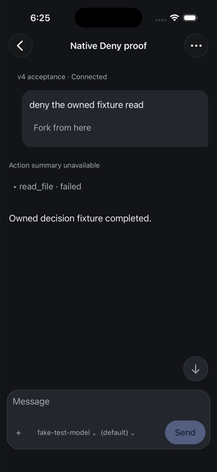
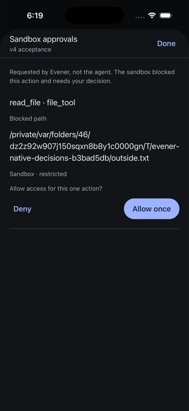

# Native sandbox approvals

Verified 5 September 2026. A compact approval count beside the composer opens an iOS page sheet or Android full-screen modal. The sheet identifies the hub, tool, blocked path, sandbox mode, command, partial execution warning and available output. Allow once and Deny are explicit actions; dismissing does not decide. Resolutions received from another client remove the pending request while the sheet is open.

The shared conversation projection owns pending approvals. Initial hydration subscribes before reading, reconciles approval notifications and rereads for overlapping non-idempotent traffic. A resolution received during a later snapshot read cannot be resurrected by that older snapshot. Native decisions check the displayed request and live session binding, serialize dispatch, and refresh after acknowledgement. Uncertain failures stay visible without automatic replay.

## Evidence

- Native TypeScript and 94 tests across 17 files pass. Seven approval tests cover hydration, identity filtering, changed requests, stale/disposed bindings, concurrent decisions, uncertain failure, a stale rehydrate, initial snapshot overlap and failed initialization cleanup.
- Shared mobile TypeScript and 2,238 tests across 90 files pass. Touched native files pass Biome. Independent review closed initial notification loss, overlapping delta replay and failed initialization cleanup findings; the final bounded review reported no remaining findings.
- Both final Release builds installed successfully. On final sources, iOS dismissal preserved the pending request without dispatch. iOS Allow once sent one true decision and cleared both devices. After fixture reset, Android Deny sent one false decision and cleared both devices. Both then displayed No approvals pending without the obsolete waiting instruction.
- Inspected final screenshots on both simulators. iOS accessibility-large text reflowed and scrolling reached both decision actions; that capture precedes only notification buffering and empty-state copy changes. Text size was restored afterward. Android approval-specific enlarged-text and screen-reader acceptance remain open.
- Manual decisions used a controlled WebSocket fixture for the owned isolated-hub session. It injected one escalation and intercepted its decision; other traffic forwarded to the real isolated hub. No actual blocked command executed or resumed. The fixture was removed and the ordinary all-interface navigation proxy restored afterward. Production was untouched.

## Remaining acceptance

Background/reconnect decision races, acknowledgement-loss injection in the native UI, screen readers and physical devices still need E2E acceptance. Structured questions are a separate unfinished workflow. The direct execution pass below qualifies one blocked-file path; it does not establish all user-decision surfaces, the full repository merge gate or release readiness.

## Direct v4 execution through native and packaged SDK decisions

On 7 September 2026, the iPhone 17 Pro / iOS 26.5 clean Release from
`92bfcbf5d` used the direct owned hub on port 54211. Its installed JavaScript
bundle was independently verified as
`1a52905ae64b7ea081cc7850eae5d6848af7062cf32756dcd73caaed895c6d18`.
The native source and build are unchanged from the reader repair; the preceding
583 native tests and TypeScript remain the build baseline. The hub binary has
SHA-256 `606c8b19bbeb6139a1e1ecc1f2b70d70acd24634f286f940f5a365cd989cfbb7`.

The isolated fixture lives at
`/private/var/folders/46/dz2z92w907j150sqxn8b8y1c0000gn/T/evener-native-decisions-b3bad5db`.
Its Go driver imports the existing `test/e2e/fakellm` boundary, asks for exactly
one `read_file`, and inspects the matching tool result in the next real provider
request. The requested `outside.txt` is a canonical regular file containing a
unique owned sentinel, outside the separately initialized `workspace` Git root.
Sessions use `sandbox: restricted` and have a live native or SDK subscription
before starting. The harness emits the approval and waits for its decision;
no approval notification or resolver response is injected or intercepted.

The final driver is Git-tracked at `2f54edd3663dae74960944b69cad7e56bdd309d3`,
source SHA-256 `f6b5abfc4739608a9388fb2865020b2a8eab1f9935e357bf66e821ce389f066b`
and binary SHA-256 `35cac089f4982d8f2da339ca9ed8fb548881a20287a6dbb0f82b6ca987a3cb26`.
It logs only tool-call IDs and boolean observations, never request bodies,
prompts or file contents. A temporary openai-compatible provider instance uses
its loopback endpoint without a real provider credential. Luna medium agents
supplied proposals and reviewed the evidence; root corrected, built and ran the
fixture in the authoritative environment.

| Decision surface | Ref | Read result | Sentinel reached provider |
| --- | --- | --- | --- |
| Native Allow once | `local:034Khfv53GGNQtwSD1USdp` | completed, no error | yes |
| Native Deny | `local:034Khfvp9td8b69koFIdy1` | failed, error present | no |
| Packed SDK approve true | `local:034KhoCGMKvMhy6dutNu5W` | completed, no error | yes |
| Packed SDK approve false | `local:034KhoDBsNt9bVISkNMX7q` | failed, error present | no |

Before every decision, independent `thread/read` confirmed one pending card
with the exact owned path, `read_file`, and `restricted` mode. Native sends used
the composer; the keyboard was open when the approval count was tapped. The
sheet displayed the complete path and both actions. Each decision cleared the
card. A separate subscribed SDK client observed turn completion and read the
full transcript. The provider observed the matching read result and sentinel
presence independently of the UI. The two clean native screenshots below show
the completed response; Deny also shows the failed read.

The installed SDK artifact
`707c7f1ff6798aff1ce3f1f1fcf901737499a620fef96d1c30f60fa51c92bca5`
ran `runApprovals` with the full reviewed card and current instance. Each case
made exactly one resolve request and returned `acknowledged` with
`execution: unverified`. Separate completion notifications, transcript results
and provider observations establish these fixture outcomes; the helper does
not infer execution from its acknowledgment. All four turns ended `completed`,
with no pending approval and the thread `awaiting` its next user input.
The [structured receipt](assets/approval-real-receipt.json)
retains identities and assertions for each case.

An excluded diagnostic turn proved Allow reached the file, but its driver used
bare text to finish. Evener required a `communicate` tool call, so that turn was
explicitly interrupted. The corrected driver uses the existing fakellm CLI's
`communicate(end_turn=true)` envelope. The diagnostic card image below belongs
to that initial turn on the same native artifact and owned path; it is not the
proof of complete execution. The clean receipt and completed transcript images
provide that proof. An observer initially asserted `idle`; current source and
independent reads establish `awaiting` after a completed communication. The
recorded acceptance checks turn completion and send/interrupt capabilities.

Cleanup shut down exactly the five created fixture sessions after checking
their current instance, workspace and absence of pending work. Transcripts
remain for evidence. The temporary provider was removed and its entire original
two-entry registry restored exactly; the local provider process exited cleanly.
Four pre-existing retained drafts still matched their hashes, and the unrelated
Apple project/plist patch remained byte-for-byte unchanged.

This qualifies ordinary native and packaged-SDK Allow/Deny for an actually
blocked single-file read. Same-session repeated grants, other file tools,
concurrent/replaced cards, disconnect or acknowledgment loss, background/death,
multi-hub decisions, large text, VoiceOver and physical devices remain open.
Questions are separate. No branch was pushed, package published or release
declared; iOS-only v1 remains in progress and Android qualification is deferred.

