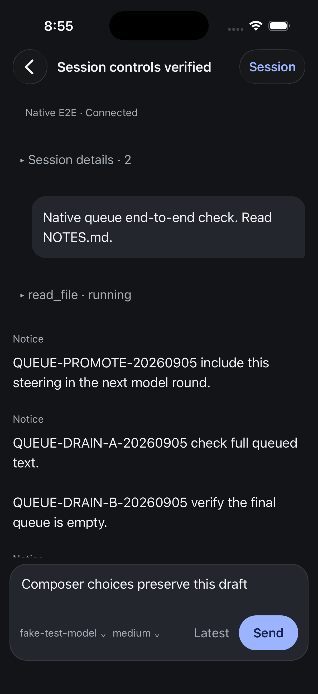
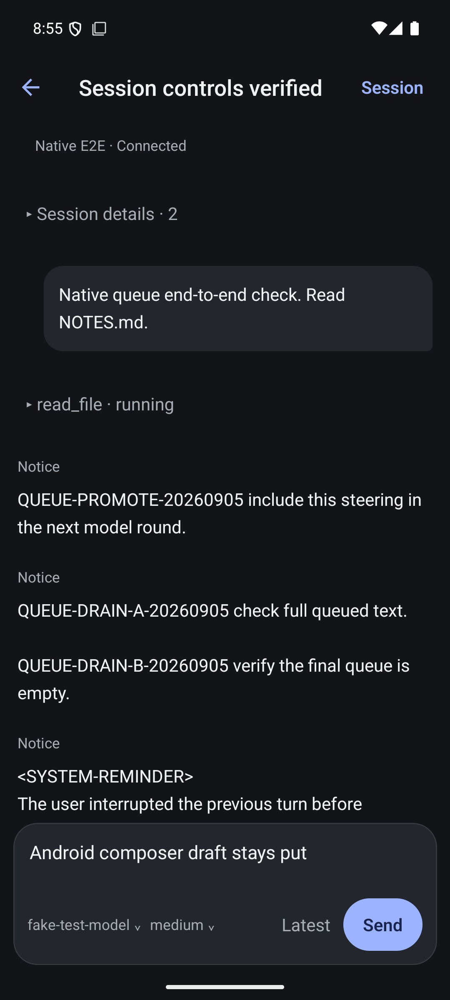
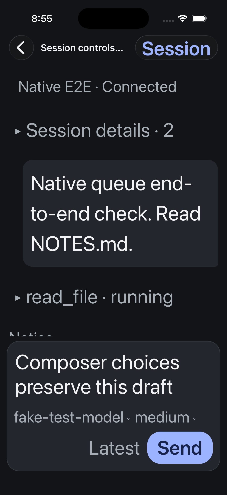
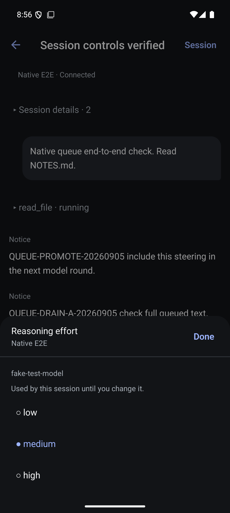

# Composer model and reasoning controls

Verified 5 September 2026 against an isolated real Evener hub, using a scripted OpenAI-compatible provider. Production sessions were not mutated.

Model and effort are independent controls inside the composer footer. Model opens a searchable platform modal with an explicit selection and Apply action; effort opens a short choice sheet and applies one tap. Both settings persist on the session. Dismissing either keeps the unsent draft. Session management contains rename, compaction and runtime stop.

## Behavioral verification

- Native suite: 65 tests across 12 files; TypeScript and targeted Biome pass. Controller tests exercise the real conversation service over a scripted request boundary: catalog scoping, exact provider/model validation, stale binding rejection, serialization, compose overlap and explicit catalog retry.
- Shared mobile suite: 2,237 tests across 90 files, plus TypeScript and targeted Biome passed during this increment. Catalog scope follows the current thread harness and working directory, and stale responses cannot install after opening another thread.
- Both iOS and Android Release builds succeeded and were installed. Final formatting changes preserve the built source behavior.
- Both simulators changed the real session model through the UI. An independent wire read confirmed the selected model. iOS changed reasoning to low; Android subsequently changed it to medium, independently confirmed by wire read.
- iOS retained `Composer choices preserve this draft`; Android retained `Android composer draft stays put`. Neither draft was submitted.
- Provider membership rejection retained the choice and error without automatic replay. The isolated test provider was then configured to enumerate both fake-test-model and fake-alternate, allowing successful model switches. This used a local test-only HTTP proxy in front of fakellm; no production implementation change was needed.

## Native geometry

Android initially placed Apply behind the search keyboard. Moving keyboard avoidance to encompass the entire modal fixed the measured layout; searching, selecting and applying with the keyboard visible succeeded. iOS live accessibility-large changes initially compressed the model label; reserving a full footer row at large font scales corrected this, verified after changing size while mounted. Normal sizing keeps model, effort and Send on one row. Native Back uses a minimal title to avoid clipped text at large sizes.

## Remaining acceptance

These checks do not establish whole-app accessibility, physical-device behavior, all model-provider combinations, or full repository merge-gate success. The reasoning surface is a React Native modal with a bottom-aligned sheet, not an interactive native detent sheet. Long-model-name behavior, screen-reader traversal and model-change acknowledgement loss still need dedicated native acceptance. Voice remains outside v1.
