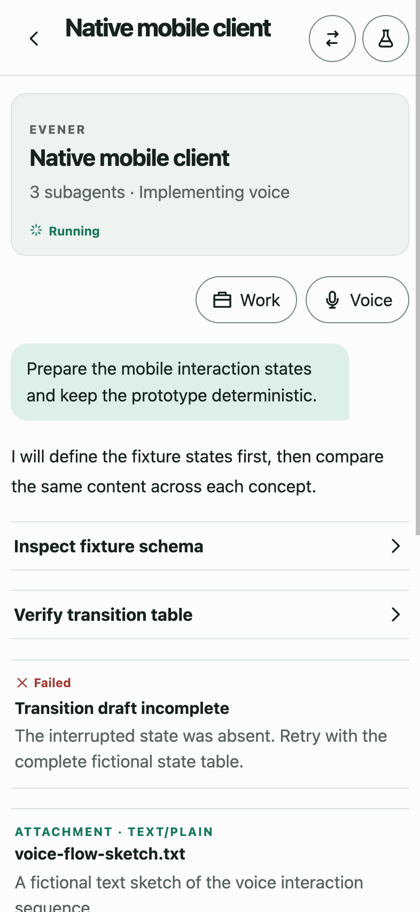
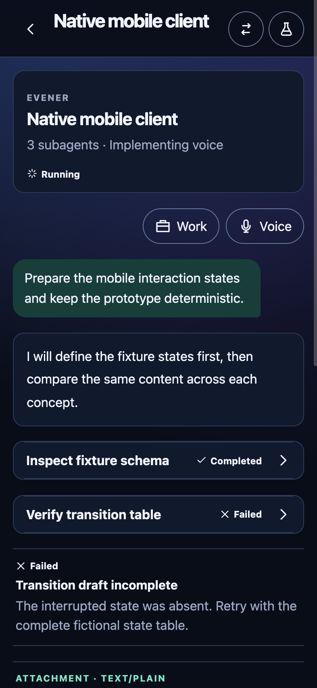
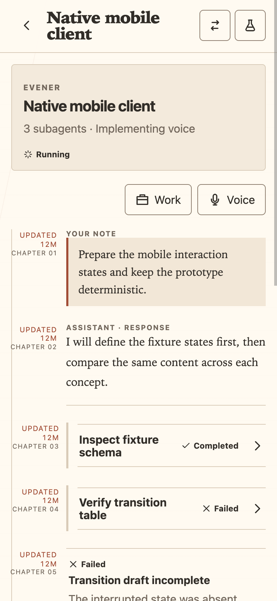

# Mobile concept sketches

These are historical visual studies from the mobile concept lab, preserved as
static design references. The shipping mobile direction is the native iPhone app.
The Tauri application, plugins, packaging, and executable concept lab are excluded
from this landing. The original working branch and its unfinished work remain
preserved separately.

The studies explore three treatments of the same session and conversation fixture.
They can inform visual decisions; they do not describe implemented or approved
product behavior. In particular, the visible voice controls and other prototype
labels do not establish v1 scope. iPad and accessibility work remain paused.

## Compare the directions

| Stillwater | Constellation | Field Notes |
| --- | --- | --- |
|  |  |  |
| Quiet hierarchy, restrained spruce accents, and familiar lists. | Relationships between sessions, with luminous mint accents on blue surfaces. | Long-form reading, warm paper colors, and editorial typography. |

These captures also preserve the studies' limitations: large headers and rows,
extra status labels, and controls whose purpose needs clarification. They are
reference material for comparison, not a recommendation to reproduce each screen.
For the native app, project organization, automatic pagination, prompt session
loading, and clear conversation controls remain the product priorities.

## All captures

Each direction includes sessions and a conversation in both appearances.

| Direction | Sessions | Conversation |
| --- | --- | --- |
| Stillwater | [Light](stillwater-sessions-light.png) · [Dark](stillwater-sessions-dark.png) | [Light](stillwater-conversation-light.png) · [Dark](stillwater-conversation-dark.png) |
| Constellation | [Light](constellation-sessions-light.png) · [Dark](constellation-sessions-dark.png) | [Light](constellation-conversation-light.png) · [Dark](constellation-conversation-dark.png) |
| Field Notes | [Light](field-notes-sessions-light.png) · [Dark](field-notes-sessions-dark.png) | [Light](field-notes-conversation-light.png) · [Dark](field-notes-conversation-dark.png) |

## Provenance and capture

Captured on 10 September 2026 from the unchanged `mobile-concepts/` source at
commit `f6614d6cc137d3498460ad6b9a5d0071aea67742` in the preserved
`live-concepts-plan2-integrate` worktree. These are fresh browser captures of that
historical implementation, not the original brainstorming mockups or screenshots
of the current native app. The original source is retained locally; this document
does not depend on it being available on `main`.

The browser build used the offline baseline fixture, its iOS layout, standard text
size, and reduced motion. Each capture uses a 393 × 852 CSS-pixel viewport at 2×
scale. The sessions screen was captured first, then the fixture's native-client
session was opened through its visible control. Appearance and route were checked
before capture, and all twelve output images were visually inspected. No Tauri
runtime, real hub, or production session was used. Browser rendering is not device
or native-app qualification.

The [capture manifest](capture-manifest.json) records the source tree, renderer,
settings, dimensions, and SHA-256 digest of every PNG. The images are unedited
viewport captures; no cropping, rescaling, or compositing was applied.
