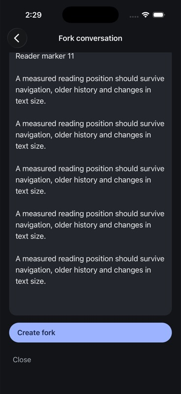
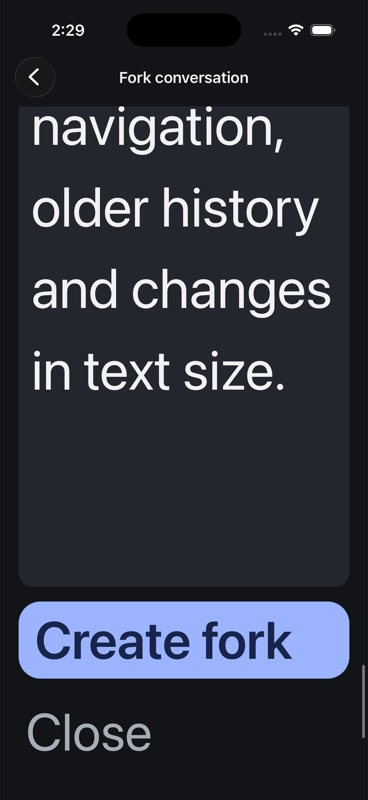
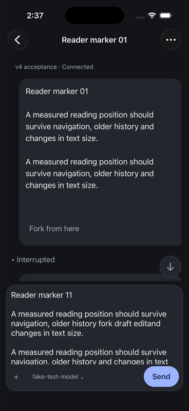
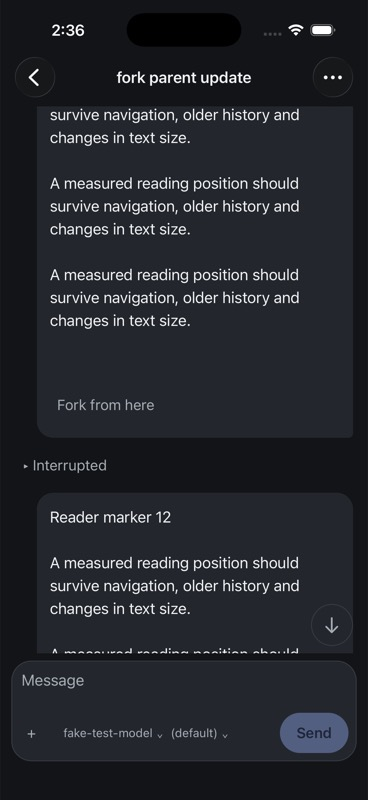

# Native ordinary fork evidence

Observed 7 September 2026 on the owned, isolated AppWire v4 hub. This is a
bounded iOS workflow checkpoint, not whole-product release acceptance.

## Source and artifacts

- `ff3da051b` adds typed message divergence, deferred fork, durable recovery,
  child composer preparation, preview and route restoration.
- `0b2d95109` corrects the hub-owned fork capability on live local reads and
  existing status capability updates. Standalone daemon capabilities stay intact.
- `be164c5ad` reacquires the conversation snapshot and stream on screen focus.
- Final iPhone 17 Pro / iOS 26.5 Release bundle SHA-256:
  `045b7da4af947e8f2ccb77b3b7b2b1aa8d1a524fd32679ac42cc221b45ed3827`.
  Build/install/launch succeeded; the final restart launched PID 65787 at
  2026-09-07 09:36:49 UTC. Bundle ID: `com.primeradiant.evener.native`.
- The earlier preview/restoration/maximum-text pass used bundle
  `74aaa5cea13cd905f56520b0cdeb4ba0c68098ffe32fb34b6ae375b29d71ca58`.
  Its fork editor layout is unchanged in the final bundle; its screenshots
  are identified below rather than attributed to the later artifact.
- The owned hub binary SHA-256 is
  `606c8b19bbeb6139a1e1ecc1f2b70d70acd24634f286f940f5a365cd989cfbb7`.
  It listens directly on loopback port 54211. No forwarding proxy was used.

## Observed behavior

The selected user message was Reader marker 11, carrying typed
`transcriptEntryIndex: 22`. Turn IDs and rendered positions were not substituted.
The preview survived process termination/relaunch with the exact hub, parent,
instance and index. No fork checkpoint existed before Create was pressed.
At maximum iOS text size, the preview remained scrollable and both Create fork
and Close were reachable. Text size was restored to `large` afterward.

Two explicit Create presses, one on each Release artifact, produced exactly
the two children reported by the independent SDK session listing:

- Parent: `local:034KVwAjXBf0IyAcKKEYU3`.
- First child: `local:034Kc0VZckYNdqD7aAzlQq`.
- Final-build child: `local:034Kc9793pXlhHyCRXdeAk`.

Independent paged reads confirmed the parent still has markers 01–30. Each child
has only markers 01–10, identifies the original parent, and has no persisted
marker 11. The child stayed `notLoaded`; creating the deferred fork did not
start a provider turn. The parent's local draft remained empty.

SQLite readback confirmed the child's initial 498-character draft exactly
matched the selected source input. A native edit inserted `fork draft edit`
at the current caret, producing 513 characters. The final build reopened the
same child after termination/relaunch with the identical edited draft and no
unconfirmed send. Its draft SHA-256 remained
`150a0f511e6cd5aeed960cd4a7a7300bfde11fbd811f1227be9484e74574a61f`.
The saved destination was the child conversation and the parent fork checkpoint
was cleared. Both owned child fixtures and their drafts are retained.

The Back journey exposed a lost subscription: opening a child replaces the
connection's subscription, while the mounted parent previously did not reread
on focus. A rename from another client stayed stale after Back. The final build
received that same rename immediately after returning from the child, and also
received restoration of the original parent name. Its reader remained at the
marker 11/12 position. This verifies this return path, not the separate Dynamic
Type reader-position failure.

## Automated checks and regression evidence

- `make test-native`: 510 tests in 62 files plus TypeScript, passing on the final
  source. Touched native files pass Biome.
- Shared mobile package: 2,257 tests in 90 files, Biome and TypeScript pass.
- Full `go test ./cmd/evener-hub -count=1` passes (61.687 seconds).
- Scoped `golangci-lint run ./cmd/evener-hub/...`: zero issues. Focused fork
  capability tests pass after the final test-only formatting correction.
- The real daemon → rendezvous → hub test failed first for metadata reads,
  item reads and active-status capability updates. The narrow hub overlay
  corrected all three while retaining daemon Send/Interrupt restrictions.
- Checkpoint, controller and real SQLite draft tests cover storage failure
  before request, lost reply, late acknowledgement after disposal, conditional
  removal, acknowledged-child persistence failure, draft preparation failure,
  preservation of newer or intentionally emptied drafts, and saved destination
  or navigation failure. Recovery does not replay the fork RPC. Route tests
  reject invalid indices, mixed destinations and hub mismatches.

Local logs: `/tmp/evener-ordinary-fork-native-gate.log`,
`/tmp/evener-ordinary-fork-shared-test.log`,
`/tmp/evener-ordinary-fork-shared-check.log`,
`/tmp/evener-fork-capability-red.log`,
`/tmp/evener-fork-capability-green.log`, `/tmp/evener-fork-hub-test.log`, and
`/tmp/evener-fork-hub-lint.log`. Owned readback summaries are in
`/tmp/evener-native-fork-20260907.json` and
`/tmp/evener-fork-edited-draft-20260907.json`.

## Limits and remaining acceptance

The existing `thread/fork` contract has no expected instance or revision
precondition. The native screen rereads the source immediately before dispatch
and rejects an observed replacement, but a replacement after that read cannot
be atomically rejected by the server. That protocol limitation remains open.

Native lost-reply/storage faults are covered deterministically by the actual
controller and repositories, not by device-level fault injection. VoiceOver,
iPad, physical devices, multiple hubs under overlapping failures, attachments,
and the complete release matrix remain unqualified here. Ended-session deletion,
durable archive/favorite recovery and the rest of the delivery plan remain open.
No whole-repository merge gate or publication is claimed.

## Screenshots

Earlier Release, unchanged editor layout:

Final Release:

