# Full-width composer — MOB-011

The text input occupies its own full-width row at every text size. Send, Steer
and built-in command actions are on the controls row after model/reasoning.
Existing action handlers and dispatch guards are unchanged. The presentation
study is updated to show the same placement; the older density studies are
superseded by Jesse's MOB-011 correction.

Verification, 6 September 2026: native TypeScript, Biome and 228 tests pass.
Both Release builds succeeded. On Android with the actual software keyboard,
the input spans x=56..1026 in the 1080-pixel screenshot, up from x=56..815;
Submit shares y=1347..1473 with the attachment/model/reasoning controls. The
118-character fixture is readable over multiple lines. iOS visually shows
the full-width draft and controls-row Submit with the keyboard hidden.

Android submitted the fixture to the owned isolated SecondHub session. Both
apps received the running state, displaying Steer/Stop/Queue. A newer Android
draft remained in the full-width field; Stop from iOS ended the turn and
restored Send without discarding that draft. This uses the scripted provider
boundary and real Evener hub/session runtime, not production sessions.

All four screenshots were inspected. Android's running model label is heavily
truncated; its full accessible name remains available. iOS wraps Queue onto a
second controls line. Those states need further design review. iOS software
keyboard visibility was not established in this check: menu activation attempts
did not yield a keyboard in the captured simulator image. Do not count the
keyboard-hidden image as keyboard acceptance. Large text, long model labels,
empty drafts, slash-command layouts and screen-reader acceptance also remain
open, so MOB-011 is in progress.

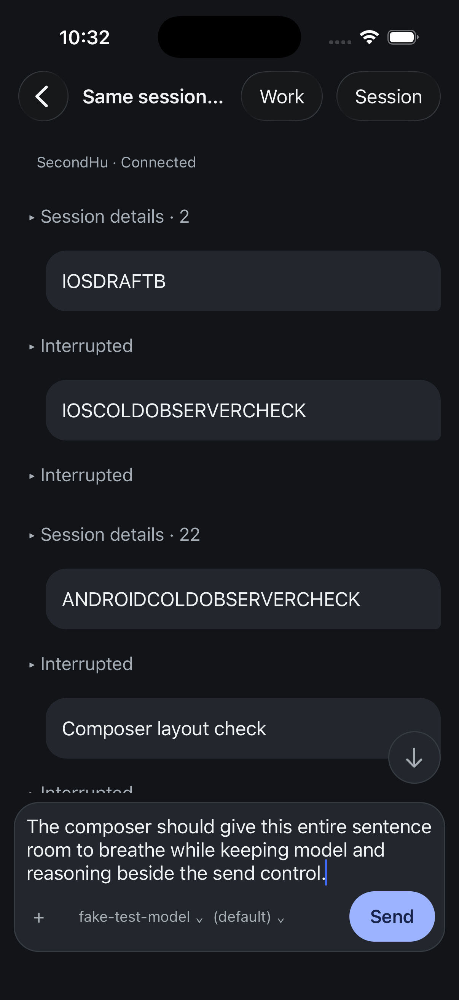

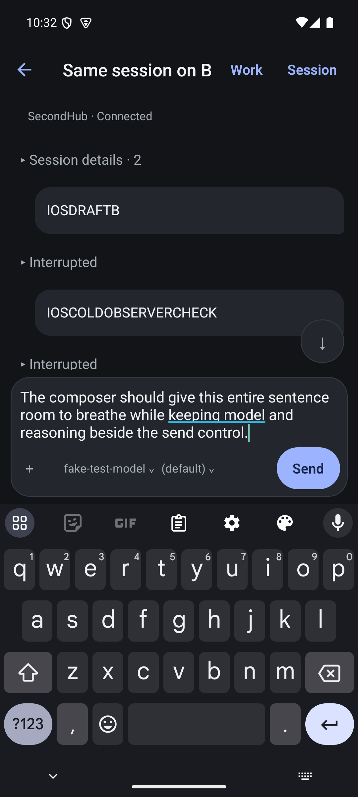

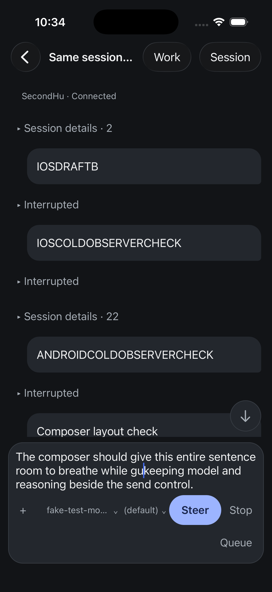

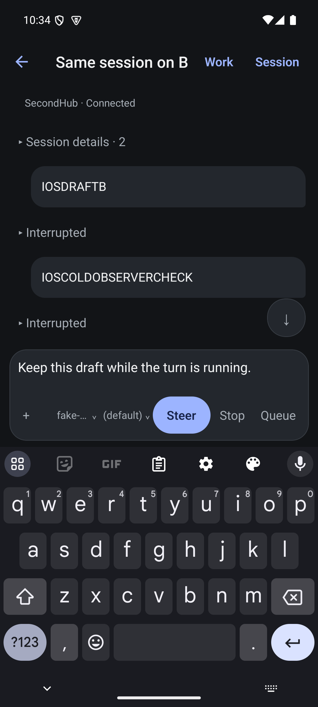

## Keyboard and large-text follow-up

Verified on the installed Release app at eb2ece322. The iOS software keyboard
is now visible in the captured image after disconnecting Simulator's hardware
keyboard. At the ordinary `large` content size, a multiline draft occupies the
full width; attachment, model, reasoning, and Send share one row above the
keyboard. This establishes the previously missing idle iOS keyboard evidence.
No message was submitted in this follow-up.

At `accessibility-extra-extra-extra-large`, the iOS composer still gives text
its own full-width row, but consumes nearly all the space above the keyboard.
Attachment, settings, and Send occupy three separate rows. The draft viewport
also shows a clipped next line. This is a failed space-use acceptance case,
not accessibility sign-off. The fixture contains an accidental `gu` from an
earlier simulator interaction; it was corrected in the ordinary-size capture.

Android at font scale 2.0 similarly stacks those controls into three rows.
Its captured keyboard was hidden, including after focusing Message; that image
does not establish large-text keyboard acceptance. Both platforms' controls
remain semantically exposed, which does not establish screen-reader usability.

The source explains the extra row: ComposerSettings has a full-width minimum
above font scale 1.4, but follows attachment in the wrapping footer. Attachment
therefore gets stranded before the settings row, with Send after it. The next
layout correction should group actions deliberately at accessibility sizes,
retain scalable text and native touch targets, and recheck the transcript and
draft viewports with the real keyboard. MOB-011 and MOB-001 remain open.

Simulator text settings were restored to iOS `large` and Android 1.0.

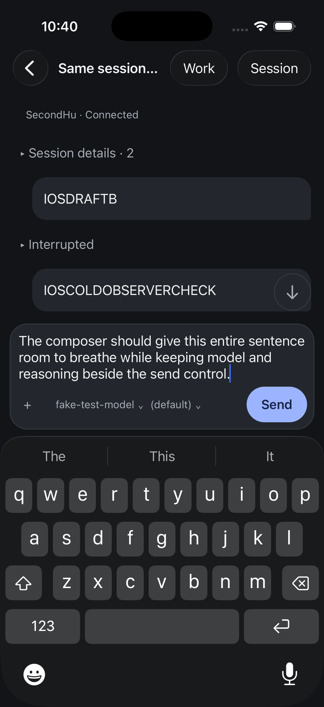

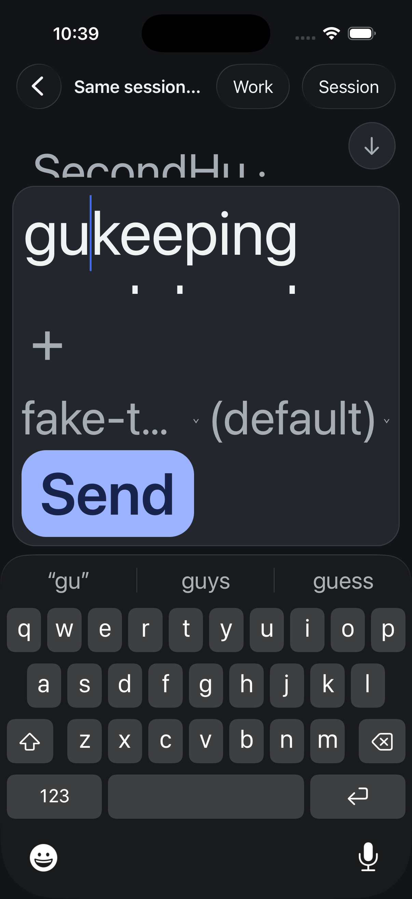

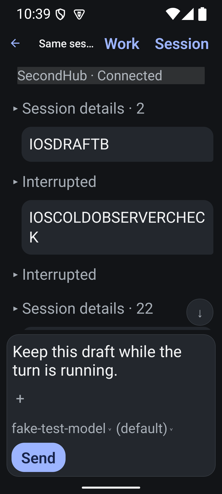

## Deliberate accessibility control rows

The settings component now sits above the action footer when font scale exceeds
1.4, with intrinsic height instead of expanding in the vertical composer.
Ordinary sizes retain the original inline settings flex behavior. The same
settings element and callbacks are used in either position; no protocol or
submission behavior changes.

Both final Release builds were installed and inspected with real software
keyboards: iOS at its largest accessibility content size, Android at font scale
2.0. Model/reasoning occupy one row, attachment and Send share the following
row, and the full-width input remains above them. The stranded attachment row
is gone. Android's keyboard-hidden draft top moved from y=1648 to y=1800 at the
same scale, recovering 152 physical pixels for the transcript.

The iOS reasoning picker opened and dismissed without losing the draft. Android
also opened its reasoning choices; restoring font scale recreated the screen
and dismissed the sheet, with the draft retained. No settings were changed and
no messages were submitted in this pass. Font settings were restored to iOS
large and Android 1.0. TypeScript, touched-file Biome, 228 native tests and both
Release builds pass. Native screenshots verify this layout; unit tests cover
the existing behavior, not screen geometry.

This resolves the extra control row, not the entire accessibility acceptance:
iOS at its largest size still has a cramped reading area, a clipped next draft
line, and a truncated model label. Running and command controls at these sizes,
long model labels, empty drafts and screen-reader interaction remain open.

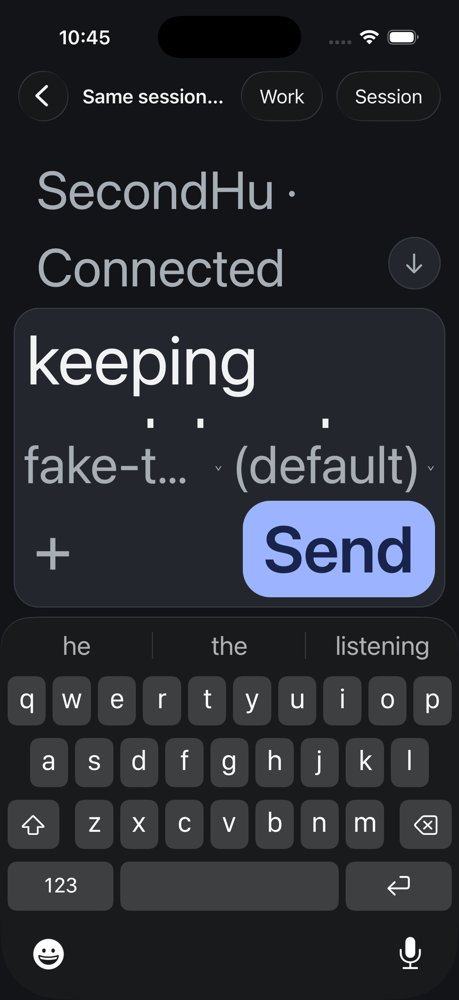

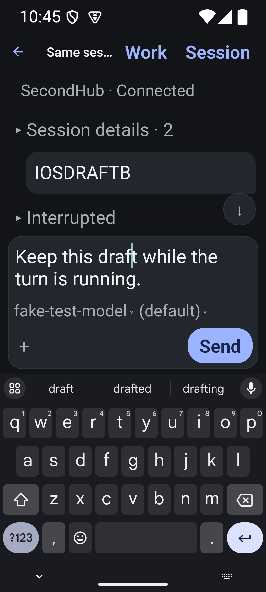

## Empty, command and running-state checks

Manual checks on the installed 447ed65f8 Release apps:

- Empty iOS and Android drafts have full-width inputs and disabled Send on the
  controls row, with both real keyboards visible.
- `/project` at ordinary sizes places Show in project on the controls row on
  both platforms. Suggestions are insertion-only; the command action was not
  invoked. The model label truncates more to accommodate the longer action.
- Android font scale 2.0 keeps `/project`, model/reasoning, attachment and its
  action visible above the real keyboard.
- iOS largest accessibility text **fails** with `/project`: the command header
  wraps into several tall lines, the results and footer extend behind the
  keyboard, and neither the draft nor its action remains visibly reachable.
  Dismiss is reachable and removes the suggestions, but that recovery does not
  make the state acceptable.
- Android at 2.0 submitted COMPOSER_RUNNING_ACCESSIBILITY to the owned isolated
  SecondHub session. Steer, Stop and Queue appeared together below settings.
  The new draft `Keep this draft while the turn is running.` survived Stop,
  which restored Send. This exercised the real runtime and scripted provider.
  iOS received the running state while retaining its `/project` draft; no claim
  of iOS running-control visual acceptance is made.

The iOS failure has two unbounded regions: CommandCompletion caps only the
results FlatList at 160 points, leaving its wrapping title/Dismiss header
outside that limit, and the enclosing composer has no total available-height
constraint or overflow-scrolling path. Fixing the header alone is insufficient
for arbitrary large-text command actions, running controls and draft heights.
The next correction must allocate the whole keyboard-visible area and keep
editing, dismissal and submission reachable without reducing requested fonts.

The iOS test tool's replaceExisting option inserted at the caret in this run.
Readback caught it. The accidental character was removed, and native AX value
clearing produced the verified empty state before `/project` was entered.
Simulator text settings were restored to iOS large and Android 1.0. iOS ends
with the unsent `/project` draft and suggestions dismissed; Android retains the
newer draft. No production sessions were changed.

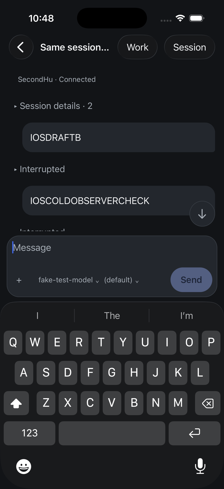

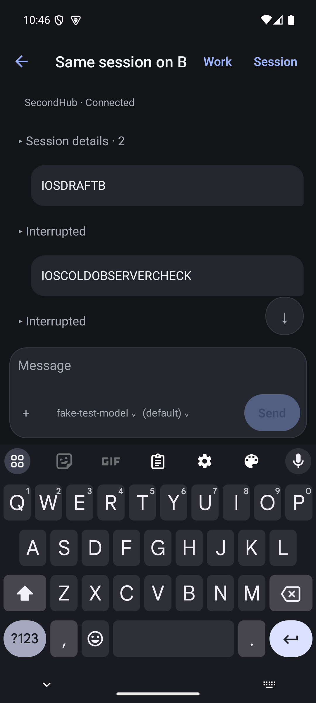

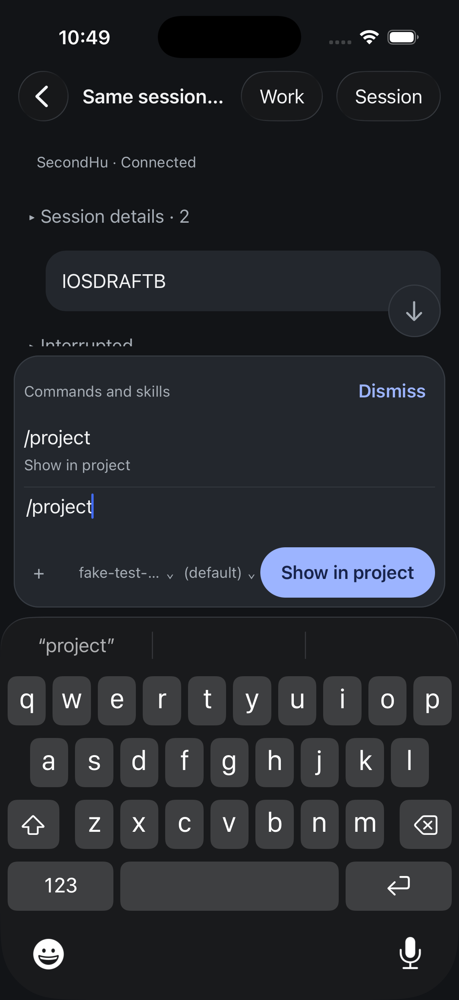

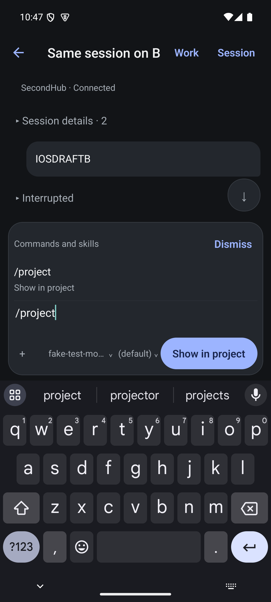

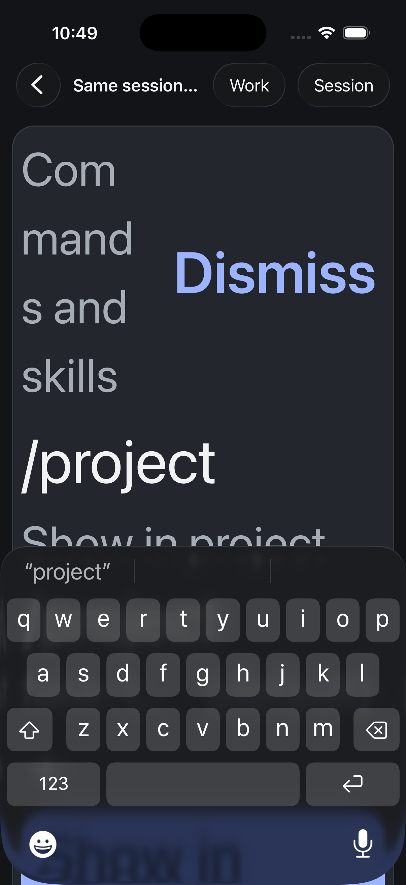

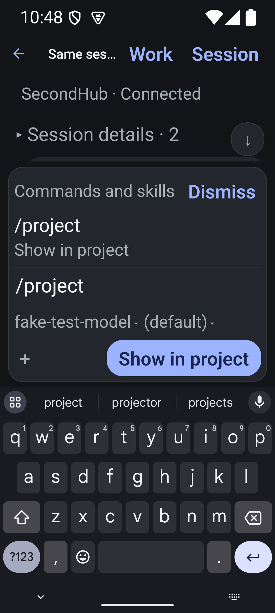

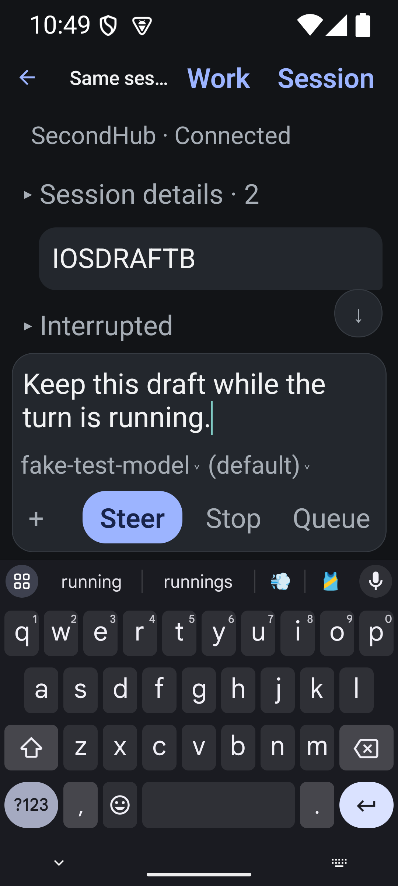
