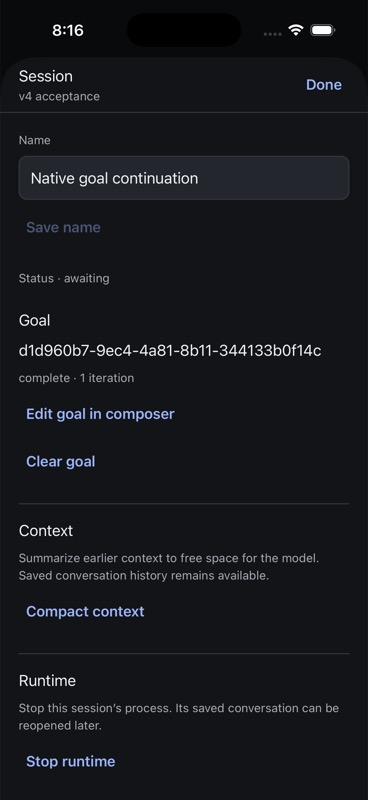
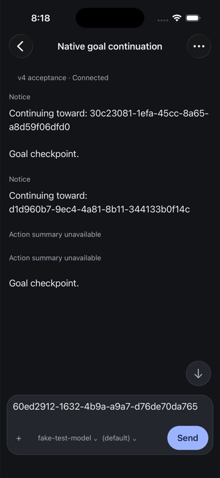

# Native goals

Product authority: current web GoalControl.tsx, the goal entry in shell/palette/commands.ts, composer/builtinCommand.ts, and the goal/set and evener/goal/updated wire contracts. Goals have an objective, status and iteration count. Empty objective clears the goal. There is no budget, pause or invented goal lifecycle control in this surface.

Native presents an existing goal as a quiet composer-adjacent status control. Its Session sheet shows the full objective, status and iterations, with Edit in composer and Clear goal. With no goal, Set goal prepares an editable /goal command in the composer. Replacing a nonempty draft requires a concrete replacement confirmation; cancellation preserves text and images. Submitting /goal follows the existing durable draft checkpoint so uncertain delivery is retained and never replayed automatically. Clear retains the ordinary draft. Live notifications and hydration belong to the current hub/session; a notification arriving during a read must survive that older read.

Verification: transport-boundary set/clear and capability rejection, real draft storage and uncertainty, notification identity and hydration races, then native simulator/emulator set/edit/clear against the isolated real hub. This slice does not complete tasks, jobs, the full slash-command catalog, or release-wide acceptance.

## Implementation and evidence

The shared conversation projection includes goal state and applies evener/goal/updated only to the current session. A goal ownership revision preserves notifications received during an older rehydrate. The service checks the goal capability before goal/set. The composer recognizes the current web /goal grammar only without images; attached messages retain ordinary message routing. Empty commands offer Clear goal only when a goal exists. Native goal submission uses the existing SQLite uncertainty checkpoint, while clear preserves the ordinary draft. Replacing a draft retires text and image references atomically. Pending goal errors remain visible in the Session sheet.

Automated verification passes: 145 native tests, 432 targeted shared projector/service/state tests, native TypeScript and touched-file formatting. Focused boundary tests cover initial goal projection, another session's notification rejection, a newer notification surviving an older read, live clear, set/clear wire parameters, unavailable capability, durable lost-acknowledgement recovery, newer-draft retention and uncertainty preventing replay.

Manual iOS 26.5 iPhone 17 Pro and Android API 35 Pixel 7 checks set an objective through the Session-to-composer action, then observed the real isolated hub report blocked with six iterations. The scripted image provider repeats its response, so that terminal state verifies engine-driven updates, not successful autonomous goal execution. Both cleared the goal, and fresh thread/read responses confirmed absent goals for local:034K0xcRUdVXB4a529zcCs and local:034K15lO0VfSdITfzQSnBh. Android also reopened the objective for editing and retained that composer draft after clearing the goal. Draft replacement cancellation and confirmation were exercised on Android. A keyboard handoff issue was fixed by waiting for Android window focus to return after modal dismissal; the installed app then showed the keyboard with the composer above it. Both Release builds pass after these changes.

Remaining acceptance includes iOS goal-edit replacement, native lost-acknowledgement and storage-failure injection, physical devices, VoiceOver/TalkBack, large text, and full command discovery. Successful set/clear and live status observation do not establish those cases. Production hub 9180 was not used.

## v4 acknowledgment validation and SDK recipe — 7 September

The shared native service now validates the boolean started response before
clearing its durable goal-command checkpoint. Malformed acknowledgments retain
unconfirmed delivery without replay; clear preserves the ordinary draft. Five
service cases reproduced the previous false-success behavior. The 114-test
service suite and two real-SQLite checkpoint regressions now pass.

The independently packaged goals recipe adds explicit ownership and complete
reviewed-goal/instance preflight, exact wire set/clear parameters, validated
acknowledgment and same-instance readback after success or failure. goal/set has
no server CAS, expected-instance or mutation-ID fields: preflight cannot prevent
another writer racing the change, and the hub may resume an exited daemon.
No goal result authorizes automatic replay or proves execution. The 112 SDK
contracts and package gate pass; see the package README for runnable examples.
Real successful autonomous goal continuation on the current iOS/SDK build and
the remaining device/fault matrix are still unqualified.

## Direct v4 iOS and SDK continuation — 7 September

The Release app rebuilt from `d48fe9471` and a freshly packed SDK consumer now
exercise the real goal loop through owned hub `ws://127.0.0.1:54211/rpc`.
Only the provider boundary is scripted; the hub, daemon, goal store, continuation
routing and file tool are real. The [receipt](assets/goals-v4-receipt.json) records
source, bundle/package/binary hashes, fixture Git commits, session identities,
terminal reads, file hashes and cleanup.

Native set an idle goal through Session → Set goal in composer. While the first
provider request was held, Edit goal in composer changed the objective; fresh
reads confirmed the exact new objective with zero iterations. Ending that first
turn with `communicate(end_turn: true)` produced the next provider request
without Send or steering. A fresh read showed the first turn completed, the
second running and one goal iteration **before** releasing its file operation.
The real `write_file` created the expected 36-byte file. The provider then called
`update_goal(status: "complete")` and ended the turn. An independent subscribed
client observed completion; both turns were completed, the goal was complete
with one iteration, and neither turn contained a user-message or steering item.

The independently installed SDK repeated this sequence in a different session
and wrote a different file. Idle set returned `started: true`. Editing during
the running turn returned `started: false`; a wrapper deliberately discarded
that valid reply. The recipe reported uncertain, did not replay, and read back
the edited objective. A stale reviewed-goal clear dispatched zero writes. Across
set, edit and final clear there were three counted `goal/set` requests. Clearing
the completed goal returned acknowledged with `started: false` and absent goal
readback. These SDK receipt results still report execution unverified; separate
provider, transcript and filesystem evidence establishes this run's execution.

Native kept an ordinary draft while the goal finished. Edit requested concrete
draft replacement; Cancel preserved the text. Clear removed the goal without
sending or replacing that draft. Actual app stop/launch restored the same session
and exact draft, and an independent read still found no goal and only the two
completed turns. SQLite verification confirmed its 36-byte hash and no unconfirmed
delivery, together with unchanged hashes for five earlier drafts.

Both fixture sessions are shut down, their goals are absent, the temporary
provider exited successfully, and the complete provider registry matches its
baseline. The unrelated Apple project/plist changes remain byte-for-byte intact
and unstaged. Luna medium reviewed the implementation and acceptance boundaries;
the coordinator executed the device, SDK and cleanup checks.

This qualifies this simulator's set/edit/clear and successful continuation path.
Native wire counts and actual `started` replies were not intercepted. SDK reply
discard is a client-boundary fault, not a network disconnection. Native uncertainty,
storage faults, another writer, draft-replacement confirmation, iPad, physical
devices, VoiceOver and broader lifecycle cases remain open. The scripted tool
responses omit descriptions, so the transcript displays “Action summary
unavailable”; this run does not qualify settled action summaries.

## Saved continuation identity — 7 September

Reopening the retired goal fixture in the Release app built from `2e4bad2de`
exposed a separate replay defect: the saved transcript displayed the full model
continuation instructions. The live notice had been compact. The daemon persisted
ordinary steering without the notice or reserved turn identity, and saved reads
merged it into the preceding turn.

Goal acceptance now persists typed display metadata and the stable turn ID on
the existing steering entry. Its full message remains in model history and the
durable transcript. Saved projection uses the compact notice and opens a distinct
logical goal turn. Full reads, bounded pages, item windows and incremental saved
indexes use the same distinction; ordinary steering still joins the active turn.
The derived index version is advanced so older indexes rebuild.

Regression tests first reproduced missing durable metadata and incorrect turn
grouping. Real writer/readback, full/bounded/item projections, page boundaries,
warm-index appends and cache recreation now pass, along with the full agent,
schema, transcript, apptranscript and appprojector suites, focused hub tests and
vet. Luna medium reviewed the change; the coordinator ran the checks.

This applies to newly recorded continuations. Existing entries with no typed
goal metadata remain unchanged; no prompt-text guessing or transcript rewrite
was added. Direct hub/iOS acceptance of the new recording path remains pending.
