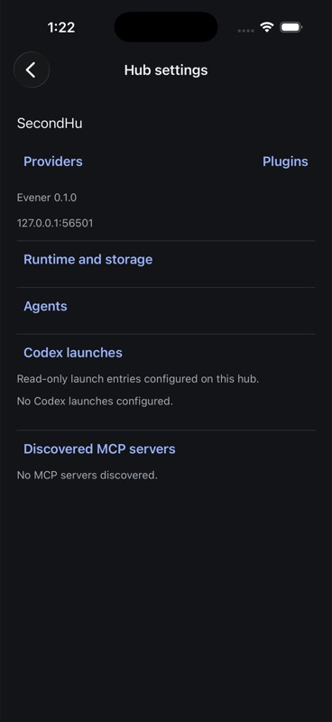
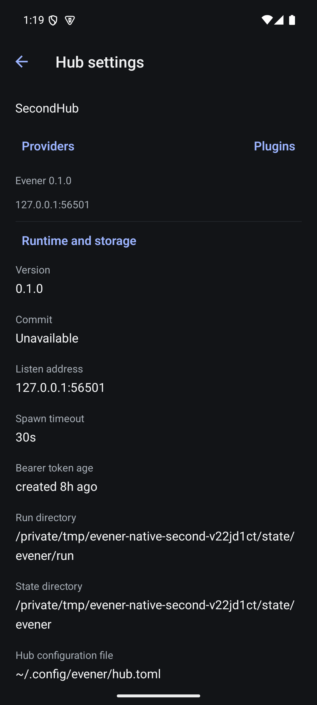

# Native hub information evidence

6 September 2026. Hub settings is reachable from Sessions and contains Providers,
Plugins, and disclosures for runtime/storage, agents, Codex launches and discovered
MCP servers. It uses `evener/settings/overview`, scoped to the selected connected
hub. Re-entering the screen refreshes it. Reconnect unmounts the connected view;
a new client owns a new overview. A failed refresh retains known data with an
error/retry. No credential values are displayed.

Four controller tests cover retained reads and retry, out-of-order results,
disposed lifetime and Go omitted empty/zero fields. The first tests failed on
missing implementation; the later omitempty case reproduced an actual mismatch
before normalization. All 272 native tests, TypeScript, touched-file Biome and
diff checks pass. Both final Release builds succeeded and were installed.

## Manual native checks

Both devices opened Sessions → Hub settings against isolated SecondHub and
loaded version 0.1.0, listen address 127.0.0.1:56501, token age metadata, spawn
timeout and the isolated run/state paths. Expanded runtime screenshots were
visually inspected: long paths wrap rather than overflow horizontally.
iOS expanded Agents and showed default/explorer/subagent, each built-in.
iOS opened Plugins from Hub settings; Android opened Providers through the new
route. Existing management screens remained reachable.

The first implementation called omitted Codex launches unavailable. Inspection of
`cmd/evener-hub/app_rpc_settings_overview.go` and `appwire/types.go` established
that the Go server omits empty arrays and zero numeric index fields. The controller
now normalizes those fields. Both final builds then showed No Codex launches
configured and No MCP servers discovered when expanded. Missing scalar details
remain unavailable. The conventional hub.toml path is labeled as the default
configuration location, not asserted to be the active config path.

The Android runtime screenshot predates that label refinement. The iOS screenshot
shows final empty-state behavior. These are narrow functional/manual checks,
not complete acceptance of hub settings or visual quality.

## Remaining acceptance

- Nonempty Codex entries, environment-key display, MCP entries and discovery errors.
- Both-platform complete field inspection, index zero/count rendering and scrolling.
- Two distinct hubs, delayed replies, native refresh failure/retry and reconnect.
- Accessibility, large text and stronger disclosure affordances; reduce redundant
  summary/detail fields and vertical gaps during visual refinement.
- Agent remote-file opening requires a supported hub file workflow; do not hand a
  server path to a phone-local editor.
- Editable launch layers, schema kinds, path validation, provenance and repository
  trust remain separate required work under MOB-015/MOB-007.

