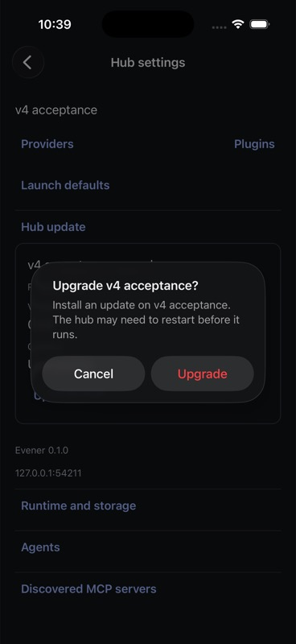
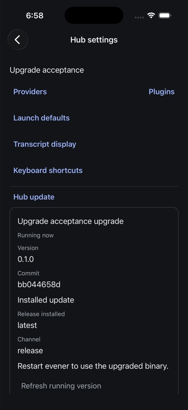

# Native hub upgrade evidence

The iOS-only v1 Hub Settings route now exposes a collapsible Hub update section.
Its controller is owned by the immutable selected hub/client and disposed when
the connection or screen changes. Installation/restart details are separate
from the running version/commit. Unknown outcomes offer read-only refresh;
storage failures do not falsely claim that no installation occurred.

## Observed 6 September 2026, Pacific time

On the iPhone 17 Pro iOS 26.5 simulator, the coordinator built and installed the
Release app from the authoritative integration worktree with these UI changes.
JavaScript bundle SHA-256:
`b786cdbe7d203332ba31a74a3a30385ef568e06a055e90f99902a3b5fc1bc01a`.

Against the direct owned v4 fixture hub on port 54211:

1. Open Sessions → Hub settings → Hub update.
2. Observe selected profile **v4 acceptance**, running version **0.1.0** and
   truthful unavailable commit (this fixture binary has no commit metadata).
3. Tap Upgrade hub. The native confirmation names the selected hub and explains
   that the installed update may need a restart.
4. Cancel. The section returns to idle with Upgrade hub available. No installer
   was intentionally dispatched in this journey.

`make test-native` passed 395 tests across 51 files plus typecheck. The existing
`TestHubRPCUpgradeRunsSelfUpdater` and `go test ./internal/selfupdate -count=1`
also passed. Controller tests separately cover durable intent before dispatch,
late A results after switching to B, unknown replies and failed storage.

## Historical remaining acceptance after 6 September

This is confirmation/cancellation evidence, not an actual-install or restart
qualification. Still required: disposable-prefix installation, reconnect and
independent running-identity verification, failure states on device, pending
status while disconnected, VoiceOver/large text, process death and an explicit
source-backed flow for initiating a later update after a previous installation.
An overview change alone cannot prove which installation is running. Production
installations and credentials were not used for this test.

## Actual iOS installation and recovery — 7 September 2026

The [current receipt](assets/ios-upgrade-receipt.json) records the iPhone 17 Pro,
iOS 26.5 Release artifact from native source `4f630af16`. Both the built and
installed JavaScript bundle hash to
`89622d2b735740a41310267a1420a12c872aed8ada3c8a4ae065911082b65a55`.
The installer inputs carry backend metadata `bb044658d-dirty`, built at
`2026-09-08T01:35:55Z`; this differs from the native source identity and is
recorded explicitly.

The manual `TestNativeUpgradeHarness` runs the actual AppWire upgrade handler
and `selfupdate.Upgrade`, with only the release download and install prefix
pointed at owned temporary resources. Native connections went directly to its
authenticated loopback RPC server. No WebSocket proxy was used.

1. A confirmed native upgrade encountered a release-download failure. The app
   retained an uncertain outcome with sanitized copy. Refreshing the running
   version left the archive request count at one.
2. Review another update refreshed the running identity. Continue re-enabled
   the action; a separate Upgrade confirmation started a held second download.
3. Backgrounding the actual app closed its RPC connection. The download was
   released after disconnection and no installation occurred. Cold launch
   changed the native PID and restored the unresolved checkpoint. There were
   still only two archive requests; no automatic retry occurred.
4. A third explicitly reviewed/confirmed attempt installed both supplied
   executables. Their bytes matched the immutable source hashes, and the bin
   symlinks resolved inside the disposable share directory. The native screen
   showed the installed release separately from the still-running fixture.
5. Another native cold launch retained the installed response. The fixture RPC
   was closed and the installed `evener hub` started on the same port with
   isolated XDG configuration/state, no inherited provider credentials, and
   plugin auto-upgrade disabled. Native Reconnect and Hub Settings displayed
   running commit `bb044658d`; an independent installed SDK consumer read the
   same commit. That identity was not inferred from the release label `latest`.

The receipt also records eight read-only discovery calls through the previously
qualified SDK tarball: seven recipe actions, plus a corrected directory-kind
validation. The invalid kind `directory` was rejected by the hub; `dir` returned
valid. The empty roster/search and non-repository git HEAD were preserved as
empty results. Full sensitive discovery outputs stayed in private local files.
The [driver](assets/ios-upgrade-discovery.mjs.txt) records the seven-action run;
the valid-directory follow-up parameters/result are in the receipt.

The manual fixture exited zero. Both owned server processes and listeners were
gone afterward; token files and the private hub log were removed. The temporary
native profile was removed, the original conversation restored, all seven
retained drafts verified, and the unrelated Apple patch compared byte-for-byte.
Reproduction helpers for [starting the installed hub](assets/ios-upgrade-start-installed.py.txt)
and [independent readback](assets/ios-upgrade-read-running.mjs.txt) retain the
owned paths and assume the receipt's fixture/package inputs exist.

The integration gate and separate vet run exited zero for the upgrade source:
Go lint/build/tests, web, 671 native tests across 73 files, native TypeScript and
outside-checkout SDK package qualification. Sixteen focused native upgrade
tests and race-enabled installer-fixture tests also passed before the manual run.

This closes the scoped simulator installation/recovery journey. It does not
prove a lost successful-installation reply: backgrounding canceled the held
download before installation. Public release service behavior, overlapping hub
upgrade attempts on device, iPad, physical-device, VoiceOver/large text and signed
application install/update qualification remain open.
