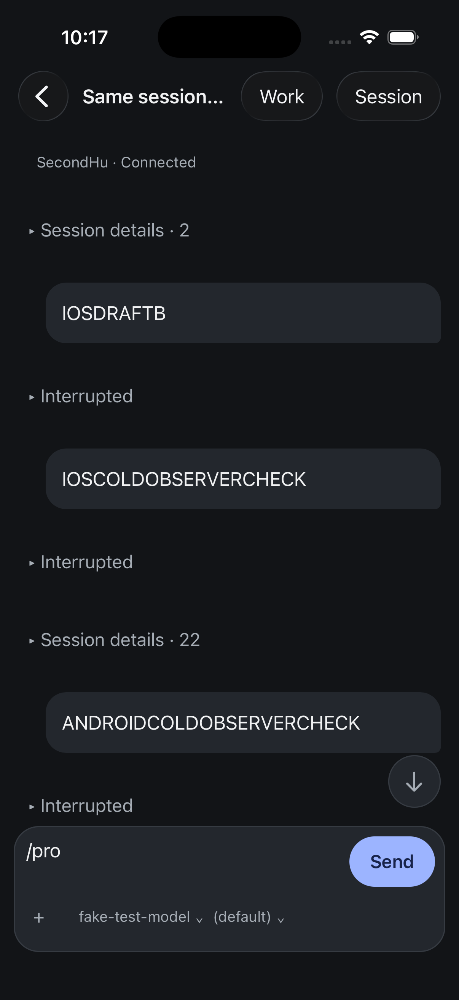
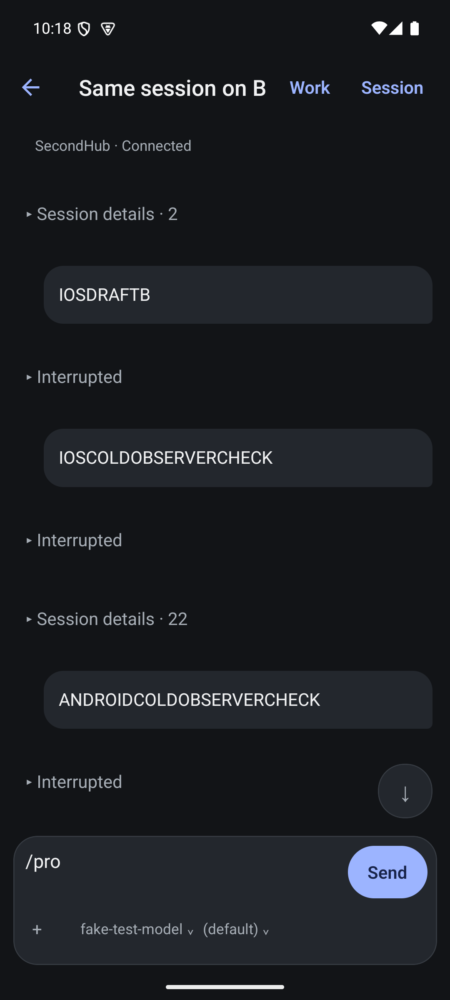

# Interruption notices

The current web `transcript/messages/SteeringItem.tsx` uses the typed
`steeringKind` and a collapsible divider labelled Interrupted. Native projection
discarded that field, leaving a generic Notice above the complete reminder.
Preserving the field allows the native renderer to identify the same event
without interpreting its prose.

Only non-warning notices with origin steering and kind interrupted get this
disclosure. Expansion shows the original selectable text, including framing;
the collapsed label does not replace or rewrite it. Warning, notification,
unknown and system-origin notices do not enter this route. Disclosure state
is local to the mounted row; restoration across virtualized remounts remains
unfinished, as for the existing activity/detail disclosures.

Verification, 6 September 2026: new projection and classification tests failed
before implementation. All 227 native tests and 2,242 shared-client tests pass,
along with native TypeScript and touched-file formatting. Both Release builds
succeeded. On the actual isolated SecondHub session, both native apps showed
collapsed Interrupted rows and expanded the first to its complete original
reminder. iOS was also collapsed again. The existing `/pro` drafts stayed
unchanged; no message or provider request was sent. Both saved screenshots
were visually inspected.

This is one implementation step toward presentation study 02. Header space,
row spacing, other notice families, notification cards, persistent disclosure
state, screen-reader traversal and large-text acceptance remain open. The
screenshots do not establish final visual quality.

