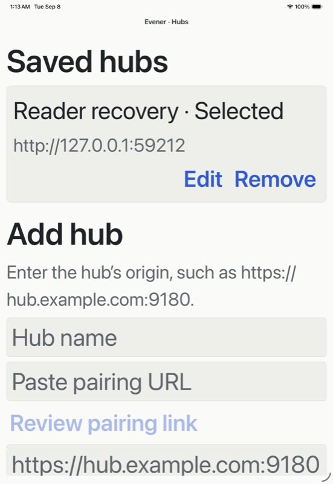

# iPad accessibility evidence — 8 September 2026

At the largest iOS accessibility text size, the Hubs headings kept a 26.5-point
layout height while their glyphs grew, visibly clipping both headings. Explicit
iOS font and line-height scaling gives each heading 100 points in the installed
Release build. Both now render fully and expose the Header accessibility trait.
Android retains native font scaling.

| Before | After |
| --- | --- |
|  |  |

Launch-default rows now expose their displayed value through accessibilityValue,
alongside their existing Edit label, button role and editor hint. The installed
native accessibility tree at the same text size reports `Inherited · default`
for Edit Agent and `Inherited · Default` for Edit Model. The checks made no
settings mutations.

The [receipt](assets/ipad-accessibility-receipt.json) identifies the exact source
files, installed executable and JavaScript, native accessibility captures and
unmodified screenshots. This was an iPad Pro 11-inch (M5) simulator running
iOS 26.5. The Release build succeeded in 12.1 seconds; cold launch was PID 22057.

These observations qualify the two heading layouts and setting value semantics.
VoiceOver speech, focus order and gestures, other screens at large text sizes,
and physical-device accessibility remain open. Reader recovery changes made
after this build are separate work and are not qualified by this receipt.
