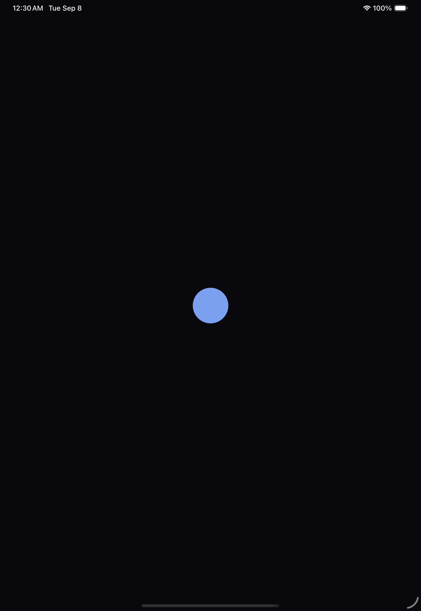

# iPad branding evidence — 8 September 2026

The native app uses Evener's existing production PWA icon, copied byte-for-byte,
for its iOS app icon and launch mark. The launch screen places that mark at
120 points on `#0a0a0e`. The [receipt](assets/ipad-branding-receipt.json) records
the input, executable, JavaScript bundle, video and screenshot hashes.

Root installed the Release build on the iPad Pro 11-inch (M5) simulator and
observed the icon in SpringBoard. A recorded cold launch, PID 39741, showed the
mark and dark background before the Hubs screen. The image below is an
unmodified frame extracted from that recording.

The build used source `2e37bca74` plus the branding inputs identified in the
receipt. Its JavaScript bundle matches the artifact used to verify the settings
conflict fix. The final native build passed in 29.7 seconds; the native gate
passed 678 tests across 74 files and TypeScript. The first complete compile
exceeded the MCP tool's reporting timeout; a subsequent build after compiler
exit returned success. No timeout was treated as a successful build.

Expo SDK 57 defaults prebuild to recreating native folders. The documented
`--no-clean` option preserves them. The splash plugin's image-less path did not
apply the configured background to the launch storyboard; switching that
generated storyboard to an image also left its empty subviews list unchanged.
Root retained the generated storyboard as private evidence and regenerated
that file from Expo's template. The final storyboard references the configured
image and named background color. No generated native patch is required for
a fresh prebuild from the committed app configuration.

This is simulator branding evidence. Physical devices, distribution signing,
physical-device updates and the wider accessibility/release matrix remain open.

## Existing iPhone installation — 8 September 2026

Root installed the same branded Release artifact over the retained iPhone 17
Pro simulator installation, then cold-launched it as PID 50518. Both installed
executable and JavaScript hashes matched the branding receipt. The existing
connected conversation and its unsent composer text returned; all seven retained
drafts passed their independent content and pending-send checks before and after
installation. The original hub and unrelated Apple patch were preserved.

This qualifies a simulator installation update without clearing app data.
Distribution signing and physical-device installation/update remain open.
