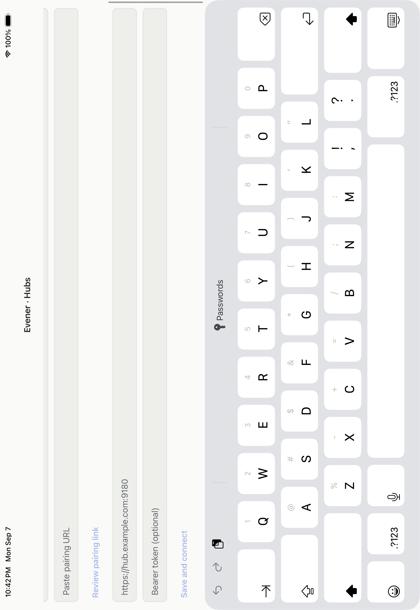
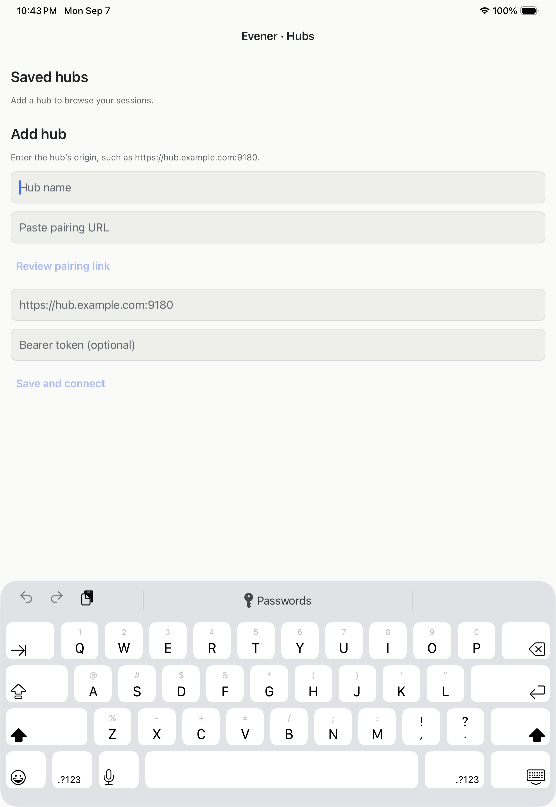

# iPad hub form qualification — 7 September 2026

The existing Release app passed the scoped portrait and landscape hub-form
keyboard check on iPad Pro 11-inch (M5), iOS26.5. Root reinstalled and verified
the original native `8d2297116` bundle before repeating the test. The
[receipt](assets/ipad-form-receipt.json) records artifact hashes, measured
frames, gesture coordinates and private accessibility evidence.

The first worker incorrectly used landscape accessibility coordinates for
portrait-native simulator touch events. Its swipe landed outside the form,
so the reported inability to reach Save was a test error. A two-line keyboard
candidate at `1e0533ce1` was built and tested, then reverted by `401eddc95` after
root showed the original app also worked. No native fix is claimed.

In landscape, the upper fields were initially visible. The correctly transformed
swipe moved the form until the token field and Save were above the keyboard:
Save occupied y337.5–381.5, above the keyboard toolbar at y407. In portrait,
all four form fields and Save were visible above the full software keyboard;
Save occupied y553–597, above the toolbar at y871. Root dismissed and reopened
the keyboard and finished in portrait with it hidden, empty dummy fields and
Save disabled. No profile was saved or network connection attempted.

This qualifies the default-size empty form's layout and scrolling only.
Connected profiles, lifecycle recovery, split view, large text, VoiceOver,
hardware keyboard, physical devices and signed distribution remain open.
