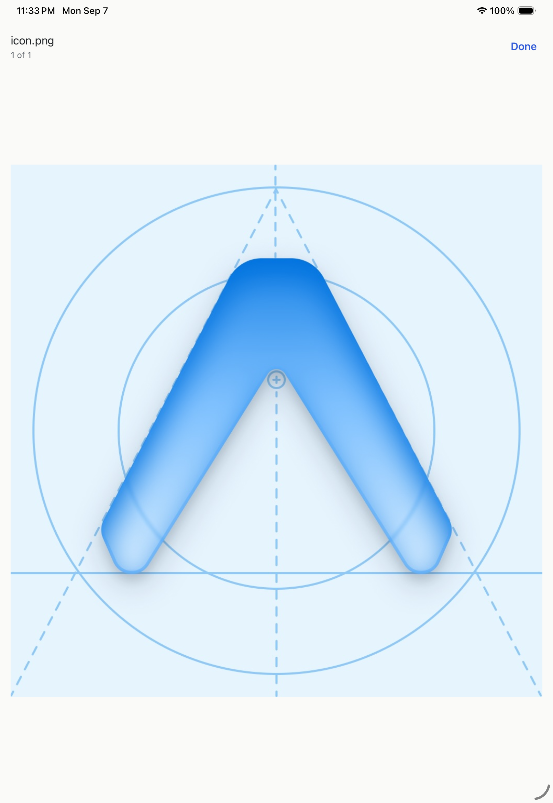
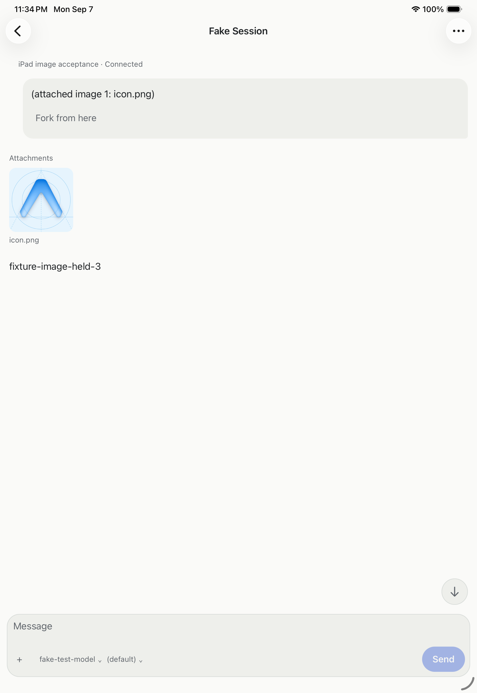

# Native iPad image creation and recovery

The iPad Pro 11-inch (M5), iOS 26.5 Release journey passed image-only creation,
durable creation-image recovery and live gallery rendering. The
[receipt](assets/ipad-image-creation-receipt.json) records the native artifact,
backend and packaged SDK identities and hashes of 40 private checkpoints.
The journey used native source `8afaeacba`, backend `d2d5eedf9`, and the
externally installed SDK from `58d1b079f`.

The native Photos picker selected the repository's `icon.png`. Expo encoded a
747,473-byte PNG. A deliberate app termination and cold launch preserved the
creation metadata, image identity and image bytes exactly. Reopening New session
restored the attachment and its marker without typing an opening prompt.

The first Create used Hub default, but this disposable fixture had no default
model. The server rejected it with `model is required`; the image stayed saved,
and the fixture still had its original two seed sessions. Selecting the actual
catalog entry, Fake Test Model, created `local:034L6zkRET9JUqnUDlpclX`.
Confirmed creation removed both creation metadata and image bytes from SQLite.

While the external scripted provider held the opening turn, the native
conversation showed the image tile and opened its gallery. The independent
packaged SDK [readback](assets/ipad-image-readback.mjs.txt) reported `turn_m1`
in progress with exactly one user message and one image. Its decoded SHA-256
matched the saved native draft:
`424a8a2b2c2c29cea7dbb84f3c8cf78370c0c269021190e73e65ea30c843b6aa`.

After release, the SDK read reported the same turn completed. Evener's private
API ledger contains the exact outgoing JSON request with the same image hash
and the HTTP 200 SSE response ending the turn through `communicate`.
Independent raw capture inside the provider was unavailable. A second cold
launch restored the conversation, image tile and gallery.

The fixture hub, provider and daemons exited. Its credentials and hub log were
removed. Native removal of the temporary hub cleared its saved location and
draft tables. The imported photo was removed through Photos into Recently
Deleted; all six original photo files retained their original hashes.

## Encoded size correction

Source `d20229b75` fixes a separate validation gap found during this work:
a source JPEG below 8 MiB can become a PNG above the server limit. Native
selection now checks the decoded byte length of the encoded PNG before saving
it and reports the shared size-limit error while retaining later valid images.
The calculation accounts for Base64 padding without allocating another decoded
image buffer. Regression tests cover oversized output and the exact boundary.

All 678 native tests in 74 files and TypeScript passed. The corrected Release
app built, installed and launched on the iPad with an empty Hubs screen.
The journey above precedes this size correction; the oversized-image picker
case on the corrected device build remains open. This evidence also leaves
maximum-count selection, interrupted creation dispatch, large-text/VoiceOver,
performance and physical-device qualification open.

## Encoded oversize-image rejection

The [size-validation receipt](assets/ipad-image-size-receipt.json) records the
corrected native build `d20229b75` (`d47fe4d8…` bundle hash) rejecting the
converted `converted-oversize.jpeg` picker image with the shared “maximum 8 MB”
message while retaining the later `valid-control.png` attachment. The source
JPEG in the native ImagePicker cache was 4,013,748 bytes with SHA-256
`dc9116ae…`, matching the source file. An independently decoded PNG reference
was 15,921,361 bytes and is evidence for the oversize condition only; it is not
asserted to be the native encoded artifact’s byte count.

The rejection accessibility capture and SQLite snapshot show the valid control
image retained. After cold launch (native PID 42478), the `creation_drafts` and
image rows were byte-identical to the pre-restart snapshot, and the reopened UI
still showed the retained control image. The installed source bundle remained
unchanged after prebuild verification.

The owned profile and drafts were removed and stayed absent after cold launch.
Root rechecked fixture processes, listeners and credential cleanup. The two photos imported for this case
were moved to Recently Deleted; six original library photos and all seven
baseline image files remained unchanged. This case qualifies rejection and durable recovery;
image-count limits, other formats, accessibility, physical devices, and signed
release acceptance remain open.
