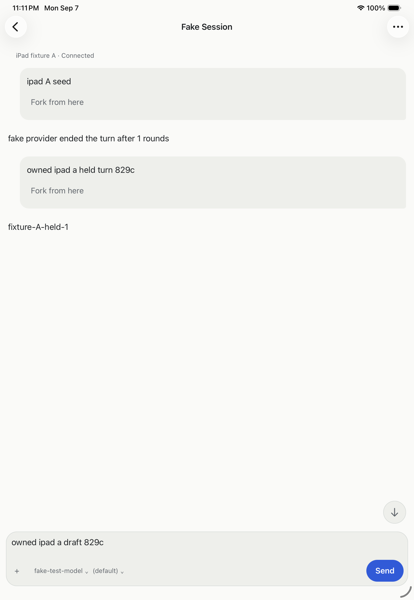

# Connected iPad lifecycle evidence — 7 September 2026

The iPad Pro 11-inch (M5) simulator passed a scoped two-hub journey on the
Release build from `8afaeacba`. The [receipt](assets/ipad-lifecycle-receipt.json)
records the installed bundle hash, backend and packaged SDK identities,
private readbacks, native snapshots, draft hashes and cleanup checks.

## Observed journey

Two owned direct hubs had separate tokens, XDG roots and sessions. Each seeded
session completed before its external provider was replaced with an explicit
hold/release provider at the same endpoint. The native form saved and
authenticated both profiles. Root verified each conversation and its separate
unsent draft in the UI and SQLite.

Root sent one owned message on A and observed its next provider request held.
After restoring A's unsent draft, root switched to B and verified B's transcript
and draft. A was released while B remained selected. Independent packaged SDK
reads confirmed A's authored reply and completed turn, and B's unchanged
transcript. Neither draft appeared in server user messages.

B restored its selected profile, conversation and draft after cold launch. A
separate background/foreground check retained the same app process and state.
After A's hub process stopped and its listener closed, B remained connected in
the app and through a fresh SDK read. Selecting unavailable A showed a
connection error and Reconnect action. Restarting A at the same endpoint,
reconnecting and opening its session restored its transcript and draft.

Removing A through its confirmation removed only A's draft; B's draft remained
byte-for-byte identical. Removing B cleared the remaining draft and saved
location. A final cold launch showed the empty Hubs form. Owned hub, provider,
daemon and supervisor processes stopped, their listeners closed, and fixture
tokens, empty credentials and private hub logs were removed. Raw evidence was
retained. The original iPhone's seven drafts and unrelated Apple patch were
independently reverified and preserved.

## Verification limits

This run used portrait layout, short text-only conversations and distinct
session references. The earlier iPhone journey separately covers identical
references across hubs. It does not qualify lost RPC replies, overlapping
pending mutations, credential rotation, split view, exact reader position,
large content or images, VoiceOver, physical devices, LAN or distribution
signing and updates.

Simulated key entry altered punctuation/case and did not reliably replace text.
Native accessibility field entry was used instead, with real authenticated
connections and persisted state confirming the result. The first readback
attempt lacked its output directory; the final assertion helper initially
requested more than the supported 40 items. Both fixture errors were corrected
before successful read-only verification; neither caused a mutation replay.
Helper snapshots are hashed after the run, not claimed as prelaunch captures.
