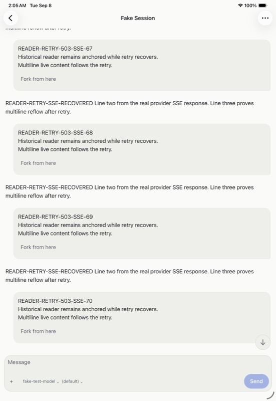
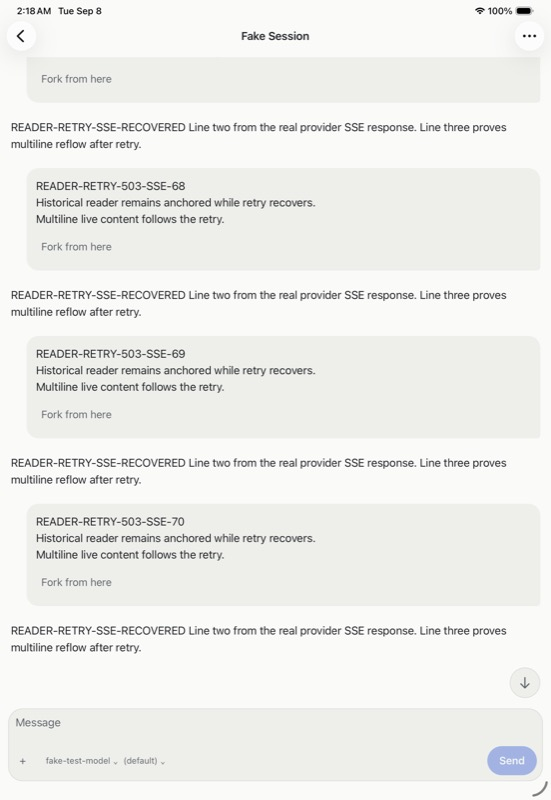
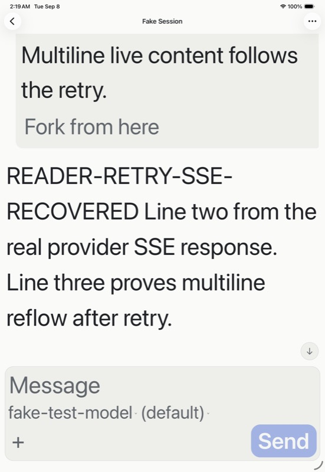

# iPad reader recovery evidence — 8 September 2026

The iPad Pro 11-inch (M5), iOS 26.5 Simulator retained the same historical
reading position through a real provider HTTP 503 retry, streamed completion,
and cold launch at the largest accessibility text size. This scoped journey
uses native source `66e55d887`; it is not physical-device or release qualification.

The fixes preserve stable item ownership across projection refreshes and always
send the paging cursor supplied by the caller. Substituting a newly read tail
cursor had returned already retained items, stopping recovery before the saved
anchor. The final service/store suite passes 392 tests, including overlapping
reads, changed wire IDs, live/page deduplication, and caller cursor ownership.

Before, held, settled, and cold-launch checkpoints retain the complete anchor
record for `apptranscript-item-v1:turn_m4:5:0`, within-item offset `106`.
Turn 04 and 05 accessibility frames match before, after settlement, and after
cold launch. Stop is present while held and absent at the other checkpoints.
These are endpoint observations; uninterrupted frame stability is not asserted.

An independent packaged SDK observer recorded 13 notifications for the final
run, including an environment completion before target `turn_m70`. Target turn,
thread, item lifecycle, delta text, final read, and the provider's emitted SSE
agree. Backend binaries are from `d2d5eedf9`; the SDK package is from
`58d1b079f`. All 139 regular tarball files match their installed counterparts;
the consumer tree has 144 additional files. Private request bodies and raw
captures remain outside the repository. The duplicate-observer m66 run is
unqualified, and m67–m69 remain diagnostic evidence of the cursor defect.

Source `7b954fe90` separately fixes Latest by using the underlying native scroll
view's content extent, including bottom padding. FlatList's estimated last-row
offset had left the completed response below the viewport. The installed
Release build returns from historical turn m54 after paging, follows reflow to
the largest text size, preserves a manual drag, and reveals the final response
when Latest is selected again. No live-in-viewport streaming claim is made for
this build.

| Before Latest fix | After Latest fix | Largest text |
| --- | --- | --- |
|  |  |  |

Native teardown then exposed a separate omission: confirmed hub removal left
its reader anchors on disk. Source `517f70ae3` adds scoped memory and disk cleanup
to that removal path, preserving other hubs and reporting storage failures.
Four regressions pass; the complete native gate passes 682 tests in 74 files
and TypeScript. Its Release build is startup-smoked. A fresh native removal
journey for this fix remains open.

The fixture is closed: its hub, daemon, provider and three listeners are gone,
and its token and private hub log are removed. Native profile, drafts and last
location were removed through the app. The one orphaned reader anchor was
removed explicitly during test teardown after preserving the failing evidence;
this manual cleanup does not qualify the product fix. Cold launch confirms
empty native state. The original hub, seven iPhone drafts and unrelated Apple
patch remain preserved.

The [receipt](assets/ipad-reader-recovery-receipt.json) records source, installed
artifact, raw evidence, helper and screenshot hashes. Remaining iOS acceptance
includes the new removal journey, rich-media reflow, live-tail combinations,
rotation, VoiceOver, physical devices, measured performance, distribution
signing/update and final repository/release gates. Android qualification remains
deferred beyond iOS-only v1.
