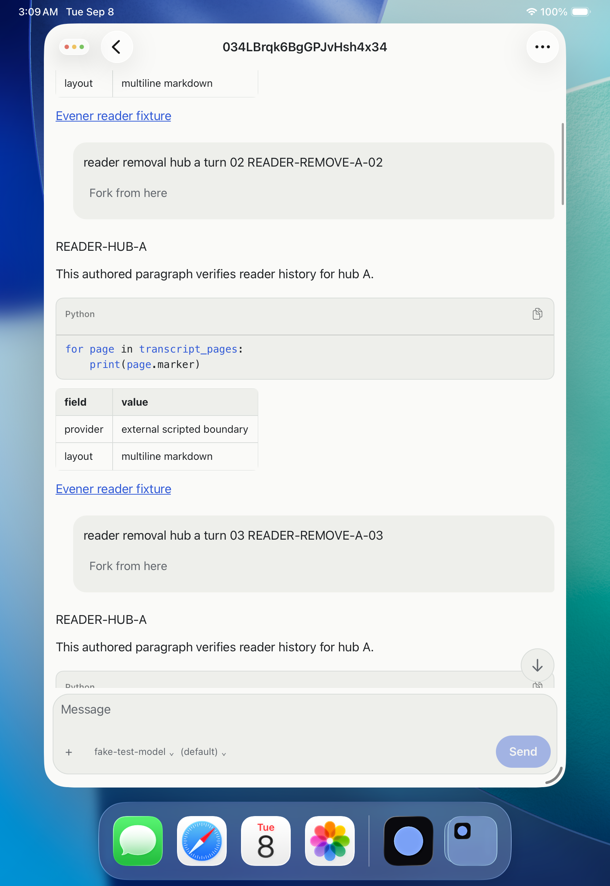
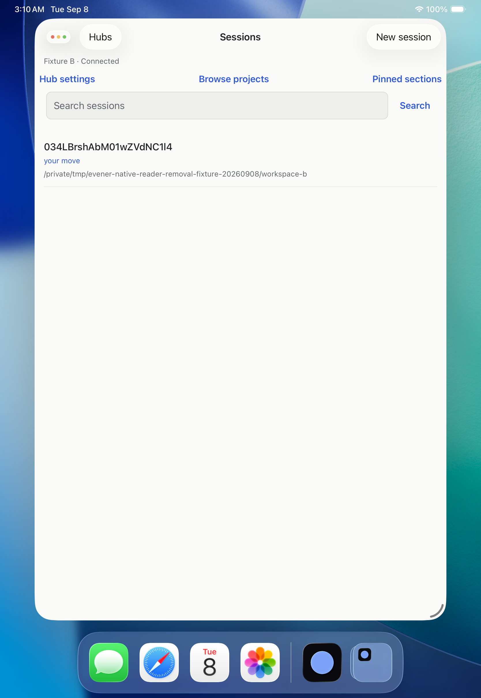
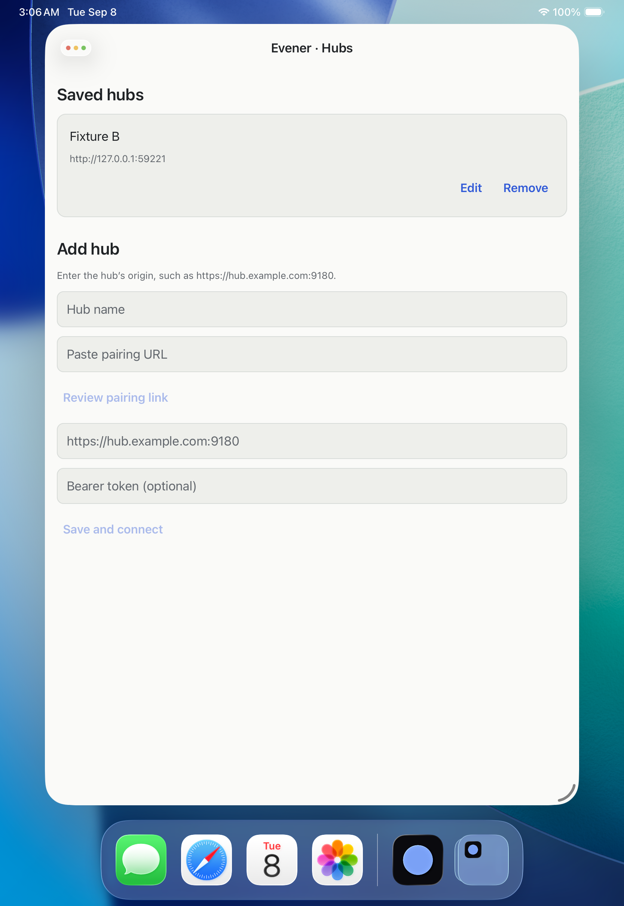
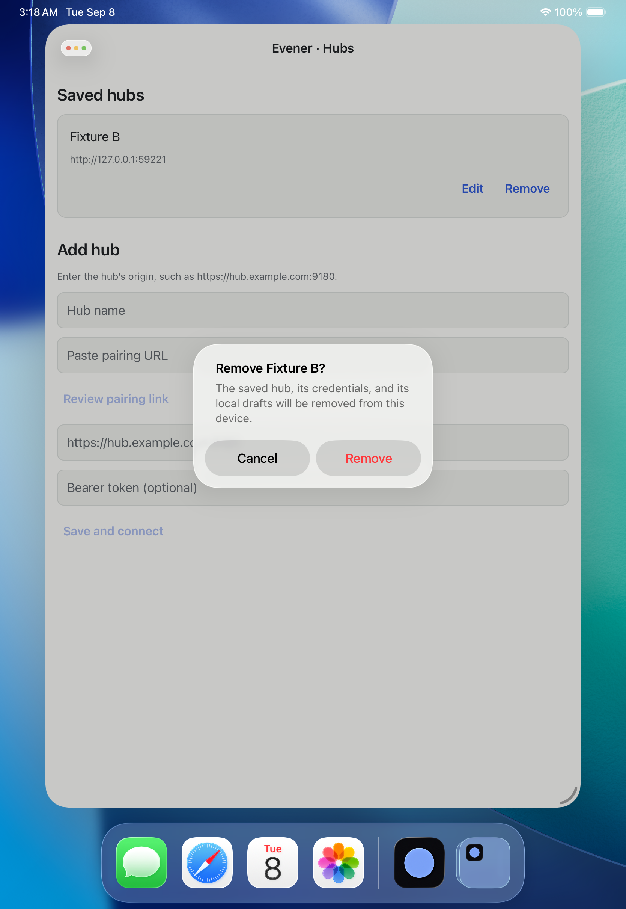
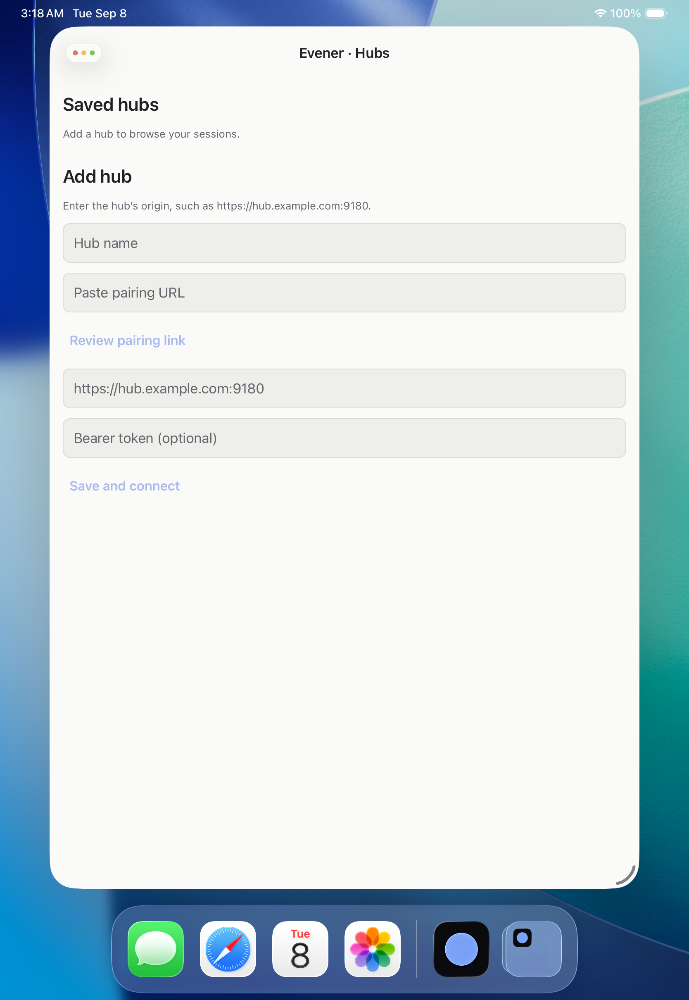

# iPad reader removal evidence — 8 September 2026

This scoped journey used the iPad Pro 11-inch (M5), iOS 26.5 Simulator,
UDID `6462A0FC-A190-4F08-A0CC-9B7E6C792AEC`, with the installed bundle
`com.primeradiant.evener.native`. It is simulator evidence, not physical-device
or release qualification.

Fixture A (`local:034LBrqk6BgGPJvHsh4x34`) and Fixture B
(`local:034LBrshAbM01wZVdNC1l4`) were opened through the native UI. The reader
history was dragged for each profile and the app was navigated back, producing
two actual `evener.reader-positions` entries. The private pre-removal SQLite
JSON receipt contains the complete values and is not checked into the repo.

Fixture A was then removed through the labeled `Remove Fixture A` action and
its confirmation dialog. After an explicit simulator cold launch, the private
post-removal receipt contains exactly one reader-position entry: B. B's value
is byte-equivalent before and after removal; its canonical value SHA-256 is
`411079416c9a8d65277be3f1f3a544baa83b2606ea54c2b8467ebe91a9950df7`.
The A entry is absent. This qualifies scoped reader-position cleanup while
preserving another hub's reader state.

The installed Release app executable SHA-256 is
`e2386bcca4d94cec2d78b2f3190eb6287009b9a14382b6ee30142f3482d6072e`.
The cold-launch PID was `796`; the PID is diagnostic only and is not a build
or signing claim.

Raw screenshots and SQLite captures were retained privately with mode `0600`.
The [receipt](assets/ipad-reader-removal-receipt.json) records their hashes,
the exact profile/ref identifiers, and the independent before/after comparison.

Remaining scope includes drafts, rich media, live-tail behavior, accessibility
and physical-device qualification, distribution signing/update, and final
release gates.

## Frozen reader-progress artifact follow-up

The frozen Release simulator artifact was installed on the same iPad after the
two-profile qualification. Its `main.jsbundle` SHA-256 is
`1d5f0061f1b644928124358436bd7313565d2ed231dd56ff44ac015ce4b7ac7e` and its
`Evener` executable SHA-256 is
`7e1e295075aa7ceec32fc667b5079028b086c9253017dc9aec6f524036e25040`.

Before installation, B's saved anchor was
`apptranscript-item-v1:turn_m3:4:0` at offset `61.5`. After installation and
cold launch, the raw reader-position value was byte-equal, with the same item
and offset. B was then removed through the labeled confirmation flow; a final
cold launch showed an empty Saved hubs screen and no reader-position row. This
is a bounded artifact-preservation and profile-removal observation. It does
not qualify the broader reader-restoration behavior, which remains open on
other devices and journeys.

