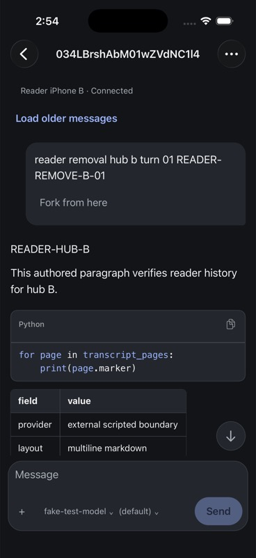
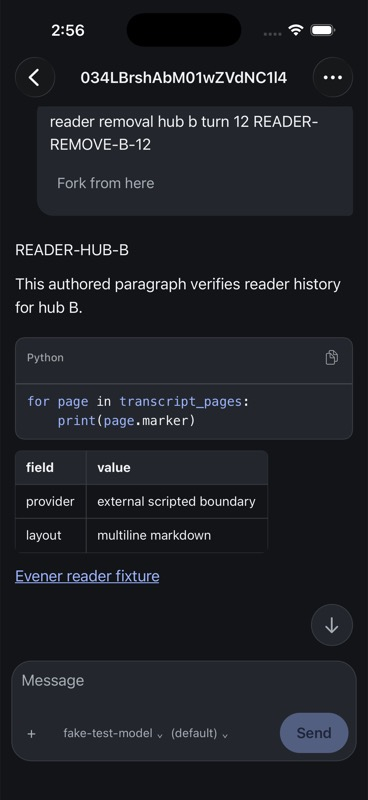

# iPhone reader upgrade and rich content evidence

The in-place iPhone 17 Pro simulator upgrade to native source `517f70ae3`
preserved every row in all seven draft tables: nine conversation drafts,
eight question drafts, three question positions and one creation draft.
The app reconnected to the existing authenticated hub. Exact source,
installed bundle and binary hashes and private before/after readbacks are in
[the receipt](assets/iphone-reader-upgrade-receipt.json).

A separate authenticated fixture supplied 12 completed turns through a real
Evener hub and daemon with a scripted external provider. On the installed
Release app, paragraphs, code, table rows and a link rendered in the reader.
The native code copy control returned the exact 52-byte code; long-pressing
the link and choosing Copy destination returned its exact 41-byte URL. The
prior simulator clipboard was restored. Latest moved to the final response
with the content clear of the composer. These are bounded native observations,
not a full rich-content or accessibility qualification.

The largest-text cold-launch check found a regression: the stored anchor
identified the final response in turn 12, while the settled viewport showed
turn 8. This reproduced on two cold launches. An initial candidate that
removed the intra-row offset from approximate scrolling did not resolve it;
its raw capture is retained separately. The cold-launch case remains open.

Native code blocks expose a custom Copy accessibility action. Multiline links
use UIKit accessibility paths, so their zero rectangular AX frame alone does
not establish a focus defect. VoiceOver focus, speech and custom-action
activation still require direct qualification.
