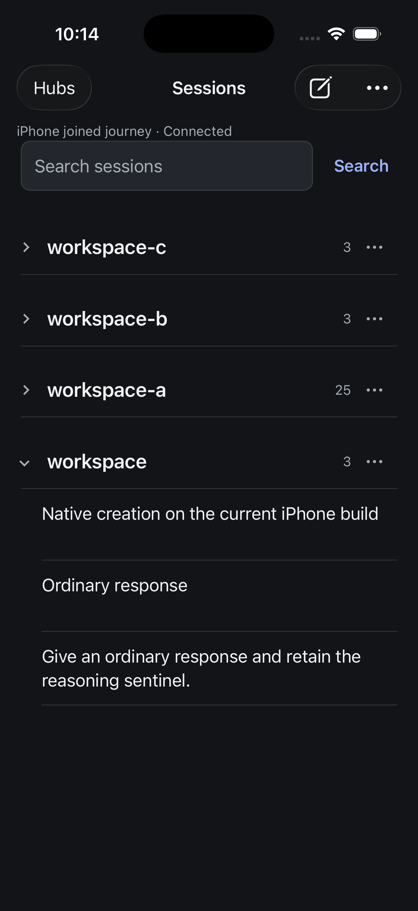
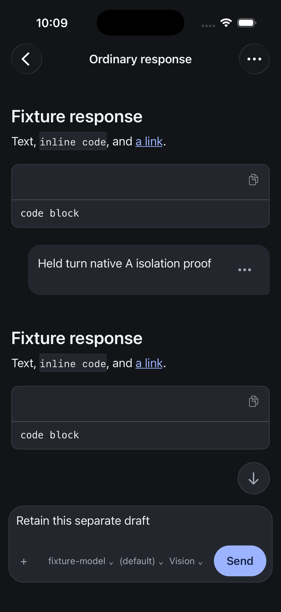

# iPhone UX contract

8 September 2026. Existing direction consolidated for the whole-app review.

Evener should make three things immediately understandable: where the work lives,
what it is doing, and what the person can do next. Projects organize discovery;
the conversation remains the working surface. This contract extends the approved
[philosophy](philosophy.md) and [style guide](style-guide.md). It does not introduce
a new navigation framework or declare unfinished workflows accepted. iPad and
dedicated accessibility work remain paused; preserve existing support.

## The daily path

**Choose hub → find project → open session → read or act → return to the same place.**

New work starts from the existing compose action and returns to its created
conversation. Questions, approvals, queue inspection and session settings are
temporary departures from that conversation, with its draft and reading position
retained. Hub administration belongs behind hub actions. There is no new dashboard
or mandatory setup tour in this design.

| Surface | What should lead | Primary action | Secondary information and actions |
| --- | --- | --- | --- |
| Saved hubs | Readable hub name and connection destination | Open a saved hub; add one when none exists | Edit credentials or remove the device-local profile with its actual consequences |
| Sessions | Project names, then session titles and meaningful state | Open a session; compose new work | Search, project disclosure/details, organization and hub actions |
| Conversation | Assistant answer and the person's draft | Send when idle; Steer when the active session supports it | Model/reasoning, attachments, queue and Stop; session management in the header menu |
| Decision sheet | The requested decision and its consequence | Explicit answer, Allow once or Deny | Context, alternatives and dismissal that leaves the decision pending |
| New session | Destination and opening prompt | Create session | Current model/reasoning and inspectable project, harness, plugin and session options |
| Settings and administration | Resource name, effective selection and editable value | Save or the named operation | Exact details on demand, failure recovery and return to the originating work |

## What the screens should look like

### Find work

Use the existing native header with Hubs, Sessions, compose and hub actions. Below
it, show the selected hub quietly, then search, then one continuous list of
expandable projects. Project names lead at 19 pt semibold; session titles use
17 pt with a two-line allowance and a minimum 68 pt row. Counts and paths are
secondary. Working, questions, approvals and failures deserve more emphasis than
idle state. Keep ordinary rows open on the canvas with sparse boundaries.

Load further pages as the person approaches them, preserving visible rows. Keep
expansion, search text and position on return. A stale list needs a visible update
action; an error needs recovery without erasing the last useful list. Search
queries the hub rather than just loaded rows. Its existing aggregate limit must
be explained; do not offer a false continuation. Project details remain a separate
route for current, recent and archived work.

### Read and write

Use a native back control, a useful session title and one session-actions menu.
Assistant prose sits directly on the canvas. Headings, lists, code and images
retain their meaning. Routine activity is inspectable in place; decisions and
blocking failures must remain discoverable. A restrained user-message surface
distinguishes the person's input. Message actions use the existing native sheet;
Fork preview is read-only and the created fork opens with an editable draft.

The composer gives the draft the full width. Its footer holds attachment access,
the model and reasoning choices, and the primary action. Secondary controls must
not squeeze the draft. Stop and queue remain available when applicable. Latest
belongs outside the writing surface. Reading earlier content never follows new
output automatically; deliberate navigation back restores the previous position.

### Act while work runs

The same screen changes state rather than acquiring a second permanent toolbar.
Keep the active primary action explicit. Pending questions and approvals have
visible entries close to the composer; opening one reveals the complete context
in a sheet. Queue inspection shows full messages, ordering, cancellation and the
consequence of promoting one or all entries. Settings mutations show pending state
and prevent a send with an ambiguous selection. Closing a settings sheet cannot
silently lose its failure.

### Start meaningful work

Show the selected hub and project destination before the opening prompt. Keep
recent projects and directory selection easy to reach. The opening prompt uses
the same full-width composer, model/reasoning controls and submission arrangement
as the conversation. Advanced choices remain inspectable disclosures. Creation
failure retains input; uncertain creation must reconcile before another attempt
can accidentally duplicate work. Keyboard-open composition is a required screen,
not an afterthought to a tall configuration form.

### Recover without losing work

Retain readable content and the current draft through reconnect and backgrounding.
An uncertain submission remains separate from a newer draft. The visible action
leads to checking delivery; it must not imply that retrying is automatically safe.
Show what is unavailable and the action that can restore it. Destructive actions
name their destination and effect. Do not promise undo where the server has none.

Settings and decision sheets need the same readable title, target identity,
pending feedback, recovery and return conventions. Exact paths or commands are
available where needed for a decision, without dominating every resource row.

## Visual language

- SF system typography; 17 pt reading text and subordinate 13 pt metadata.
- Quiet light `#fafaf8` and dark `#121417` canvases, with semantic text and surfaces.
- Cobalt accents for actions and selection; stronger emphasis for decisions and
  blocking failures, with words that convey meaning independently of color.
- Align content to consistent 20 pt insets, with deliberate nesting in lists.
- Use native navigation, menus and sheets. Preserve at least 44 pt action regions.
- Avoid decorative cards around ordinary transcript entries and settings rows.
- Keep loading indicators and temporarily unavailable controls from shifting
  the person's reading position.

The scoped serialized tokens and exact browser rules live in
[mobile-native/DESIGN.md](../../../mobile-native/DESIGN.md).

## Current runtime appearance

These are actual simulator captures of native source `f75411ead`, with fixture
content. They show the implemented browser and reader; they are not mockups of
the still-unreviewed combined running states.

| Project browser | Conversation and composer |
| --- | --- |
|  |  |

The [two-reviewer panel](2026-09-08-iphone-ux-panel.md) records the independent
assessments, source corrections and prioritized design follow-through.

## Implementation and evidence boundary

| Part of this contract | Evidence at this review | Still required |
| --- | --- | --- |
| Expandable project browser, automatic paging and return | Runtime `f75411ead`; [receipt](assets/2026-09-08-native-project-browser.json), dark/light/search screenshots | Representative scale, live invalidation combinations and physical-network performance |
| Conversation, full-width composer, native message action and stable return | Same runtime reader and action screenshots; scoped navigation/draft evidence | Coherent running/decision/error journeys on the same current artifact |
| Keyboard composition, queue, creation and administration | Implemented source plus dated screenshots in the corresponding assets folders | Fresh joined current-artifact review; older screenshots are historical, including superseded header controls |
| Recovery and device continuity | Implemented protections and separately dated behavior receipts | Combined interruption states and physical-device acceptance |
| Signed demo | TestFlight 0.1.0 (2), containing native source `f75411ead` | Physical build-2 install/update and complete device smoke |

Static screenshots establish visible composition within the recorded state. They
do not establish interaction fluency, complete functionality or performance.

## Next complete design specimen

Use one realistic project with ordinary session names, overlapping hub names,
active and failed work, and enough sessions to scroll. Use one substantial
conversation with prose, code, an image, routine activity, a question and an
approval. Capture its reading, keyboard-open, running, decision and recovery
states with the same content and source identity. Review light and dark on
iPhone. Preserve the current draft and reading position throughout.

This is the remaining Task 15 design gate. The source/screenshot panel informs
that specimen; it does not close the gate. Apply agreed findings in one bounded
batch, then confirm the affected journeys. Performance measurements remain
Task 14 with their own dataset and device identity.
