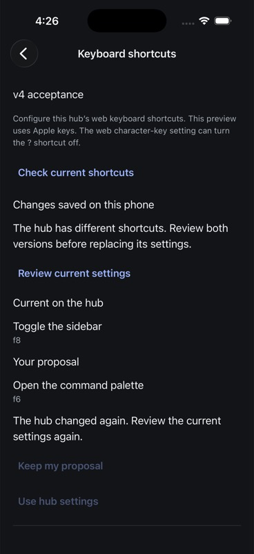
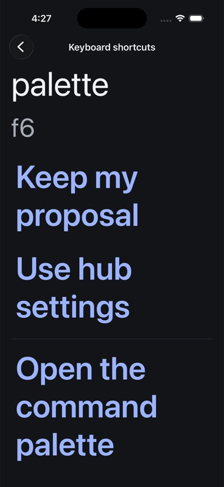
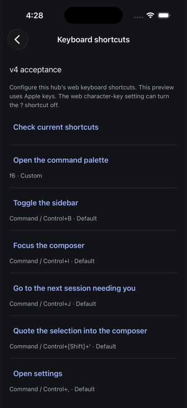
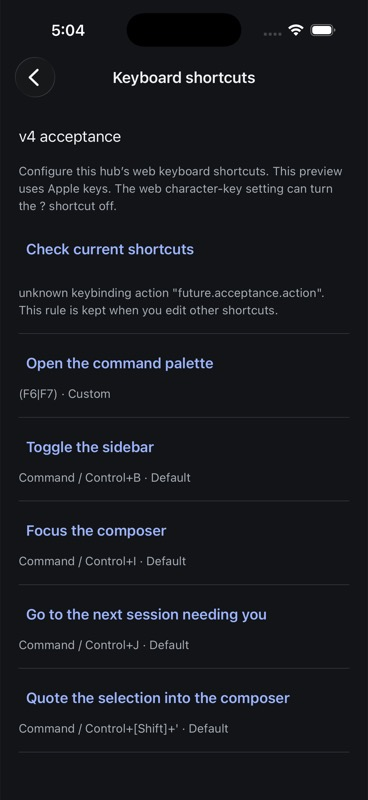
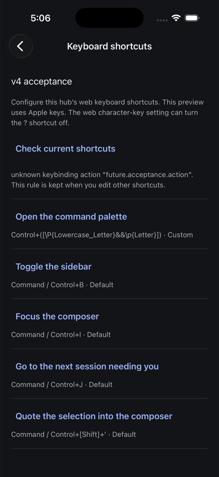
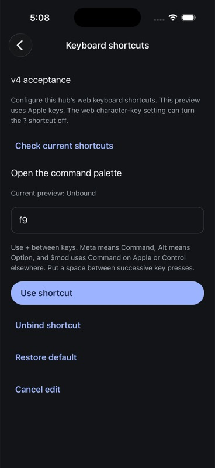

# Native keyboard-shortcut settings evidence

Observed 7 September 2026 on the owned AppWire v4 hub and iPhone 17 Pro /
iOS 26.5 simulator. This is bounded feature evidence, not iOS release approval.

## Source boundaries

- `9ca6eeb71` adds the native settings/editor, hub-scoped durable proposal and
  uncertainty journal, explicit conflict review/rebase, saved editor destination,
  stale read/write/disposal fences, and shared semantic validation.
- Its installed Release bundle SHA-256 was
  `b1ee24a01ae21f55b1e0725eb5dbdb8e33a18a76cd648826dff0b8c5b10c82bc`,
  3,117,992 bytes. The observations and three screenshots in the next section
  use this artifact. An earlier exploratory build also restored an unsaved `f6`
  input after termination, but that is not final-source form-restoration evidence.
- `cadf744a8` adds native UnicodeSets compilation and authored-pattern previews;
  `d65d234f5` preserves literal `$mod` text inside keys/patterns and gives the
  comparison tests their own unpatched tinykeys development dependency.
  [Pattern decisions and limitations](keybinding-patterns.md) describe the
  compiler corrections and explicitly recorded browser-engine discrepancy.

All native runs use simulator `F9170898-2B92-4420-BD12-9B54B3FC4AE0`, bundle
`com.primeradiant.evener.native`, and the direct owned hub at loopback 54211.
The owned hub binary hash is
`606c8b19bbeb6139a1e1ecc1f2b70d70acd24634f286f940f5a365cd989cfbb7`.
No forwarding proxy, production session, or live provider was used.

## Persistence and conflict observations

The native editor created a durable proposal for `palette.open: f6` at revision
0. Reinstallation preserved it. An independent SDK update set `rail.toggle: f7`
at revision 1 and the app displayed current and proposed rules for review.
Another SDK update changed the rail to `f8` at revision 2. The previous review
became stale and the replacement controls disabled until fresh review.

At maximum Dynamic Type size, scrolling reached both Keep my proposal and Use
hub settings. Keep my proposal rebased only the local journal: independent reads
still showed hub revision 2 with `rail.toggle: f8`, while the local proposal was
`palette.open: f6` based on revision 2. No write was automatically replayed.
After restoring text size to Large, termination/relaunch preserved the proposal.
Explicit Save changes then produced hub revision 3 with `palette.open: f6` and
removed the exact local journal.

The same artifact exposed a platform failure when the owned hub was set to
`(F6|F7)`: Hermes rejected the parser's `v` flag. That observation triggered the
compiler work; it is not counted as accepted pattern support.

## Compiler artifact and final iOS observations

The `d65d234f5` source built, installed and launched successfully after module
regeneration. The final Release bundle SHA-256 is
`b0d1e4067fda6e6e5b63ffa3290861f64d0b18658c6134addc42dd4d292cdb64`,
4,113,337 bytes: 995,345 bytes (31.9%) above the earlier shortcut bundle.
This measures bundled code cost, not runtime performance qualification.
Initial launch PID was 84313 at 2026-09-07 12:03:54 UTC.

The final artifact loaded the owned revision-4 `(F6|F7)` rule as custom, retaining
its original text. Only the intentionally unknown action produced a warning.
Native Unbind created a local revision-4 proposal retaining that unknown action;
the hub stayed unchanged until explicit Save produced revision 5 with
`palette.open: null`. The local journal then disappeared.

Native Restore default similarly created a local revision-5 proposal containing
only the unchanged unknown rule. The hub remained at revision 5 until Save;
the acknowledged revision 6 contained only that rule and the journal was empty.

Independent SDK fixtures then checked actual Hermes validation/rendering:

| Revision | Palette rule | Native result |
| --- | --- | --- |
| 7 | `Control+(\p{Script=Greek})` | Custom authored text, no parse/reserved warning |
| 8 | `Control+([\p{ASCII}&&\p{Letter}])` | Browser-reserved warning and default preview; no parse failure |
| 9 | `Control+([\P{Lowercase_Letter}&&\p{Letter}])` | Custom authored text, no parse/reserved warning |

With a revision-10 unbound fixture, the native editor accepted unsaved `f9` text.
SQLite stored that editor destination with no shortcut proposal/journal.
Termination/relaunch restored the exact editor text. Cancel left the hub at
revision 10: the typed shortcut was never sent. The final owned settings were
restored to the original empty rule list at revision 11, and the journal remained
empty. The app ends on this hub's default shortcut list at Large text size.

The four retained fork/deletion drafts still match their previous lengths and
SHA-256 values (513, 513, 37, and 27 bytes), with no unconfirmed sends. The two
unrelated Apple project-file changes match the preserved binary patch exactly.
These settings-only journeys did not operate on session history.

## Deterministic verification

At `d65d234f5`, `make test-native` passes 581 tests in 69 files plus TypeScript.
Touched Biome and `git diff --check` pass. The initial shortcut implementation
also passed `make test-web` and 167 shared keybinding tests after rejecting
empty key presses in the shared chord parser.

Recovery cases exercise intent-before-dispatch, failed storage, unknown replies,
fresh authoritative reads, conflict/rebase revisions, a pre-write GET arriving
after a failed write, subscriber disposal before dispatch, late acknowledgements,
replacement journals, hub/model scope changes, and route/form restoration.
Pattern cases exercise the actual native parser and preview, set membership,
negation and case folding, invalid grammar, authored text, modifier aliases,
and duplicate/collision selection. No default test contacts a real hub/provider.

A clean offline dependency install applied the native patches. The subsequent
iOS rebuild first lacked CocoaPods-generated SQLite files; `pod install`
restored them. Inspection then found a cached ExpoSQLite module importing the
system SQLite module. The worktree-local cache was preserved under
`ios/build/ModuleCache.keybindings-sqlite-20260907` and removed from the active
cache path for regeneration.

Luna medium agents reviewed supplied contracts, source/algorithm excerpts and
test vectors. They could not inspect the authoritative filesystem in their
snapshots. Root integrated changes and executed repository and simulator checks;
agent proposals alone are not execution evidence.

## Qualification limits

The conflict/max-text journeys use the earlier explicitly identified artifact;
the pattern/unbind/reset/form journeys use the final artifact. A complete
same-source release matrix has not been run. Full VoiceOver, iPad, physical-device, signing/update,
overlapping multi-hub lifecycle coverage and the final canonical merge gate
remain open. Transport-level lost-reply injection is not claimed by these
device observations; deterministic model tests cover it.
