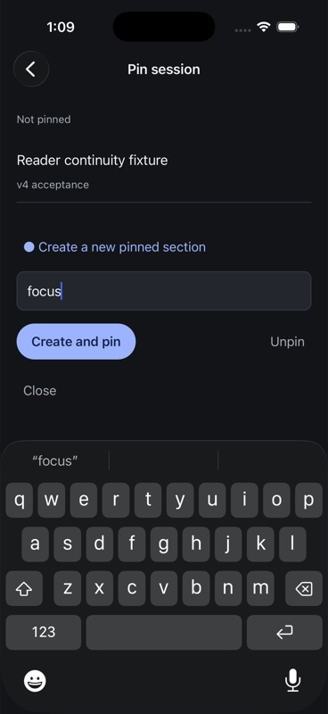
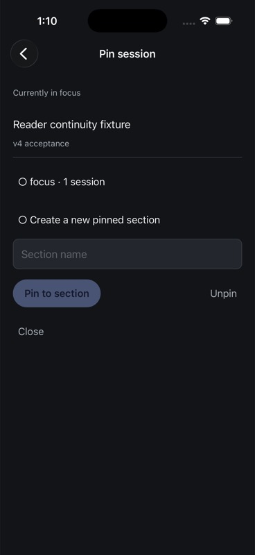
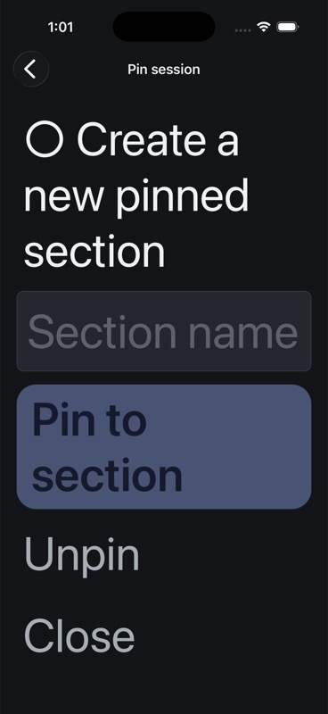
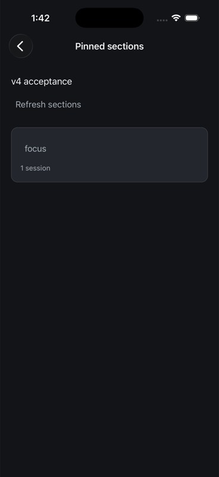
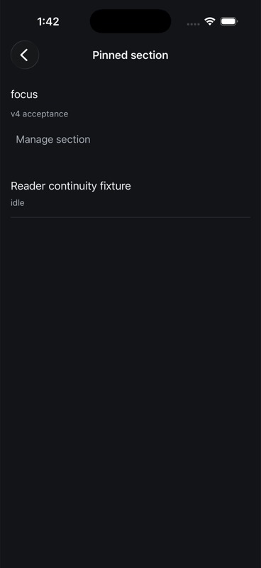
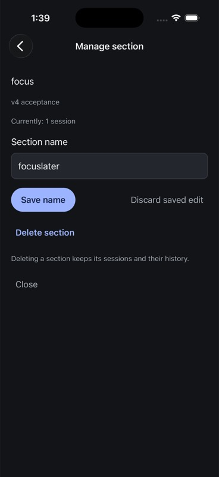
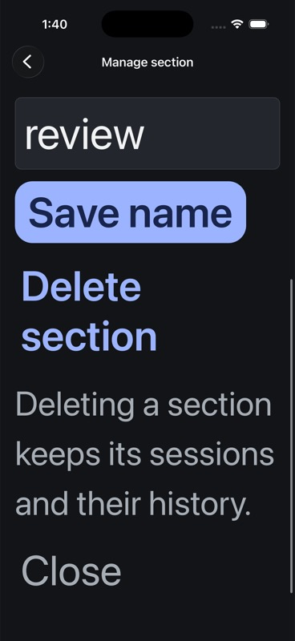
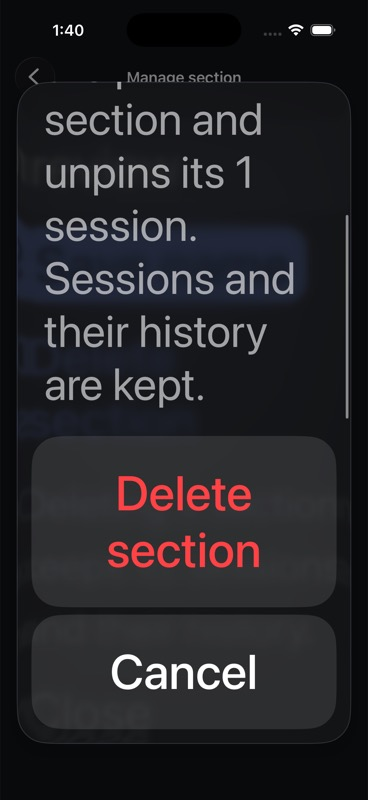
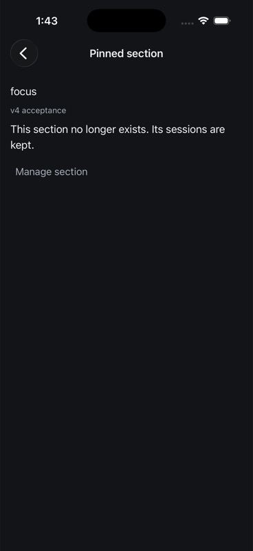

# Native project and session organization

Verified 5 September 2026. Project and session rows expose a quiet More action with the item title and hub in the platform alert. Projects support Add to pinned/Remove from pinned and Archive/Unarchive. Top-level sessions support Archive/Unarchive; nested subagent, fork and cluster rows do not expose organization. The synthetic no-project entry is excluded. Session pin sections remain a separate unfinished workflow.

Archive uses the server session_id, while opening uses the canonical ref. Projects send their key and working directory. No history is deleted and no runtime stop is requested. Successful writes require a navigation read satisfying the receipt generation and relevant revision. A read invalidated by a racing notification gets one further read, never a repeated write. Cancellation or a superseding read cannot falsely acknowledge verification. Owner tokens invalidate old native alert callbacks after readiness/focus changes. Errors remain visible without automatic mutation replay.

## Evidence

- Native 87 tests across 16 files, TypeScript and targeted Biome pass. Both final iOS and Android Release builds were installed.
- Boundary tests cover exact project parameters, single pending mutation, disposal/stale confirmation, uncertain failure, receipt revision rejection, superseded verification and a notification racing the receipt read.
- Independent review found and closed superseded-read acknowledgement and reconnect/focus ownership defects.
- Both simulators archived the real isolated-hub project, found it under Archived projects, and restored it. Both archived the owned Session controls verified session, found it in the Archived tier, and restored it. iOS pinned the project; Android removed its pin. The final owned fixture state is unpinned and unarchived.
- The wire observer captured actual hub receipts and navigation pages. Android session archive revision 74 excluded the session from Current and included it in Archived; revision 75 returned an empty Archived tier after restoration. This used the page-size proxy forwarding actual hub data, with no synthetic hierarchy.
- Live testing exposed receipt-before-notification timing: the first verification was invalidated despite a current server response. The added read-only revalidation regression reproduces that order; both-platform manual checks succeeded after correction.
- Final geometry correction gives Action a platform minimum width as well as height. Android More bounds measured 126 by 126 physical pixels at the emulator's 2.625 density, or 48 dp square. Both final screenshots were visually inspected. Mutation checks precede only this minimum-width adjustment; final Android More opening/cancel was repeated afterward.

## Remaining acceptance

This does not complete navigation organization: session pin sections, removal, hub-wide pinned browsing and physical-device/accessibility acceptance remain open. Native acknowledgement-loss and stale-alert fault injection still need dedicated E2E beyond the deterministic controller checks. No full repository merge gate or release-readiness claim is made.

## Organization foundation checkpoint (2026-09-07)

This checkpoint covers native navigation/controller behavior and the independent
SDK recipe. Pin management is not yet connected to iOS destinations, and no iOS
Release build or UI acceptance is claimed for these changes.

### Native navigation and recovery

Commit `394442767` adds pin catalog paging/invalidation and validates conditional
responses and tombstones against the current resource's revision. A cached
first-page refresh also resets the next-page offset. The owned hub exposed
manifest revision 8 and pin catalog revision 1 in the same generation: ETags and
revisions are resource-scoped, not interchangeable across resources. A receipt
revision floor also belongs to its generation: after a failed receipt readback,
an explicit fresh read can accept a restarted hub at its new revision. A read
that is still confirming the original receipt must match that receipt generation.

`NavigationActions` accepts a synchronous per-hub recovery journal. It saves
the operation and immutable target before dispatch, persists an acknowledged
navigation receipt before readback, and conditionally clears only the exact
checkpoint. Disposal leaves recovery available to a replacement model. A lost
reply is never replayed. Storage read/write failures block further mutations.

The controller passes the restored checkpoint to the reconciliation callback.
That callback must actually read the saved target and validate applicable
receipt revisions before returning. Current archive/favorite screens still use
the nonpersistent controller binding; production storage and target-specific
reconciliation are not yet integrated. The pure `PinAssignmentEditor` is an
internal component with no registered route.

Validation on 2026-09-07:

- `make test-native`: 458 tests in 55 files and TypeScript passed.
- Focused controller coverage includes recreation, late acknowledgement,
  acknowledged receipt retention, failed begin/acknowledge/finish storage,
  corrupt storage, shared-journal admission, replaced checkpoints, and a new
  operation arriving during an initially empty-journal reconciliation.
- Focused navigation coverage: 26 tests, including resource-specific receipt
  floors, stale conditional responses/tombstones, pin catalog invalidation,
  continued paging after conditional refresh, and a fresh generation after hub restart.
- Touched native sources passed Biome; the final editor adjustment also passed
  TypeScript. No native menu journey was run for this checkpoint.

Native gate log: `/tmp/evener-organization-native-restart-gate.log`.

### Independent SDK organization recipe

The packaged `organization.mjs` defaults to reading. Explicit mutation mode
requires an exact owned endpoint match and a structured target. It performs one
mutation, then reads current navigation; rejected, unknown, and acknowledged
but failed readback outcomes remain distinct. Catalog pages keep their own
revision, and loaded manifest/catalog resources enforce only their own receipt
floors. Session location has its own revision.

Nine deterministic organization contracts passed. `make test-api-package`
qualified the packed package outside the checkout and runs organization,
preference, and streaming contracts there. Package publication is still separate.

A direct run used the already-owned scripted hub at port 54211 and existing
reader fixture `local:034KVwAjXBf0IyAcKKEYU3`. It imported the current organization
logic with the outside-checkout installed client. This was an SDK/API journey,
not an iOS UI journey.

| Operation | Acknowledgement | Independent readback |
| --- | --- | --- |
| Assign a new named section | changed: true | Session points to new section; catalog count 1 |
| Assign the same existing section | changed: false | Same section and count; no-op retained |
| Rename section | changed: true | Catalog contains the requested new name |
| Unpin session | changed: true | Location has no pin section; catalog count 0 |
| Delete empty section | changed: true | Catalog is empty |

The fixture began unpinned with no sections and ended in the same state. No
session was deleted or started. Other hubs and production sessions were untouched.
Receipt/readback samples demonstrate independent resource revisions: create
returned manifest 9, catalog 2, pin section 1, project 10; session location read
revision 4. Applying the maximum of those values to every resource would reject
valid readback.

Detailed local observations: `/tmp/evener-organization-sdk-evidence.json`.
Package gate log: `/tmp/evener-organization-package-final-gate.log`.

### Remaining acceptance

Connect native pin destinations, proposal persistence, current assignment
readback, and durable target reconciliation before exposing mutations. Extend
recovery to the existing archive/favorite bindings. Then run the iOS menu journey,
process death/lost reply/hub-switch scenarios, large text, VoiceOver, and iPad.
Ordinary selected-turn fork, ended-session deletion, native keybinding editing,
remaining SDK recipes, the open reader continuity issue, and complete release
acceptance remain outstanding.

## iOS pin assignment checkpoint (2026-09-07)

Commit `c9466f954` connects the native session menu to pin assignment. The form
can select a loaded section, name a new section, or unpin a top-level session.
Proposals are stored synchronously per hub/session before publishing edits.
The saved route restores the form over its conversation after process death.
The per-hub operation journal is written before RPC and keeps the exact target
and acknowledged receipt until fresh location/catalog reads confirm current
state. Reconciliation does not replay mutations or silently discard proposals.

Refresh uses transport readiness independently of edit readiness. Cached
assignment labels say "Last seen" while stale or uncertain. The summary,
session title and controls share one scroll area; action rows wrap. This fixes
an observed maximum Dynamic Type failure where fixed headers consumed the
viewport and made the form unreachable.

### Observed Release workflow

The final iPhone 17 Pro/iOS 26.5 Release bundle SHA-256 is
`832d376f44314a8945927831eee0e43170d290ec61f2634e3620b8bc17601561`.
Testing used the existing owned scripted hub on port 54211 and reader fixture
`local:034KVwAjXBf0IyAcKKEYU3`, with separate SDK reads of the real server.

| Workflow | Observed result |
| --- | --- |
| Enter a new-section proposal | Form shows `focus`; hub still has no sections or assignment |
| Stop and relaunch the final app | Exact form route and `focus` text return; no mutation occurs |
| Create and pin from iOS | Hub location points to the new section; catalog count is 1 |
| Unpin from iOS | Hub location has no section; the existing section count is 0 |
| Assign an existing section | Earlier same-controller Release journey repinned the selected section and confirmed it independently |
| Maximum Dynamic Type | Final layout scrolls to Unpin and Close; Unpin was executed successfully at that size |
| Another client deletes the empty section | iOS marks the catalog stale; explicit Refresh succeeds after the hub fix below |

The last-section deletion was an SDK cleanup operation, not a native delete
journey. The final fixture is unpinned and its catalog is empty. Device text
size was restored to `large`. The app's SQLite records were inspected for the
owned proposal and operation keys; successful changes cleared both records.

### Hub empty-catalog correction

The external deletion check exposed an actual hub error: cached catalog reads
failed with `navigation delta does not reconstruct current snapshot`. Projection
used a nil entity slice for an empty resource while history and delta application
used an empty array. Commit `c9fb42abc` normalizes that internal representation,
preserving reconstruction checks and the wire contract.

Both new real normalization/diff/application regressions failed before the fix:
removing the final pin section and updating only empty-catalog metadata. They
pass after it. The rebuilt owned hub returned the expected removal delta and
the iOS form refreshed successfully after a repeated external deletion.
Owned hub binary SHA-256:
`1a7e1e3385fa40f3b233ece51c3b8278c6e6c8035182b46c3b7b160d81ae04b0`.

### Validation and limits

- `make test-native`: 477 tests in 59 files and TypeScript passed.
- Native persistence/readback tests cover scope isolation, conditional clears,
  real Expo storage adapters, ACKed read failure, replacement-controller
  reconciliation, and retry after an initial read failure without replay.
- `make test-web`: typecheck, unit tests and lint passed; touched native sources
  passed Biome.
- Navigation/pin Go tests and the full `cmd/evener-hub` package passed; the full
  package took 113 seconds. `make build` passed with a freshly built frontend.

Local details: `/tmp/evener-pin-assignment-ui-evidence.json`,
`/tmp/evener-pin-conditional-fixed.jsonl`,
`/tmp/evener-pin-assignment-final-native-gate.log`, and
`/tmp/evener-pin-empty-hub-tests.log`.

This qualifies the bounded assignment workflow, not complete organization or
release acceptance. Native catalog/section browsing, rename/delete, durable
archive/favorite recovery, selected-turn fork and ended-session deletion remain
open. Lost-reply UI journeys, hub-switch races, storage-failure UI, full VoiceOver,
iPad and physical-device acceptance still need completion. The separate reader
continuity defect remains open.

## iOS pinned section management checkpoint (2026-09-07)

Commit `f08473f48` adds the pinned-section catalog from Sessions, section member
browsing, and a native section editor. Rename proposals are synchronously stored
per hub/section, including raw unfinished names. Restart restores the catalog,
member and editor route stack. Assignment and management now share their
navigation/recovery binding; editing requires an observation from the current
focus and connection scope. Section deletion requires a native confirmation and
retains sessions. A fresh missing-section read suppresses cached member rows.

### Final Release evidence

The final iPhone 17 Pro / iOS 26.5 Release bundle SHA-256 is
`0dada2f69bedc5522b37b941222cc75f2b042901e03855aa3e5762323a8c378e`.
The owned hub remains on port 54211 with the empty-navigation fix recorded above.
Only the existing owned reader fixture and sections created for this journey
were mutated. Independent SDK reads checked the server after each operation.

| Workflow | Observed result |
| --- | --- |
| Open catalog and section | Catalog shows the owned section with 1 session; opening it shows the reader fixture |
| Save a local name proposal | SQLite contains raw `focuslater` and the exact editor route; the hub still reports `focus` |
| Terminate and relaunch the final Release | Editor and `focuslater` return; hub name and revision remain unchanged |
| Save name from iOS | Hub reports `focuslater`; iOS confirms it and clears the draft and operation journal |
| Change section from another client while delete alert is open | SDK rename to `review` invalidates the catalog; pressing the stale alert's Delete does not delete it or create a journal entry |
| Refresh after the rejected stale confirmation | Editor shows current `review` and 1 session |
| Maximum Dynamic Type | Editor controls remain reachable; native confirmation text scrolls fully, with Delete and Cancel available |
| Cancel then confirm deletion at maximum text size | Cancel keeps the section; confirmation returns to an empty catalog and unpins the reader |
| Open the retained reader | Existing transcript markers 09–11 are still visible |
| Assignment regression on the final Release | Native Create and pin creates a second owned `focus` section and confirms membership |
| External deletion while the member screen is open | SDK deletes that second section; native Refresh replaces cached members with the missing-section result |

The simulator is restored to `large` text size. Final independent readback has
an empty catalog (revision 15), an unpinned reader location (revision 9), and
generation `cf71465c9a773014f113db95b9ab6846`. The selected hub's rename draft and
operation journal are absent; saved location is the catalog. Both owned sections
were removed. The first deletion was native; the second deliberately exercised
external deletion through the SDK.

The simulator text-entry tool appended to the existing field despite requesting
replacement. The observed and persisted proposal was therefore `focuslater`;
acceptance asserts that actual value rather than claiming a different edit.

### Readback correction and validation

The initial native rename succeeded on the hub but entered uncertain readback.
A notification sequence gap during the first catalog read reproduces that failure
with the real navigation model: the gap invalidates the in-flight observation.
Immediate ACK confirmation now uses the existing receipt-aware refresh, which
allows one further read when the notification epoch changes. Continued gaps still
reject; no mutation is retried. Restart reconciliation continues to read the
current generation without requiring the previous generation's receipt.

Both notification regressions failed before the correction. The final native
suite passes 492 tests in 60 files plus TypeScript; touched native sources pass
Biome. Tests also cover section lookup beyond the first page, missing sections,
abandoned reads, route restoration and malformed saved routes, draft scope and
conditional clearing, and real Expo storage cleanup. The final Release build,
installation, launch, and the tabled native journeys passed. Local gate details
are in `/tmp/evener-pin-section-native-gate.log`.

This checkpoint qualifies catalog/section browsing and the tested rename/delete
workflows. Durable archive/favorite recovery, ordinary selected-turn fork,
ended-session deletion, keybinding editing, remaining SDK recipes and the reader
continuity failure remain open. Lost-reply UI, hub switching, storage-failure UI,
full VoiceOver, iPad and physical-device acceptance still need completion. No
final whole-repository merge gate or release certification is claimed here.
