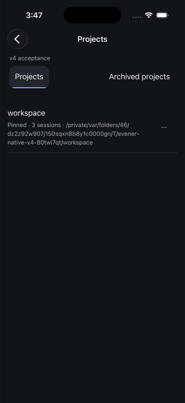
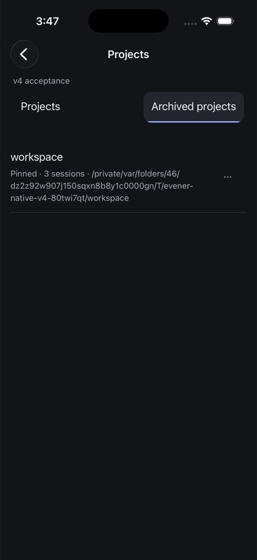
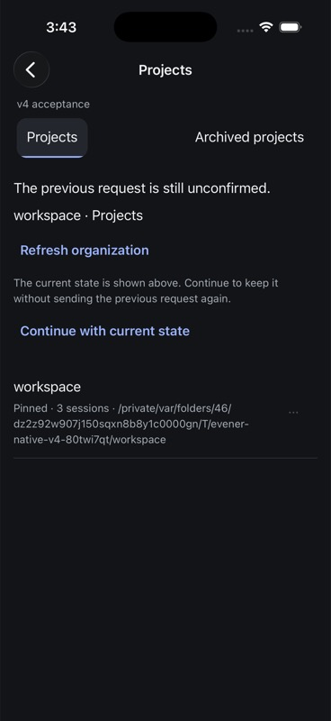
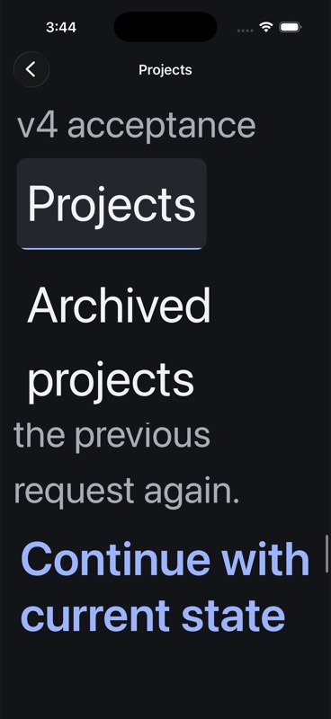
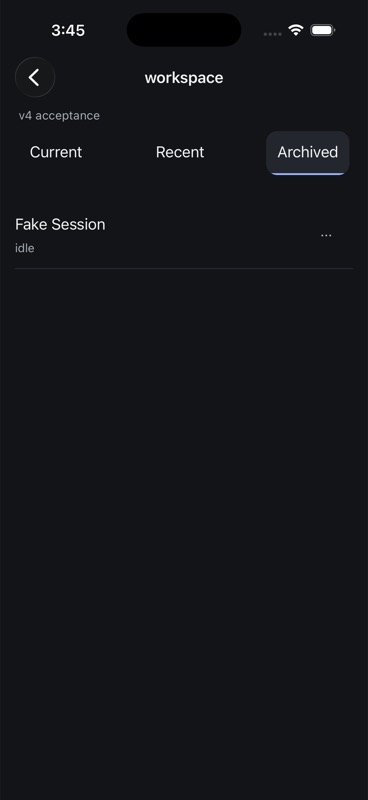
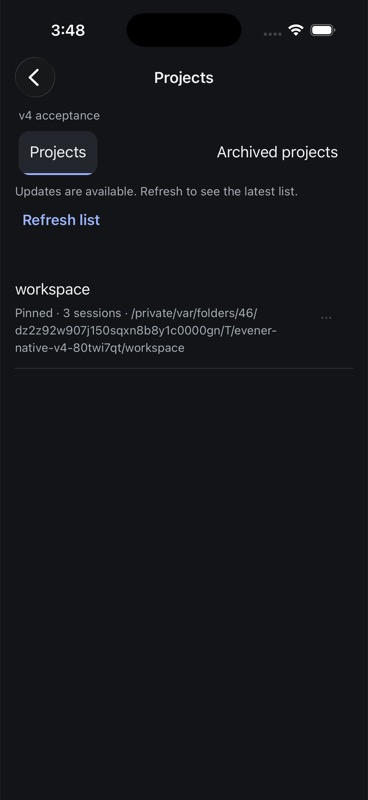

# Native archive and favorite recovery evidence

Observed 7 September 2026 on the owned AppWire v4 hub and iPhone 17 Pro /
iOS 26.5 simulator. This qualifies these organization workflows, not the full
iOS release matrix. Android qualification remains deferred for v1.

## Source and artifact

- `60611f595`: per-hub archive/favorite intent and receipt recovery, exact-target
  reads, read-only continuation, stale confirmation fences, project/filter route
  restoration and selected-button accessibility for project filters.
- `ef1cdf93e`: distinguish unresolved requests from failed reads, and discard a
  displayed observation when another read begins.
- Final Release bundle SHA-256:
  `7f14a22312fa38916cb64b7700a10788a6cd6ef1d4cbf40c6fb952f78182f7a2`.
  Build/install/launch succeeded on simulator
  `F9170898-2B92-4420-BD12-9B54B3FC4AE0`, bundle
  `com.primeradiant.evener.native`. Initial final-artifact launch PID 5406 at
  2026-09-07 10:42:45 UTC; subsequent restarts used this same bundle.
- The owned direct hub at loopback 54211 retained binary SHA-256
  `606c8b19bbeb6139a1e1ecc1f2b70d70acd24634f286f940f5a365cd989cfbb7`.
  No forwarding proxy, production session or live provider was used.

All screenshots below and the following completed journeys use the final
artifact. Earlier exploratory builds exposed the missing filter button traits
and misleading recovery error wording; those exploratory results are not the
final acceptance evidence.

## Observed workflows

The owned workspace project was unpinned and pinned through its native More
menu. Independent SDK catalog reads confirmed favorite false at project-catalog
revision 10 and true at revision 11. Archiving moved it from Projects to Archived
projects: project-catalog revision 12 was empty and archived-catalog revision 4
contained the exact project with `is_archived: true`. Termination and relaunch
restored the Archived projects filter with an empty organization journal.
Unarchive returned the same project to Projects.

The owned local session `local:034KUCPzao5OJ00zkfBDOK` (Fake Session) was archived
from the project's Current list. Its exact location read reported tier Archived
at location revision 2. Termination and relaunch restored the same project and
Archived tier, with no pending write. Native Unarchive removed it from that tier;
an independent location read reported Current at revision 3. It remained idle.

For unknown-request restoration, the app was stopped and one exact archive
intent with no receipt was seeded at the SQLite recovery boundary, conditional
on that hub's journal being empty. The intent requested archive while the project
was visibly unarchived. No request was sent to create this fixture. Relaunch
restored Projects and exposed Refresh organization. The read displayed the
project's actual state while retaining the exact unknown checkpoint and disabling
new organization writes. Another final-artifact installation/restart retained it.

At maximum iOS text size, scrolling reached both recovery actions. Explicit
Continue with current state reread the target and cleared only that checkpoint.
Independent reads before and after showed the same hub generation, project
catalog revision 9, archived-catalog revision 3 and unarchived project. Thus the
archive intent was not replayed. Text size was restored to Large.

To exercise stale confirmation, the project More menu was left open while an
independent client changed its favorite false and then true. This restored the
same visible favorite value while advancing navigation. Tapping Archive in the
old menu left the project unarchived and the journal empty; the native list
requested refresh. This proves the fence observes changed navigation rather
than merely comparing the final favorite value.

The project finished unarchived and unpinned, Fake Session finished in Current,
and the per-hub organization journal was empty. The last saved destination is
Projects on the owned hub. Paged, non-subscribing SDK reads confirmed the retained
reader still contains markers 01–30 and both ordinary-fork children contain
markers 01–10. The reader remains idle and both children remain notLoaded.
SQLite checks matched all four previous fork/deletion draft lengths and SHA-256
hashes, with no unconfirmed sends. The two unrelated Apple project-file changes
still match their preserved binary patch exactly.

## Deterministic verification

Final `make test-native` passes 553 tests in 66 files plus TypeScript. Touched
Biome and `git diff --check` pass. The added regressions cover finding a moved
project beyond the first catalog page, comparing each receipt revision only with
its own resource, missing/failed target reads, explicit restart reconciliation,
generation changes during reads, remote/wrong targets, obsolete scopes, unknown
archive placement, conflicting favorites, read-only continuation, replaced
checkpoints, a late acknowledgement during review, a navigation change between
readback and journal removal, and restored project/filter/tier destinations.

Existing shared action and deletion tests still cover intent-before-dispatch,
storage failures, late receipts after disposal and no replay. Generation/receipt
readback is now shared with deletion to keep those checks consistent. Luna medium
provided contract/design review; the root agent integrated changes and executed
the tests and simulator journeys. The review agent could not inspect the current
filesystem snapshot and reviewed supplied source and algorithm excerpts instead.

Logs and readbacks are local under `/tmp/evener-organization-*`, including
`native-gate.log`, `after-recovery-20260907.json`,
`stale-confirmation-20260907.json`, `retained-history-20260907.json`, and
`retained-drafts-20260907.json` (each with that prefix).

## Limits

The unknown-request device fixture starts at persisted storage; it does not claim
a transport-level lost-reply injection. Lost replies, storage failures and late
acknowledgements remain deterministic model tests. Archive location is effective
placement and cannot prove an unknown explicit archive decision persisted; the
explicit continuation intentionally accepts the current view without that claim.
Missing targets and unrelated journal operations conservatively retain recovery.

This is not a full VoiceOver pass, iPad or physical-device qualification, signing
or update acceptance, overlapping multi-hub lifecycle testing, or a final
whole-repository merge gate. Native keybindings, further SDK recipes, reader
Dynamic Type drift and the remaining delivery matrix are still open. No push,
merge or release publication was performed.

## Screenshots

