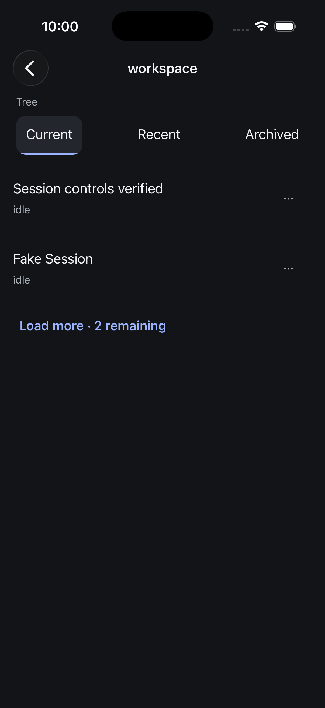
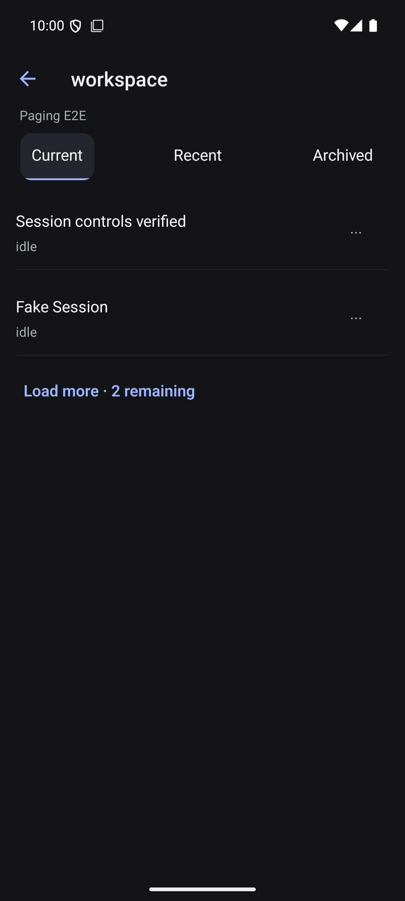

# Native project and session organization

Verified 5 September 2026. Project and session rows expose a quiet More action with the item title and hub in the platform alert. Projects support Add to pinned/Remove from pinned and Archive/Unarchive. Top-level sessions support Archive/Unarchive; nested subagent, fork and cluster rows do not expose organization. The synthetic no-project entry is excluded. Session pin sections remain a separate unfinished workflow.

Archive uses the server session_id, while opening uses the canonical ref. Projects send their key and working directory. No history is deleted and no runtime stop is requested. Successful writes require a navigation read satisfying the receipt generation and relevant revision. A read invalidated by a racing notification gets one further read, never a repeated write. Cancellation or a superseding read cannot falsely acknowledge verification. Owner tokens invalidate old native alert callbacks after readiness/focus changes. Errors remain visible without automatic mutation replay.

## Evidence

- Native 87 tests across 16 files, TypeScript and targeted Biome pass. Both final iOS and Android Release builds were installed.
- Boundary tests cover exact project parameters, single pending mutation, disposal/stale confirmation, uncertain failure, receipt revision rejection, superseded verification and a notification racing the receipt read.
- Independent review found and closed superseded-read acknowledgement and reconnect/focus ownership defects.
- Both simulators archived the real isolated-hub project, found it under Archived projects, and restored it. Both archived the owned Session controls verified session, found it in the Archived tier, and restored it. iOS pinned the project; Android removed its pin. The final owned fixture state is unpinned and unarchived.
- The wire observer captured actual hub receipts and navigation pages. Android session archive revision 74 excluded the session from Current and included it in Archived; revision 75 returned an empty Archived tier after restoration. This used the page-size proxy forwarding actual hub data, with no synthetic hierarchy.
- Live testing exposed receipt-before-notification timing: the first verification was invalidated despite a current server response. The added read-only revalidation regression reproduces that order; both-platform manual checks succeeded after correction.
- Final geometry correction gives Action a platform minimum width as well as height. Android More bounds measured 126 by 126 physical pixels at the emulator's 2.625 density, or 48 dp square. Both final screenshots were visually inspected. Mutation checks precede only this minimum-width adjustment; final Android More opening/cancel was repeated afterward.

## Remaining acceptance

This does not complete navigation organization: session pin sections, removal, hub-wide pinned browsing and physical-device/accessibility acceptance remain open. Native acknowledgement-loss and stale-alert fault injection still need dedicated E2E beyond the deterministic controller checks. No full repository merge gate or release-readiness claim is made.

## Organization foundation checkpoint (2026-09-07)

This checkpoint covers native navigation/controller behavior and the independent
SDK recipe. Pin management is not yet connected to iOS destinations, and no iOS
Release build or UI acceptance is claimed for these changes.

### Native navigation and recovery

Commit `394442767` adds pin catalog paging/invalidation and validates conditional
responses and tombstones against the current resource's revision. A cached
first-page refresh also resets the next-page offset. The owned hub exposed
manifest revision 8 and pin catalog revision 1 in the same generation: ETags and
revisions are resource-scoped, not interchangeable across resources. A receipt
revision floor also belongs to its generation: after a failed receipt readback,
an explicit fresh read can accept a restarted hub at its new revision. A read
that is still confirming the original receipt must match that receipt generation.

`NavigationActions` accepts a synchronous per-hub recovery journal. It saves
the operation and immutable target before dispatch, persists an acknowledged
navigation receipt before readback, and conditionally clears only the exact
checkpoint. Disposal leaves recovery available to a replacement model. A lost
reply is never replayed. Storage read/write failures block further mutations.

The controller passes the restored checkpoint to the reconciliation callback.
That callback must actually read the saved target and validate applicable
receipt revisions before returning. Current archive/favorite screens still use
the nonpersistent controller binding; production storage and target-specific
reconciliation are not yet integrated. The pure `PinAssignmentEditor` is an
internal component with no registered route.

Validation on 2026-09-07:

- `make test-native`: 458 tests in 55 files and TypeScript passed.
- Focused controller coverage includes recreation, late acknowledgement,
  acknowledged receipt retention, failed begin/acknowledge/finish storage,
  corrupt storage, shared-journal admission, replaced checkpoints, and a new
  operation arriving during an initially empty-journal reconciliation.
- Focused navigation coverage: 26 tests, including resource-specific receipt
  floors, stale conditional responses/tombstones, pin catalog invalidation,
  continued paging after conditional refresh, and a fresh generation after hub restart.
- Touched native sources passed Biome; the final editor adjustment also passed
  TypeScript. No native menu journey was run for this checkpoint.

Native gate log: `/tmp/evener-organization-native-restart-gate.log`.

### Independent SDK organization recipe

The packaged `organization.mjs` defaults to reading. Explicit mutation mode
requires an exact owned endpoint match and a structured target. It performs one
mutation, then reads current navigation; rejected, unknown, and acknowledged
but failed readback outcomes remain distinct. Catalog pages keep their own
revision, and loaded manifest/catalog resources enforce only their own receipt
floors. Session location has its own revision.

Nine deterministic organization contracts passed. `make test-api-package`
qualified the packed package outside the checkout and runs organization,
preference, and streaming contracts there. Package publication is still separate.

A direct run used the already-owned scripted hub at port 54211 and existing
reader fixture `local:034KVwAjXBf0IyAcKKEYU3`. It imported the current organization
logic with the outside-checkout installed client. This was an SDK/API journey,
not an iOS UI journey.

| Operation | Acknowledgement | Independent readback |
| --- | --- | --- |
| Assign a new named section | changed: true | Session points to new section; catalog count 1 |
| Assign the same existing section | changed: false | Same section and count; no-op retained |
| Rename section | changed: true | Catalog contains the requested new name |
| Unpin session | changed: true | Location has no pin section; catalog count 0 |
| Delete empty section | changed: true | Catalog is empty |

The fixture began unpinned with no sections and ended in the same state. No
session was deleted or started. Other hubs and production sessions were untouched.
Receipt/readback samples demonstrate independent resource revisions: create
returned manifest 9, catalog 2, pin section 1, project 10; session location read
revision 4. Applying the maximum of those values to every resource would reject
valid readback.

Detailed local observations: `/tmp/evener-organization-sdk-evidence.json`.
Package gate log: `/tmp/evener-organization-package-final-gate.log`.

### Remaining acceptance

Connect native pin destinations, proposal persistence, current assignment
readback, and durable target reconciliation before exposing mutations. Extend
recovery to the existing archive/favorite bindings. Then run the iOS menu journey,
process death/lost reply/hub-switch scenarios, large text, VoiceOver, and iPad.
Ordinary selected-turn fork, ended-session deletion, native keybinding editing,
remaining SDK recipes, the open reader continuity issue, and complete release
acceptance remain outstanding.
