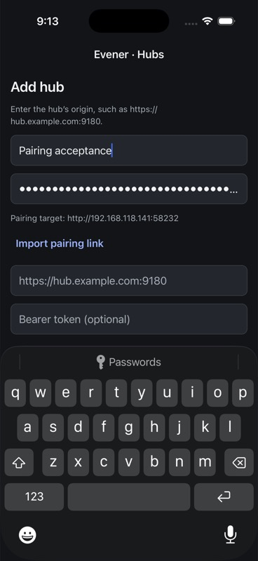
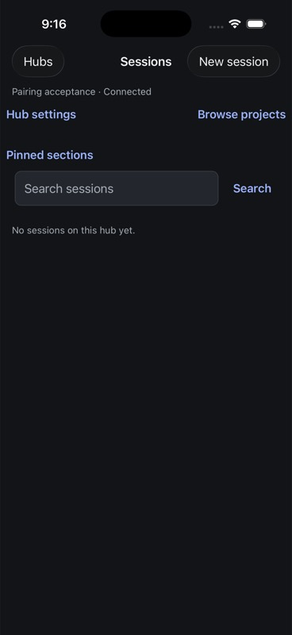

# Native pairing import evidence

## Qualified iPhone journey

The [receipt](assets/ios-pairing-receipt.json) identifies native source
`8d2297116`, the five built source-file hashes, Release artifact, installed bundle
hash and the isolated real hub. Root verified the built and installed JavaScript
bundle both hash to
`e833dd2b8c4c5f173e5c96212499a8461cae97db26a4e61ad8ec65938350f71c`.
The device was an iPhone 17 Pro simulator running iOS 26.5.

The actual hub's pairing endpoint rejects loopback origins. A fresh fixture bound
to the machine's LAN address, with an isolated configuration/state root, fresh
auth token and scripted external provider. No proxy or fake AppWire server was
used. The SDK generated its pairing link and privately verified the encoded token.
The link was placed on the Simulator pasteboard and pasted through the native
Paste menu; no credential-bearing URL was printed or archived.

1. A malformed escaped URL produced the generic invalid-link error and no import
   preview, leaving manual connection fields unchanged.
2. A real generated link was pasted into the masked field. Review displayed only
   the exact LAN origin; manual origin/token fields remained empty.
3. Import populated those fields and cleared the raw link and preview.
4. Save and connect opened the authenticated roster on the owned hub.
5. A cold app launch reconnected to the saved profile without re-entering a token.
6. Removing the test profile and reopening the original hub/session preserved all
   seven pre-existing drafts. The Simulator pasteboard was cleared and both test
   processes stopped. Root separately verified absent listeners and removed
   fixture credentials/private logs, including owned leftover diagnostic daemons.

## Deterministic coverage and remaining scope

Ten focused connection/pairing tests plus native TypeScript passed. They cover
escaped-token parsing, unsafe origins/paths/normalization, stale preview clearing,
invalid review and explicit import clearing. The existing secure profile storage
and save/connect path remain in use; no storage schema or camera dependency was
added. Independent Luna review found no remaining concrete defect.

This qualifies pasted-link import on the iPhone simulator. Camera scanning and
OS deep-link routing are not implemented by this change. iPad, physical phones,
expired credentials, unreachable hubs, interrupted saving, VoiceOver and the
remaining signed-release matrix require separate acceptance. A Release simulator
build is not distribution signing or physical-device qualification.
