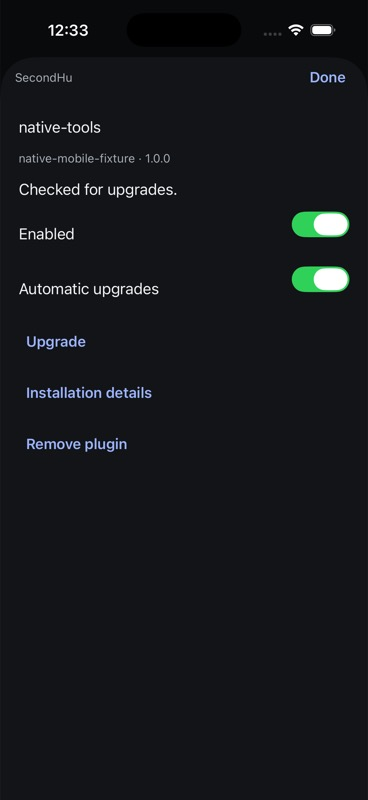
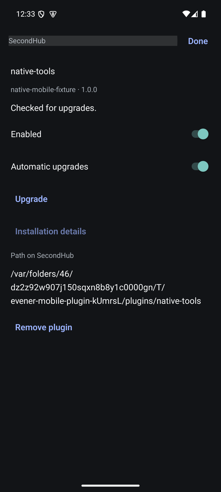
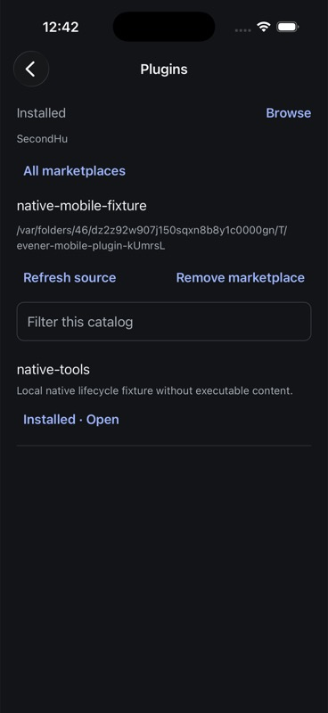
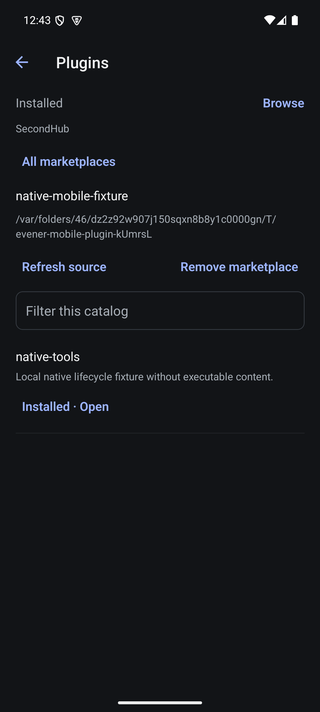
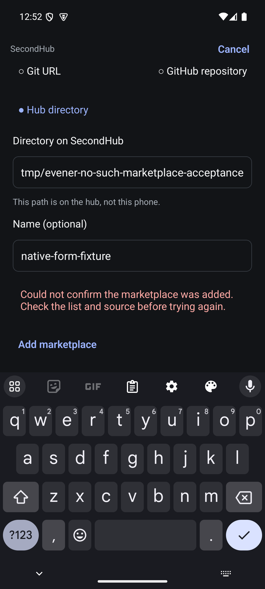
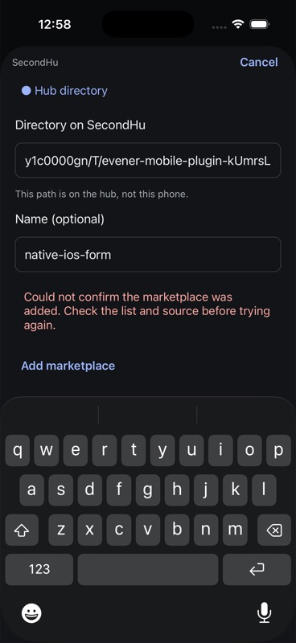
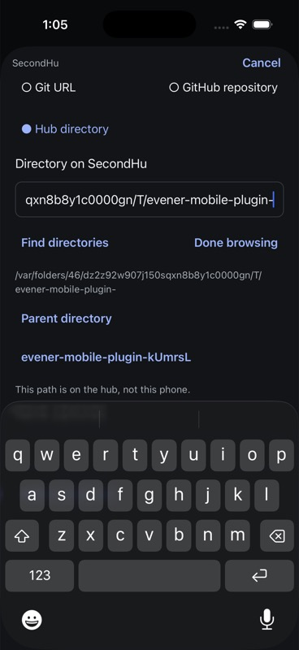
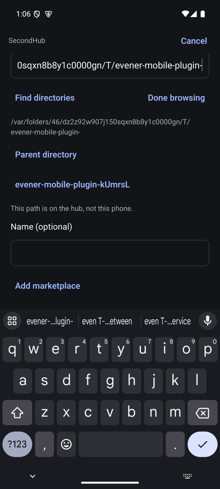

# Native plugin acceptance

## Owned local fixture

On 6 September 2026, used the isolated SecondHub runtime on port 56501 through
its existing port 9200 proxy. No production hub or credentials were touched.
`mobile-native/scripts/plugin-fixture.mts setup` creates a temporary directory
marketplace with one manifest-only plugin, registers it and installs it through
the real native wire client and hub handlers. It refuses an existing marketplace
with the same name. `status` reads the installed list without changing it.

Fixture source: `/var/folders/46/dz2z92w907j150sqxn8b8y1c0000gn/T/evener-mobile-plugin-kUmrsL`.
Marketplace: `native-mobile-fixture`; plugin: `native-tools`, version `1.0.0`.
No hooks, MCP servers or executable content are present. The marketplace and
source remain for subsequent native Browse/install testing; the installed plugin
was removed at the end of this pass.

## Installed lifecycle on iOS and Android

Both Release apps from `b23680c19` were already on Plugins. Installing the fixture
through the script caused both lists to show native-tools without reopening.
Opened detail on iPhone 17 Pro and Pixel 7 API 35.

- Disabled on iOS; independent wire status reported enabled false.
- Enabled automatic upgrades on Android; iOS's open detail switch changed to on.
- Re-enabled on Android; iOS changed to on. Independent wire status reported
  enabled true and autoUpgrade true.
- Tapped Upgrade on each platform; both displayed Checked for upgrades. This
  directory-backed source does not establish fetching a newer Git revision or
  background automatic upgrade behavior.
- Expanded installation details on Android. The full path wrapped within the
  viewport, with Remove still reachable.
- Removed on Android through the native confirmation showing plugin, marketplace
  and hub. Android returned to empty; iOS's open detail closed and its list became
  empty after the notification. Independent wire status returned an empty list.

Both detail screenshots were captured and visually inspected. The screen is
functional, but visual acceptance remains open: detail hierarchy and destructive
action styling need refinement; the hub's selectable header also shows a gray
selection highlight on Android in this capture.

TypeScript and fixture-script Biome pass. The previous screen commit's 258 native
tests and both Release builds remain the automated baseline; this pass added a
manual fixture script and evidence, not app code. Marketplace browsing/install,
Git-backed upgrade, filtering/duplicate identities with realistic lists, failure
and disconnect paths, large text, screen readers and physical-device validation
remain. This evidence does not close MOB-014.

## Native Browse and installation

Plugins now has Installed and Browse views. Browse lists registered marketplaces,
loads one catalog, filters names/descriptions and offers Install or Installed ·
Open using both plugin and marketplace identity. Source refresh/removal and a
Git URL/GitHub/hub-directory add form are wired. Install is disabled until installed
status is known and error-free, so a failed installed read cannot imply absence.

On 6 September 2026, both updated Release builds succeeded; 264 native tests,
TypeScript and touched-file Biome passed. On iOS selected Browse →
native-mobile-fixture → Install native-tools. The action became Installed · Open;
independent wire status reported enabled native-tools at 1.0.0. Open reached the
installed detail sheet. Android opened the same catalog and correctly offered
Open, then removed the plugin through its confirmation and reinstalled it from
Browse. Independent wire status again confirmed enabled 1.0.0. The fixture is
left installed with automatic upgrades off. Both catalog screenshots were
captured and visually inspected.

This verifies browsing, catalog install and opening installed details on both
platforms with the directory fixture. Add/remove marketplace, source refresh,
keyboard-open form submission, validation failures, hub-path completion, realistic
catalogs, screen readers and visual density still need acceptance. Android's first
post-install UIAutomator read returned a null root; a fresh screenshot and later
semantic snapshot showed the running app, and native navigation succeeded without
restarting the app or hub.

## Android add-form keyboard recovery and cross-client removal

On 6 September 2026, the Android Release from c540157be reproduced a
keyboard obstruction: Hub directory → invalid path → Add marketplace retained
the entered source/name and showed the rejection, but Add was below the software
keyboard and swiping could not reveal it. The modal's ScrollView only adjusted
keyboard insets on iOS; Android had no keyboard avoidance. The form now uses
an Android-only KeyboardAvoidingView with height behavior, matching existing
native forms. iOS keeps its automatic scroll insets.

The updated Android Release built successfully. Repeated the invalid-directory
case with name native-form-fixture, reopened the software keyboard, then scrolled:
Add was fully visible above the keyboard with the retained inputs and error.
Replaced the path with the owned directory fixture and tapped Add while the
keyboard remained open. The form closed and native-form-fixture appeared.
iOS received the added marketplace through its live list. Both catalogs offered
Install for the alias, despite native-tools being installed from
native-mobile-fixture; marketplace identity was preserved.

Tapped Refresh source on Android; this directory fixture does not prove a Git
fetch. Removed native-form-fixture on iOS through the native confirmation naming
marketplace and hub. Both clients returned to lists without the alias; Android's
open catalog closed on the external removal. Independent plugin/list still
reported native-tools@native-mobile-fixture enabled, version 1.0.0, automatic
upgrades off. No production hub or seeded marketplace was modified.

All 264 native tests, TypeScript and touched-file Biome passed. The keyboard
regression was verified manually on the Android emulator, not through a mocked
layout test. The iOS app used the preceding Release for notification/removal
checks; the changed wrapper has not yet had an iOS rebuild/regression pass.
iOS add-form submission, reverse-direction source CRUD, Git sources, path
completion, screen readers and visual acceptance remain open.

## iOS add-form keyboard recovery and reverse removal

On 6 September 2026, rebuilt and launched iOS Release at fc417145a successfully.
Opened Plugins → Browse → Add marketplace → Hub directory. Entered an invalid
hub path and name native-ios-form. The screenshot confirmed the software keyboard
and Add were visible together; tapping Add produced the rejection while retaining
both inputs.

The Xcode UI tool's replaceExisting operation inserted text inside the old path
and lowercased part of it. This was an automation failure, not accepted input
correction or an app bug. Changed source kind to Git URL and back to Hub directory
through native controls, preserving the name and clearing the source. Set the
source via the simulator's native accessibility text-field API; the fresh runtime
snapshot confirmed the exact owned fixture path including case. Scrolled the form
until Add was fully visible above the software keyboard and tapped it. The sheet
closed and native-ios-form appeared on iOS and Android without list reopening.

Opened its catalog on iOS and Android, then removed the alias through Android's
native confirmation naming native-ios-form and SecondHub. Android returned to
its marketplace list; iOS's open catalog closed on the notification and the alias
was absent from both lists. The original native-mobile-fixture was retained.

This completes ordinary-keyboard directory-form creation/rejection recovery and
cross-client removal in both directions across this and the preceding pass.
It does not establish Git URL/GitHub cloning, large-text or screen-reader form
acceptance, direct manual select-all editing, or visual polish. The corrected
source still displays the previous rejection until resubmission, and the
single-line hub path requires horizontal scrolling; path completion and form
presentation remain open. No application code changed during this iOS pass;
the preceding 264-test baseline still applies.

## Hub directory selection

The marketplace directory input now offers Find directories using the same
`evener/paths/complete` contract as the current web PathField, requesting folders
only. Results show the basename with the complete path as their accessibility
label. Selecting one writes its full path with a trailing slash and closes the
list; Find directories then lists its children. Parent directory writes and
loads the parent. Done browsing closes suggestions without changing the field.
Manual entry remains available. Up to 100 results occupy a bounded 220-point
scroll area; reaching the limit prompts the user to narrow the prefix. Failures
have an explicit error and can be retried. Changing the field immediately
invalidates old suggestions, and disposal fences results from an old hub.

On 6 September 2026, both updated Release builds passed, as did TypeScript,
touched-file Biome and all 268 native tests. Four new deterministic tests exercise
the real directory controller at the hub-client boundary: directory-only payload
and complete paths, clear while a response is pending, obsolete response versus
current failure/retry, and closed-hub lifetime. The initial run failed because
the new module did not yet exist; the implemented behavior then passed.

On both simulators, entered the owned fixture's parent prefix ending
`evener-mobile-plugin-`, invoked Find directories, scrolled with the software
keyboard open and selected the returned fixture. Fresh native snapshots showed
the complete selected path, preserving case, with a trailing slash. Invoking
Find directories again returned its plugins child on both platforms. On Android
selected plugins, loaded it, and used Parent directory; the field and listing
returned to the fixture root. These were real reads from the isolated full hub.
No marketplace was added or removed in this pass.

Both screenshots were inspected. This is functional keyboard evidence, not final
visual acceptance: action hierarchy and vertical allocation still need refinement.
Large directory lists/nested scrolling, screen readers, large text, native failure
and hub-switch interactions remain open. Marketplace creation from a picker
selection has not yet been repeated end-to-end.

