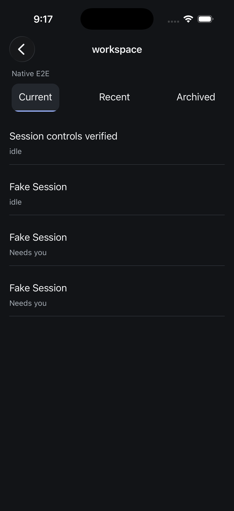
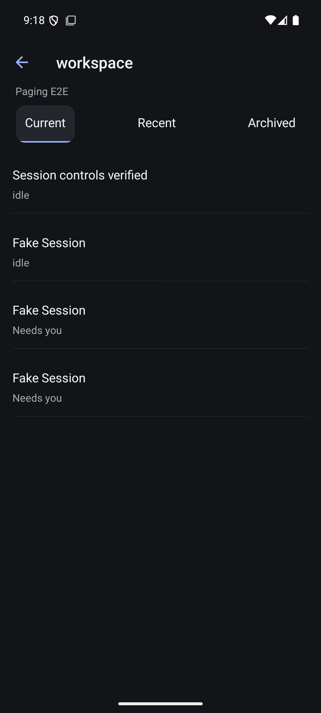
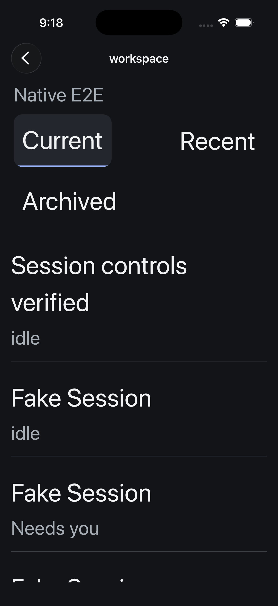
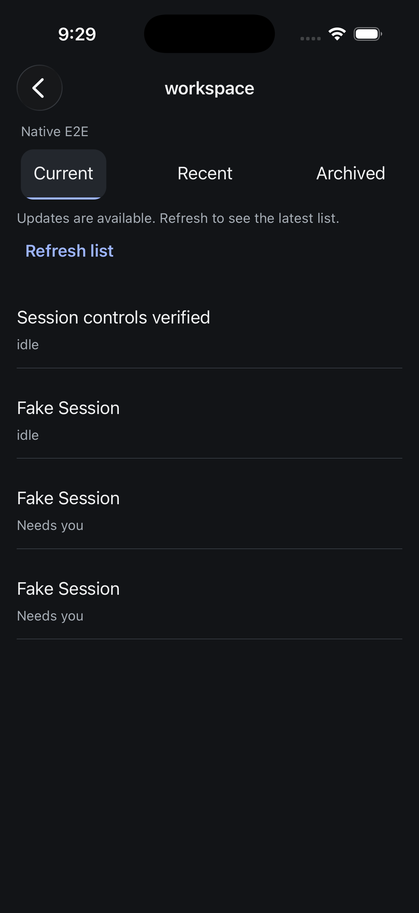
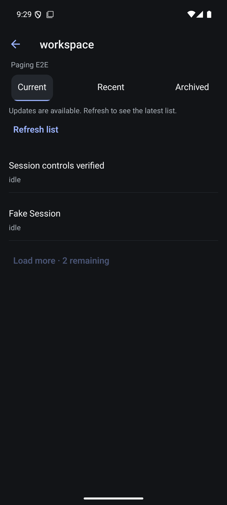
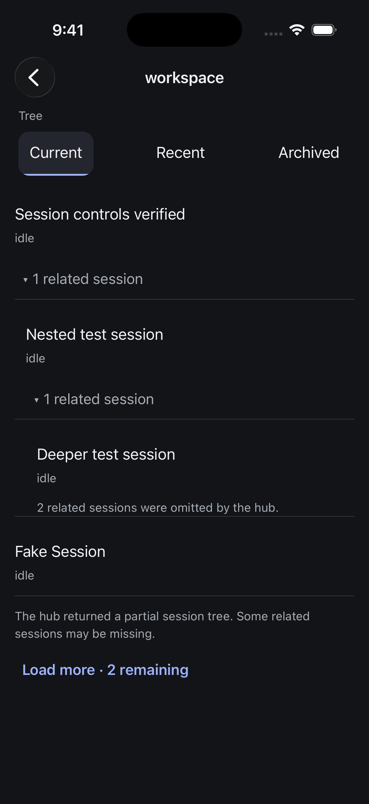
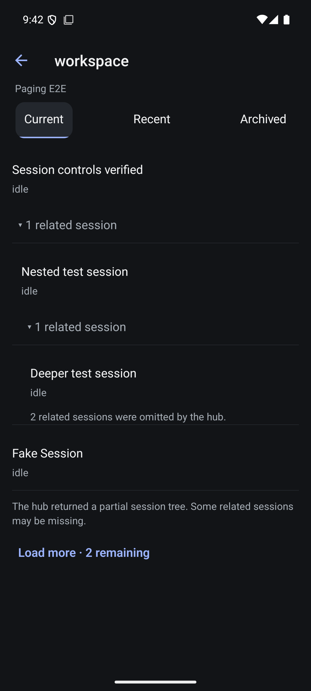

# Native project browsing

Verified 5 September 2026. Sessions → Browse projects opens a paged project catalog. A project opens Current, Recent and Archived session tiers. The separate archived-project catalog is accessible too. All routes carry the selected hub identity and use server project keys and session refs.

This uses evener/navigation/read catalog and project_page resources. It does not add aggregate thread/list cursors. The existing navigation service supplies offsets, remaining counts and a revision shared by pages of each logical resource. The client advances by raw response length, deduplicates visible identities, serializes continuation, rejects changed generations/revisions and ignores cancelled requests. Returning from a session preserves loaded pages; pull-to-refresh explicitly replaces them. Selected tabs expose accessibility selection and remain readable at large text sizes.

## Evidence

- Native tests: 72 across 14 files, TypeScript and targeted Biome pass. Both iOS and Android Release builds succeeded and were installed. Shared code was not changed in this increment.
- Network-boundary tests cover raw offsets despite duplicates, duplicate Load more dispatch, revision mismatch and refresh recovery, cancelled completion, and malformed empty pages with positive remaining counts.
- The real isolated hub returned one project with four current sessions. Four wire reads with limit one returned offsets 0–3, remaining 3–0, and project revision 59 throughout.
- iOS manually opened the project and a conversation, returned to the project, and exercised empty Recent/Archived session tiers and the empty archived-project catalog. Live accessibility-large font changes produced readable rows and wrapping tabs; normal text size was restored.
- Android opened the same real project and conversation. A temporary WebSocket proxy reduced only navigation request limits to two, forwarding actual hub responses unchanged. The native Load more action issued offset 2 and displayed all four unique sessions. Returning from the conversation retained the list. Pull-to-refresh then issued offset 0, confirming the reviewed refresh correction through the real network path.
- Review found the explicit refresh incorrectly shared the initial-load guard; the final code permits connected pull-to-refresh after a successful load.

## Open acceptance

This is not full navigation completion. Pins, favorites/archive mutations, project-route restoration after process death remain open. Multi-page catalog and archived nonempty datasets, native revision-conflict recovery, screen readers and physical devices still need dedicated acceptance. The top-level thread/list roster retains its documented cap; project paging is the available path to older sessions. No full repository merge gate or release-readiness claim is made.

## Live invalidation increment

Project catalogs and session lists now subscribe to evener/navigation/invalidated. Matching revised targets, generation changes and notification sequence gaps mark the displayed snapshot stale without replacing its rows. A quiet update prompt offers Refresh; Load more is disabled until recovery. Reads racing an invalidation must meet the new revision, and unknown invalidations during a read require a new read. An explicit reset can establish a restarted hub generation when no newer event raced the request, clearing the old generation's revision requirements.

Native tests increased to 78 and TypeScript passes. Both Release builds passed and were installed. Deterministic tests cover unrelated targets, stale rows, subscription cleanup, old versus already-current in-flight reads, notification gaps, and hub-generation recovery. Review reproduced an old-generation refresh deadlock; the added regression failed before the correction and passes afterward.

Both simulators observed a real rename of the owned isolated-hub session to Navigation update verified, retained the old row with an update prompt, and displayed the new name after Refresh. Restoring Session controls verified repeated that flow successfully. Android also showed Load more disabled while stale. Final layout changes inset the quiet prompt to align with the screen. These checks do not establish native hub-restart or dropped-event recovery; those cases currently have network-boundary tests. The main flat roster still refreshes on focus rather than consuming navigation invalidation.

## Related-session disclosure

Project sessions now disclose nested destinations in one virtualized list. Opening a session and expanding its related sessions are separate actions. Expansion survives ordinary return from a conversation and resets when the list owner changes. Canonical refs suppress duplicate destinations and repeated ancestor references. Indentation is capped to protect readable width. Per-row omitted counts and a page-level partial-tree notice expose server truncation; the latter accumulates across continuation and resets on refresh.

Native tests: 81 across 15 files, TypeScript and targeted Biome pass. Both final Release builds succeeded and were installed. New behavioral tests cover collapsed/expanded ordering, duplicate/cyclic refs and truncation across paging/refresh. Independent review found no actionable findings.

Both simulators expanded two levels, opened the deepest destination and returned with disclosures intact. The fixture proxy added a synthetic hierarchy and omitted counts to real isolated-hub navigation responses; opening used real owned session refs. This proves native handling of that projection, not daemon-created subagent hierarchy. Final screenshots include the singular-count correction. Screen readers, very deep trees and real subagent lifecycle remain open acceptance.

