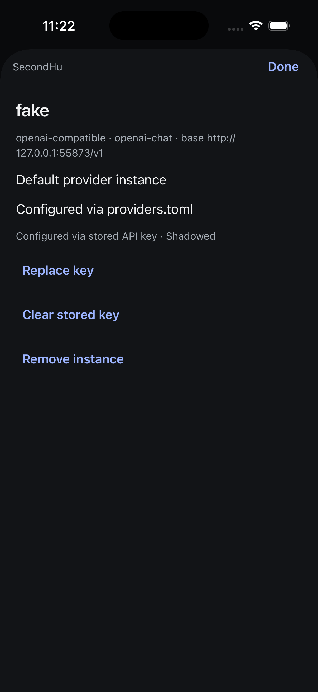
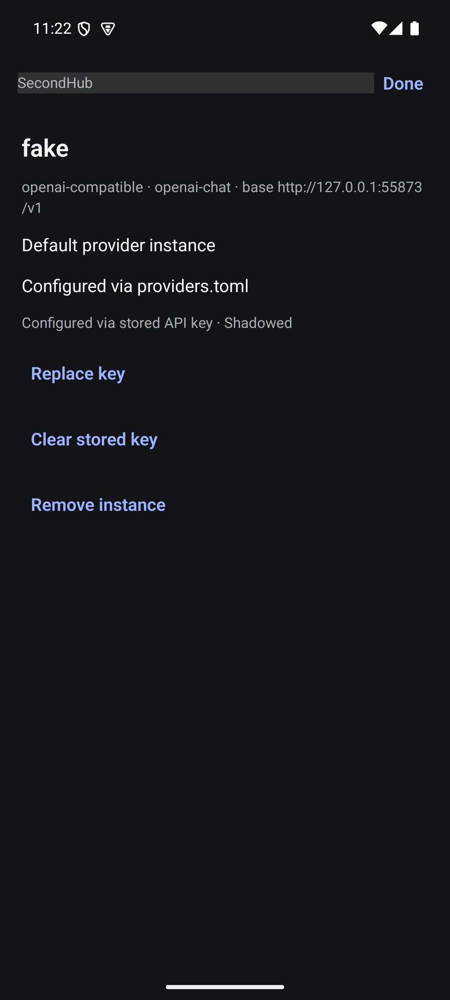
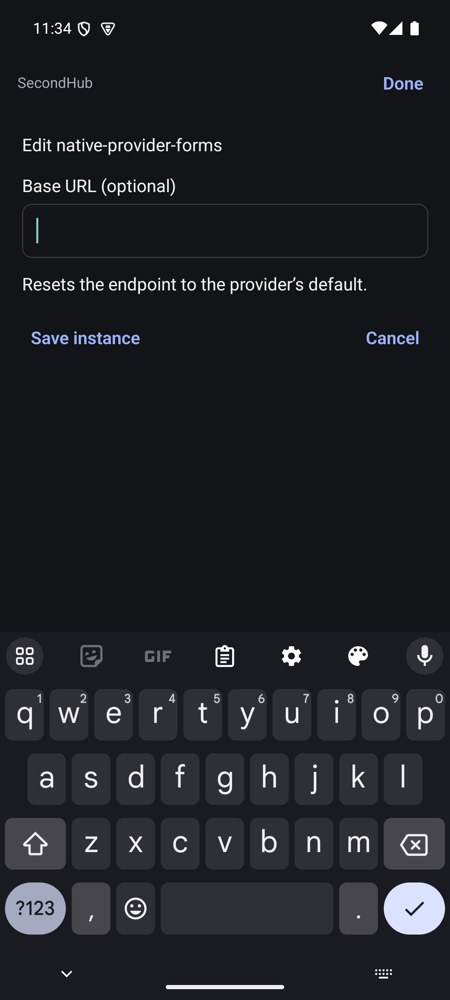

# Native providers: first workflow evidence

6 September 2026. Controller baseline `5f4a14661`; screen implementation committed
with this evidence. This is partial MOB-012 acceptance, not completed provider parity.

## Implemented

Sessions → Providers opens a hub-scoped, grouped provider list. A row opens an
iOS page sheet or Android full-screen modal with current credential source and
shadowed layers. Native actions expose set/replace key, make default, clear active
credentials, clear a shadowed stored key and remove explicit instances according
to the current web rules. Configuration writes respect `writesRefused`.

Disconnect unmounts the connected screen; its controller stops publishing and
unsubscribes. Submitted keys are cleared from the field and never stored in the
controller snapshot. Editor errors use fixed text because upstream errors can
echo sensitive input. Editor completion is fenced when a sheet closes or another
instance opens. Destructive confirmations identify the instance and selected hub.

## Manual native execution

Release builds installed and launched on iPhone 17 Pro / iOS 26.5 and Pixel 7 /
Android API 35. Both connected to the owned isolated second hub on proxy port
9200; iOS profile SecondHu and Android profile SecondHub. Production was not used.

1. Opened Providers from Sessions on both platforms; real `ollama` and `fake`
   instances appeared, with `fake` marked default.
2. Opened `fake` on iOS, entered a dummy fixture key into the secure field, and
   saved. Detail changed to Replace key and showed a stored key shadowed by the
   configured provider-file credential. The underlying active credential stayed
   provider-file based.
3. Opened the same detail on Android and observed the shadowed key state.
4. Cleared the stored key from Android through the native confirmation naming
   `fake on SecondHub`. The already-open iOS sheet updated to Set key and removed
   the shadowed layer without a manual refresh. This verifies the real auth
   notification/read path in that direction. Fixture key was removed.
5. Captured and visually inspected both detail screens at ordinary text size.

## Limits and remaining work

Screenshots record the intermediate shadowed-key state before cleanup. This
checks a dummy credential's storage lifecycle, not successful provider API auth.
Default selection, instance removal and active credential clearing are wired but
have not yet received native mutation E2E. Create/edit forms, credential testing,
OAuth/device sign-in remain absent. Complete large-text/keyboard/screen-reader,
failed/uncertain mutations, two-hub switching and late editor results acceptance.
The list still exposes raw diagnostic text; visual hierarchy, destructive-action
styling and navigation placement need refinement before beauty acceptance.

Automated controller coverage exercises cross-hub disposal, auth invalidation,
read failure retention, provider write refusal, mutation exclusion, no replay and
read/mutation races. These tests do not establish rendered UI behavior.

## Instance creation and endpoint editing

The native create form now uses the server provider catalog with a collapsible
searchable chooser. It collects name, optional endpoint, provider-specific
variables, optional API-key environment variable and credential header. Header
validation matches the web's variable-reference requirement. Editing changes only
the endpoint; clearing an existing endpoint sends `clearBaseUrl`, with an explicit
reset explanation. Four automated tests cover these request/validation decisions.

Manual execution on the same isolated second hub:

- iOS: searched for Ollama, selected it, created `native-provider-forms` with
  `http://127.0.0.1:11434/v1`, and opened its returned detail. Return dismissed the
  keyboard before Save. This is successful native creation, not keyboard-open
  save acceptance or a test of the provider's inference API.
- Android: opened that instance, changed its endpoint to
  `http://127.0.0.1:11435/v1` and saved. The existing iOS detail updated live.
- Android: emptied the endpoint, observed the reset explanation and saved with
  the software keyboard open. iOS updated to `http://localhost:11434/v1`, the
  server-returned default endpoint.
- Android: removed the fixture using the confirmation naming instance and hub.
  The iOS detail closed and the provider list returned to its original two rows.
  The fixture was removed; the original default instance was untouched.

Both final Release builds succeeded; the native suite has 239 passing tests and
TypeScript/touched-file Biome pass. Android creation and iOS editing, invalid form
native checks, large text and screen readers still need acceptance. Credential
testing and sign-in remain absent.

### Open keyboard finding

The first iOS create-form run could not reach Save above the keyboard with the
existing keyboard-avoiding wrapper. The sheet now uses ScrollView native keyboard
insets and interactive dismissal. Subsequent automated swipes did not conclusively
establish bottom-action reachability with the keyboard open; a targeted gesture
and geometry check is still required. Do not count successful saving after Return
as proof this finding is fixed. Keep this under MOB-012/MOB-010 until verified.
