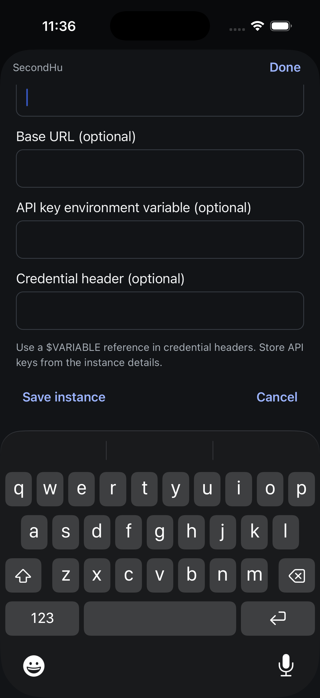
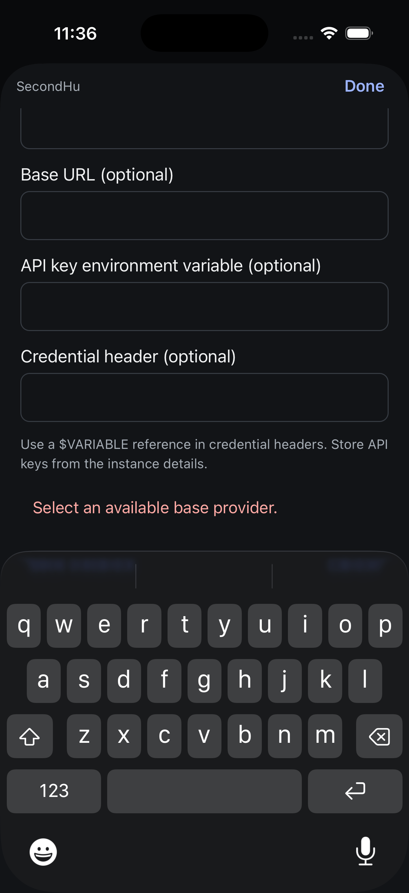
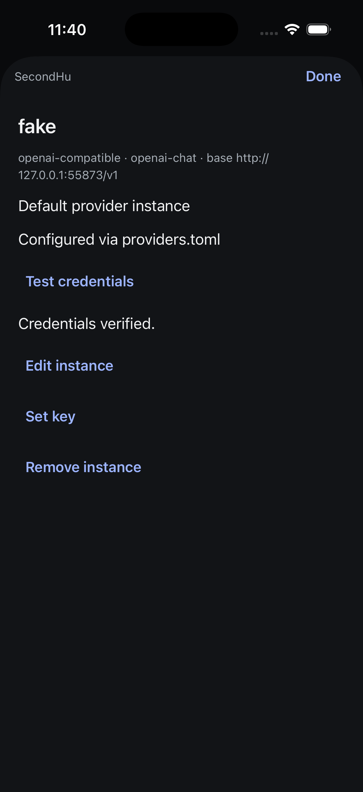
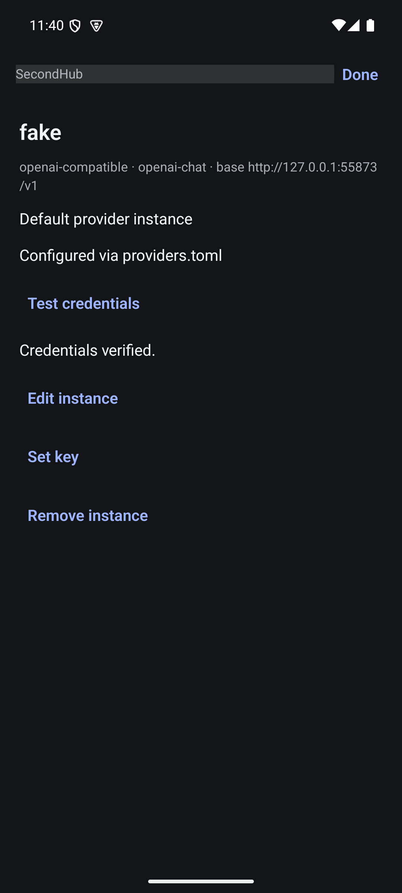
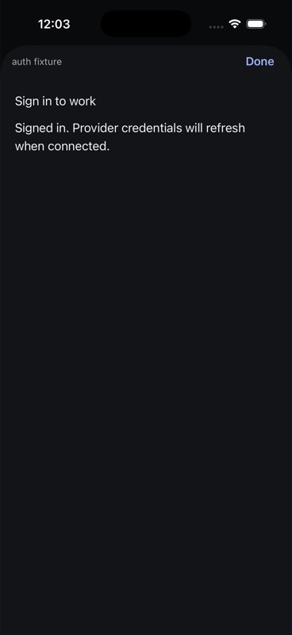
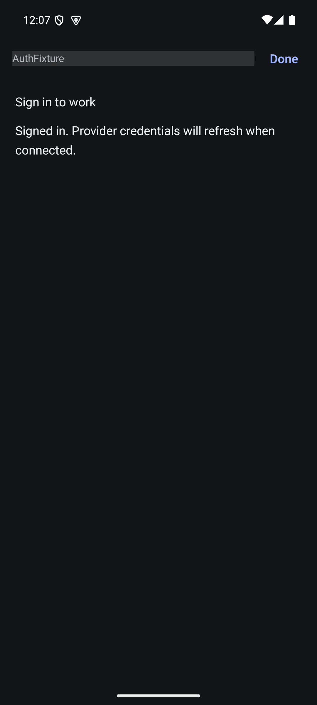
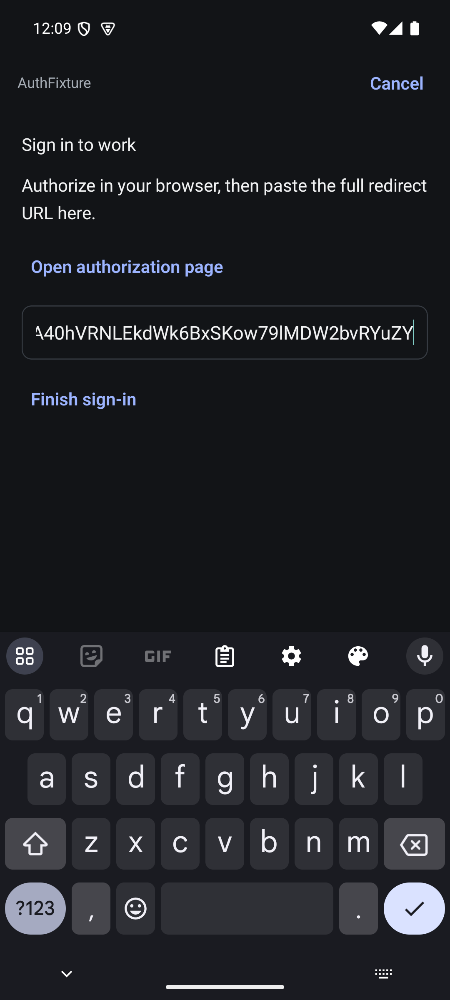
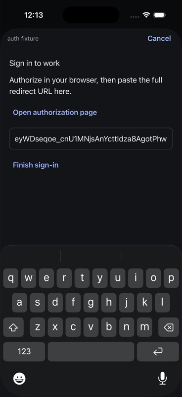
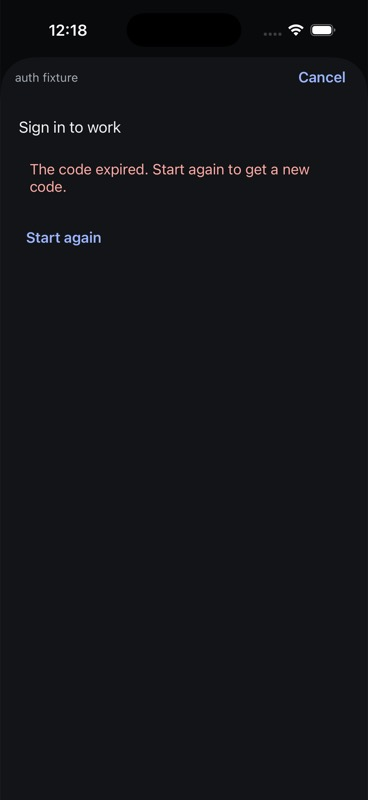
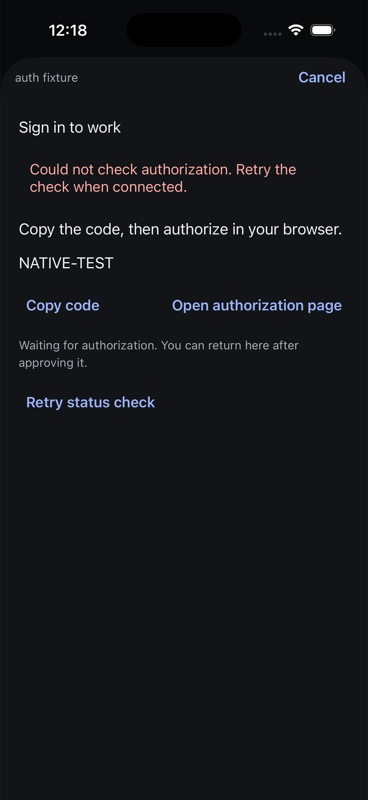

# Native providers: first workflow evidence

6 September 2026. Controller baseline `5f4a14661`; screen implementation committed
with this evidence. This is partial MOB-012 acceptance, not completed provider parity.

## Implemented

Sessions → Providers opens a hub-scoped, grouped provider list. A row opens an
iOS page sheet or Android full-screen modal with current credential source and
shadowed layers. Native actions expose set/replace key, make default, clear active
credentials, clear a shadowed stored key and remove explicit instances according
to the current web rules. Configuration writes respect `writesRefused`.

Disconnect unmounts the connected screen; its controller stops publishing and
unsubscribes. Submitted keys are cleared from the field and never stored in the
controller snapshot. Editor errors use fixed text because upstream errors can
echo sensitive input. Editor completion is fenced when a sheet closes or another
instance opens. Destructive confirmations identify the instance and selected hub.

## Manual native execution

Release builds installed and launched on iPhone 17 Pro / iOS 26.5 and Pixel 7 /
Android API 35. Both connected to the owned isolated second hub on proxy port
9200; iOS profile SecondHu and Android profile SecondHub. Production was not used.

1. Opened Providers from Sessions on both platforms; real `ollama` and `fake`
   instances appeared, with `fake` marked default.
2. Opened `fake` on iOS, entered a dummy fixture key into the secure field, and
   saved. Detail changed to Replace key and showed a stored key shadowed by the
   configured provider-file credential. The underlying active credential stayed
   provider-file based.
3. Opened the same detail on Android and observed the shadowed key state.
4. Cleared the stored key from Android through the native confirmation naming
   `fake on SecondHub`. The already-open iOS sheet updated to Set key and removed
   the shadowed layer without a manual refresh. This verifies the real auth
   notification/read path in that direction. Fixture key was removed.
5. Captured and visually inspected both detail screens at ordinary text size.

## Limits and remaining work

Screenshots record the intermediate shadowed-key state before cleanup. This
checks a dummy credential's storage lifecycle, not successful provider API auth.
Default selection, instance removal and active credential clearing are wired but
have not yet received native mutation E2E. Create/edit forms, credential testing,
OAuth/device sign-in remain absent. Complete large-text/keyboard/screen-reader,
failed/uncertain mutations, two-hub switching and late editor results acceptance.
The list still exposes raw diagnostic text; visual hierarchy, destructive-action
styling and navigation placement need refinement before beauty acceptance.

Automated controller coverage exercises cross-hub disposal, auth invalidation,
read failure retention, provider write refusal, mutation exclusion, no replay and
read/mutation races. These tests do not establish rendered UI behavior.

## Instance creation and endpoint editing

The native create form now uses the server provider catalog with a collapsible
searchable chooser. It collects name, optional endpoint, provider-specific
variables, optional API-key environment variable and credential header. Header
validation matches the web's variable-reference requirement. Editing changes only
the endpoint; clearing an existing endpoint sends `clearBaseUrl`, with an explicit
reset explanation. Four automated tests cover these request/validation decisions.

Manual execution on the same isolated second hub:

- iOS: searched for Ollama, selected it, created `native-provider-forms` with
  `http://127.0.0.1:11434/v1`, and opened its returned detail. Return dismissed the
  keyboard before Save. This is successful native creation, not keyboard-open
  save acceptance or a test of the provider's inference API.
- Android: opened that instance, changed its endpoint to
  `http://127.0.0.1:11435/v1` and saved. The existing iOS detail updated live.
- Android: emptied the endpoint, observed the reset explanation and saved with
  the software keyboard open. iOS updated to `http://localhost:11434/v1`, the
  server-returned default endpoint.
- Android: removed the fixture using the confirmation naming instance and hub.
  The iOS detail closed and the provider list returned to its original two rows.
  The fixture was removed; the original default instance was untouched.

Both final Release builds succeeded; the native suite has 239 passing tests and
TypeScript/touched-file Biome pass. Android creation and iOS editing, invalid form
native checks, large text and screen readers still need acceptance. Credential
testing and sign-in remain absent.

### Open keyboard finding

The first iOS create-form run could not reach Save above the keyboard with the
existing keyboard-avoiding wrapper. The sheet now uses ScrollView native keyboard
insets and interactive dismissal. Subsequent automated swipes did not conclusively
establish bottom-action reachability with the keyboard open; a targeted gesture
and geometry check is still required. Do not count successful saving after Return
as proof this finding is fixed. Keep this under MOB-012/MOB-010 until verified.

### Keyboard finding: ordinary-size reachability verified

At `b60407d31`, reproduced the creation sheet on iPhone 17 Pro with the actual
software keyboard visible. Three short upward strokes inside the unobscured form
(`withinElementRef` scroll region, distance 0.15) moved Save and Cancel fully above
the keyboard. The tool reported strokes from logical (201, 512) to (201, 434).
The previous 0.8–0.9 strokes extended into the keyboard-covered part of the scroll
region, so their failure did not establish that native scrolling was broken.

Tapped Save with the keyboard still open and obtained the local missing-provider
validation message. A further short stroke reached the actions after the error
expanded the form; Cancel closed it and returned to the provider list. No server
mutation was attempted. Both screenshots below were visually inspected. No code
change was needed for this verification.

This closes the ordinary-text bottom-action reachability observation for the
current build. It does not establish the earlier wrapper's behavior, large-text
acceptance, screen-reader navigation or successful creation with the keyboard open.

## Credential testing

The instance detail now exposes `evener/auth/test`. The controller publishes only
the shared web `safeCredentialTestResult` output, never raw provider messages or
transport errors. Refresh and mutation invalidate prior/pending results; duplicate
tests are disabled while pending. Rendering checks the result's instance name.

On the same isolated hub B, tapped Test credentials for `fake` on both iPhone 17
Pro and Pixel 7 Release builds. Both displayed “Credentials verified.” Screenshots
were captured and visually inspected. This is a real native-to-hub request against
a scripted local provider, not real-provider account authentication qualification.
No credential values or default configuration changed during this check.

Three additional tests cover sanitization, refresh invalidation of a late response
and transport failure without secret echo/retry. The full native suite passes 242
tests; TypeScript and touched-file Biome pass. Both Release builds succeeded.
Sign-in/device auth, error-state native E2E, large text and screen readers remain.

## Sign-in editor integration (manual acceptance pending)

Native provider details now expose sign-in for server-advertised OAuth instances.
The editor supports device code copy, browser opening, same-flow status retry,
expiry/restart, browser redirect paste/completion and authorized status. URLs are
opened only as HTTP(S); no redirect submission or authorization URL is persisted.

The editor is owned above the connected provider list. AppState pauses polling,
and the route rebinds the flow only to the same hub's replacement connection.
Changing hubs or closing the editor disposes it. Closing remounts the list so it
refreshes credential state, including after uncertain completion.

Validation: iOS Release build/run and Android Release build succeeded; 253 native
tests, TypeScript and touched-file Biome pass. These results do not establish
rendered sign-in, browser return, copy, successful device authorization or redirect
completion. Next acceptance uses a controlled local auth fixture for both flows,
background/reconnect, expiry/failure and cross-hub isolation. Real-provider account
acceptance remains separate. MOB-013 stays in progress.

## iOS device authorization browser round trip

On 6 September 2026, the iPhone 17 Pro Release app at native implementation
`9a75d0479` connected to the isolated real auth harness from `73bbe2570` using a
separate `auth fixture` hub profile. No production credentials were involved.

Opened `work` → Sign in. The sheet showed the server's `NATIVE-TEST` device code;
Copy code changed to Code copied. Open authorization page launched Safari and
backgrounded Evener. The native connection closed while the sheet retained its
device flow. Tapped the local page's Approve fixture sign-in button, observed
“Approved. Return to Evener.”, then used Safari's return-to-Evener control.

After reconnect, the same sheet displayed Signed in. Independently reading the
fixture's `/status` returned `signedIn: true`, `activeSource: oauth`. Tapping Done
returned to the provider list with Configured via OAuth. Reopening the detail
showed Refresh sign-in and Clear credentials. Clear credentials → Confirm changed
the detail to Not configured and restored Sign in; `/status` then returned
`signedIn: false`, `activeSource: none`. The fixture was left signed out.

The authorized screenshot was captured and visually inspected. This verifies the
iOS device flow, browser return/reconnect, displayed copy feedback, provider refresh
and credential clearing against real hub handlers with a scripted OAuth boundary.
It does not verify clipboard contents by paste, real-provider authorization,
Android sign-in, browser redirect fallback, expiry/denial, or hub-switch isolation.

Visual acceptance remains open: the success-only sheet occupies nearly the entire
screen for two short lines, and signed-out provider details expose a CLI login
instruction despite having a native Sign in action. Track these under MOB-013;
retain server diagnostic detail in a deliberate disclosure rather than using it
as the primary mobile instruction.

## Android device authorization browser round trip

On 6 September 2026, installed the current Release APK (built after `9a75d0479`)
on Pixel 7 API 35 and created a separate AuthFixture profile for the same isolated
real auth harness. Opened work → Sign in; the returned NATIVE-TEST code rendered
with Copy code and Open authorization page. Tapping Copy code showed Code copied
(captured and visually inspected; clipboard contents were not pasted).

Open authorization page launched Chrome. Completed the emulator's Chrome first-run
setup without an account and declined notifications. The local authorization page
rendered; tapped Approve fixture sign-in, then used Android Back twice to return
to Evener. The sheet displayed Signed in, independently confirmed by `/status`
reporting `signedIn: true`, `activeSource: oauth`. Done returned to the refreshed
provider list; work opened with Configured via OAuth and Refresh sign-in.
Clear credentials → Confirm returned the detail to Not configured and Sign in,
while `/status` reported `signedIn: false`, `activeSource: none`.

The screenshot below was captured and visually inspected. This proves the Android
device-flow browser round trip across a prolonged first-run interruption and
credential clearing with the scripted OAuth boundary. It does not qualify real
provider accounts, redirect fallback, expiry/denial or cross-hub flow isolation.
UIAutomator could not reach idle while device polling ran at the fixture's one-second
interval; fresh screenshots supplied targets during that phase. Observation failure
did not cause a flow restart. The fixture is left signed out in device mode.

## Browser redirect fallback on both platforms

On 6 September 2026, switched the isolated auth harness to browser mode before
each native sign-in. Both apps displayed the fallback instructions, Open
authorization page, an empty Redirect URL field and disabled Finish sign-in.
The returned page opened in Chrome on Pixel 7 API 35 and Safari on iPhone 17 Pro.

On Android, selected all of the fixture page's redirect text and copied it with
native keyboard shortcuts. Returned using Back, focused Redirect URL and pasted
with the native paste shortcut. The field contained the full matching redirect
and Finish sign-in became enabled. Tapped Finish with the real software keyboard
open; the editor displayed Signed in and `/status` independently reported
`signedIn: true`, `activeSource: oauth`. Cleared credentials through iOS before
starting its separate flow; this also verified cross-client auth notification.

On iOS, used the Safari textarea's native Select All and Copy menu items, returned
with the system Evener link, then used the native Paste menu in Redirect URL.
The full redirect matched the page's state value. Before submission `/status` was
`signedIn: false`, `activeSource: none`; after tapping Finish with the software
keyboard open the editor showed Signed in and status became true/oauth. Done
returned to Configured via OAuth. Cleared fixture credentials through the native
confirmation dialog and restored device mode; final status was false/none.

The keyboard-open screenshots below were captured and visually inspected. Both
platforms kept Finish sign-in reachable without dismissing the keyboard. These
are current Release builds from the sign-in implementation at `9a75d0479`, using
real registered hub handlers and temporary storage with scripted OAuth exchange.
The copy/paste checks here cover the browser redirect, not the device-code Copy
button. Real provider accounts, native expiry/denial/retry, cross-hub flow isolation,
screen readers and visual acceptance remain open. No production hub was mutated.

## iOS expiry and explicit poll recovery

The fixture now advances its injected clock through the real hub expiry check
and can fail the scripted external OAuth poll boundary. The expanded wire smoke
first failed against the old fixture's missing expiry control, then passed against
the implementation: expired flow rejection, failed poll with no stored credentials,
and authorization after recovery using the same flow ID. Targeted Go auth tests
and default harness skip pass; native TypeScript and script Biome pass.

On iPhone 17 Pro Release, started device sign-in and tapped Copy code. Advancing
the fixture clock removed the code and rendered The code expired with Start again.
Tapping Start again returned to a device code with Copy code (not Code copied).
Enabled the fixture poll failure; the UI retained the code, displayed a fixed safe
error and exposed Retry status check. Cleared the fault and approved the fixture
through its control endpoint: server status remained false/none before retry.
Tapping Retry status check completed sign-in; UI showed Signed in and independent
server status became true/oauth. This recovery check used fixture control endpoints,
not another browser round trip. The fixture is currently signed in in device mode.

Both screenshots below were captured and visually inspected. Android recovery,
real provider denial, interrupted completion and cross-hub flow isolation remain
open. No app implementation change was required by these observations.

