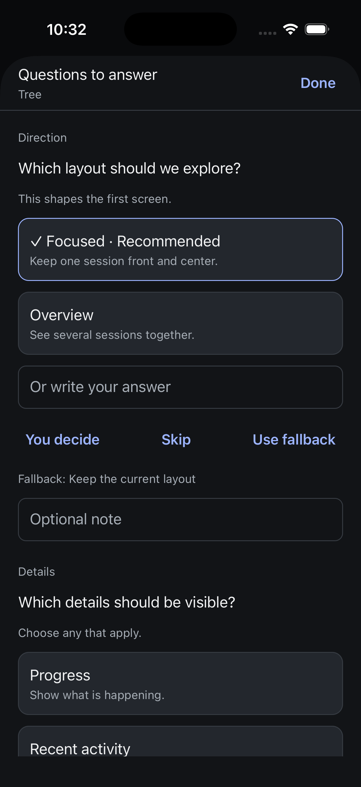
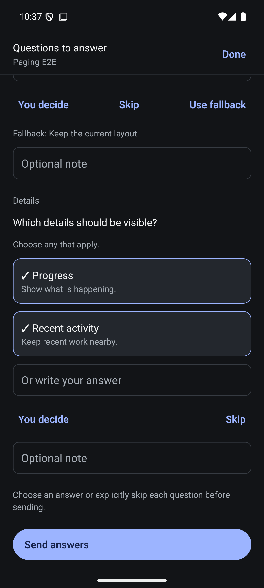

# Native structured questions

Verified 5 September 2026. Pending questions open from a compact composer entry into an iOS page sheet or Android full-screen modal. Each question supports advertised single or multiple selections, a written alternative, notes, You decide with optional leaning, explicit Skip and the advertised fallback. Recommendations are labels, never preselected answers. Every question requires an explicit valid resolution before Send answers enables. Dismissal preserves choices while the same question sheet remains mounted; updated question definitions reset them.

The native UI reuses shared composeAskAnswers and turn/start. Dispatch checks the current question definitions, session generation/instance, focus, readiness and send capability. Structured replies use the durable draft delivery checkpoint without consuming the ordinary message draft. Confirmed acceptance clears uncertainty before the subsequent refresh. An accepted batch cannot be sent again while its old projection remains visible.

## Evidence

- Native TypeScript, targeted Biome and 98 tests across 18 files pass. New tests first failed for missing implementation and cover explicit answers, invalid/removed choices, multiple-selection rules, fallback availability, exact machine answer format, preserving the ordinary draft and durable uncertain delivery without replay.
- Independent review found acceptance waiting on rehydration; the callback now acknowledges before the guarded read. The follow-up review confirmed that finding closed.
- Both final Release builds installed. iOS sent a written answer and explicit skip; Android sent a single choice plus two selections. The controlled proxy recorded the exact answer payloads forwarded through the real isolated hub. The sheets cleared and the owned runtime was stopped after each check.
- iOS retained the separate Message draft, Question controls preserve this draft, after accepted answer delivery. Android had an empty ordinary draft. iOS selection/dismiss/reopen retained a choice; radio and checkbox accessibility states exposed checked/unchecked values. These interaction checks precede only the acceptance-before-refresh correction; successful send checks used final sources.
- A temporary proxy variable collision crashed before forwarding an earlier attempt. The native app retained an uncertain reply across rebuilding/relaunch instead of retrying. After confirming the proxy failure occurred before forwarding, the test checkpoint was explicitly dismissed and successful checks repeated.
- Screenshots inspected on both simulators. The iOS image precedes only the delivery-order correction; Android uses final sources.

## Boundaries and remaining work

The fixture injected a completed ask_user item into a real thread snapshot. Answer submission, receipt handling and subsequent thread updates used the actual isolated hub; this does not prove an actual harness ask_user pause/resume. Synthetic questions were removed and the all-interface ordinary navigation proxy restored. Production was untouched.

Unfinished selections currently survive sheet dismissal but not app termination, binding recreation or a changed question definition. Persisting those selections with exact question ownership remains required. Larger text, VoiceOver/TalkBack traversal, background/reconnect races, deliberate acknowledgement-loss native injection and physical-device acceptance remain open. This is not complete question-workflow acceptance or full release verification.
