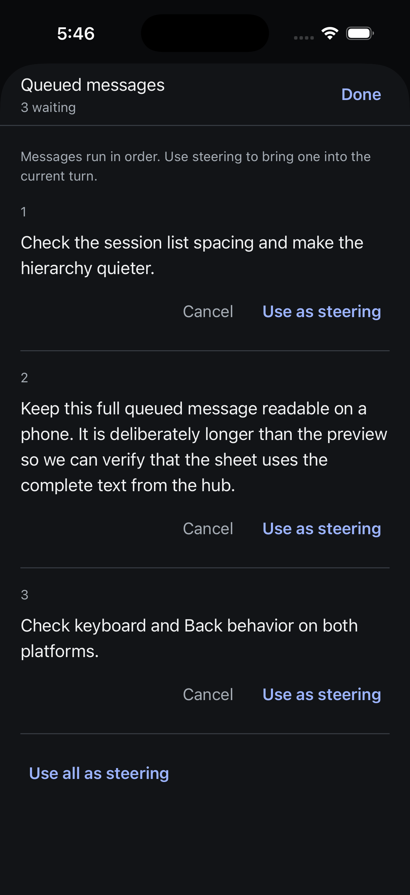
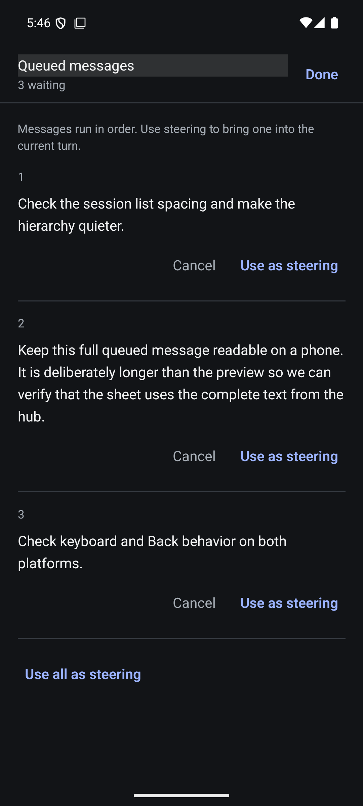

# Native queue management

The composer queue count opens an iOS page sheet or Android full-screen modal. Entries use full text when supplied, explicitly identify previews otherwise, and keep action targets tied to the displayed entry ID/index and session instance. Bulk steering carries the displayed queue revision. The composer draft is not included or cleared by these actions.

Cancel is available for identifiable entries; steering actions appear when the session advertises steering. Idle-session run-now controls are not exposed in this slice. The wire queue does not supply image counts or attachment metadata; this surface does not invent them.

## Verification on 2026-09-05

Shared mobile: 2,233 tests across 90 files passed, plus TypeScript and Biome across 234 source files. Native: 54 tests across 11 files and TypeScript passed. The new service tests first failed on missing projected identity, stale-instance dispatch, and missing steering methods. The WebSocket fixture test first failed on queue capability, then passed through the real native client/shared service with cancellation, promotion, draining, and stale entry/revision rejections that preserve remaining messages.

Both native Release builds succeeded. On iPhone 17 Pro/iOS 26.5 and Pixel 7/API 35, the scripted Playground fixture showed all three messages, including the full long message beyond its 80-character preview. Cancellation, individual steering, and bulk steering changed the displayed queue on both platforms. The other simulator updated from the fixture's notification. Empty queues remained inspectable until dismissal. iOS Done returned to the same conversation; Android system Back dismissed the modal and retained the conversation.

These are scripted WebSocket fixture checks, not proof that a real Evener provider consumed steering. Queue conflicts were tested at the protocol boundary, not manually injected into the native UI. Reconnect/withheld-ack queue checks, real isolated-daemon steering, large text, screen-reader traversal, and physical-device validation remain outstanding. Errors are never automatically retried. The sheet reports unconfirmed outcomes and requires an explicit refresh before another action; this slice does not add a durable queue-mutation journal.

The demonstration fixture listens on 0.0.0.0:9196. The production hub was not changed or used for mutations. Independent source review reported no actionable findings; manual acceptance is limited to the evidence above.
