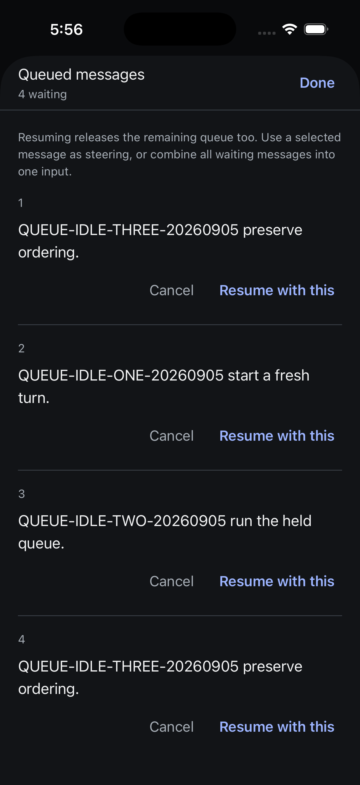
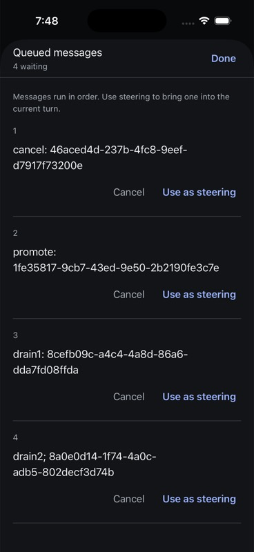
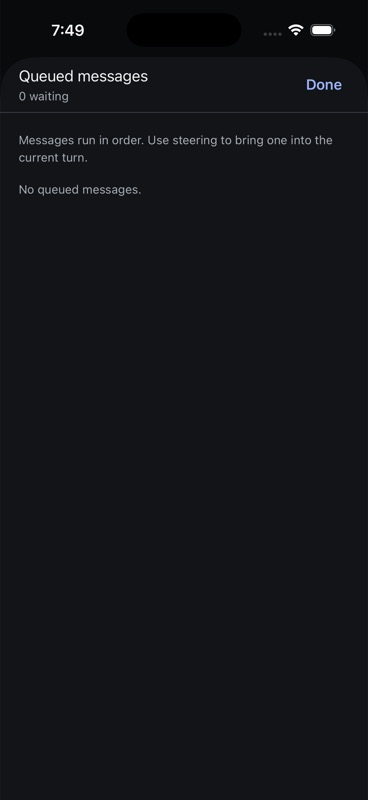
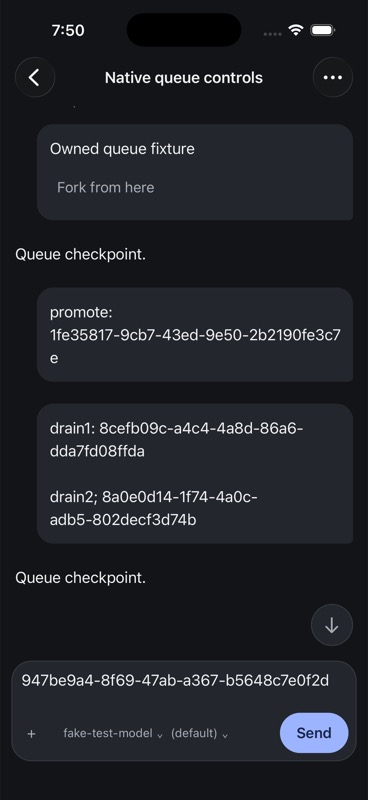

# Native queue management

The composer queue count opens an iOS page sheet or Android full-screen modal. Entries use full text when supplied, explicitly identify previews otherwise, and keep action targets tied to the displayed entry ID/index and session instance. Bulk steering carries the displayed queue revision. The composer draft is not included or cleared by these actions.

Cancel is available for identifiable entries; steering actions appear when the session advertises steering. Idle-session run-now controls are not exposed in this slice. The wire queue does not supply image counts or attachment metadata; this surface does not invent them.

## Verification on 2026-09-05

Shared mobile: 2,233 tests across 90 files passed, plus TypeScript and Biome across 234 source files. Native: 54 tests across 11 files and TypeScript passed. The new service tests first failed on missing projected identity, stale-instance dispatch, and missing steering methods. The WebSocket fixture test first failed on queue capability, then passed through the real native client/shared service with cancellation, promotion, draining, and stale entry/revision rejections that preserve remaining messages.

Both native Release builds succeeded. On iPhone 17 Pro/iOS 26.5 and Pixel 7/API 35, the scripted Playground fixture showed all three messages, including the full long message beyond its 80-character preview. Cancellation, individual steering, and bulk steering changed the displayed queue on both platforms. The other simulator updated from the fixture's notification. Empty queues remained inspectable until dismissal. iOS Done returned to the same conversation; Android system Back dismissed the modal and retained the conversation.

These are scripted WebSocket fixture checks, not proof that a real Evener provider consumed steering. Queue conflicts were tested at the protocol boundary, not manually injected into the native UI. Reconnect/withheld-ack queue checks, real isolated-daemon steering, large text, screen-reader traversal, and physical-device validation remain outstanding. Errors are never automatically retried. The sheet reports unconfirmed outcomes and requires an explicit refresh before another action; this slice does not add a durable queue-mutation journal.

The demonstration fixture listens on 0.0.0.0:9196. The production hub was not changed or used for mutations. Independent source review reported no actionable findings; manual acceptance is limited to the evidence above.

## Real isolated-daemon acceptance and idle recovery

At 17:51–17:57 Pacific, created a fresh session `local:034Jpw6Pu89wMXd5BusUvs` (Queue E2E) on the isolated hub at 56491. The real daemon and its durable mutation/queue machinery ran; only the external model provider was scripted (`fakellm`, 55873, two-minute held rounds). Authentication used the existing isolated hub credential without copying it into evidence.

Android cancelled the first queued message and promoted the next while the turn was active. iOS then drained the two remaining messages. Both native views reached an empty queue. At 17:53:07, the provider's next request contained `QUEUE-PROMOTE-20260905`, `QUEUE-DRAIN-A-20260905`, and `QUEUE-DRAIN-B-20260905` once each; it contained no `QUEUE-CANCEL-20260905`. This proves delivery to the model request, beyond an acknowledged mutation or displayed count. It does not establish model compliance with the prose.

The same session was populated with a held queue and interrupted. Its authoritative state was idle, send=true, steer=false, queue=false. The earlier native surface hid resume actions in this state. Shared service guards now allow running queued input when either send or steer is available, while retaining instance/entry/revision protections. A new test first failed on the steer-only gate and passed after this change.

On iOS, promoting an entry from idle resumed the turn. The server also released the remaining queue: its next request included the next queued message plus the selected steering message. This is intentional server behavior (`QueueHeld = false` in both promotion and drain paths), so the UI says **Resume with this** and explicitly explains that the remaining queue resumes too. It does not promise to run only that entry. On Android, **Run all together** from idle emptied the four waiting entries and started a turn; the provider request contained their combined input in queue order.

Final verification: shared 2,234 tests / 90 files, shared TypeScript/Biome, native 54 tests / 11 files, native TypeScript, and both Release builds passed. Both installed apps were rebuilt with the final idle-state wording. The final iOS sheet was visually inspected, and Android accessibility state showed the matching labels before bulk resume.

The earlier real-daemon delivery and idle run-now limitations above are now resolved for this isolated scenario. Queue-specific withheld acknowledgements, reconnect, native stale-view conflicts, durable mutation recovery, accessibility traversal and physical-device checks remain outstanding. The existing production hub and older test-session drafts/queues were not modified.

## Direct v4 iOS and packaged SDK qualification — 7 September

This checkpoint uses iOS-only v1 scope. Historical Android and earlier protocol
checks above remain separate. The Release app was rebuilt from
`8fb3e343cb0eeb766146ee9cf31396da0af8a54f` on iPhone 17 Pro/iOS 26.5.
Its JavaScript bundle SHA-256 is
`29430c6ded188b165c9cf1e1ba149eac604e8957d129a8b72db0ef0dd032bbfd`.
The independently installed SDK tarball SHA-256 is
`d23cfbaaad31c403a7fbe6ea1e2ef2eb35f18e5918a6bb484d194382a8ddd73d`.

Both clients connected directly to the owned authenticated v4 hub at
`ws://127.0.0.1:54211/rpc`. Its binary SHA-256 is
`606c8b19bbeb6139a1e1ecc1f2b70d70acd24634f286f940f5a365cd989cfbb7`.
Only the model boundary was scripted. The provider waited for explicit release
commands after each actual request; no proxy or timed response pacing was used.
[The receipt](assets/queue-v4-receipt.json) records exact bindings, artifacts,
provider observations, SDK mutation IDs, draft hashes and cleanup.

Native session `local:034Kjo1wmWpBXjjTfGlJ5z` began with three SDK-seeded entries.
The native /queue command added a fourth. With an ordinary unsent draft present,
one UI press each cancelled the first, promoted the next, and drained the two
remaining entries. Independent reads confirmed depth 3, then 2, then 0. The
provider's following request contained the promoted and both drained UUID
sentinels, and contained neither the cancelled sentinel nor the ordinary draft.
The completed transcript contains one steering entry for promotion and one
combined steering entry for drain. App stop/launch restored the ordinary draft,
and it remained unchanged after completion. Native wire request count was not
instrumented; this proves observed UI actions, authoritative state and provider
delivery, not an exact native RPC count.

SDK session `local:034Kju5wl4tNB8RY8hztnD` exercised four enqueues, cancellation,
promotion and drain through the installed recipe. The counted client discarded
the successful cancellation response before returning it to the recipe. The
recipe returned uncertain, read back the three remaining entries, and sent no
second cancellation. This simulates acknowledgment loss at the client boundary;
it is not a socket-disconnection test. Stale entry/revision attempts then sent
zero recipe mutations. Separate raw server requests with those stale
preconditions both returned conflict `-32013`. Fresh promotion/drain succeeded.
Seven recipe mutations were dispatched total; the two deliberately rejected
raw CAS requests are counted separately.

The provider's subsequent SDK request contained exactly the intended sentinel
set, and the completed transcript independently contained the same promoted/
drained steering entries. The SDK completion listener observed completion; the
native completed state was independently re-read. An initial read-only observer
incorrectly counted only `userMessage` items; correcting it to include the
actual `steering` type verified the already-completed native turn without
replaying any action. ACKs and recipe results remain execution-unverified;
the separate provider and transcript observations supply execution evidence.

Cleanup shut down both created sessions, removed the temporary provider
instance, verified the original registry exactly, and stopped the owned provider
process. Four pre-existing draft hashes and the new native ordinary draft were
verified unchanged, with no unconfirmed sends. The fixture driver and scripts/
receipts are tracked at `/var/folders/46/dz2z92w907j150sqxn8b8y1c0000gn/T/evener-native-queue-jv6vnntm`
(driver commit `ced4733`; proof commit `18fbba2`).

Remaining: current-build held/idle queue recovery, native stale-view conflicts
and uncertain acknowledgments, actual socket loss/reconnect during queue
mutation, multi-device concurrency, durable queue mutation recovery,
VoiceOver/large text/iPad/physical devices, and full release qualification.
