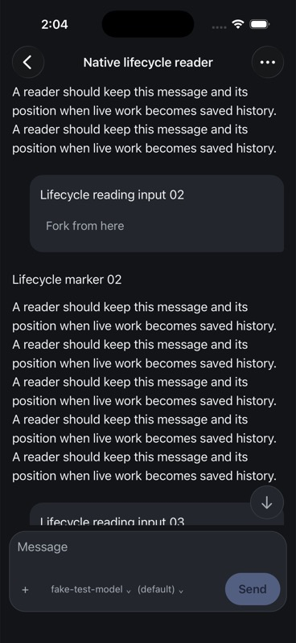
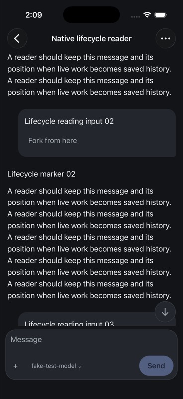
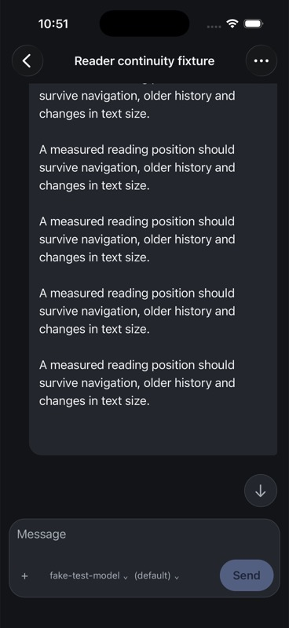
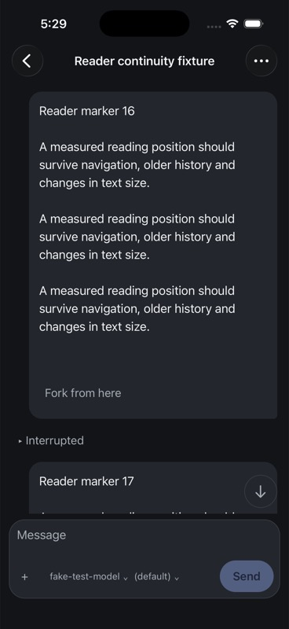
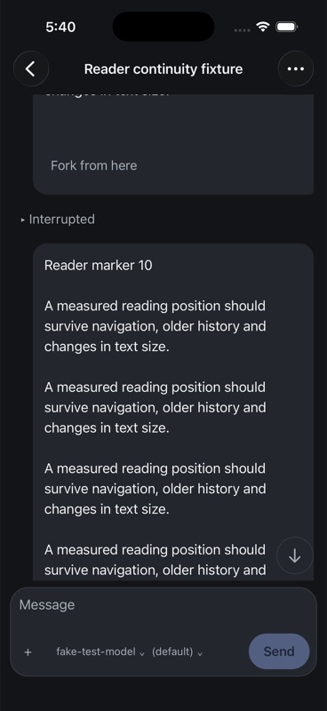
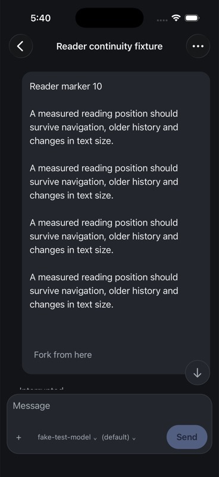

# iOS reader continuity evidence

## Native live-to-saved continuity, 7 September 2026

The environment identity fix at `5361555a6` now has an actual native journey.
A separate direct authenticated hub and local scripted provider created 24
completed turns. The iPhone 17 Pro/iOS 26.5 Release app connected through a new
owned profile, loaded older messages and retained the first assistant message
partway through its text, above input 02.

The anchor was `apptranscript-item-v1:turn_m1:2:1`, position `(2,1)`, offset
`143.33333333333331`. The independently installed SDK shut the session down and
waited for authoritative `notLoaded` status. All 49 environment/user/assistant
identities matched in live and persisted paged reads. The visible text stayed
in place. After process termination/relaunch, the app restored the same older
page and boundary; SQLite retained the exact anchor and touch time. Installing
the subsequent Release build with the question-recap change restored it again.

The [receipt](assets/reader-continuity/native-lifecycle-receipt-20260907.json)
records both identity vectors, status observations, anchors, source/binary
hashes, screenshots and cleanup. The initial bundle was
`3641870a5afc45389001c02227a8b3307ebc0e08e9026feb954fc27891ffa904`;
the final bundle is
`b8708d25356771c3409c8c8b6da09802a69fef91be608c9bf622e25c9a2ad9c9`.

An initial unsupported 200-item read was rejected. No creation or input was
replayed; qualification used the 40-item ceiling and an opaque older cursor.
Simulator HID injection dropped modifiers and targeted keyboard-covered fields.
Native paste with observed selection controls completed profile setup, and the
simulator clipboard was restored. Keyboard-open hub-form focus remains a
separate qualification item.

The owned native profile and provider instance were removed, the separate hub
and provider stopped, and the original v4 acceptance hub restored in the app.
Seven prior drafts and the unrelated Apple patch remain unchanged. This
qualifies this older-page live-to-saved/restart journey. Historical anchors,
ongoing streaming/image reflow, iPad, physical devices and the remaining release
matrix stay open.

## Environment identity across shutdown, 7 September 2026

The real Session regression reproduced the first-user identity changing from
`turn_m1:1:0` live to `turn_m1:2:0` in the saved transcript. The session wrote an
ENVIRONMENT turn before user input without emitting a corresponding live event.
The persisted projection therefore allocated an entry missing from the live
projection. A saved reader position could consequently identify the environment
entry instead of the original user message.

The session now assigns that environment turn an existing-format stable turn
ID, persists it, and emits a typed environment event. Its projector notification
contains one completed standalone environment turn without consuming or changing
the reserved/active user identity. Existing stable-ID persistence supplies the
same identity on file reads. No protocol fields or historical-data migration
were added, and transcript-write failures retain the existing session policy.

The real Session/scripted-provider regression now passes for both environment
and user identity and ordering. Projector tests cover reserved and active user
turns; the session test verifies unchanged context emits only once across two
inputs. Full agent, events, projector, transcript and server packages pass, as
do focused race checks, tagged event-fuzz coverage and the full `make lint` gate.
Luna medium reviewed the implementation proposal and event coverage; Bot read
the final source, reproduced failures and ran the actual checks.

An independently installed SDK then created an isolated real hub session with a
local scripted provider, completed two inputs, read its live items, shut it down
and read the persisted items. All five environment/user/assistant identities
match by turn ID, key and position; both mutation IDs remain attached to their
original user turns. The authoritative status progressed from `awaiting` to
`notLoaded`. Shutdown acknowledges dispatch, so the driver waits up to ten
seconds for that ended state before comparing.

[Metadata-only receipt](assets/reader-continuity/environment-identity-receipt-20260907.json)
records source and binary hashes, identities, status observations and cleanup.
The [driver](assets/reader-continuity/environment-identity-driver-20260907.mjs.txt)
is archived with its owned fixture root supplied through an environment variable.
An earlier run asserted ended state immediately after the asynchronous shutdown
ACK and failed without retaining its live checkpoint; that run is excluded from
parity evidence. The qualified run retains both checkpoints before assertions.
The owned provider instance was removed and the separate hub/provider stopped.
Seven native drafts and the unrelated Apple patch remain unchanged.

This qualifies the reproduced live/file identity defect through an external
consumer. Actual native viewport continuity across this transition, historical
anchor recovery, write-failure behavior and the broader release matrix remain
open. The original native fixture hub was left running.

## Current-key geometry repair, 7 September 2026

Reader restoration could resolve a saved position to a differently keyed row,
then incorrectly use measurements belonging to the obsolete key. The pure
command and native screen now measure the resolved row's current key. A stale
measurement alone leaves restoration approximate; current measurements produce
exact restoration with the saved offset clamped to the current height.

The behavioral regression failed against the original implementation, which
accepted obsolete geometry as exact. All sixteen reader contracts, all 621
native tests, TypeScript, touched Biome checks and the iPhone Release build pass.
Luna medium reviewed the supplied algorithm; its workspace access failed, so
Bot applied the source changes and performed actual verification.

The direct owned hub remains on port 54211. On the iPhone 17 Pro/iOS 26.5,
opening the retained reader fetched the older page containing the saved
interruption after marker 09. After layout settled, process restart and another
roster/reader round trip showed the same marker-10 position. SQLite retained
the exact key, position, offset 37 and touch time. An initial screenshot taken
before layout settled is excluded from positional comparison. The seven draft
hashes and unrelated generated Apple patch are unchanged.

[Source/build receipt](assets/reader-continuity/position-key-receipt-20260907.json)
records the Release bundle and source hashes.

This does not qualify the separate live-to-persisted transition. Inspection of
the completed question fixture found a saved live first-user anchor at
`turn_m1:1:0`, while the persisted projection places an environment entry at
position `(1,0)` and that user at `turn_m1:2:0`. Thus the turn ID survives while
the key and position shift. The trailing `turn_1` is an environment turn, not a
replacement ID for the final answer. Root-cause investigation and a differential
regression are required before claiming lifecycle continuity. SDK traversal can
use fresh opaque cursors after stale recovery; it does not require a seek API,
but cannot safely treat a shifted position as unchanged message identity.

## Observed 6 September 2026, Pacific time

The iPhone 17 Pro simulator (iOS 26.5, device
`F9170898-2B92-4420-BD12-9B54B3FC4AE0`) ran a Release build from the authoritative
integration worktree. The final build in this record was produced over
`f0aeb8e6d` plus the reader changes committed with this document. It is scoped
reader evidence, not final release acceptance.

Final JavaScript bundle SHA-256:
`d6d70cd71bc21a49c3934c027656cac7501ca7d21618cbfc39fc4b3cef2b108b`.
Reader source fingerprints at build/test time:

- `screens.tsx`: `320a5da696281122b30cee242866144af740475d39ecbf07086ce4e28339c830`
- `readerPosition.ts`: `843f1fdce9c939800e9e14c78c7a2730c069d2ad86efd9cd460985eeb7e454f7`

The direct authenticated owned v4 hub on port 54211 used a scripted provider.
A fresh session named **Reader continuity fixture**, ref
`local:034KVwAjXBf0IyAcKKEYU3`, contains 30 separately started/interrupted turns
with varied-length text. Creation and turn requests were issued once, with
instance checks and completion notification barriers. The initial native
40-item window begins at reader marker 11; older history is available.

## Executed journeys

1. Scroll into marker 11 with marker 12 below it, return to Sessions and reopen.
   The same content and within-message offset returned. The first before/after
   images predate the additional header-drag fix; they prove only this journey.
2. Pull toward the top to reach Load older messages. The initial reader code
   snapped the first message back to the viewport top after the gesture and hid
   the header. Recording the user-selected geometry as already applied fixed
   the issue; the rebuilt app kept the header reachable.
3. Load older messages. After page insertion the app retained marker 11 rather
   than jumping to marker 1. The snapshot briefly did not settle; a fresh
   snapshot and screenshot confirmed the settled result.
4. Scroll into the newly loaded history, leaving marker 10 below the tail of
   marker 09. Return to Sessions and reopen. The app loaded the earlier page
   again and restored that reading position (approximately one screenshot pixel
   of vertical difference). This exercises an anchor outside the initial page.

## Deterministic and integration checks

Twelve reader-position tests cover measured offsets, exact protocol identity,
missing measurements, older-window resolution, persistence isolation, failed
reads/writes, cached newer positions and storage bounds. `make test-native`
passed 385 tests across 51 files plus typecheck after integration. The full
`make merge-approval-gate` also passed during this continuation; concurrent
uncommitted work means that run is integration evidence, not a final exact-head
release certification.

## Still required

Exercise long heterogeneous Markdown/images, image reflow, streaming while
reading, background/process death, hub switching with overlapping refs, sheet
return, largest Dynamic Type, iPad/landscape, VoiceOver and physical-device
performance. Verify bounded virtualization recovery when a target is far from
mounted variable-height rows. Header space is not itself persisted as a
semantic transcript item. The current screenshots do not qualify these cases.
Android delivery remains deferred beyond v1 by Jesse's explicit decision.

## Dynamic Type follow-up, 6 September 2026

The later Release build with hub settings (bundle
`b786cdbe7d203332ba31a74a3a30385ef568e06a055e90f99902a3b5fc1bc01a`)
showed a real failure when returning from
`accessibility-extra-extra-extra-large` to `large`: the visible transcript
moved to reader marker 05. The saved semantic anchor still identified the
interruption after marker 09. This case is **open**, not accepted.

Subsequent builds with temporary diagnostic probes did not reproduce the drift
in the same font-size round trips. One probe recorded the same anchor with
within-item offset 26.667 points, its row at y=4874/height=52 at ordinary size
and y=37178/height=92.332 at the largest size. The corresponding observed scroll
offsets were 4900.667 and 37204.667, matching those particular restorations.
These successful runs do not explain or invalidate the earlier failure.

The probes were removed from source and a clean Release build was installed.
Continue with a reproducible uninstrumented case and event-order evidence.
Inspect automatic scroll offset changes, virtualized cell measurements and
restoration suppression before choosing a fix. Do not treat an inferred race
mechanism as a demonstrated root cause. The simulator's content size was
restored to `large`.

## Reproduced round-trip drift, 7 September 2026

The clean Release used for shortcut acceptance reproduces the defect. Its
installed JavaScript bundle is
`b0d1e4067fda6e6e5b63ffa3290861f64d0b18658c6134addc42dd4d292cdb64`,
from native source `d65d234f5`; subsequent `93e817cd3` and `fda2b9c53` do not
change native code. Device: iPhone 17 Pro simulator, iOS 26.5. Source hashes:

- `screens.tsx`: `121f94a6980b4ee4a72424aaaac1e707ba3f0745d3eff3fe1120fe0f6e4a8488`
- `readerPosition.ts`: `4e473319feaa00736417c65595562c53cf6fab52d1a2875917f15278b39f2bdf`

With the same 30-turn fixture open at ordinary `large` text size, scroll upward
to Load older messages, load the earlier page, and scroll to the end of marker
09 with marker 10 below. The persisted anchor is the user message
`apptranscript-item-v1:turn_m9:9:0`, position `{entry: 9, item: 0}`, within-item
offset 332 points. This differs from the interruption-row anchor in the earlier
failure.

Changing to `accessibility-extra-extra-extra-large` keeps marker 09 visible.
Returning to `large` moves the settled viewport to marker 16 with marker 17
below. The accessibility snapshot also contains marker 15 near the viewport.
The SQLite anchor remains exactly marker 09 / offset 332 / the same touch time
through both transitions. No drag, send or session mutation occurs during the
round trip. The final screenshot records the failed ordinary-size state.

This proves a rendered-position mismatch with retained semantic identity. It
does not identify the cause. The next diagnostic must distinguish native
content-size clamping, stale virtualized measurements and a queued approximate
restore running after a newer exact restore. Capture bounded in-memory event
order and flush outside the layout/scroll callbacks so logging does not mask
the failure. The simulator is back at `large`; the defect remains open.

## Measured recovery repair, 7 September 2026

A bounded, in-memory trace reproduced the same marker-09-to-marker-16 failure
and established the suppression mechanism. The diagnostic bundle was
`f8f2ee2a45af0a2754747555d14b694de0d42a6fb7f74f03e9ff80c4805d6645`.
Its [83-event trace](assets/reader-continuity/reflow-trace-20260907.json) was
flushed only when backgrounding the owned fixture, without transcript text or
transport/configuration data. Relevant events:

| Events | Observation |
| --- | --- |
| 14–35 | Initial approximate search uses offset 1868 and exhausts three failures, then measures the anchor at y=4827 and successfully scrolls to 5159. |
| 44–49 | Maximum text size measures y=34963.332 and successfully scrolls to 35295.333. |
| 53–60 | Shrinking text temporarily measures y=11392 while virtualized spacers update; an exact request and observed scroll both reach 11724. |
| 64–65 | The anchor reports its final y=4827, then unmounts before the restoration effect can use that measurement. |
| 66–76 | With the anchor unmeasured again, the effect repeatedly skips the approximate search because offset 1868 is still marked as attempted from the initial load. |

The repair gives approximate attempts and their failure count a single lifecycle
in `ReaderRestoreAttempts`. An exact measurement clears both before the existing
duplicate-exact guard. If reflow later removes that row, a fresh approximate
search can recover it. The retry cap remains three failures between measured
results. The exact-layout duplicate guard, semantic anchor, paging and user-drag
suppression behavior remain in place. No speculative content-size delay or
additional scroll loop was added.

The regression test failed with the extracted original behavior at the fresh
search after a measured row, then passed after the lifecycle reset. Fifteen
reader tests and the full `make test-native` gate pass: 583 tests across 69 files
plus TypeScript. Touched Biome checks and `git diff --check` pass. Luna medium
reviewed the supplied fix and regression sequence; root executed the checks and
simulator journeys.

The final clean Release bundle is
`1a52905ae64b7ea081cc7850eae5d6848af7062cf32756dcd73caaed895c6d18`.
Source hashes:

- `screens.tsx`: `f0c9dd6804d6ca5e220f161b2dede9a94392953605b8a3ffe82392ac08bd032a`
- `readerPosition.ts`: `6d0b9a8ca9f39670aebf932ebff13ff88817e7e4a105867c7e745bd5484cda63`

On the same iPhone simulator this clean build passed:

1. The failing message-anchor round trip, retaining marker 09 at offset 332
   and returning to the same visible position with marker 10 below.
2. Process termination/relaunch, restoring that message anchor from the older
   page.
3. A second round trip after a user drag selected the interruption after marker
   09 (`turn_m9:9:1`, offset 37), retaining the same boundary above marker 10.

SQLite retained each exact semantic anchor and touch time through its size
round trip. Before/after screenshots show the same content and placement:

Temporary probe source and its SQLite record were removed. All four retained
fixture draft hashes remain unchanged with no unconfirmed sends. Text size ends
at `large`. This closes the reproduced suppression defect; the broader image,
streaming, far-virtualization, multi-hub, VoiceOver, iPad and physical-device
continuity matrix above remains unqualified. The final canonical merge gate
has not been rerun for this source.
