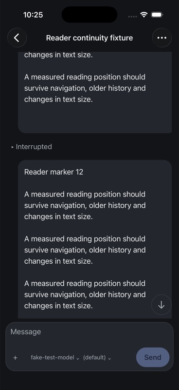
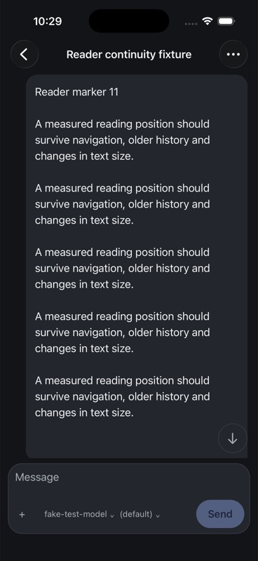
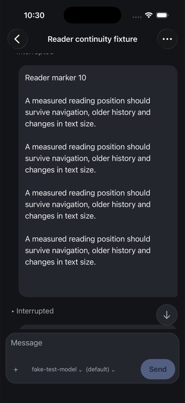

# iOS reader continuity evidence

## Observed 6 September 2026, Pacific time

The iPhone 17 Pro simulator (iOS 26.5, device
`F9170898-2B92-4420-BD12-9B54B3FC4AE0`) ran a Release build from the authoritative
integration worktree. The final build in this record was produced over
`f0aeb8e6d` plus the reader changes committed with this document. It is scoped
reader evidence, not final release acceptance.

Final JavaScript bundle SHA-256:
`d6d70cd71bc21a49c3934c027656cac7501ca7d21618cbfc39fc4b3cef2b108b`.
Reader source fingerprints at build/test time:

- `screens.tsx`: `320a5da696281122b30cee242866144af740475d39ecbf07086ce4e28339c830`
- `readerPosition.ts`: `843f1fdce9c939800e9e14c78c7a2730c069d2ad86efd9cd460985eeb7e454f7`

The direct authenticated owned v4 hub on port 54211 used a scripted provider.
A fresh session named **Reader continuity fixture**, ref
`local:034KVwAjXBf0IyAcKKEYU3`, contains 30 separately started/interrupted turns
with varied-length text. Creation and turn requests were issued once, with
instance checks and completion notification barriers. The initial native
40-item window begins at reader marker 11; older history is available.

## Executed journeys

1. Scroll into marker 11 with marker 12 below it, return to Sessions and reopen.
   The same content and within-message offset returned. The first before/after
   images predate the additional header-drag fix; they prove only this journey.
2. Pull toward the top to reach Load older messages. The initial reader code
   snapped the first message back to the viewport top after the gesture and hid
   the header. Recording the user-selected geometry as already applied fixed
   the issue; the rebuilt app kept the header reachable.
3. Load older messages. After page insertion the app retained marker 11 rather
   than jumping to marker 1. The snapshot briefly did not settle; a fresh
   snapshot and screenshot confirmed the settled result.
4. Scroll into the newly loaded history, leaving marker 10 below the tail of
   marker 09. Return to Sessions and reopen. The app loaded the earlier page
   again and restored that reading position (approximately one screenshot pixel
   of vertical difference). This exercises an anchor outside the initial page.

## Deterministic and integration checks

Twelve reader-position tests cover measured offsets, exact protocol identity,
missing measurements, older-window resolution, persistence isolation, failed
reads/writes, cached newer positions and storage bounds. `make test-native`
passed 385 tests across 51 files plus typecheck after integration. The full
`make merge-approval-gate` also passed during this continuation; concurrent
uncommitted work means that run is integration evidence, not a final exact-head
release certification.

## Still required

Exercise long heterogeneous Markdown/images, image reflow, streaming while
reading, background/process death, hub switching with overlapping refs, sheet
return, largest Dynamic Type, iPad/landscape, VoiceOver and physical-device
performance. Verify bounded virtualization recovery when a target is far from
mounted variable-height rows. Header space is not itself persisted as a
semantic transcript item. The current screenshots do not qualify these cases.
Android delivery remains deferred beyond v1 by Jesse's explicit decision.
