# Real harness question acceptance

For the current iOS-only v1 checkpoint, see [direct v4 qualification](#direct-v4-questions-restart-and-keyboard-qualification). The September 5 evidence below predates v4.

Verified 5 September 2026 on native commit 8bd34913b, using the installed iOS Release app and the real isolated Evener hub/daemon. This supplements the controlled AppWire fixture tests in question-evidence.md.

## Boundary and successful run

The existing fakellm package served a scripted provider on loopback port 58875. The isolated model-provider proxy routed only requests containing NATIVE-ASK-HARNESS to it; ordinary test traffic retained its previous provider. AppWire traffic on port 9199 was forwarded without question injection. Production was untouched.

A fresh session was created through the iOS native New session flow against the test workspace and Fake Test Model. Session local:034JxVIyO9oM0UMdFCoVfM advertised ask_user to the provider. The provider returned a valid ask_user call. The real harness executed it and the native app exposed one unanswered question.

- Before answering: thread/read projected askPending true, send true, clear false and a completed ask_user item.
- In the native sheet, selected the advertised fallback and tapped Send answers once.
- The subsequent provider request contained exactly the structured fallback answer. The successful driver log contains one answer_received request.
- The provider returned communicate with end_turn true and the required output envelope. The resumed turn completed successfully.
- Afterward: thread/read projected askPending false, clear true, one answer user message and the completed communicate preview. The native sheet disappeared and the final response rendered. The thread's generic awaiting status remains after completion; that status alone is not evidence of a pending ask_user.

[Trimmed actual snapshots and projection results](assets/real-question-ios.json) exclude system prompts and retain relevant turn identities, statuses and items.

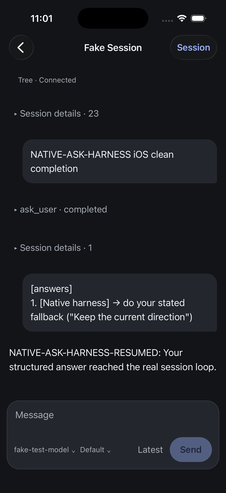

## Corrected test-provider error

The first run, local:034JxOVYtIHAXfjosUH1gY, proved delivery of a selected option but ended with a failed turn: the scripted provider emitted bare text repeatedly, while this harness requires communicate. That was a test-provider defect. The driver was corrected using the repository's communicate response shape, and the successful run above used a fresh session. The first run is not counted as clean completion or as an app delivery failure.

## Android and remaining acceptance

Android real-harness acceptance remains open. Before creating its session, emulator-5554 stopped responding to uiautomator, basic shell and screenshot commands. A host sample of the live QEMU process was captured at /tmp/evener-android-freeze.sample.txt. It shows the main loop waiting on its I/O-thread mutex for much of the sample but does not establish the root cause. An earlier restart restored service temporarily; repeated restarts are not proof of a fix. The stalled Android creation attempt is not question acceptance.

Earlier both-platform controlled-fixture send checks and question-draft restoration checks remain separate evidence. Real Android completion, cross-device resolution with a real question, storage fault injection, largest text and screen-reader traversal remain required. No full-repository or release-ready claim is made.

## Direct v4 questions, restart and keyboard qualification

Verified 7 September 2026 with the direct owned hub at
`ws://127.0.0.1:54211/rpc`, iPhone 17 Pro/iOS 26.5 Release, and an external
installed SDK tarball. No AppWire injection, forwarding proxy or production
session was used. This is the current iOS-only v1 checkpoint; the earlier
September 5 evidence above is historical.

The fixture executed one real `ask_user` call containing two questions, each
with a recommended option; the second permitted multiple selections. SDK and
native used separate fresh sessions. Both submitted the alternate first option,
both second-question options and a unique note on the first question. The
scripted provider checked the subsequent user message through the original
tool-call ancestry and emitted the required `communicate` completion envelope.

- Clean SDK: `local:034Kipx5OOG7fYWmAzdhtZ`. The packaged helper dispatched one
  answer request, validated the v4 receipt, returned acknowledged with execution
  still unverified, and performed fresh readback. An independent completed-turn
  observation and transcript read verified one matching answer and a completed
  assistant message.
- Native: `local:034KintfDXDCwVaWR3mk01`. Saved selections, note and active
  question survived rebuilding/relaunching; a further stop/launch retained both
  checked second-question options. Before submission, an independent observer
  still found exactly the original user input and pending questions: restoration
  had not sent an answer. One Send answers tap produced exactly one matching
  structured reply, a nonempty mutation ID and a completed follow-up turn. The
  sheet closed and the final response rendered.
- Both ended `awaiting` with no pending question. That generic status means
  waiting for the next user message; it is not evidence that the question remains
  unresolved. Actual provider receipt and completed-turn/readback evidence
  establish the bounded outcome.

### Keyboard overlap found and fixed

On the initial current build, the question sheet's Next question button remained
behind the keyboard at maximum scroll: y537, height44 in simulator points.
`KeyboardAvoidingView` used its parent-relative layout against a screen-relative
keyboard position. This misses the iOS page-sheet origin. The installed React
Native 0.86 implementation confirms that calculation in
`Libraries/Components/Keyboard/KeyboardAvoidingView.js`.

The sheet now lets the iOS ScrollView adjust keyboard insets, while retaining
the Android height behavior. The native Fabric implementation in
`React/Fabric/Mounting/ComponentViews/ScrollView/RCTScrollViewComponentView.mm`
converts the view origin to window coordinates before computing overlap.
No fixed keyboard offset was added. The rebuilt Release moved the maximum-scroll
action to y475, height44, fully above the keyboard; tapping it advanced to the
second question without editing the note. See the
[React Native keyboard-inset contract](https://reactnative.dev/docs/0.86/scrollview#automaticallyadjustkeyboardinsets-ios).

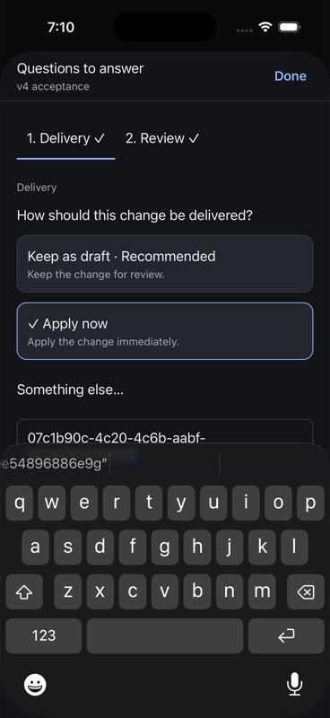
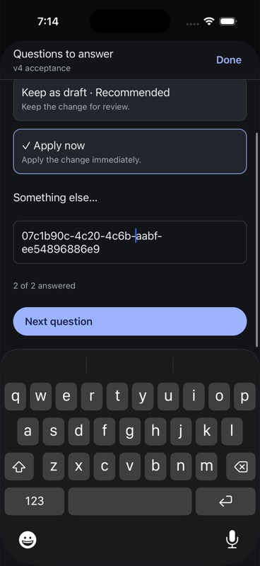
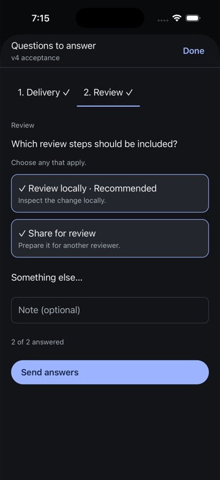
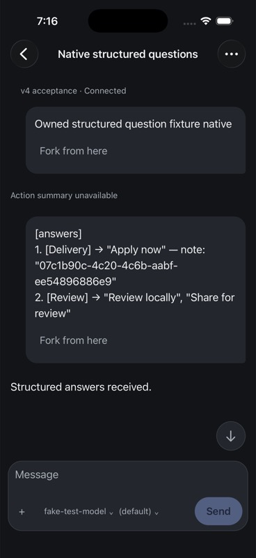

Radio/checkbox controls expose their role and checked state in accessibility
values; XcodeBuildMCP did not return them as tap targets. Their observed native
accessibility frames were used for idb taps. Keyboard-covered controls can also
appear in snapshots: screenshot and frame checks, rather than target presence
alone, established reachability. This is not a VoiceOver traversal pass.

### Artifact identity, tests and limits

[Sanitized receipt](assets/questions-v4-receipt.json) records the hub, SDK,
native source/bundle and scripted-provider hashes, mutation/turn identities,
keyboard measurements, retained draft hashes and cleanup.

- Native source: `94b063d2b` plus the two-property question-sheet keyboard fix;
  final sheet SHA256 `8b8f81a08c74ec11500e5547b64e900fa321bfed9d5920306fe9f784a702a626`.
- Installed native bundle SHA256:
  `93b60595d242149dd884167006dc38ba33aaf0183f6200adca263eb14bdec24c`.
- External SDK tarball SHA256:
  `c8a99dbf37e8c45cc1982294f2f11f48a527d2a4495da2eb11cf05810773c292`.
- Driver source Git commit: `7a199fe173e1c9237377c4e518b8a72f782b2cc3`.
  Its source and receipts are retained under
  `/private/var/folders/46/dz2z92w907j150sqxn8b8y1c0000gn/T/evener-native-questions.CJCR5KTbU7`.
- SDK package and canonical frontend gates pass; 95 packaged contract tests
  include 14 question cases. Native TypeScript and all 583 native tests pass
  after the keyboard correction. The geometry regression was verified in the
  real Release UI, not with a source-string assertion.

The first SDK diagnostic session (`local:034KinukxlU1ZPLej0Iqaz`) delivered its
answer and completed, but the acceptance script incorrectly expected
`communicate` to appear as a commandExecution row. It renders as an agentMessage.
That assertion was corrected and a fresh clean session qualified; the diagnostic
session is excluded from the clean SDK proof. All three created sessions were
shut down, the temporary provider removed, its complete original registry
restored, and the provider process stopped cleanly. Four earlier retained drafts
and the unrelated Apple project/plist patch remain unchanged.

This covers two questions in one tool call, one single-selection answer, one
multiple-selection answer, a universal note and native process restart. The
ordinary composer draft was empty in this fresh native case; preserving the four
other drafts does not qualify ordinary-draft/answer interaction. Multi-call
paging and uncertain receipts are covered deterministically at the SDK request
boundary, not by this live fixture. Native lost acknowledgments, concurrent
cross-device answers, free-text/fallback/skip variants on v4, storage faults,
largest text, VoiceOver, iPad and physical-device qualification remain open.
The completed fixture also shows the intentional missing-description fallback
for a settled tool; a polished settled-question recap remains part of the
broader conversation review. No release readiness or Android qualification is
claimed.

## Second-client question handoff — 7 September

An actual owned hub session ran two consecutive `ask_user` calls through a
scripted provider. The iPhone displayed the first two-question batch and retained
a local answer note while its keyboard was open. An independently installed SDK
client answered that batch once. The provider validated the answer's tool-call
ancestry and emitted a second batch containing one question. The open native
sheet updated to the new batch, with an empty note and reachable Send answers.
The iPhone submitted that second answer once, and the provider completed the
turn after validating its distinct tool-call ancestry.

The SDK tried the previously reviewed first batch after observing the second;
its stale-review guard rejected the operation before an additional `turn/start`
dispatch. Independent `thread/read` confirmed exactly three user inputs: the
initial prompt and the two answer messages. No question remained pending and
`turn_m3` was completed. This proves a sequenced second-client handoff; it does
not provide an atomic guard against two clients dispatching simultaneously.

The [structured receipt](assets/question-recovery-receipt.json) preserves source,
native bundle, SDK tarball, provider binary, archived source/driver and screenshot
hashes. The source checkpoint was `490b761a7`; native code and the independent
package were built from `ef12d750e`. The later approval-controller build is a
separate artifact. The [archived driver](assets/question-recovery/driver.mjs.txt)
contains the exact owned paths and ports used for this run and is evidence
source, not a portable automated test. Its provider baseline stays private.

Cleanup shut down the owned session, restored the complete provider registry,
and stopped the scripted provider cleanly. Six pre-existing draft hashes and
the unrelated Apple project/plist patch remained unchanged. The ordinary
composer was empty: this does not qualify ordinary-draft/answer interaction.
Lost acknowledgments, reconnect/death, simultaneous answers and the remaining
question variants and accessibility/device matrix remain open. The settled
question tools still show the missing-description fallback in the completed
conversation; polished question recaps remain unfinished.

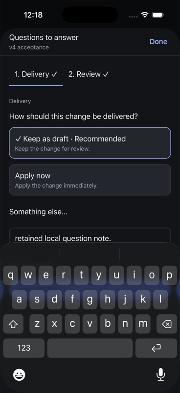
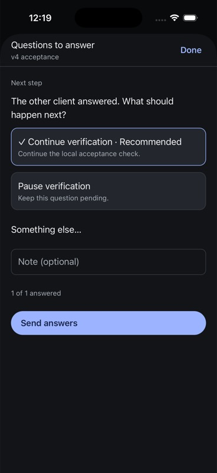
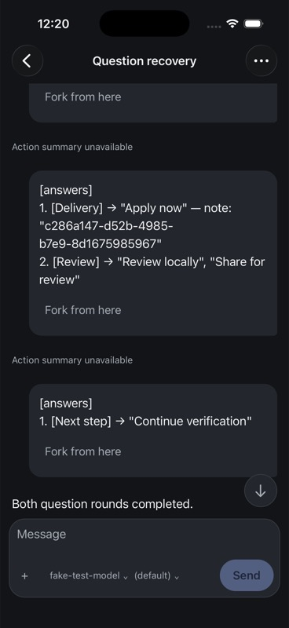

## Ordinary composer draft and native answers — 7 September

A fresh owned session retained a 63-byte ordinary composer draft before the
SDK started its first model turn. The actual scripted provider then issued two
questions. In the native sheet, Apply now and a unique note were saved; stopping
and launching the app retained that selection and note. Independent hub readback
still contained only the initial prompt, proving the restart did not send an
answer. The ordinary draft's exact hash also remained unchanged.

The iPhone selected both review options and sent the first batch once. The
provider validated its tool-call ancestry and answer data, then issued the next
question. Its native note was empty. One further Send answers tap completed
that round. Independent reads found exactly the initial prompt and two answer
messages, no pending question and a completed third turn. The ordinary draft
was never sent, cleared or replaced. It remained visible after a second
stop/launch; the final response and draft are shown below.

The [structured receipt](assets/question-draft-receipt.json) records exact native
bundle, hub, setup SDK and provider identities, archived driver/readbacks,
question-call IDs, screenshot hashes, and each draft hash check. Native source
is `04dd97a46` with bundle
`f126b96894e877b0042b83e94ac87875e016c7b2487c6c33f20def1c96d13e31`.
No native source changed for this acceptance run. The initial setup started its
question before entering the ordinary draft, when the composer is intentionally
hidden; that session was completed through the SDK and shut down, and is excluded
from the clean native proof. The clean session entered its draft while idle.

The later packaged session-settings check reused the completed owned session,
preserved all three input messages and restored its original settings. The
persisted turn IDs in that subsequent read differed from the initial live IDs;
this run does not qualify reader anchoring across that lifecycle boundary.
Cleanup shut down both owned sessions, restored the provider registry, removed
the SDK's temporary command file and stopped the provider. All six prior drafts,
the new draft and the unrelated Apple project/plist patch remain intact.

This qualifies plain-text ordinary-draft preservation through native question
answers and process restart before dispatch/after completion. It does not cover
death during dispatch, lost acknowledgments, storage faults, draft attachments,
or the wider accessibility/device matrix. Settled question recaps remain
unfinished; the missing-description fallback is still visible.

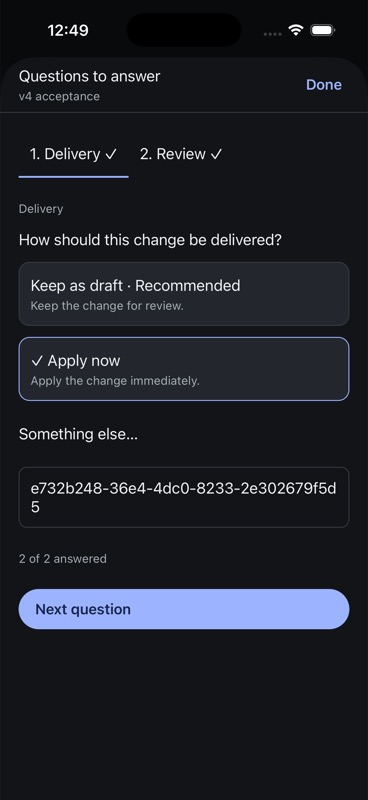
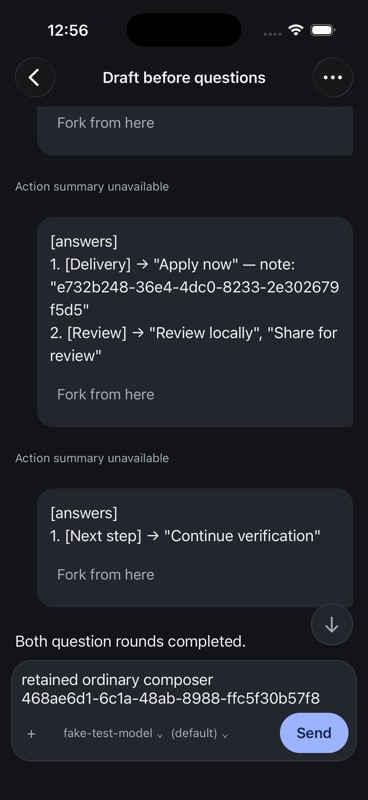

## Completed question context — 7 September

Completed ask_user calls without an authored description now retain a concise
recap of their parsed question headers. The shared projection preserves any
nonblank authored description and all original arguments, output and errors.
Malformed arguments do not manufacture context; failed calls remain failed
activities; pending calls retain the existing answer controls. The neutral
Questions prefix identifies content without claiming a failed request was
delivered or inferring selected answers from subsequent prose.

Two regressions failed on missing descriptions before the repair. All 88 shared
projection tests and 621 native tests plus TypeScript pass. Luna medium supplied
the proposal and reviewed integrated source; Bot applied it, verified actual
checks and ran native acceptance. The iPhone Release build passed with bundle
`b8708d25356771c3409c8c8b6da09802a69fef91be608c9bf622e25c9a2ad9c9`.
Source hashes appear in the [same-build lifecycle receipt](assets/reader-continuity/native-lifecycle-receipt-20260907.json).

Opening the completed owned Draft before questions fixture displayed
Questions: Delivery; Review and Questions: Next step between their associated
input rows. No pending-question controls returned. Its original 63-byte ordinary
draft remained intact, and all seven retained drafts and the unrelated Apple
patch were verified unchanged after the build and hub round trip.

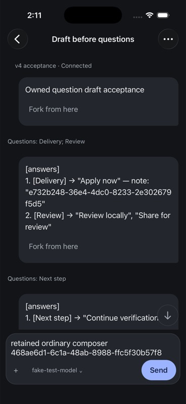

This closes the reproduced missing-description presentation gap. Concurrent
answers, uncertain delivery, accessibility and release qualification remain open.
