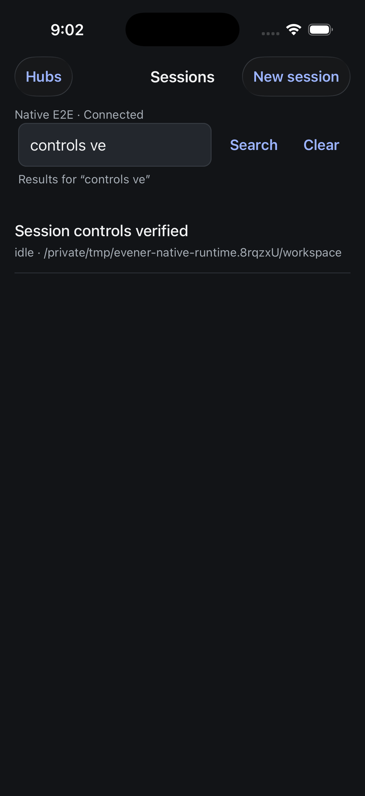
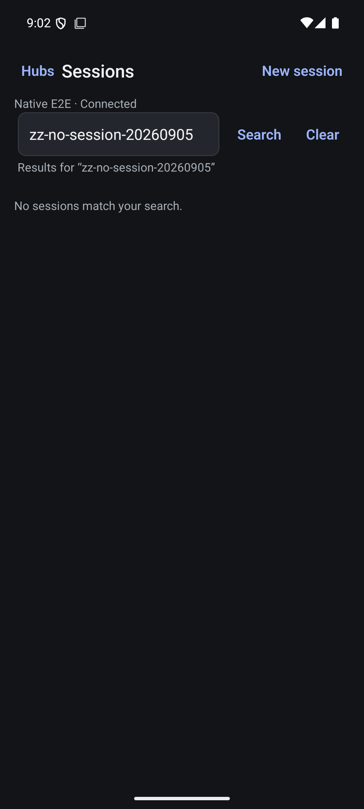
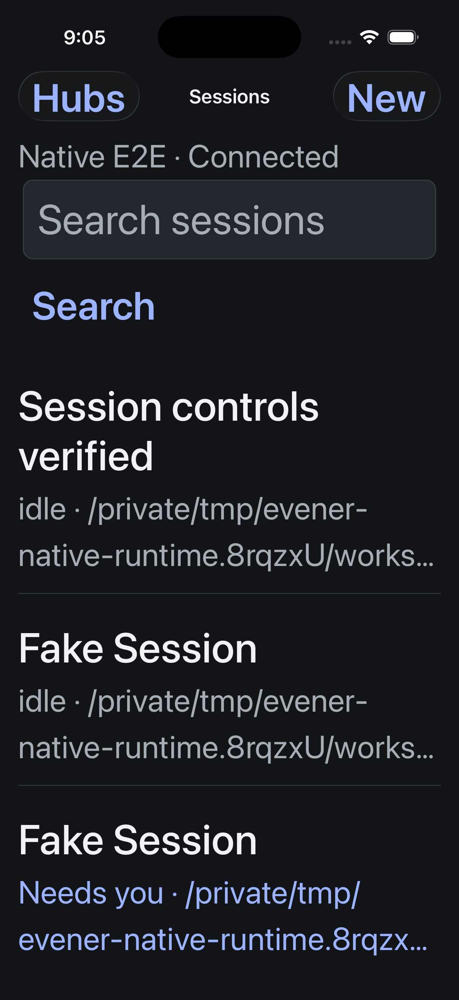

# Native roster search

Verified 5 September 2026. Search submits a trimmed term to the hub's thread/list endpoint. It does not filter only the downloaded rows. Clear restores the unfiltered roster; pull-to-refresh and Retry repeat the submitted query. Opening a session and returning retains that query. A new connection starts unfiltered. Search and Clear are unavailable while disconnected.

The request owner invalidates older searches and requests from a departed screen or hub. Native tests use the real roster service over a scripted network boundary to check out-of-order completion, cancellation and explicit retry. These are client contract tests, not daemon tests.

Validation: 68 native tests across 13 files, 2,238 shared mobile tests across 90 files, both TypeScript checks, targeted Biome and both Release builds passed. Both final builds were installed. iOS searched the real isolated hub, opened the matching session, returned with its query intact and cleared back to four sessions. Android verified no-match results and clearing, then searched for the existing controls session. Production was not mutated. Live iOS accessibility-large changes exposed clipped roster text; explicit iOS font measurement corrected the rows and was visually rechecked. Android retains native font scaling. This does not establish screen-reader or physical-device acceptance.

## Pagination is incomplete

`cmd/evener-hub/app_threadlist.go:26` implements hubThreadList. It passes the list parameters to each source, discards source nextCursor values, reads past sessions at offset zero, merges and truncates the rows, and returns only Data. The protocol cursor fields therefore do not establish functional aggregate pagination. The native footer truthfully asks for a narrower search when its 50-row limit overflows. A combined-source paging design and real-daemon tests are required before adding Load more. Search is not a replacement for that work.
