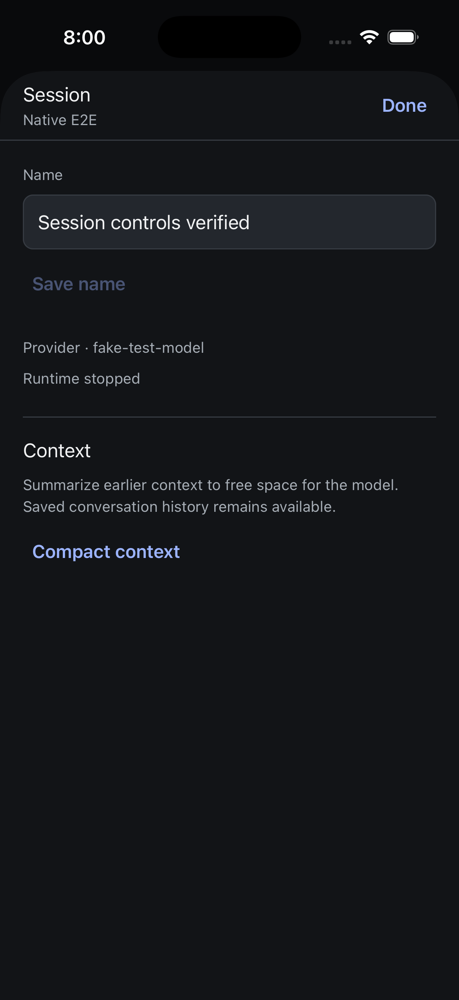
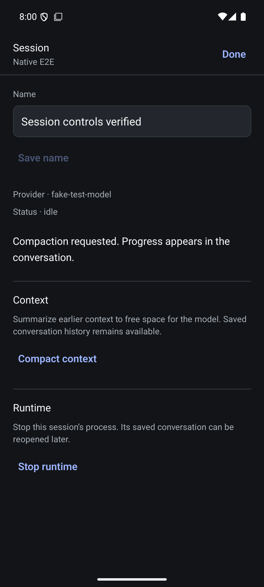

# Native session controls

The conversation navigation bar opens a native Session sheet. It exposes name editing, context compaction, and a confirmed runtime stop through the shared capability-gated service. Actions belong to the conversation binding rather than the sheet, so sheet dismissal retains action state. A binding predicate checks connection, focus, generation, instance and open status before dispatch and after awaits. No action is automatically replayed.

Rename and compaction refresh the authoritative projection. Rename also updates the navigation title; untouched name fields follow projection changes, while active edits remain local. Shutdown closes the binding and returns to the roster without a read that might restart the runtime. A stopped (`notLoaded`) runtime is labeled plainly and has no redundant Stop control.

## Automated and build verification

Native Vitest: 59 tests in 12 files passed. Native TypeScript passed. Touched files were formatted and checked with Biome. Both final iOS and Android Release builds succeeded and were installed.

Five controller tests exercise the real shared conversation service at a scripted request boundary: duplicate submission suppression, normalized rename plus refresh, no post-shutdown read or failed-action replay, disposed and changed-binding callbacks, and compaction refresh. The reconnect regression first dispatched one shutdown through a reused service when zero were expected; the final binding check prevents it. The cold-compaction regression first made zero projection refreshes when one was required; it now refreshes. These are controller/service tests, not device or full-daemon tests.

Independent source review found the reconnect ownership issue and confirmed its closure after the fix.

## Manual real-daemon checks

Used only the isolated hub at 56491 and session `local:034Jpw6Pu89wMXd5BusUvs`, with a scripted external model provider. The production hub and older test-session drafts/queues were not changed.

- iOS renamed Queue E2E to Session controls iOS. The sheet acknowledged it and disabled unchanged-name saving. Android later renamed it to Session-controls-Android; persisted session metadata contained that exact name, and the iOS roster showed it. A further iOS rename to Session controls verified persisted and survived reopening on both platforms.
- iOS requested compaction. The saved transcript gained CHECKPOINT and SUMMARY records; this proves completed plumbing with the scripted provider, not quality of a real model's summary. Android also requested compaction from a stopped runtime. The final implementation refreshed to idle afterward and exposed runtime controls instead of retaining the stale stopped state.
- Android confirmed Stop runtime. It returned to the roster, retained the session, and daemon PID 64639 was no longer alive. Reopening saved history did not itself restart the daemon.
- A subsequent compaction restarted the runtime. iOS then confirmed Stop runtime, returned to the roster, and daemon PID 73278 exited. Reopened iOS history displayed Runtime stopped and omitted Stop runtime in the final build.
- Name editing with the software keyboard and explicit sheet dismissal were exercised. The final iOS stopped-state and Android post-compaction sheets were visually inspected.

## Remaining acceptance

Native injected disconnect/reconnect while a confirmation is open, withheld responses, large text, screen-reader traversal, rotation, and physical devices remain unverified. The stale-confirmation protection has automated evidence only. Provider metadata is displayed as supplied by the existing projection. Full model/vision/reasoning controls, fork, clear, explicit lifecycle controls and other session-management workflows remain on the coverage roadmap. No full repository merge gate or release certification is claimed.
