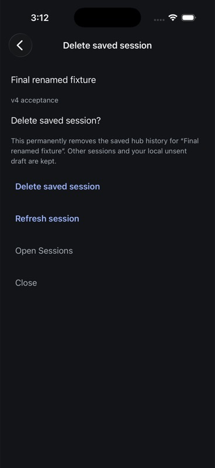
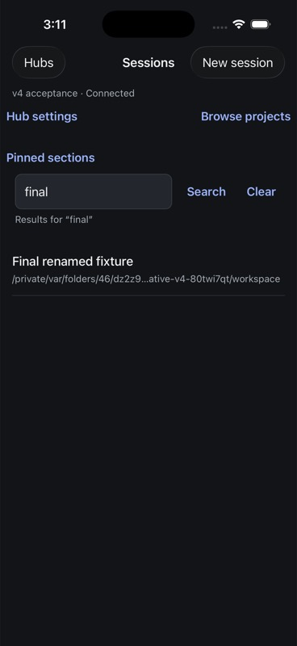
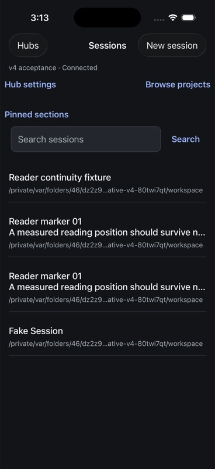
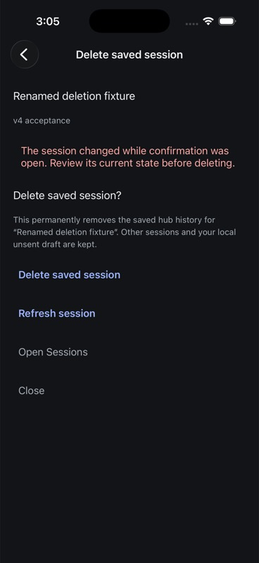
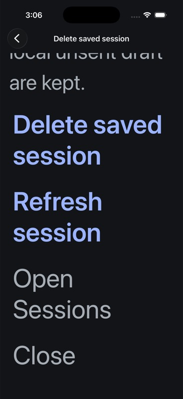

# Native ended-session deletion evidence

Observed 7 September 2026 on the owned AppWire v4 hub and iPhone 17 Pro /
iOS 26.5 simulator. This qualifies the bounded workflow below, not the complete
iOS release matrix.

## Source and Release artifacts

- `29ac49032`: native deletion review/confirmation, saved destination, typed
  per-hub recovery, receipt convergence and read-only outcome checks.
- `d2188a67d`: focused Sessions-list invalidation subscription with coalesced
  refreshes and preservation of the current query and visible rows.
- Final source Release bundle SHA-256:
  `fe5e44502fe66d9a6f5e4fbd6a650e63eb12d4c3a69d9159d92c26da762d8e99`.
  Build/install/launch succeeded. The post-deletion restart launched PID 45881
  at 2026-09-07 10:13:22 UTC. Bundle ID: `com.primeradiant.evener.native`.
- The earlier deletion/cancel/stale-confirmation/maximum-text journey used
  `c88906ad6c5e0b387a37c99d110e968712beedb83a06cd0c160f86355b216f08`.
  Deletion screen/controller code is unchanged in the final artifact; the final
  artifact separately passed restoration, deletion and local draft retention.
- The direct owned hub on loopback 54211 used binary SHA-256
  `606c8b19bbeb6139a1e1ecc1f2b70d70acd24634f286f940f5a365cd989cfbb7`.
  No forwarding proxy, production session or live provider was used.

## Native journeys and independent readback

Two additional disposable children were created from the owned reader before
marker 11. Neither was one of the retained ordinary-fork acceptance fixtures.

On the earlier artifact, `local:034KcnEd7Bun7mmTCtTAOL` was named Deletion
acceptance fixture. A local draft was entered through the composer. Opening the
deletion review and terminating/relaunching restored the exact hub/ref and review
destination. The recovery journal remained empty: review restoration did not
dispatch a deletion. Canceling the native confirmation kept the session.

While another confirmation was open, an independent client renamed that exact
fixture. Confirming the old title reread the source, rejected the changed target,
and displayed the new name for review. The journal was still empty and the draft
unchanged. After restoring the original name and refreshing, all controls remained
reachable by scrolling at maximum iOS text size. The native destructive Alert
provided reachable Delete and Cancel actions. An explicit Delete returned to
Sessions only after the readback completed. Text size was restored to `large`.

This journey exposed a separate Sessions-list defect: a cold external rename did
not update a focused list, even though opening the session fetched its new name.
The list reloaded only on focus. The final artifact subscribed to navigation
invalidations; a newly created fixture appeared without leaving the list. With
the query `final` active, an external rename immediately changed the matching row
to Final renamed fixture while preserving that query.

On that final artifact, `local:034Kd12aed4Ah92lJZGUML` received another native
composer draft. The deletion review and draft survived termination/relaunch
without a request. Explicitly confirming deletion returned to Sessions. Another
restart reopened Sessions, with neither deleted fixture present and no pending
organization checkpoint.

Independent SDK reads returned the exact requested missing-thread rejection for
both deleted refs. Paged reads confirmed that the original reader retains markers
01–30, and both ordinary-fork children retain markers 01–10. Those children remain
`notLoaded`; the parent's name and empty local draft are unchanged.

SQLite readback after the final restart confirmed:

- First deleted fixture: the exact 37-character draft remains, with no unconfirmed
  send; SHA-256 `b95d26151c621311fab3184126f81a077e273b1c48a90285356c194e9adf4246`.
- Final deleted fixture: the exact 27-character draft remains, with no unconfirmed
  send; SHA-256 `6cda18a937464750cba904227a67cb384569776915773d0f70b47b34e105b14a`.
- Both earlier fork drafts remain 513 characters. The final ordinary-fork child's
  SHA-256 is still `150a0f511e6cd5aeed960cd4a7a7300bfde11fbd811f1227be9484e74574a61f`.

## Deterministic checks

Final `make test-native` passes 540 tests in 64 files plus TypeScript. Touched
Biome checks pass. Deletion checks cover bare-ID results without `ok`, skipped and
empty outcomes, malformed/wrong-target results, storage admission failure, late
acknowledgement after disposal, exact journal replacement fences, restoration
without replay, explicit unknown-request allowance, per-resource receipt floors,
hub generation changes, unavailable reads and scope replacement. Route checks
reject mixed destinations and hub mismatches.

The roster regressions failed before implementation, then passed with real
`RosterSearch` and `createRosterService`: invalidations during initial loading,
coalescing during a refresh, retaining the query/rows, applying a changed server
name, and cancel/unsubscribe on blur. Transport and storage are the fake boundaries.

Local logs: `/tmp/evener-session-deletion-native-gate.log`,
`/tmp/evener-deletion-roster-native-gate.log`, `/tmp/evener-roster-watch-red.log`,
and `/tmp/evener-roster-watch-green.log`. Readback:
`/tmp/evener-native-session-deletion-final-readback-20260907.json` and
`/tmp/evener-native-session-deletion-drafts-20260907.json`.

## Limits

Skipped live/reserved responses and lost-reply/storage faults were exercised
deterministically, not injected through the device transport. Concurrent project
deletion can still block confirmation: its targetDeleted fence also represents
cleanup in progress, so this screen conservatively reports an error. Retention
of local drafts is verified here; this does not qualify every later recovery or
reuse path for a draft whose hub session has been removed.

VoiceOver, iPad, physical devices, overlapping multi-hub faults, signing/update,
reader Dynamic Type drift, durable archive/favorite and the rest of the delivery
plan remain open. No whole-repository merge gate or release publication is claimed.

## Screenshots

Final Release:

Earlier Release, unchanged deletion UI:

