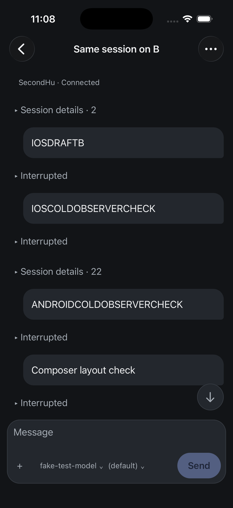
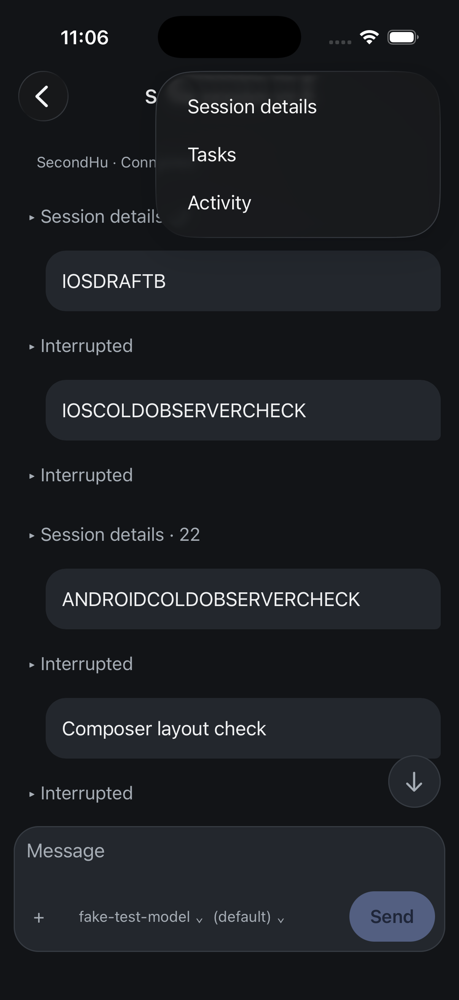
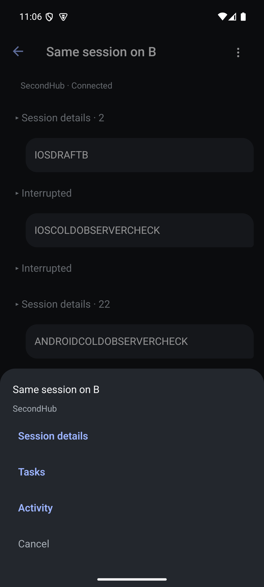
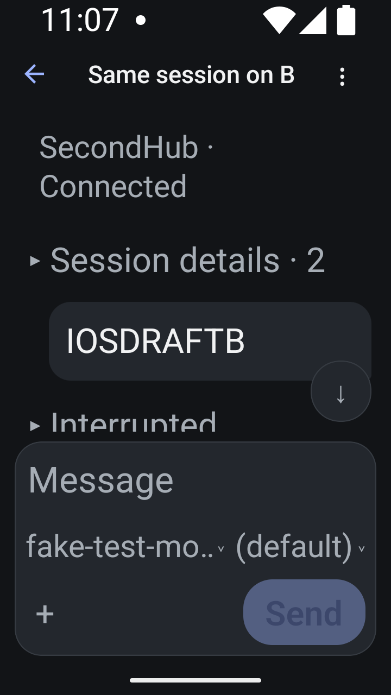
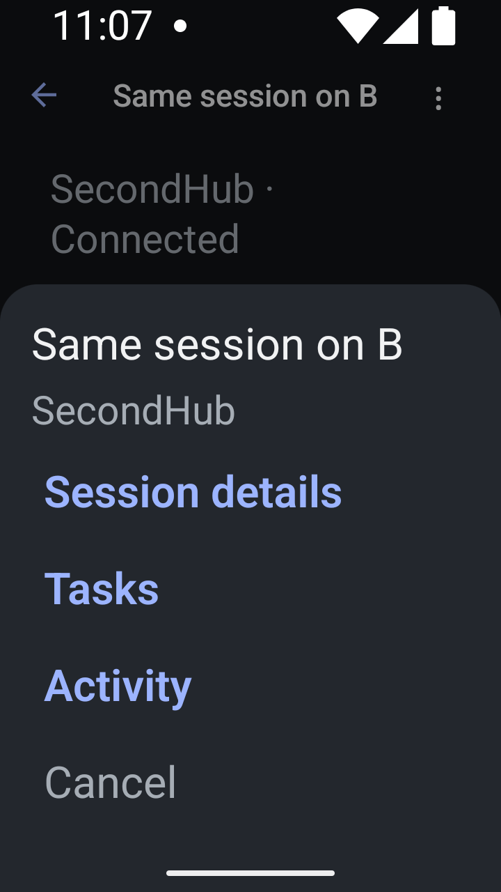

# Session actions and title space

One overflow icon replaces the wide Work and Session header buttons. iOS uses
the installed native-stack header menu; Android uses a bottom action sheet with
native controls and a scrollable body. Both expose Session details, Tasks and
Activity directly. The sheet includes the session and hub names. Cancel,
outside-tap dismissal and Android Back dismiss the menu.

The existing session, task and activity destinations and context binding are
preserved. Choosing a destination reads the current conversation; work entries
remain unavailable while disconnected. This is presentation of existing
functionality, with no protocol additions or old-mobile feature inference.

Both Release builds, TypeScript, touched Biome and 228 native tests pass.
Manually opened all three destinations and returned on both installed apps
against isolated SecondHub: Session shows the correct name and idle status,
Tasks shows No tasks yet, and Activity shows No activity yet with Refresh.
No session mutation was invoked during these checks.

At Android 720 × 1280 physical pixels, density 360 and font scale 2.0, the old
header title frame was x=162..196 (34 pixels). It is now x=162..543 (381 pixels),
and the full Same session on B title is visible. The menu target remains
108 × 108 physical pixels, or 48 × 48 logical units. The small action sheet
shows every destination and Cancel without overlap. On iOS the full title is
also visible at the ordinary text setting. All screenshots were inspected.
Android display and font overrides were restored after the test.

This completes the header-entry consolidation slice of MOB-001. It does not
complete hub identity/connection presentation, long-title accessibility,
screen-reader order, iPad behavior, or whole-screen visual acceptance. The
separate connected row still consumes unnecessary vertical space.

