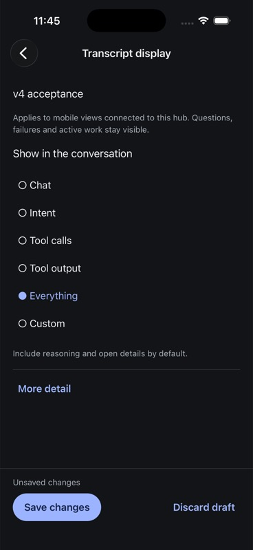
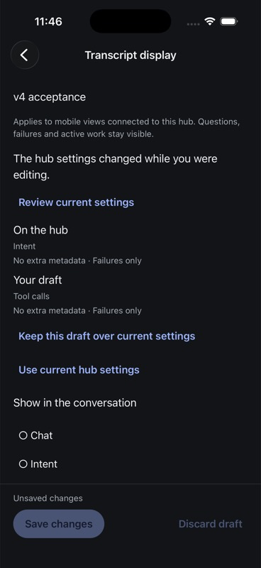
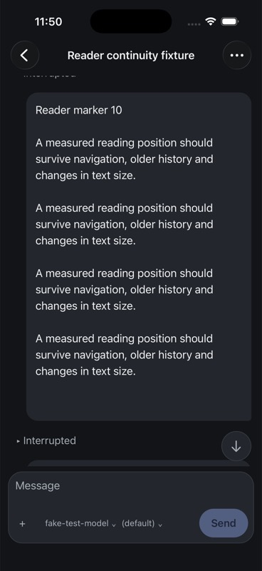

# Native transcript preference evidence

## Source and artifact

Scope: iOS-only transcript display preferences, using the existing unfiltered
mobile conversation store. Android and voice remain deferred.

- Draft controller: `cd85889d7`.
- Native settings/presentation integration: `8bbff54c5`.
- Final deterministic gate: `make test-native`, 436 tests in 54 files plus
  TypeScript, exit 0. Log: `/tmp/evener-native-preferences-final-gate.log`.
- Final Release build/install/launch: 7 September 2026, 06:54:45 UTC,
  18.495 seconds, succeeded. Bundle `com.primeradiant.evener.native`,
  iPhone 17 Pro / iOS 26.5, simulator
  `F9170898-2B92-4420-BD12-9B54B3FC4AE0`, launch process 83398.
- Final bundled JavaScript SHA-256:
  `04f4ea31620e28a43983a53e7ab1d4b58f238cabea6759ace32cb6313bcfb0b9`.
- Full settings journey below used the preceding Release bundle
  `dface15b505b4344e67d52b726ee92738cc8f5bd72b7a63b275aa97d981f7119`.
  The final rebuild added typed critical-notice grouping protection and kept
  local recovery errors visible during notifications. It was
  launched and observed in the reader, but the complete settings journey was
  not repeated on that artifact.

The original unrelated Apple project and Info.plist diff was compared
byte-for-byte with its preserved patch and remained unchanged.

## Owned hub journey

Direct isolated v4 acceptance hub at `ws://127.0.0.1:54211/rpc`, with its
isolated state/home/workspace and scripted provider. Independent readback used
the installed AppWire package from an outside-checkout consumer. No production
hub or provider was used. No forwarding/fault proxy was used.

1. Opened Hub settings → Transcript display. The confirmed mobile default was
   Intent at revision 0; desktop was Tool calls at revision 0.
2. Selected Everything without saving. The UI showed Unsaved changes. The
   independent hub GET still returned mobile revision 0 / Intent.
3. Stopped and relaunched the app. Returned through Hub settings to Transcript
   display. Everything remained selected as an unsaved draft. The SQLite
   checkpoint retained base revision 0 and uncertainty false.
4. Tapped Save changes. UI returned to Using hub settings. Independent GET
   showed mobile revision 1 / Everything; desktop stayed byte-for-byte
   unchanged. The local preference checkpoint was removed.
5. Selected Tool calls as a new draft. Another owned client changed the hub's
   mobile configuration to Intent at revision 2. The app retained Tool calls,
   displayed the conflict, and disabled Save.
6. Opened Review current settings. The UI showed On the hub: Intent and
   Your draft: Tool calls. Chose Keep this draft over current settings.
   Independent GET still showed revision 2 / Intent: review/rebase did not
   dispatch a mutation.
7. Enabled Timing, Token counts, Estimated cost, System events and Prompt
   events, selected All hook events, then explicitly saved. Independent GET
   showed mobile revision 3, Tool calls, all five flags true and hookExits all.
   Desktop remained at its original revision/config.
8. Opened the reader continuity fixture. A second owned client restored the
   original mobile config using expectedRevision 3. Independent GET verified
   revision 4 / original Intent config and unchanged desktop.
9. The open reader updated its presentation and continued at the marker 10
   area. The saved source anchor remained
   `apptranscript-item-v1:turn_m9:9:1`, position `{entry:9,item:1}`,
   within-item offset 26.6667. This is a narrow continuity observation, not a
   general pixel-stability claim.

Radio choices are exposed as native accessibility `other` elements with radio
button/checked values. The runtime tooling's default target list omits them;
a label-based wait obtained their current element references and native touch
activated them. No test-only UI controls were added.

## Screenshots

## Deterministic checks

New cases exercise synchronous draft restoration, failed/corrupt local
storage, checkpoint-before-PATCH, pending/uncertain edit/discard/save guards,
own notification before acknowledgement, newer external revisions, a stale
acknowledgement against a newer same-config checkpoint, explicit reviewed
revision checks, and acknowledged-save/local-cleanup failure separation.
Connection binding tests cover already-ready clients, ready/connect
coalescing, reconnect disposal and a late old-hub handshake.

Presentation tests cover every preset, custom visibility, source-backed
intent, critical/unknown events, member identity and attachment adjacency,
canonical interleaving, absence of invented metadata before confirmation,
independent token/cost visibility, and immutable source input. Reader tests
recognize hidden source members and grouped notices as already loaded, so a
preference filter does not cause unnecessary older-page reads. Typed errors,
tool repair notices and failed hook exits stay outside collapsed diagnostic
groups.

## Still open

This closes the implemented transcript editor/presentation slice, not full
preference or release acceptance. Native keybinding editing and hardware
keyboard qualification remain unfinished. Full VoiceOver, iPad/landscape,
largest text, physical-device performance/networking, all reader combinations,
and a real lost-reply/process-death matrix still need current-artifact
evidence. The previously recorded Dynamic Type reader drift remains open;
this change does not establish its root cause or fix it.

The saved test hub configuration was restored (revision advanced to 4).
No publication, push, merge or production mutation was performed.
