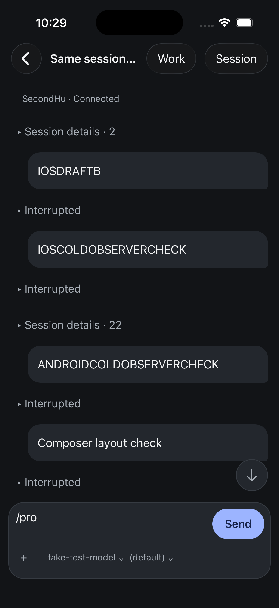
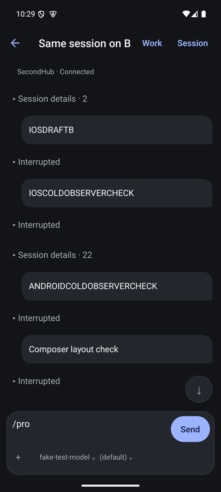

# Transcript spacing — MOB-001

The conversation header contained an empty View even when sending was available.
Its parent gap reserved space. Remove that container when there is no message
to show. The transcript also applied a uniform 24-point separator to every
item. Use 8 points around grouped details and typed interruption notices, while
retaining 24 around ordinary messages, warnings, failures and questions.
These are gaps between rows; text sizes and action touch regions are unchanged.

Measured Android comparison on the same Pixel 7, 1080×2400 screenshot, same
session, collapsed notices, default font scale and hidden keyboard:

| Anchor | Before y (pixels) | After y (pixels) |
| --- | ---: | ---: |
| First session-details button top | 449 | 417 |
| IOSDRAFTB text top | 674 | 600 |
| ANDROIDCOLDOBSERVERCHECK text top | 1646 | 1362 |
| Composer input top | 2030 | 2030 |

The first detail action remains 126 pixels high. Another complete user message
and its interruption fit above the composer. iOS visually shows the same extra
content with its existing text and touch sizes; no numerical iOS viewport
allocation claim is made here. Both captures were visually inspected against
the earlier interruption-notice captures.

Verification: the spacing test failed before implementation; 228 native tests,
TypeScript and touched-file Biome pass. Both Release builds succeeded. Both
apps expanded the first interruption after this layout change. No message was
sent. The draft remains `/pro`.

This does not close MOB-001: header consolidation, full viewport accounting,
other content families, keyboard and large-text matrix remain open. Submit
still sits beside the text in these captures; MOB-011 explicitly requires
moving it to the controls row and giving the draft the full width.

