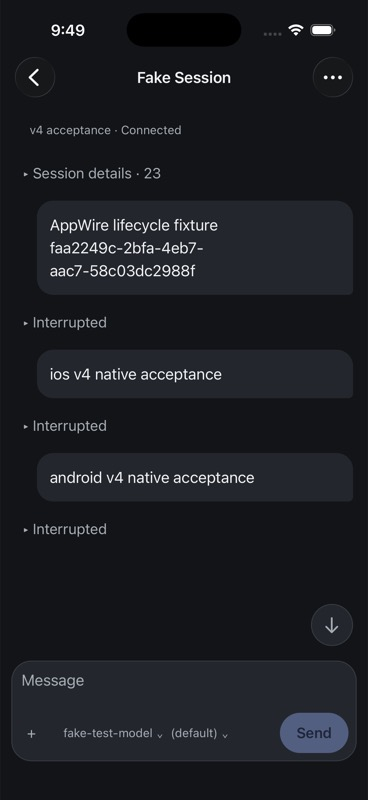
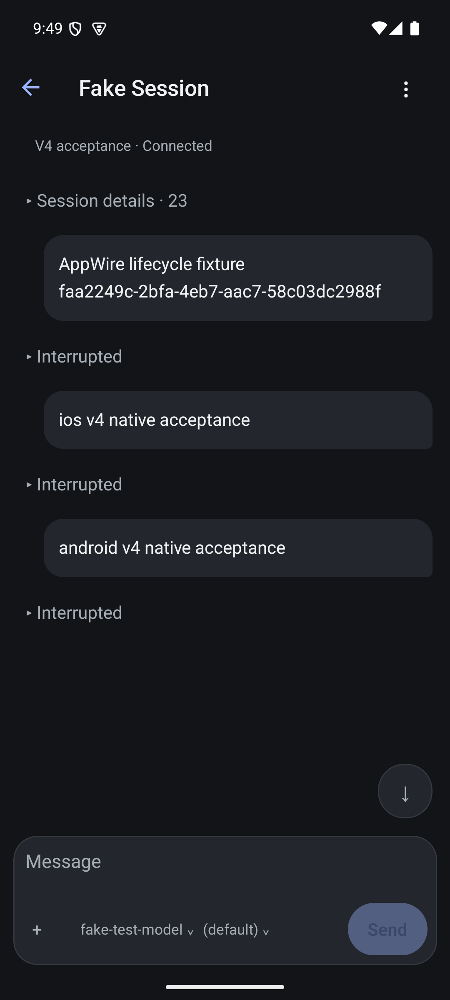

# Native AppWire v4 integration evidence

Observed 6 September 2026 in the integration worktree. This qualifies the
specific journeys below, not full native release readiness.

## Source and artifacts

Both installed Release artifacts were rebuilt from `9e6f232d7`, including the
reviewed navigation v2, provider v4, transcript identity and connection recovery
changes. Later reader-position edits were not included. iOS: iPhone 17 Pro,
iOS 26.5 simulator; Android: Pixel 7, API 35 emulator, arm64-v8a. iOS text size
was large; Android font scale was 1.0.

| Artifact | SHA-256 |
| --- | --- |
| Android APK | `b5ced5ef358b8e8f3f81564c639b7da960bcbef2be0cd4c48e7703ad58c1da31` |
| iOS JavaScript bundle | `993b0cfc2dfcf639267a66f36490ea04559b4a4c5af7964dd4d02512f635eb8d` |
| iOS executable | `6b4c47ff7f66828dd0e234630a7c9be3ba801c1f65051d8e3817c57afb84a0e0` |

## Executed journeys

1. Open the saved old v3 fixture profile on each platform. Both showed the
   update-app-and-hub guidance instead of a generic transport error.
2. Save a new profile for the owned isolated v4 hub. iOS used loopback and
   Android used the emulator host address, directly on port 54211.
3. Open the SDK-created Fake Session from the roster on both platforms.
   Both displayed its original submitted message and interrupted state.
4. On iOS, send `ios v4 native acceptance`, then Stop while the scripted
   provider holds the turn. The message appeared live on Android.
5. On Android, send `android v4 native acceptance`, then Stop. The message
   appeared live on iOS.
6. Independently read the session through the outside-checkout SDK client.
   Each submitted message appeared exactly once: iOS in `turn_m2`, Android in
   `turn_m3`, both with status `interrupted` and stable item keys/positions.
7. On both platforms, return to Sessions, browse Projects, open `workspace`,
   then open Fake Session. The normalized v2 project/session navigation worked
   and returned to the same three-message transcript.

The daemon used the current v4 server plus empty-roster fix `509c7bd57`, an
isolated config/state/workspace and the deterministic fake provider. No
production session was mutated. The original SDK fixture turn remained intact.
The fixture session ref was `local:034KUCPzao5OJ00zkfBDOK`.

## Automation limitations

Simulator keyboard injection altered shifted characters, demonstrated by a
colon becoming a semicolon in a nonsecret URL. iOS also presented a system
Save Password prompt absent from the app-only UI snapshot; a screenshot exposed
it and it was dismissed. The owned v4 fixture credential was deliberately
rotated to a random 256-bit hex value so input did not depend on shifted
characters. Credential entry used verified secure fields without clipboard or
credential output. This run therefore does not qualify arbitrary credential
entry, keychain suggestions or authentication failure diagnosis.

## Captures

## Remaining acceptance

The fixture fits in one read page. It does not qualify long-history paging,
reader position, Markdown/image reflow, model/provider changes, multi-hub
pending operations, decisions, background/process death, accessibility,
physical-device behavior or release signing. The repository gate still has
open findings. The acceptance ledger retains these requirements separately.
