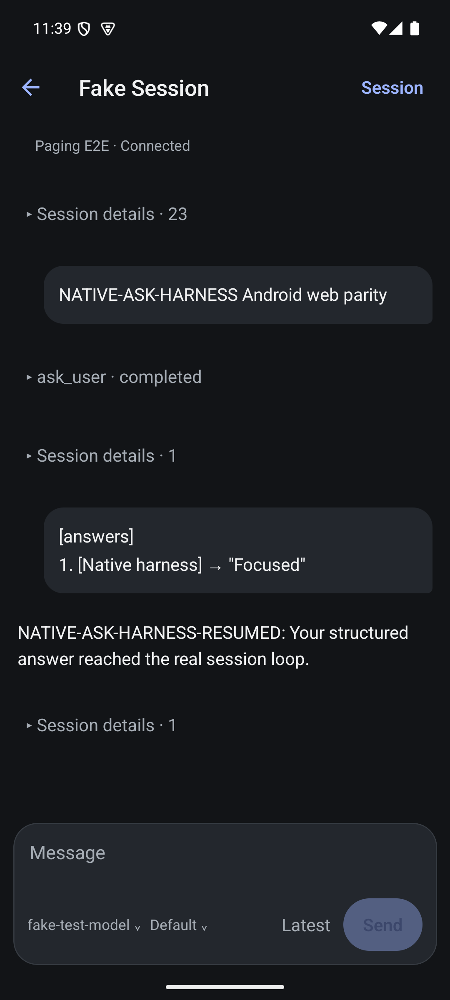
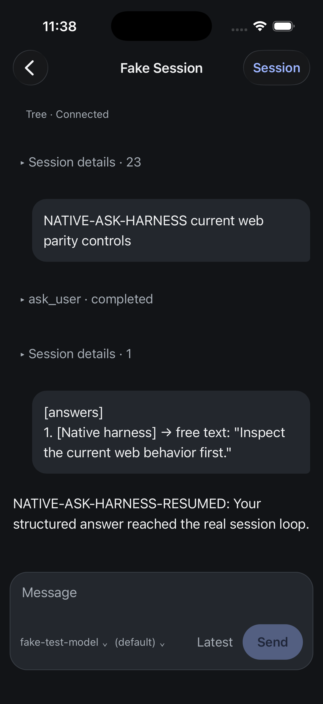
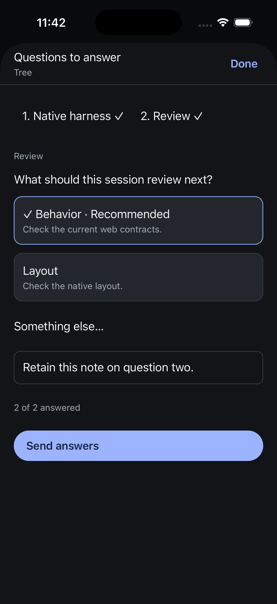

# Native parity audit

Product authority is the current web UI and server contracts. The old mobile UI is not a feature reference. Native layout may differ; product behavior must have a current source. Jesse explicitly requested model and reasoning controls inside the composer.

This audit is incomplete. Existing simulator screenshots and native tests do not establish product parity.

## Questions

Reference: cmd/evener-hub/frontend/src/panes/session/composer/askDock/.

- AskQuestionCard sorts recommended options first and uses one text field for either a note or a Something else answer. It does not expose You decide, Skip, or fallback pills. Corrected in native: recommended-first options, Something else, one shared field, and removal of those obsolete controls.
- askDockStore seeds recommended selections. Corrected in native: seed untouched answers without replacing edits or deliberately cleared choices.
- AskDock presents one question at a time, maintains the active question, and advances through questions. Corrected in native: a question tab strip and one visible question, with forward/wrap progression and single-choice auto-advance. Active-tab restoration across a full remount remains open.
- Web permits sending an untouched single question; a multi-question batch requires answers. Corrected in native: permit an untouched single question and require non-null resolutions in multi-question batches, including the web empty free-answer behavior.
- reconcileBatches freezes sending batches and reconciles newly arriving questions into an open batch. Native now calls the current web reconciler and tracks submitting/accepted batches by question identity. Automated tests verify frozen membership, late-arrival separation, exclusion of accepted questions, stale/repeated submission rejection, and failed-submit retention. Native race testing and independent interaction with a second batch during an in-flight send remain open.
- Web suppresses the ordinary composer while an ask is pending. Corrected: native hides ordinary input and send/steer/queue actions while questions are pending, and rechecks the live pending set at dispatch. The ordinary draft is retained.
- Corrected: native answer serialization imports the current web askCompose.ts directly. The previous mobile formatter did not encode headers containing closing brackets or newlines, allowing answer framing to break.

## Sandbox approvals

Reference: cmd/evener-hub/frontend/src/panes/session/transcript/tools/sandboxEscalation.tsx and agent/sandbox/escalation.go.

- Allow/Deny is an existing one-action sandbox escalation operation.
- Corrected: native warning says a command may have run before the sandbox blocked it. The server boolean indicates uncertainty, not proof that execution occurred.
- Corrected: native explicitly attributes the approval request to Evener, not the agent.
- Native displays command and output fields supplied by the server. These are additional presentation details, not additional operations.

## Remaining audit

Compare composer model/reasoning capabilities and defaults, queue operations, session management, navigation, transcript projection, and lookbook claims with current web and server counterparts. Reuse of old mobile code does not prove equivalence. Revalidate both native platforms after correcting the question interaction and batch lifecycle.

## First correction verification

Native TypeScript check passed. All 102 native tests across 18 files passed. The header-framing regression failed before the formatter import changed. No fresh native build or simulator verification is claimed for this patch.

## Question interaction correction verification

The three new behavioral tests failed before implementation. Native TypeScript and all 105 tests pass; targeted Biome passes. An iOS Metro production export succeeds, including the direct current-web formatter import. This proves bundling, not a native build or manual interaction. Manual iOS/Android verification of the corrected controls is still required. Batch reconciliation, active-tab restoration across remount, and ordinary composer suppression are still open.

## iOS native manual correction check

Built and installed a Release app containing the revised question controls and ordinary composer suppression. Created a fresh session from the native UI against the isolated scripted provider with marker NATIVE-ASK-HARNESS current web parity controls. The actual harness emitted ask_user (call_fakellm_3). Verified ordinary Message/Send absent while pending, Focused recommended option checked, Something else changing the same field from note to answer, and a written answer submitted once. The provider log recorded that exact free answer; the sheet closed and ordinary Message returned after the pending question resolved. This was an actual harness question, not injected AppWire question data.

The check found stale transcript guidance saying reply below. That copy is corrected in source after the tested build; the copy-only correction has not been rebuilt. Multi-question navigation, race/batch semantics, and Android validation remain outstanding.

## Batch ownership correction

QuestionBatches wraps the current web reconcileBatches function; the conversation store subscription feeds current question snapshots into it. Submission rechecks the batch, freezes it when the durable dispatch starts, and settles only that batch on accepted send. The ordinary draft delivery checkpoint remains in use, including uncertain-delivery blocking. This replaces the single answered-definition marker. The sheet still displays the first batch, and a newly arriving batch is presented after that batch settles; simultaneous independent batch interaction remains incomplete.

Native TypeScript, targeted formatting, and 107 tests across 19 files pass. The two ownership tests were added before the implementation. These tests exercise the actual shared reconciler, not a copied algorithm. Previously recorded manual iOS evidence predates this ownership change; it is not manual race evidence.

## Draft preservation when batches grow

The existing SQLite question draft record now merges selections and definitions by question key within each hub/session. Reads restore only entries whose individual definition still matches. Adding questions or saving a separate batch no longer invalidates or overwrites an existing question's saved answer. A changed definition invalidates only that question. This retains the existing database schema and JSON definition representation.

The regression test failed with the prior whole-batch signature lookup. It now verifies adding a question, saving a sibling batch, database close/reopen, both answers retained, and selective invalidation when one definition changes. All 108 native tests and TypeScript pass. Native keyboard/focus behavior across a growing batch, active-tab persistence, and storage-failure interaction during definition changes still require validation.

## Composer reasoning audit

Current web StatusRow offers a default empty-string value, the advertised effort ladder (or minimal/low/medium/high when reasoning is supported but the ladder is empty), and an existing current value absent from the ladder. It distinguishes explicit none from the default via shell/reasoningEffort.ts. Corrected: native uses the shared current-web level selection, option list, and labels, including default, explicit none, and the fallback ladder. SessionControls validates the same options before sending. These restore existing product behavior. Model selection uses the existing thread/model/set operation; effort changes use thread/reasoning-effort/set.

Android Release build at 54774a4c4 succeeded (359 tasks, 12 executed). The existing emulator answered one health echo but subsequent boot/activity inspection remained pending; a fresh install was started against that same device. The pending install subsequently completed with Success; new Android manual testing remains open.

## Reasoning correction verification

A native transport-boundary regression failed before the correction and now verifies empty-string default dispatch, fallback-level dispatch, and rejection of an invented level. All 109 native tests and TypeScript pass. Current web StatusRow uses the extracted sessionEffortLevels helper without changing its behavior; its existing tests cover fallback levels, unset default, explicit none, and provider-default none. The full make test-web gate passed (typecheck, tests, lint), followed by all five make test-web-browser guards. Native manual verification of the corrected picker has not yet been performed.

## Active-question restoration

The native sheet records its active question key in SQLite per hub/session and restores it only if that key still belongs to the pending set. Tab presses, Next question, and automatic advancement all save the position. A position-write failure retains the visible position and exposes a retry, separately from answer persistence. Hub removal clears saved positions. The real SQLite test covers close/reopen, changed pending sets, destination isolation, and hub removal. Native TypeScript and 110 tests pass; native relaunch verification of this addition remains open.

## Native manual acceptance follow-up

- iOS Release at 7df17fd7b built, installed and launched. In the real isolated session, the composer reasoning picker showed default selected, changed to high, then returned to default. The controller refreshed from the hub after each mutation and the composer reflected both values. The fallback ladder and explicit none branches have automated/current-web coverage but were not manually exercised in this session.
- Android Release at 54774a4c4 created a fresh native session with prompt NATIVE-ASK-HARNESS Android web parity and Fake Test Model. The real harness emitted ask_user (call_fakellm_5). Verified the recommendation selected, ordinary composition hidden, one Send answers action, provider receipt of Focused, the resumed communicate response, and restoration of ordinary Message. This build includes batch ownership and per-question answer persistence, but predates the reasoning/default and active-question-position changes.
- Before this Android check, the emulator displayed Process system isn't responding. Its event log identifies ANRs in system NotificationHistoryJobService, Google Play services, and the permission controller. Selecting Wait allowed the check to proceed; this is not a root-cause fix or proof of long-run emulator stability. No Evener-specific ANR was established by that record.

## Multi-question iOS relaunch acceptance

Using the Release build at 7df17fd7b, created a fresh isolated session with NATIVE-MULTI-ASK iOS restoration. A separate scripted provider on loopback port 58876 emitted one real ask_user call with two questions. Next question moved from Native harness to Review. Entered a note on Review, terminated and relaunched the app, reopened questions, and observed Review still active with the complete note and both recommended answers retained. One Send answers action produced a provider-received reply with both numbered answers and the note, then restored ordinary composition.

The screenshot exposed a visual omission: question tabs had selected accessibility state but no visible selected indicator. An accent underline is added in source after this capture. The underline has not yet had native visual verification. This test covers a two-question batch and relaunch, not late arrivals during sending or interrupted storage.

## Saved hubs versus server settings

Current web panes/settings/sections/hub.tsx displays read-only listen address, run directory and spawn timeout from settingsOverview. It is not a saved-connection editor. Native connection profiles are explicitly required by Jesse's multi-hub goal and must be audited as a native connection concern, separately from parity with server settings.

Native saved-hub editing supports renaming and explicit credential replacement while preserving the profile ID and origin. The editor never loads the stored token into a field; replacement defaults off, and explicit empty replacement clears it. Renaming does not recreate the connection; credential replacement reconnects the active hub. Connecting to another address requires a separate profile so that credentials and drafts cannot silently follow a different server. Server runtime settings remain a separate missing native surface.

Android Release at 7e9dd7070 built successfully (359 tasks, 12 executed); installation is still pending in the existing emulator. No latest-build Android restoration result is claimed yet.

## Saved-hub editor verification

Native TypeScript, targeted Biome and all 111 tests across 19 files pass. The storage regression covers rename, unchanged identity and credential, explicit token replacement/clear, isolation from a second hub, and refusal to revive a removed profile. Both Release builds succeeded; Android installation returned Success.

On iOS, renamed the isolated Tree profile to Harness Hub, reopened the editor, enabled token replacement and observed a blank secure field, then changed the name and cancelled. Cancellation retained Harness Hub. Opening the saved hub showed Connected and its session list; after terminating and relaunching, Harness Hub and authenticated connectivity persisted. This verifies rename persistence and cancellation, not live credential rotation or every failure path. Android editor interaction remains pending.
